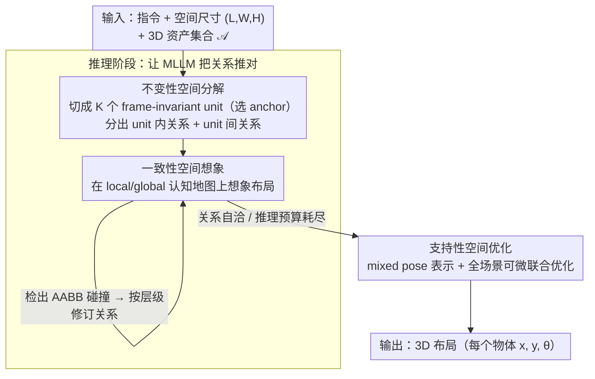

# R$^3$L: Reasoning 3D Layouts from Relative Spatial Relations

**会议**: ICML 2026  
**arXiv**: [2605.06758](https://arxiv.org/abs/2605.06758)  
**代码**: 有（github.com/Neal2020GitHub/R3L）  
**领域**: 多模态 VLM / 3D 场景生成 / 空间推理  
**关键词**: 3D Layout Generation, MLLM, 关系推理, 参考系变换, 自洽性

## 一句话总结
R³L 把 MLLM 多跳"相对空间关系"推理的两类系统性误差（语义漂移与度量漂移）归因于"反复发生的参考系变换"，并通过不变性空间分解（缩短关系链）、一致性空间想象（imagine-and-revise 循环消除冲突）与支持性空间优化（全局-局部位姿重参数化）三个模块，让 GPT-5 生成的开放词汇 3D 场景在 9 类场景下的碰撞率与越界率都接近 0、语义指标显著反超 LayoutVLM/Holodeck/LayoutGPT。

## 研究背景与动机

**领域现状**：从自然语言生成 3D 场景布局有两条主流路线：(1) 直接路线——让 MLLM 直接输出每个 asset 的位姿（LayoutGPT / 3D-FRONT 微调），数据范围窄、外推差；(2) 关系-求解路线——MLLM 推理出物体间相对空间关系（如"椅子在桌子左侧 0.5m"），再用 DFS solver 或可微优化把关系实例化为位姿（Holodeck、LayoutVLM）。

**现有痛点**：关系推理路线的瓶颈是 **MLLM 推理出的相对关系本身经常不可靠**——语义不一致或物理上不可解。现有 pipeline 用一堆 post-hoc 启发式（网格离散化、冲突关系剪枝）"硬解"，常以语义保真度为代价。这些启发式回避了真问题：为什么 MLLM 在 2 物体关系上还行，**跨多个物体的多跳推理**就垮？

**核心矛盾**：多跳空间推理需要**反复在物体-中心参考系之间转换**——每跳关系都在一个新的局部 frame 下表达，MLLM 必须不断"重投影"中间结论。两种系统性误差就此产生：(a) **语义漂移**：方向关系在 frame 间被重解释，一个 local axis swap 就能把"左/右"翻成"上/下"；(b) **度量漂移**：度量位移在变化的 frame 下层层累加，小误差复合成碰撞、间距不一、物理不可行。

**本文目标**：(i) 减少多跳推理中参考系变换的次数；(ii) 让 MLLM 自我察觉并修正度量上的冲突；(iii) 把推理产物喂给一个**对初始化更鲁棒**的位姿优化器。

**切入角度**：把空间推理类比为认知科学里的"心理旋转"（Shepard&Metzler 1971）——人类在多步空间推理中也会累加误差，破解之道是**减少 frame 切换**或**外化中间表征验证一致性**。R³L 把这两点都搬到 MLLM 推理 pipeline 里。

**核心 idea**：用 **frame-invariant unit 分解** + **imagine-and-revise self-consistency loop** + **global-to-local 位姿重参数化** 三件套，从"做了什么后处理"转向"在推理阶段就让关系正确"。

## 方法详解

### 整体框架
给定自然语言指令 $I$、空间尺寸 $(L,W,H)$、3D 资产集合 $\mathcal A=\{a_i\}_{i=1}^N$，R³L 走"先推理后求解"两阶段：(1) 推理阶段先用 MLLM 把 $\mathcal A$ 分解成 $K$ 个 frame-invariant unit $\{U_k\}$，生成两层关系——unit 内的 intra-unit 关系 $\mathcal R^{\text{intra}}_k$ 与 unit 之间的 inter-unit 关系 $\mathcal R^{\text{inter}}$；同时让 MLLM 在 unit-local 与 global 两层 cognitive map 上做"想象-修订"循环消除冲突。(2) 求解阶段把所有关系翻译成可微约束，对 mixed pose representation（独立物体 / unit 位姿 / unit 内成员局部位姿）做联合优化，输出最终的 $p_i=(x_i,y_i,\theta_i)$。

### 关键设计

**1. 不变性空间分解：把场景切成 frame-invariant unit，结构性地缩短关系链**

误差累积的根因是参考系变换次数太多，所以第一刀就砍这个数。R³L 用赋值函数 $\pi:\{1,\dots,N\}\to\{0,1,\dots,K\}$ 把 asset 分到 $K$ 个 unit 或独立类（$\pi(i)=0$），每个 unit $U_k$ 选一个 anchor $a_k^{\text{anchor}}$，成员的 global pose 由 $p_i=P_{\pi(i)}\oplus p_{i,\pi(i)}$ 合成（$\oplus$ 是平面刚体合成）。关系生成被分到两个互不干扰的层级——unit 内只在 unit-local frame 推理 $\mathcal R^{\text{intra}}_k$，unit 间只在 global frame 推理 $\mathcal R^{\text{inter}}$。从图论看，这等价于在 anchor 上做一次 vertex cut，把关系图 $G=(V,E)$ 因子化成 $K$ 个局部子图加一个 inter-unit 图，多跳路径 $\gamma$ 上的参考系变换数 $\mathcal T_{\text{path}}(\gamma)=m-1$ 因此显著下降。和之前的 semantic grouping 只减规模不减 frame 切换数不同，R³L 直接攻击 frame 切换数这个根因：anchor 一旦定下，成员之间在 unit-local frame 下就是刚体不变的，再多的全局旋转也扰不动 intra-unit 配置。

**2. 一致性空间想象：让 MLLM 把空间假设外化到 cognitive map 上自检冲突、迭代修订**

缩短链条还堵不住度量漂移——MLLM 纯文本推理度量位移时只会"局部合理、全局不验证"。这一模块让它显式维护两张图：local map $\mathcal M^{\text{local}}_k=\{q_{i,k}\}$ 和 global map $\mathcal M^{\text{global}}=\{Q_k\}\cup\{q_i\}$。对每个物体算 yaw-rotated 平面 footprint 范围 $e_i^x(\theta_i)=|l_i\cos\theta_i|+|w_i\sin\theta_i|$、$e_i^y(\theta_i)=|l_i\sin\theta_i|+|w_i\cos\theta_i|$，得到轴对齐边界 $B_i^x=[x_i-\tfrac12 e_i^x, x_i+\tfrac12 e_i^x]$（$B_i^y$ 同理），碰撞判据就是两个 AABB 在两轴都重叠：$\text{Collide}(i,j)\Longleftrightarrow|B_i^x\cap B_j^x|>0\wedge|B_i^y\cap B_j^y|>0$。每轮迭代 $t$，MLLM 从当前关系 $\mathcal R^{(t)}$ 实例化地图、检测碰撞，再按层级修订——intra-unit 碰撞改 intra 关系、inter-unit 碰撞改 inter 关系——得到 $\mathcal R^{(t+1)}$，直到无冲突或推理预算耗尽。把简单的 AABB 重叠检查当作 reasoning proxy 塞进 prompt，等于给没有空间渲染器的 MLLM 装了个轻量自检器，既不需要昂贵的 3D 模拟，局部优先修订也避免了从头重生成的 trial-and-error。

**3. 支持性空间优化：用 mixed pose representation 稳住可微求解，避免一动牵全局的振荡**

推理产物进入求解阶段后，还有个老问题：被约束多的物体一动会同时触发多个 penalty，造成振荡。R³L 用 mixed pose representation $\tilde p$ 化解——独立 asset 在 global frame 用 $p_i=(x_i,y_i,\theta_i)$，每个 unit 在 global 用 unit pose $P_k$、成员在 unit-local 用 $p_i^\ell$，成员 global pose 由前面的合成式给出。所有关系翻译成可微 penalty $\ell(r;\tilde p)$（满足时为 0），最终最小化两级目标 $\mathcal L(\tilde p)=\mathcal L_{\text{global}}(\tilde p)+\sum_k\mathcal L_{\text{local}}^k(\tilde p)$，各含 boundary、collision、relational 三类损失。关键在于 unit-local 坐标系把 intra-unit 梯度和 unit pose 解耦（Proposition B.1），整个单元可以平移旋转而不打乱内部关系，收敛更快更稳。相比 LayoutVLM 的 group-by-group 顺序优化，R³L 仍是全场景联合优化，所以早期决策后续还能反复修正。

### 损失函数 / 训练策略
完全 inference-time，无需训练。求解阶段用 Adam 之类的梯度优化器最小化 $\mathcal L(\tilde p)$；各 penalty 用 $\lambda_{\text{col}}/\lambda_{\text{rel}}/\lambda_{\text{bd}}$ 加权。MLLM 全程用 GPT-5；评估器用 Gemini 3 Flash。

## 实验关键数据

### 主实验
9 类场景（bathroom/bedroom/bookstore/game room/gym/...）× 3 个场景/类 × 3 个难度，每个 case 最多 40 个 floor-standing assets。物理指标：碰撞率 %CR、越界率 %OR（越低越好）；语义指标：Realism / Functionality / Instruction-following（1-10，越高越好）。

| 场景 | 方法 | %CR↓ | %OR↓ | Real.↑ | Func.↑ | Instr.↑ |
|---|---|---|---|---|---|---|
| Bathroom | LayoutGPT | 7.6 | 12.1 | 5.9 | 5.3 | 7.9 |
| Bathroom | Holodeck | 4.0 | 0.0 | 2.9 | 2.3 | 1.9 |
| Bathroom | LayoutVLM | 3.0 | 13.2 | 3.5 | 3.5 | 4.7 |
| Bathroom | **R³L** | **0.0** | **0.0** | **7.5** | **7.5** | **9.4** |
| Bedroom | LayoutVLM | 0.3 | 6.8 | 6.4 | 5.9 | 7.3 |
| Bedroom | **R³L** | **0.0** | **0.0** | **6.9** | **6.5** | **7.9** |
| Bookstore | LayoutVLM | 1.1 | 7.3 | 3.4 | 4.3 | 5.5 |
| Bookstore | **R³L** | **0.0** | **0.0** | **8.9** | **8.9** | **8.9** |
| Game Room | LayoutVLM | 0.1 | 7.7 | 6.3 | 5.4 | 8.7 |
| Game Room | **R³L** | **0.0** | **0.0** | **7.3** | — | — |
| Gym | LayoutGPT | 7.4 | 25.0 | 6.5 | 6.3 | 7.3 |
| Gym | **R³L** | **0.0** | **0.0** | 高 | 高 | 高 |

R³L 在所有场景下都做到 %CR=%OR=0，同时语义分数明显反超——证明"在推理阶段把关系做对"比"事后启发式修复"更优。

### 消融实验

| 配置 | 解释 | 效果 |
|---|---|---|
| Full R³L | 三模块全开 | 最优 |
| w/o Decomposition | 单层关系图 | 多跳路径变长，语义漂移显著 |
| w/o Imagination | 不做 imagine-and-revise | 度量漂移导致碰撞率回升 |
| w/o Support Opt. | 单层 global pose 优化 | 收敛慢、易振荡 |
| Decomposition only | 缩短链但不自检 | 中等 |
| Imagination only | 自检但链仍长 | 中等 |

### 关键发现
- **frame-induced 错误是 MLLM 多跳空间推理的真正瓶颈**：把它们当作显式的 design target，性能提升远超追加 post-hoc 修复。
- **AABB 碰撞作为 reasoning proxy 已足够**：不需要昂贵的 3D 模拟器，简单 bound 检查就能引导 MLLM 自洽修订。
- **mixed pose representation 在收敛速度上明显占优**：unit-local 坐标对 unit pose 的梯度解耦让优化曲线更平滑（论文中 Figure 5、6 的收敛曲线）。

## 亮点与洞察
- **把"参考系变换次数"作为关系推理误差的量化指标**：明确定义 $\mathcal T_{\text{path}}(\gamma)=m-1$ 让人能数着 frame 切换次数来衡量任何空间推理 pipeline 的"病灶"——这种把认知科学的心理旋转翻译成图论参数的视角对后续 spatial reasoning 工作极具启发性。
- **图论 vertex cut 视角下的关系分解**：把"unit anchor 做 vertex cut" 一刀切下，关系图自然分裂成局部子图 + 全局图，理论上清晰、实现上简单，比 LayoutVLM 的 semantic group 多一层结构性收益。
- **"reasoning proxy + self-revise" 是 MLLM 引导式自洽的轻量化范式**：不依赖外部 3D 模拟器或重训练，只用一段 prompt 让 MLLM 自检 AABB 重叠就能消除度量漂移——可直接迁移到其他空间任务（机器人路径规划、家具搬运等）。
- **优化器友好性是被低估的设计目标**：研究者常把目标放在 loss 形式或 prompt 工程，本文示范了"在 pose 表示层动手术"也能让同一损失函数收敛得更稳。

## 局限与展望
- 只处理 floor objects，墙挂、桌面附着物等需要额外 support/attachment 关系，pipeline 扩展未给。
- imagine-and-revise 循环在 unit 数量大时可能受 MLLM 上下文窗口限制；论文未说明 chunking 策略。
- 依赖强 MLLM（GPT-5）；在开源模型（Qwen-VL、InternVL）上的表现未测。
- 评测用 LLM-as-judge（Gemini 3 Flash 打 1-10 分），存在 LLM 偏好偏差，缺人评对照。
- 物理指标只看 AABB 碰撞，没考虑物体表面贴合、稳定性等更细的物理约束。

## 相关工作与启发
- **vs LayoutGPT**：直接预测绝对位姿，物理上经常无效；R³L 用关系-求解路线 + 推理阶段一致性保证。
- **vs Holodeck**：用 DFS solver 解 grid-discretized 关系，语义保真受损；R³L 用可微优化保留连续语义。
- **vs LayoutVLM**：先 MLLM 给关系再可微优化，但对初始化敏感、依赖 post-hoc heuristics 修关系；R³L 在推理阶段就消除关系冲突。
- **vs 多 agent 框架（Çelen 等）**：用多 agent + 外部反馈反复 trial-and-error；R³L 把反馈机制内嵌到单次推理里，更轻量且更稳定。
- **vs visualization-of-thought / 文本认知图**：同样让 MLLM 外化空间表征，但本文额外定义了 frame-invariant 单元结构和自洽修订协议。

## 评分
- 新颖性: ⭐⭐⭐⭐⭐ "frame transformation 是误差累积根因"的归因 + vertex cut 分解 + imagine-and-revise 全套设计原创度高。
- 实验充分度: ⭐⭐⭐⭐ 9 类场景 × 3 难度的开放词汇评估覆盖广，但 LLM-as-judge 缺人评、消融组合较少。
- 写作质量: ⭐⭐⭐⭐⭐ 把空间推理与认知科学心理旋转挂钩、图论形式化干净、模块各司其职。
- 价值: ⭐⭐⭐⭐ 对 embodied AI / 场景生成 / 机器人搬运等下游任务有直接迁移价值，开放词汇 + 物理可行性的组合稀缺。

<!-- RELATED:START -->

## 相关论文

- [\[ICML 2026\] ReVSI: Rebuilding Visual Spatial Intelligence Evaluation for Accurate Assessment of VLM 3D Reasoning](revsi_rebuilding_visual_spatial_intelligence_evaluation_for_accurate_assessment_.md)
- [\[ACL 2025\] Can Multimodal Large Language Models Understand Spatial Relations?](../../ACL2025/multimodal_vlm/spatialmqa_mllm_spatial_relations.md)
- [\[CVPR 2026\] SpatialStack: Layered Geometry-Language Fusion for 3D VLM Spatial Reasoning](../../CVPR2026/multimodal_vlm/spatialstack_layered_geometry-language_fusion_for_3d_vlm_spatial_reasoning.md)
- [\[ICML 2026\] Pair2Scene: Learning Local Object Relations for Procedural Scene Generation](pair2scene_learning_local_object_relations_for_procedural_scene_generation.md)
- [\[ICML 2026\] Learning GUI Grounding with Spatial Reasoning from Visual Feedback](learning_gui_grounding_with_spatial_reasoning_from_visual_feedback.md)

<!-- RELATED:END -->
