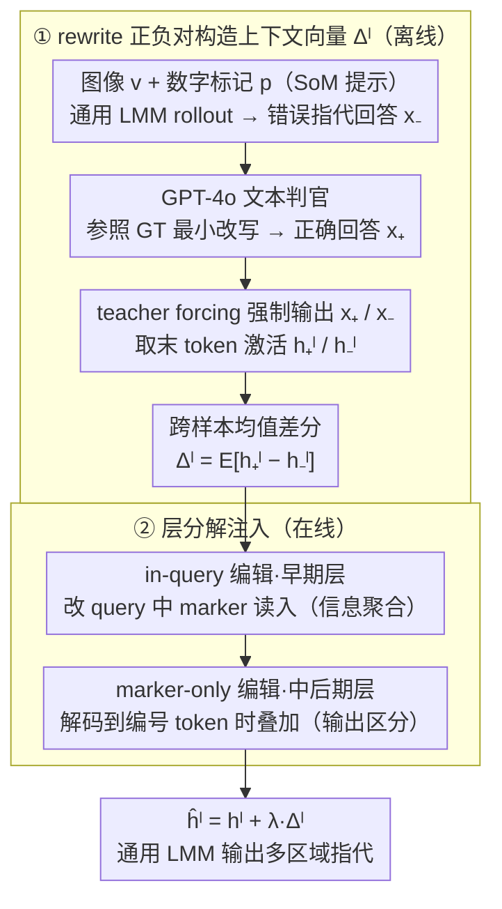

# Referring Multiple Regions with Large Multimodal Models via Contextual Latent Steering

**会议**: ICML 2026  
**arXiv**: [2605.01827](https://arxiv.org/abs/2605.01827)  
**代码**: https://github.com/xing0047/csteer.git (有)  
**领域**: 多模态VLM / 表征编辑 / 视觉指代  
**关键词**: 多区域指代, latent steering, training-free, contextual vector, LMM

## 一句话总结
CSteer 提出一种训练无关的 latent steering 方法,通过在错误/正确指代回答的隐藏激活差上构造"上下文向量",并在推理时分层注入到 query 早期层和 decode 中后期层,让通用 LMM (Qwen3-VL、InternVL-3.5) 在多区域视觉指代任务上反超专门微调的 region LMM。

## 研究背景与动机

**领域现状**:通用 LMM (LLaVA、Qwen-VL、InternVL 系列) 在整图理解上已经很强,但要求模型针对图像中"标了 [1][2][3] 多个区域"分别作答时仍然吃力;现有的 region LMM (GAR、INST-IT-Qwen、DAM、Sa2VA 等) 多走"专门 region encoder + 大规模指代数据微调"的路线,代价高且只擅长单 region 描述。

**现有痛点**:单区域 Set-of-Mark (SoM) 提示在通用 LMM 上还能工作,但一旦区域数 $m>1$,模型的视觉注意力会变得"散且不忠"——要么把多个区域的语义混在一起、要么把编号 [1][2] 配错对象、要么忽略全局上下文(如计数、比较深度/反射率)。

**核心矛盾**:实例级精细感知需要模型"按编号区分 + 同时关注全局",但通用 LMM 的预训练目标只优化整图理解,这种"分区+情境"的混合行为既没有明确监督也没有显式表示通路;而靠 SFT/RL 把它"训进去"成本高、可扩展性差。

**本文目标**:不改架构、不做监督微调,只在推理时干预隐藏激活,就让通用 LMM 触发多区域 + 上下文敏感的指代行为。

**切入角度**:借鉴 Rimsky 等人在 LLM 行为编辑上的工作——一个具体行为(如拒答、谄媚)往往可以在某些层的隐藏空间里抽出一个"激活方向向量",推理时叠加该向量就能开/关该行为。作者假设"多区域指代"也是这种可线性编辑的行为模式。

**核心 idea**:用 LLM-as-judge 把通用 LMM 自身生成的错误指代描述改写成正确描述,以"改写 vs 原错误"为正负对构造上下文向量 $\Delta^l$,然后做层分解 (layer-decomposed) 注入——早层注 query 端帮助"信息聚合",中后层注 decode 端引导"输出区分"。

## 方法详解

### 整体框架
给定一张图像 $v$、覆盖在图上的视觉提示 $p=\{p_1,...,p_m\}$(数字标记)和文本 query $q$,通用 LMM $\mathcal{F}$ 把它们编码成 $\textbf{X}_c=\text{concat}(\mathcal{F}_{visual}(v,p), \textbf{X}_q)$,然后语言模型 $\mathcal{F}_L$ 自回归解码答案。CSteer 不改这条主流程,而是在 $\mathcal{F}_L$ 的若干层隐藏状态 $h^l$ 上加一个预先算好的上下文向量 (contextual vector) $\Delta^l$:$\hat{h}^l = h^l + \lambda \cdot \Delta^l$。整个 pipeline 正是论文里两个串行模块:**① 离线构造上下文向量**——用一小批带 GT 标注的样本跑 LMM 得到错误指代回答 (负样本),用 GPT-4o 等纯文本判官参照 GT 把它最小改写成正确版本 (正样本),再用 teacher forcing 让 LMM 分别"被迫"输出正/负回答,记录最后一个 token 的隐藏激活,正负相减再跨样本平均得到每层的 $\Delta^l$;**② 在线分层注入**——推理时按"早期层改 query、中后期层改 decode"的分解策略叠加 $\Delta^l$,完全不改架构、不更新参数。

### 关键设计

论文把 CSteer 明确拆成两个串行模块——**怎么造出干净的上下文向量**、**怎么把它注到对的层**;下面两点就对应框架图里的两个 subgraph,训练无关、即插即用是这两步的自然结果(见各点末尾)。

**1. rewrite 正负对构造:把"指代纠错"信号从向量里提纯出来**

这一步要解决的是框架图 ① 的核心问题——怎么让 $\Delta^l$ 只编码"多区域指代"这个行为,而不夹带写作风格等无关信号。最直接的做法是拿一对"对/错"回答相减,但怎么取这对样本大有讲究,作者并排比了四种方案:"Refer vs No Refer"(正样本叠 marker、负样本不叠,式 5)、"Exact Matching vs Marker Shuffle"(负样本把编号打乱,式 6)、"GT vs Rollout"(正样本直接用 GT caption,式 7),以及最终采用的 "Rewrite vs Rollout"(式 8)。CSteer 的做法是:负样本 $\hat{x}_-$ 取 LMM 在 SoM 提示下的**真实错误 rollout**(如把区域 [2] 的物体描述成 [1] 的),正样本 $\mathcal{F}_{rewrite}(\hat{x})_+$ 取一个纯文本 LLM(GPT-4o)以 GT caption 为参考、把这条错误回答**最小改写**成正确版本——只纠正错的指代关系,不动句长、词汇和写作风格,于是 $\Delta^l = f_+(v,p,\mathcal{F}_{rewrite}(\hat{x})_+) - f_-(v,p,\hat{x}_-)$。为什么非要这么绕?因为朴素的 "GT vs Rollout" 会把人写的 GT 与模型 rollout 之间的风格、句式差异一并灌进 $\Delta^l$,让它变成一个"风格向量"而非"行为向量";让正负样本的非指代部分尽量逐字对齐,差分方向才几乎只承载"指代纠错"这一个信号——消融里 rewrite 也确实比其余构造方案干净、提升最大。

**2. 层分解注入(layer-decomposed steering):早层管聚合、中后层管输出**

造好 $\Delta^l$ 后还有一个问题:注到哪些层、注在哪些 token 上?默认做法(式 9)是对所有 decode step 一刀切叠加,效果平平。作者的关键观察是,"多区域指代"其实包含两件事——**读进来**(把 query 里的编号标记 [1][2] 和对应区域绑对)和**写出去**(解码时让 [1] 的描述别串到 [2]),而这两件事发生在 LMM 的不同位置。于是把注入拆成两路:**in-query 编辑**只改用户 query 里 marker token 的隐藏状态,影响"读入";**marker-only 编辑**只在解码到编号 token $h^l_{t\in\mathcal{P}}$ 时叠加 $\Delta^l$,影响"写出"。实证发现二者偏好不同层段——in-query 在**早期层**(信息聚合阶段)收益最大,marker-only 在**中后期层**(输出预测阶段)收益最大,叠加后才能同时治好"读 [1] 时没看右边那只猫"和"输出 [1] 描述串到 [2]"两个症状(单用任一路只比 SoM 高 1-2%,组合后 +5-7%)。这一分工呼应 Wang et al. 2023 关于 LLM 信息流的结论:早期层做语义聚合、后期层做下一 token 预测,把对应的行为信号注到"功能匹配"的层才真正生效。

这两步合起来就给出 CSteer 的部署优势:全程只用一小批(上百到上千)带 GT 样本**离线**预计算一次 $\Delta^l$,推理时只多一个 $O(d)$ 的逐层加法,几乎不增延迟;算好的向量还能跨任务复用(GAR-Bench 上的 $\Delta^l$ 直接套到 INST-IT、VIP-Bench)。相比 region LMM 动辄数十万样本做 SFT,CSteer 把"行为习得"从权重空间搬到了激活空间,既不改架构也不训练,对中小团队和闭源基模更可行。

### 损失函数 / 训练策略
CSteer 无任何训练损失,主步骤只有 SVD-free 的均值差分:$\Delta^l = \mathbb{E}_{(x_+, x_-)}\left[h^l_+ - h^l_-\right]$;唯一超参是注入强度 $\lambda$ 和注入层范围,通过在小验证集上 grid search 选定。

## 实验关键数据

### 主实验

| 基座 LMM | 方法 | GAR-Bench ALL | INST-IT (Img) AVG | LaSOText 评测 (替代) |
|---|---|---|---|---|
| Qwen3-VL-8B | w/o refer | 39.3 | 31.8 | - |
| Qwen3-VL-8B | SoM (Yang 2023) | 63.9 | 52.5 | - |
| Qwen3-VL-8B | **CSteer** | **65.8** | **57.4** | - |
| InternVL-3.5-8B | SoM | 50.9 | 39.2 | - |
| InternVL-3.5-8B | **CSteer** | **53.1** | **43.1** | - |
| GAR-8B (region LMM) | tailored SFT | 59.9 | 62.2 | - |
| Gemini-2.5-Pro | proprietary | 64.2 | 59.3 | - |

| 数据集 | Qwen3-VL SoM | Qwen3-VL CSteer | 提升 | 备注 |
|---|---|---|---|---|
| VIP-Bench AVG | 70.8 | 71.0 | +0.2 | 单区域为主,空间有限 |
| BLINK ALL | 47.9 | (见论文) | +3-5 | 多区域比较任务 |
| GAR-Bench (contextual) | 58.9 | 66.4 | **+7.5** | 上下文敏感场景增幅最大 |

### 消融实验

| 设计组件 | GAR-Bench AVG | 说明 |
|---|---|---|
| Full CSteer | 57.4 | Qwen3-VL-8B + rewrite + 层分解 |
| w/o Rewrite (用 GT vs Rollout) | ~54 | 风格噪声混入,提升缩水 |
| w/o Decomposition (只 marker-only) | ~55 | 信息聚合阶段缺失 |
| w/o Decomposition (只 in-query) | ~54 | decode 阶段输出仍混乱 |
| Marker Shuffle 构造 | ~53 | 不如 rewrite 纯净 |

### 关键发现
- **上下文场景增幅 > 区域中心场景**:GAR-Bench contextual subset 提升 +7.5%,但 BLINK 的 relative depth/reflectance 只提升 +3-5%,说明 $\Delta^l$ 更擅长"修正全局忽略",对纯几何比较任务也有效但增量小。
- **层分解是关键**:in-query 和 marker-only 单独使用都比 SoM 强不了多少 (+1-2%),叠加后才有 +5-7% 提升,印证作者关于"早层聚合 / 后层输出"分工的假设。
- **训练无关也能超越 SFT 模型**:Qwen3-VL-8B+CSteer 在 GAR-Bench 上拿到 65.8,直接超过专为该 benchmark 微调的 GAR-8B 的 59.9,显示通用 LMM 已经具备多区域感知能力,只是"激活不出来"——这是个相当反直觉的发现。

## 亮点与洞察
- **"行为可线性编辑"假设的视觉扩展**:之前 Rimsky 等人在文本 LLM 上验证拒答/谄媚等行为可被 steering vector 调节,本文把这个范式干净地搬到多模态指代任务,且证明视觉 marker 这种"高度局部化"的行为也吃这一套——这暗示更多视觉行为(如细粒度计数、关系推理)可能都可被表征编辑。
- **rewrite 构造正负对的纯净度技巧**:不是简单拿 GT 当正样本,而是让 LLM 把负样本"最小改写"成正确版本,这种"差分匹配"思路可迁移到任何需要纯净行为向量的任务(如代码风格、毒性、推理链结构)。
- **分层注入的功能映射**:把"信息聚合"贴到早层、"输出生成"贴到后层,这种基于 LLM 信息流先验的精细化干预比一刀切 (所有层都注) 更稳更强;后续工作可以更系统地做"任务-层"对齐研究。

## 局限与展望
- 上下文向量是数据集相关的——虽然作者展示跨基准复用,但跨完全不同模态 (如医学影像、遥感) 是否仍稳健没有验证;领域漂移时可能需要重算 $\Delta^l$。
- 注入强度 $\lambda$ 和层范围都需要小验证集 grid search,部署时仍有"无标注 cold start"难题;能否做无监督 $\lambda$ 自适应是个开放问题。
- 只覆盖到 8B 量级的开源 LMM,未在 70B+ 或闭源大模型 (GPT-4o、o3) 上做 steering 实验——后者只作为 baseline 比较;表征编辑能否在百亿级模型上稳定生效仍是未知。
- 多区域上限仍受限于通用 LMM 的视觉 token 数和注意力宽度,极端密集场景 (几十个 region) 估计仍会饱和。

## 相关工作与启发
- **vs GAR / INST-IT-Qwen / DAM (region LMM)**:它们走"加 region encoder + 大规模指代数据 SFT"路线,通用性强但训练贵;CSteer 不改架构、不训练,在多区域任务上反超,提示"通用基模 + 推理时干预"是潜力路线。
- **vs SoM (Set-of-Mark, Yang 2023)**:SoM 只在图上叠 marker 做提示,完全黑盒;CSteer 在 SoM 之上加 latent 干预,验证了"prompt + activation editing"的组合拳。
- **vs Rimsky 2024 (CAA)**:Rimsky 在文本 LLM 上做单方向 steering,作者扩展到多模态 + 层分解 (in-query / marker-only) + rewrite 正负对,是一次多维度的工程化推进。
- **vs Inference-Time Intervention (ITI)**:思路相近 (推理时改激活),但 ITI 主要做"诚实性",CSteer 第一次把这个范式系统化用到视觉指代,且 layer-decomposed 是新组件。

## 评分
- 新颖性: ⭐⭐⭐⭐ 把 latent steering 干净地引入多模态多区域指代,rewrite + 层分解都是新工程化点
- 实验充分度: ⭐⭐⭐⭐ 覆盖 4+ benchmark 和多个基座 LMM,ablation 比较全,但缺少跨域 (医学/遥感) 验证
- 写作质量: ⭐⭐⭐⭐ pipeline 图清晰,数学符号一致,公式 4-8 的多种向量构造方案对比很有信息量
- 价值: ⭐⭐⭐⭐⭐ 给出了"不微调也能挤出 region 能力"的低成本路径,对工业落地通用 LMM 极有借鉴意义

<!-- RELATED:START -->

## 相关论文

- [\[ICML 2026\] Vision-aligned Latent Reasoning for Multi-modal Large Language Model](vision-aligned_latent_reasoning_for_multi-modal_large_language_model.md)
- [\[NeurIPS 2025\] Test-Time Spectrum-Aware Latent Steering for Zero-Shot Generalization in Vision-Language Models](../../NeurIPS2025/multimodal_vlm/test-time_spectrum-aware_latent_steering_for_zero-shot_generalization_in_vision-.md)
- [\[ICML 2026\] SLQ: Bridging Modalities via Shared Latent Queries for Retrieval with Frozen MLLMs](slq_bridging_modalities_via_shared_latent_queries_for_retrieval_with_frozen_mllm.md)
- [\[CVPR 2026\] Evolving Contextual Safety in Multi-Modal Large Language Models via Inference-Time Self-Reflective Memory](../../CVPR2026/multimodal_vlm/evolving_contextual_safety_in_multi-modal_large_language_models_via_inference-ti.md)
- [\[ICLR 2026\] Grasp Any Region: Towards Precise, Contextual Pixel Understanding for Multimodal LLMs](../../ICLR2026/multimodal_vlm/grasp_any_region_towards_precise_contextual_pixel_understanding_for_multimodal_l.md)

<!-- RELATED:END -->
