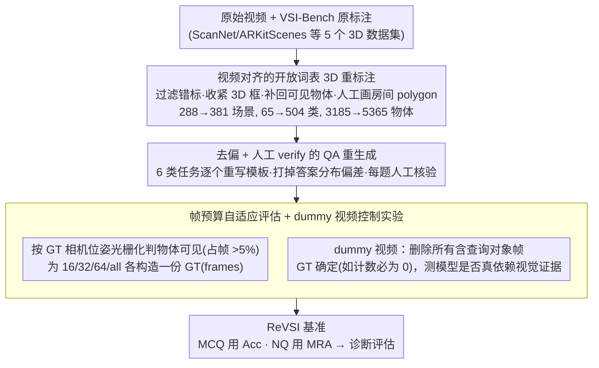

# ReVSI: Rebuilding Visual Spatial Intelligence Evaluation for Accurate Assessment of VLM 3D Reasoning

**会议**: ICML 2026  
**arXiv**: [2604.24300](https://arxiv.org/abs/2604.24300)  
**代码**: 有（项目页 + GitHub + HuggingFace）  
**领域**: 多模态 VLM / 评测基准 / 视觉空间智能  
**关键词**: VSI-Bench、空间推理、帧预算、虚拟视频、hallucination

## 一句话总结
本文系统揭示了被广泛使用的 VSI-Bench 因 3D 标注漂移与帧采样不一致而存在结构性失效，进而重新标注 381 个场景、5365 个对象，并设计帧预算自适应 QA 与"删除查询对象帧"的 dummy 视频压力测试，构建出名为 ReVSI 的高保真空间智能基准；评估显示开源 VLM 在 ReVSI 上掉点最多 40%，且在 dummy 视频上幻觉率仍高，暴露出现有空间推理能力被 VSI-Bench 系统性高估。

## 研究背景与动机

**领域现状**：随着 VLM 朝具身和 3D 感知方向扩张，VSI 评估基准如 VSI-Bench、SPAR-Bench、VSI-SUPER 成为主流，用 ScanNet/ARKitScenes 等 3D 数据集自动生成 QA 来测试模型在物体计数、相对方向、房间面积等任务上的空间推理。VLM 训练（SpatialVLM、Cambrian-S、SpaceR）也都围绕这些 benchmark 优化。

**现有痛点**：作者用手工 audit 揭示两个核心缺陷。一是**标注-视频漂移**：VSI-Bench 的 GT 来自基于点云的 3D 重建标注（为传统 3D perception 服务），但 raw video 中清楚可见的物体可能因重建不全而被遗漏，物体类别被错标（cup 标成 notebook），房间面积根据 noisy Alpha Shape 算出，导致大量 QA 在视频证据下根本错或语义模糊——以 565 个 Object Counting 题为例，27% 错、11% 歧义。二是**帧采样不可观测**：VLM 实际只能看 16/32/64 帧，但 VSI-Bench 的 GT 是按 all-frame 标的；图 3 显示 16 帧下 GT correctness 跌到 67%，相当一部分题在模型实际输入下根本无解。

**核心矛盾**：benchmark 默认"模型看见的全场景 = 标注时看见的全场景"，但现代 VLM 的 sparse-frame 输入打破了这一假设，使得"模型答错"无法区分是空间推理弱还是关键证据没出现。同时 VSI-Bench 答案分布严重失衡（"2"占 Object Counting 53%、距离 0–2m 占多数），让模型可以靠 prior 而非 visual evidence 拿高分。

**本文目标**：在保留 VSI-Bench 任务范式的前提下，让 (i) 标注与原始视频严格一致；(ii) QA 在每一种帧预算下都 answerable + correct；(iii) 提供可控诊断手段把"视觉证据"与"推理能力"解耦。

**切入角度**：与其再训一个模型，不如修评测——把"benchmark 想问的"与"模型实际看到的"严格对齐，benchmark 才有 diagnostic 价值。

**核心 idea**：用"视频对齐的人工 3D 重标 + 帧预算自适应 QA + dummy 视频压力测试"三件事，重建出第一个 input-consistent 的 VSI 基准 ReVSI。

## 方法详解

### 整体框架
ReVSI 流水线分三阶段：(1) 用自研 3D web 标注界面，在 ScanNetv2/ScanNet++/ARKitScenes/3RScan/MultiScan 上从原 VSI-Bench 的 288 场景 65 类扩到 381 场景 504 类（开放词表），重画 5365 个 3D 框；(2) 对 6 类任务（object counting / object size / absolute distance / room size / relative distance / relative direction，删除 Object Appearance Order 因更偏时间推理）按更严的模板规则重新生成 QA，每条人工 verify；(3) 同一段视频在 16/32/64/all-frame 四个采样预算下分别构造 GT，并额外生成"删除所有含查询对象帧"的 dummy 视频做 visibility-guided 控制实验。

### 关键设计

**1. 视频对齐的开放词表 3D 重标注：把 GT 从"基于 noisy 重建网格"换成"以原始视频为锚的人工标注"**

旧 GT 所有毛病的根源是一个错位——它标注的对象是点云重建出来的 mesh，而不是 raw video，于是视频里清楚可见的物体会因重建不全被遗漏、类别被错标（cup 标成 notebook）、房间面积按 noisy Alpha Shape 算偏。ReVSI 直接更换标注对象就一举解决：作者用自研 web 标注器，以原 VSI-Bench 标注为起点，过滤错标、收紧 3D 框、补回视频中可见但重建丢失的物体，对几何破损的物体用相邻帧外推真实物理尺寸，房间面积也放弃 Alpha Shape、改用 top-down 视角人工画 polygon 并剔除边界不清的场景。开放词表标签（如 "Sony PlayStation"、"Coca-Cola box"）全由人工写、GPT-5.2 只用于 verify。规模从 288 场景 65 类扩到 381 场景 504 类、物体从 3185 重画到 5365——更细的开放类别还顺手堵死了"靠 65 类先验做 narrow guess"的捷径。

**2. 去偏 + 人工 verify 的 QA 重生成：在保留任务定义的前提下打掉答案分布偏差**

VSI-Bench 的另一个漏洞是答案过分集中（Object Counting 只猜"2"就能拿 62%、距离多落在 0–2m），模型可以 mode-collapse 到高频答案、靠 prior 而非视觉证据拿分。ReVSI 逐任务重写模板专治这一点：Object Counting 重新引入单实例查询（"How many black office chairs"）并新增"两类合计"模板、把"this room"改成"the scene"以匹配多房间视频；Object Size 剔除 toilet/bed 这种近乎固定尺寸的类别、对 refrigerator 等做 OOD 采样；Absolute Distance 删掉 <1m 题（单帧 2D 线索就能答）改加长距对；Relative Direction 要求 positioning object 足迹 ≤1 m²、物体间距 ≥1m 并加"面背朝某物"模板；Room Size 新增"main room only"模板缓解多房间歧义。每题都过人工核验。统计去偏 + 模板多样化把靠先验拿分的捷径堵死，让 metric 真正反映 spatial reasoning。

**3. 帧预算自适应评估 + dummy 视频控制实验：把"模型看到的"和"benchmark 评估的"对齐，再压力测试它是否真依赖视觉**

现代 VLM 实际只看 16/32/64 帧，但旧 GT 是按 all-frame 标的，导致"模型答错"分不清是推理弱还是关键证据压根没出现（16 帧下 GT correctness 跌到 67%）。ReVSI 用场景的 GT 相机位姿光栅化每个采样帧、自动判断物体是否可见（占帧面积 >5%）、不可见时人工补标，为 16/32/64/all 四个帧预算各构造一份 GT，让 GT 从一个常数变成一个函数 $\text{GT}(\text{frames})$。在此之上再加 dummy video——删掉所有含查询对象的帧、只保留场景上下文，对人类来说"不可答"但 GT 是确定值（如 object counting 必为 0）。落到 metric 上 MCQ 用 Acc、NQ 用 Mean Relative Accuracy $\text{MRA}=\frac{1}{|C|}\sum_{\theta\in C}\mathbb{1}[|\hat y-y|/y<1-\theta]$（$C=\{0.5,0.55,\dots,0.95\}$）。dummy video 的诊断力在于：若模型在没有证据时还能答对，说明输出由 prior 而非视觉驱动——这正是 hallucination 的定义。

### 损失函数 / 训练策略
ReVSI 是评测 benchmark，不训模型；评估遵循 MRA（NQ）与 Acc（MCQ）。

## 实验关键数据

### 主实验
评估 Qwen3-VL、InternVL-3.5、LLaVA-Video、GPT-5.2、Gemini 3 等通用 VLM 与 SpatialVLM、Cambrian-S、SpaceR、VLM-3R、Spatial-MLLM 等 3D 专家模型；同时在 ReVSI 和 VSI-Bench 上跑分对比。

| 数据集统计 | VSI-Bench | ReVSI |
|------------|-----------|-------|
| 场景数 | 288 | 381 |
| 物体数 | 3185 | 5365 |
| 类别数 | 65 | 504 |
| 开放词表 | ✗ | ✓ |
| 帧预算自适应 GT | ✗（只有 all-frame） | ✓（16/32/64/all） |

| 模型类别 | VSI-Bench 表现 | ReVSI 表现 | 结论 |
|----------|----------------|-------------|------|
| 闭源大模型（GPT-5.2、Gemini 3） | 看似低于开源 | 显著反超开源，尤其 Object Counting | VSI-Bench 系统性低估闭源模型 |
| 开源 VLM（Qwen3-VL、InternVL-3.5） | 高 | 掉最多 40%（Counting / Rel-Dist / Rel-Dir） | VSI-Bench 高估开源 |
| 3D 微调专家（SpaceR、3D-R1） | 大幅高于 base | 收益锐减，部分子任务不如 base | 微调收益被 benchmark bias 放大 |

### 消融实验

| 诊断设置 | 关键发现 |
|----------|----------|
| Object Counting 仅猜 "2" | VSI-Bench 上 62%、ReVSI 上 <20%，验证答案去偏成功 |
| Absolute Distance | 多数模型 ReVSI 反而更高分 → 因 MRA 在长距更宽容，去掉 <1m 短距样本反而让 Qwen3-VL 的长距强项显形 |
| Dummy Video Object Counting | InternVL-3.5 等仍给出"中等数字" → 非零幻觉率，证明输出由 indoor prior 而非视觉证据驱动 |
| Object Size with 全黑帧 | 部分专家模型仍命中"典型类别尺寸"，揭示其 size 估计严重依赖 category prior |
| 帧预算扫描 | 16→64 帧 GT correctness 从 67%→92%，证明 frame-aware 设计的必要性 |

### 关键发现
- VSI-Bench 上"开源 > 闭源"的结论在 ReVSI 上反转，说明此前的"专家模型 SOTA"结论很可能是 benchmark artifact。
- 3D 微调专家在更干净的 ReVSI 上收益骤减，post-training data scale 与性能脱钩，提示当前 3D 指令微调主要在"过拟合 noisy GT"。
- Dummy video 暴露出多个 SOTA 开源 VLM 的输出对"视觉证据是否存在"几乎不敏感——这是 spatial reasoning 真实瓶颈。
- 帧采样阈值经验：单房间场景应至少 64 帧，且 benchmark 应按帧预算给不同 GT。

## 亮点与洞察
- **"修评测比改模型更重要"的实证范例**：作者用 audit 把 VSI-Bench 的 27% 错+11% 歧义率打出来，并把多数 SOTA 论断翻盘，说明评测 hygiene 是当前 spatial AI 研究最高 ROI 的方向之一。
- **dummy video 协议**：可以无成本扩展到其它任何 video QA，做法是"按 question 自动剔除证据帧后看模型是否还答得出来"，这套 visibility-controlled 压力测试可以系统量化 hallucination，极具迁移价值。
- **帧预算-aware GT**：第一次把"GT 不再是一个，而是一个函数 $\text{GT}(\text{frames})$" 落地到大规模 benchmark，未来 long-video benchmark 都应该跟进。

## 局限与展望
- 重标注虽规模大但仍是手工，更难扩到 in-the-wild 视频；下一步可半自动化（用 GPT-5.2 辅助 + 人工抽检）。
- Object Appearance Order 直接被删除，避免了时间推理，但 spatial-temporal 联合理解仍未覆盖。
- dummy video 把"无证据 → 应答 0/未知"作为 GT，与人类直觉一致但与某些模型的"refuse to answer"行为评估方式不完全对齐，未来可以加入 confidence calibration 指标。
- ReVSI 与 VSI-Bench 共用任务定义，意味着新基准还没扩充全新的 3D 推理任务（如多视角配准、6DoF 操作）。

## 相关工作与启发
- **vs VSI-Bench (Yang 2025a)**：直接被本文 audit；ReVSI 在每个细节上修正其问题，是其更可信的"接替者"。
- **vs SPAR-Bench / VSI-SUPER**：同样存在 GT 漂移与帧不匹配问题，ReVSI 提出的"input-consistent"原则可被这些 benchmark 复用。
- **vs 3D 微调 VLM（SpatialVLM、Cambrian-S、SpaceR）**：ReVSI 暴露这些方法在干净 benchmark 上收益锐减，呼吁研究者在评测严谨之上再训练。
- **跨任务启发**：dummy video / visibility-controlled QA 协议可推广到 medical VQA（删除关键解剖区域后看模型是否仍诊断）和 robot perception（删除关键 frame）等。

## 评分
- 新颖性: ⭐⭐⭐⭐ benchmark 类工作的"重建 + 新协议"，并非全新任务但思路独到、影响面广。
- 实验充分度: ⭐⭐⭐⭐⭐ 涵盖开源/闭源/专家三类共 10+ 模型，多帧预算 + dummy video 多维诊断，audit 数据量充足。
- 写作质量: ⭐⭐⭐⭐⭐ 三段式问题诊断 → 解决方案 → 实证验证的论证链清晰，图 1/3/5 把核心问题一图打透。
- 价值: ⭐⭐⭐⭐⭐ 直接动摇了一个被广泛引用的 benchmark 的可信度，可能改变整个 VLM 空间推理研究方向，社区影响巨大。

<!-- RELATED:START -->

## 相关论文

- [\[CVPR 2026\] SpatialScore: Towards Comprehensive Evaluation for Spatial Intelligence](../../CVPR2026/multimodal_vlm/spatialscore_towards_comprehensive_evaluation_for_spatial_intelligence.md)
- [\[ICML 2026\] R$^3$L: Reasoning 3D Layouts from Relative Spatial Relations](r3l_reasoning_3d_layouts_from_relative_spatial_relations.md)
- [\[ICML 2026\] Learning GUI Grounding with Spatial Reasoning from Visual Feedback](learning_gui_grounding_with_spatial_reasoning_from_visual_feedback.md)
- [\[ICML 2026\] Thinking in Structures: Evaluating Spatial Intelligence in Constraint-Governed Spaces](thinking_in_structures_evaluating_spatial_intelligence_in_constraint-governed_sp.md)
- [\[CVPR 2026\] SpatialStack: Layered Geometry-Language Fusion for 3D VLM Spatial Reasoning](../../CVPR2026/multimodal_vlm/spatialstack_layered_geometry-language_fusion_for_3d_vlm_spatial_reasoning.md)

<!-- RELATED:END -->
