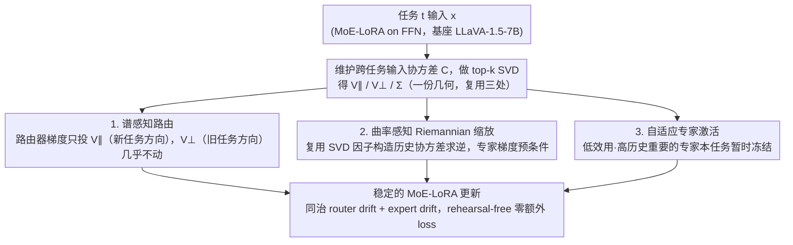

# SAME: Stabilized Mixture-of-Experts for Multimodal Continual Instruction Tuning

**会议**: ICML2026  
**arXiv**: [2602.01990](https://arxiv.org/abs/2602.01990)  
**代码**: https://github.com/LAMDA-CL/Prism  
**领域**: 多模态VLM / 持续学习 / MoE-LoRA  
**关键词**: SAME, MCIT, router drift, expert drift, 谱感知更新, 曲率感知 Riemannian 缩放, 自适应专家激活  

## 一句话总结
SAME 把多模态持续指令微调里 MoE-LoRA 的"灾难性遗忘"明确拆成 router drift 和 expert drift 两个独立来源，分别用谱感知的子空间约束更新路由器、用历史输入协方差做 Riemannian 预条件保护专家、再用任务级自适应冻结去掉冗余更新，在 CoIN / UCIT 及作者自建的 TriGap 长序列基准上稳定打过现有 MoE 持续学习 SOTA。

## 研究背景与动机

**领域现状**：MLLM (LLaVA、Qwen-VL 等) 在静态多任务上靠指令微调表现亮眼，但实际部署里任务是顺序到来的，这就是 MCIT (Multimodal Continual Instruction Tuning)。近来主流做法是把 MoE + LoRA 塞进 FFN 层，靠稀疏路由实现"专家专门化"来抗遗忘 (MoELoRA、CL-MoE、HiDe-LLaVA 等)。

**现有痛点**：作者做了非常漂亮的诊断实验 (Fig. 1)——在 8 任务序列里保存每个任务后的 router 和 expert 快照，然后用 Task 1 测试集回测：(a) 随着新任务来，路由器对 Task 1 输入的专家激活分布越漂越远，意味着**同样的输入被路到不同专家**；(b) 即使把 Task 1 的训练集拿出来重新训路由器（冻住专家），Task 1 准确率仍然一路下滑，且 routing entropy 越来越低——说明**专家本身也在飘**，已经丢掉了 Task 1 该有的功能。

**核心矛盾**：MoE 持续学习里"遗忘"其实是两个解耦的源头叠加：(i) **router drift**——路由器更新让旧任务样本被错配到新专家；(ii) **expert drift**——共享专家被新任务的梯度反复覆盖，原始功能被擦掉。之前的方法没把这两件事分开治，往往按"住一个房间"，结果按下葫芦浮起瓢。

**本文目标**：分别给路由器和专家设计独立的稳定机制，再加一个减少冗余更新的训练效率组件，做成一个端到端 rehearsal-free 的方案。

**切入角度**：作者借用了 continual learning 里的"梯度子空间投影"和"自然梯度/Fisher 度量"两条经典思路——前者治路由器（保留旧任务子空间），后者治专家（在历史输入几何下做预条件）。

**核心 idea**：维护一份历史输入未中心化协方差 $\mathbf{C}^t$ 作为统一的"过去几何"代理；路由器的梯度只往该协方差的高能子空间投，专家梯度直接用 $(\mathbf{C}^{t-1})^{-1}$ 做 Riemannian 缩放，再叠一个任务级自适应专家冻结。

## 方法详解

### 整体框架
基座是 LLaVA-v1.5-7B + CLIP-L/14-336，只在 LLM 的 FFN 层插 LoRA 专家。给定输入 $\mathbf{x}\in\mathbb{R}^d$，输出是 $\mathbf{h}=\mathbf{W}_0\mathbf{x}+\sum_{i=1}^n \omega_i \mathbf{B}_i\mathbf{A}_i\mathbf{x}$，其中 $\omega_i=\mathrm{Softmax}(\mathbf{W}_G\mathbf{x})_i$ 是路由器输出。整套方法围绕一份共享的「过去几何」——跨任务累计的输入协方差 $\mathbf{C}^t$——展开：任务 $t$ 训练时先在线维护 $\mathbf{C}^t$ 并做 top-$k$ SVD 得 $\mathbf{V}_\parallel, \mathbf{V}_\perp, \boldsymbol{\Sigma}$，然后这份分解同时喂给三件稳定机制——谱感知路由用 $\mathbf{V}_\parallel/\mathbf{V}_\perp$ 约束 $\mathbf{W}_G$ 的更新方向（治 router drift），曲率感知 Riemannian 缩放复用同一份因子构造 $(\mathbf{C}^{t-1})^{-1}$ 给专家梯度做预条件（治 expert drift），自适应专家激活用输入能量近似历史重要性、按效用-重要性差分把一批专家暂时冻结（省算力 + 减干扰）。三者共用一份协方差，存储几乎零增。

### 关键设计

**1. 谱感知路由：让路由器只在新任务的输入方向上更新，旧任务依赖的方向上几乎不动**

针对 router drift（同样的旧任务输入被路到不同专家），思路是把更新限制在「不影响旧任务」的子空间里。具体维护一份跨任务的滑动协方差 $\mathbf{C}^t=(\alpha_{t-1}\mathbf{C}^{t-1}+n_t\hat{\mathbf{C}}^t)/\alpha_t$，只存 top-$k$ 主成分使累计能量 $\sum_{i=1}^k\sigma_i^2/\sum_{i=1}^d\sigma_i^2\geq\delta$，SVD 后切成 $\mathbf{V}_\parallel$（新任务关键方向）和 $\mathbf{V}_\perp$（近零方差的旧任务空间）。路由器梯度在新任务方向上带尺度缩放 $\Delta\mathbf{W}_\parallel^t=\Delta\mathbf{W}_G^t\mathbf{V}_\parallel g(\boldsymbol{\Sigma})\mathbf{V}_\parallel^\top$、在旧任务方向上直接投影 $\Delta\mathbf{W}_\perp^t=\Delta\mathbf{W}_G^t\mathbf{V}_\perp\mathbf{V}_\perp^\top$，相加得最终更新。关键在于 $\mathbf{C}^t\propto\mathbf{X}\mathbf{X}^\top$，所以 $\mathbf{V}_\perp^\top\mathbf{X}^{old}\approx\mathbf{0}$，旧任务的路由预测被数学保证不变；同时 $\mathbf{V}_\parallel$ 内部按局部上下文 $\hat\sigma_i$ 重新加权，不对所有新方向一视同仁。消融里单这一项就把 CoIN 平均准确率从 50.58 拉到 61.32（+10.74），是最大单一收益。

**2. 曲率感知 Riemannian 缩放：让专家更新在「历史常用方向」上小步走，避免擦掉已学功能**

针对 expert drift（共享专家被新任务梯度反复覆盖），SAME 在 rehearsal-free 下把功能退化量近似为 $\Delta_{degrad}=\mathbb{E}_{\mathbf{x}\sim\mathcal{D}_{<t}}[\|\Delta\mathbf{W}_i\mathbf{x}\|^2]=\mathrm{tr}(\Delta\mathbf{W}_i\mathbf{C}^{t-1}\Delta\mathbf{W}_i^\top)$，优化 $\min_{\Delta\mathbf{W}_i}\mathcal{L}+\lambda\max(0,\Delta_{degrad}-\epsilon)$ 自然推出 Riemannian 更新：

$$\Delta\mathbf{W}_i=-\eta\nabla_{\mathbf{W}_i}\mathcal{L}\,(\mathbf{C}^{t-1})^{-1}$$

其中 $(\mathbf{C}^{t-1})^{-1}$ 不直接求逆，而是复用谱感知阶段已算好的 $(\mathbf{V}_k,\boldsymbol{\Sigma}_k)$ 做 damped pseudo-inverse $(\mathbf{C}^{t-1})^{-1}\approx\mathbf{V}_k(\boldsymbol{\Sigma}_k+\mu\mathbf{I})^{-1}\mathbf{V}_k^\top+\frac{1}{\mu}(\mathbf{I}-\mathbf{V}_k\mathbf{V}_k^\top)$。效果是：高方差方向 $\sigma_i$ 大、更新被压扁；低方差或新方向 $\sigma_i\approx0$、落到 $1/\mu$ 的默认尺度。这正是自然梯度的精神——在「过去用得多」的方向上自动加重力，但用输入协方差代替了昂贵的二阶量，且 SVD 复用让显存几乎不增。

**3. 自适应专家激活：把「对当前任务没用、对历史很重要」的专家暂时冻结，省算力又防干扰**

top-$k$ 路由是 sample-level 的，会把单任务梯度撒到很多专家身上，既浪费又增加干扰。SAME 维护两个 running average——当前任务利用率 $\mathcal{U}(i)$（按 batch 累计的路由权重均值）和历史重要性 $\mathcal{F}^{pre}(i)$（用 routing-weighted input energy $\omega_i(\mathbf{x})\|\mathbf{x}\|^2$ 近似 AGOP 迹），min-max 归一化后算激活分 $\mathrm{Score}(i)=\tilde{\mathcal{U}}(i)-\tilde{\mathcal{F}}^{pre}(i)$；当 $\mathrm{Score}(i)<\tau_{score}$（低效用但高历史重要）就在训练阶段冻结该专家的前/反向传播，下一任务和推理时全部解冻。这样当前任务的更新就被集中到真正需要它的少数专家上、强化了 compartmentalization，同时带来直接的工程收益——论文报告平均每任务省 32.1 分钟训练 + 2.3K MiB/GPU 显存，等于在再涨 0.93 准确率的同时白赚效率。

### 损失函数 / 训练策略
基础是标准多模态指令微调的 next-token CE。LoRA rank=8，每任务 1 个 epoch，bs=6，lr=2e-4 + cosine decay + 0.03 warmup，8×RTX 5090。所有约束都是直接改梯度更新规则、不加额外 loss 项，整体训练成本几乎与裸 MoELoRA 持平。

## 实验关键数据

### 主实验

CoIN 8 任务基准（与原论文报告值对齐）：

| 方法 | ScienceQA | ImageNet | REC | OCR-VQA | 平均 |
|---|---|---|---|---|---|
| MoELoRA (Chen 2024) | 62.02 | 37.21 | 33.22 | 65.75 | 50.58 |
| SEFE (Chen 2025) | 75.35 | 83.10 | 16.75 | 66.25 | 58.57 |
| HiDe-LLaVA (Guo 2025a) | 73.20 | 69.28 | 59.18 | 64.76 | 63.95 |
| **SAME (Ours)** | **78.35** | 90.21 | **59.87** | 63.59 | **66.82** |

作者自建的长序列 TriGap (10 任务) 基准：

| 方法 | DocVQA | IconQA | FloodNet | 平均 |
|---|---|---|---|---|
| MoE-LoRA | 37.49 | 43.43 | 90.41 | 44.45 |
| CL-MoE | 36.79 | 52.70 | 80.09 | 44.11 |
| ModalPrompt | 38.23 | 44.73 | 71.52 | 40.15 |
| **SAME** | **43.87** | **64.03** | 81.09 | **46.53** |

UCIT 6 任务上也以 67.12% 的平均准确率领先（ModalPrompt 65.52）。

### 消融实验

| 配置 | CoIN 平均准确率 | 说明 |
|---|---|---|
| Baseline (MoELoRA) | 50.58 | 路由/专家都不约束 |
| + Spectral-aware Routing | 61.32 | 路由稳了，+10.74 |
| + Curvature-aware Scaling | 65.89 | 专家不再被覆盖，再 +4.57 |
| + Adaptive Expert Activation | 66.82 | 任务级冻结再 +0.93，同时省时间/显存 |

### 关键发现
- **路由器稳定性带来最大单一收益**：Fig. 3 显示加上谱感知路由后 Task 1 的专家激活分布几乎不再随训练漂移，对应消融里的 +10.74。
- **专家漂移确实独立存在**：Fig. 4 用"冻专家+重训路由"的 re-routing protocol，把路由因素剥离后专家版本号越大 Task 1 准确率仍越低；加上曲率缩放后衰减明显放缓。
- **格式漂移是隐形杀手**：在 ScienceQA → TextVQA → ImageNet 的序列上，作者发现 70.6% 的"错"其实只是大小写变了（"a" vs "A"），ImageNet 之后又"鬼修复"回来，呈非单调的 drop-rebound 曲线；SAME 把这种格式漂移压平了。
- **自适应冻结是免费午餐**：在拿到 +0.93 准确率的同时，平均每任务省 32.1 分钟训练 + 2.3 K MiB 显存，Task 4/8 上分别省 50/58 分钟。

## 亮点与洞察
- **把"灾难性遗忘"做了显微分解**：以前讨论 MoE 持续学习总是笼统说"参数漂移"，这篇用一个 re-routing 控制实验明确把它拆成 router drift 和 expert drift 两个独立可观测信号，等于把问题做成了可分别治理的形态。这种"诊断 → 解耦 → 分治"的研究范式值得复用。
- **协方差 $\mathbf{C}^t$ 一份数据复用三次**：同一个累计协方差既给路由器划分子空间 ($\mathbf{V}_\parallel/\mathbf{V}_\perp$)、又给专家做 Riemannian 度量、还顺便支持自适应冻结里的 input energy 近似——存储开销摊薄到几乎为 0。
- **Riemannian 视角下的"natural anti-forgetting"**：$(\mathbf{C}^{t-1})^{-1}$ 预条件正好让"过去用得多的方向"自动获得抗变能力，这等价于在 Fisher 信息度量下做自然梯度，但用输入协方差代替了昂贵的二阶量。
- **格式漂移的实证非常有教育意义**：那张大小写错误的图说明 LLM 持续学习里很多"遗忘"其实是表层的格式偏移；如果只看数字会以为模型忘了知识，实际可能只是输出风格变了。

## 局限与展望
- **任务边界已知是前提**：协方差更新、路由子空间切分都假设知道 task id，对真实流式数据 / 任务边界模糊的场景需要额外改造。
- **协方差只在 routing 层维护**：FFN 输入分布和 router 输入分布并不完全一致，用同一个 $\mathbf{C}^t$ 给专家做预条件存在小的不匹配，作者也在 Limitations 里隐晦承认了"input formats vary"的鲁棒性问题。
- **超参较多**：$\delta,\rho,\mu,\lambda,\epsilon,\tau_{score}$ 等都要调，对小团队复用有门槛；附录 F 有敏感性分析，但实际落地建议先做粗扫。
- **当前实验仍局限于 LoRA-on-FFN**：把方法扩展到 attention 层 LoRA、QKV 投影甚至 vision encoder 后续才能验证通用性。

## 相关工作与启发
- **vs MoELoRA / CL-MoE / HiDe-LLaVA**：他们要么完全靠路由稀疏性 + 副 loss 抗遗忘，要么靠层级蒸馏；SAME 的差别在于直接干预更新规则、零额外 loss、零 rehearsal，且对路由和专家分别有理论解释。
- **vs Replay-LoRA / SEFE**：经验回放路线需要存储或合成旧数据；SAME 完全 rehearsal-free，靠协方差摘要保留"过去的几何"，存储开销小一个量级。
- **vs O-LoRA / GEM / OGD 这类经典 CL**：思想上同源（梯度子空间正交投影），SAME 把它升级到 MoE 这一额外维度——不只是参数维投影，还要管路由分布稳定。
- **可迁移启发**：用累计协方差驱动梯度预条件的思路完全可以套到非 MoE 的 LoRA 持续微调上；任务级"低效用-高历史"打分冻结对纯密集模型也适用。

## 评分
- 新颖性: ⭐⭐⭐⭐ 把 MoE 遗忘拆成 router/expert drift 两源头是个有效的解构，三件套设计完整
- 实验充分度: ⭐⭐⭐⭐⭐ CoIN + UCIT + 自建 TriGap，再加 re-routing 诊断、格式漂移分析、计算效率分析，闭环非常完整
- 写作质量: ⭐⭐⭐⭐⭐ 用 Fig. 1 把问题分解讲得极清楚，方法三个公式串得逻辑顺畅
- 价值: ⭐⭐⭐⭐ rehearsal-free + 零额外 loss + 工程成本低，对 MLLM 实际部署的持续学习有直接借鉴

<!-- RELATED:START -->

## 相关论文

- [\[ICML 2025\] Dynamic Mixture of Curriculum LoRA Experts for Continual Multimodal Instruction Tuning](../../ICML2025/multimodal_vlm/dynamic_mixture_of_curriculum_lora_experts_for_continual_multimodal_instruction_.md)
- [\[ICML 2026\] Toward Structural Multimodal Representations: Specialization, Selection, and Sparsification via Mixture-of-Experts](toward_structural_multimodal_representations_specialization_selection_and_sparsi.md)
- [\[CVPR 2026\] Multimodal Continual Instruction Tuning with Dynamic Gradient Guidance](../../CVPR2026/multimodal_vlm/multimodal_continual_instruction_tuning_with_dynamic_gradient_guidance.md)
- [\[ICML 2026\] Decentralized Instruction Tuning: Conflict-Aware Splitting and Weight Merging](decentralized_instruction_tuning_conflict-aware_splitting_and_weight_merging.md)
- [\[ACL 2025\] Enhancing Multimodal Continual Instruction Tuning with BranchLoRA](../../ACL2025/multimodal_vlm/branchlora_continual_instruction.md)

<!-- RELATED:END -->
