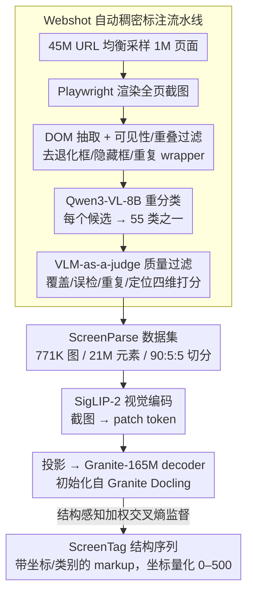

# ScreenParse: Moving Beyond Sparse Grounding with Complete Screen Parsing Supervision

**会议**: ICML 2026  
**arXiv**: [2602.14276](https://arxiv.org/abs/2602.14276)  
**代码**: https://saidgurbuz.github.io/screenparse/  
**领域**: 多模态 VLM / GUI Agent / 数据集与基础模型  
**关键词**: 屏幕解析、Computer-Use Agent、UI grounding、紧凑 VLM、结构感知损失

## 一句话总结
针对 GUI agent 普遍使用"稀疏 grounding"标注、丢失整屏结构的问题，本文用全自动 Webshot 流水线构建了 771K 截图 / 21M 元素 / 55 类的稠密屏幕解析数据集 ScreenParse，并训练出仅 316M 参数的 ScreenVLM 把整屏解析为 ScreenTag 结构序列，在密集解析与稀疏 grounding 多个 benchmark 上击败 8B 级别的基础 VLM 同时把延迟降到 $\sim 1/4$。

## 研究背景与动机

**领域现状**：computer-use agent (CUA) 的核心瓶颈是 grounding——agent 想正确点击/输入，先得知道屏幕里有什么元素、在哪、文本是什么。当前主流 CUA 训练数据如 SeeClick、ScreenSpot、Mind2Web 等都是"动作驱动"标注：每一步指令只标出那个被点击的 UI 元素，其他屏上元素全部留白。

**现有痛点**：稀疏标注让模型可以学到"指令到单个元素"的捷径，但屏幕的整体结构是隐式的；遇到新版面、新应用就崩。同时 GroundCUA 这种相对完整的数据集规模小（55k）、类目少（8 类）。另一头，基础 VLM（Qwen3-VL-8B、InternVL3）虽然可以 zero-shot 提取元素，但模型太大根本部署不到端侧。

**核心矛盾**：要的是"全屏密集结构理解"，但人工密集标注极贵；DOM 直接当真值又特别脏（含大量隐藏/重复/不可见 wrapper）；同时又要"小到可端侧"。三个目标相互掣肘。

**本文目标**：(1) 自动构造高覆盖率、低噪声的密集 UI 标注；(2) 设计能消费这种密集监督的轻量 VLM 架构和序列表示；(3) 同时让"密集监督"对外部 grounding 任务和已有 VLM 都可迁移。

**切入角度**：作者押注一个被前人忽视的"结构归纳偏置"——把整屏当成结构化文档来解，借鉴文档转 markup（DocTags、OTSL）的成熟思路，把 UI 屏幕也压成一套带坐标和类别的 tag 序列。

**核心 idea**：用 Playwright 渲染 + DOM 抽取 + VLM 二次精修，把万级网页变成 21M 元素的稠密屏幕监督；再用一个 markup 化序列 ScreenTag + 结构感知加权 CE，让小 VLM 学会把整屏 parse 成可结构化输出。

## 方法详解

### 整体框架
论文拆成两块：**数据侧 Webshot 流水线**和**模型侧 ScreenVLM**。Webshot 从 45M URL 中均衡采样 1M 页面 → Playwright 渲染全页截图 → 抽 DOM 树并按可见性/重叠过滤 → 用 Qwen3-VL-8B 给每个候选元素分类到 55 类之一 → VLM-as-a-judge 给整页打质量分剔除低质量样本 → 出 771K 图 / 21M 元素，按 90/5/5 切分。模型侧 ScreenVLM 用 SigLIP-2 作视觉 backbone 编码图像 patch token，投影后送进 165M 的 Granite 自回归 decoder（初始化自 Granite Docling 文档转 markup 模型），输出一个 XML-like 的 ScreenTag 序列，每个元素形如 `<tag> <x1> <y1> <x2> <y2> [text] [children] </tag>`，坐标被归一化并量化到 0–500 网格。

### 关键设计

**1. Webshot 自动稠密标注流水线：零人力逼近"完整 + 干净"的全屏标注**

密集标注的两难是——DOM 直接当真值覆盖广但奇脏（隐藏框、重复框、不可见 wrapper 一大堆），纯靠 VLM 标注又太贵。Webshot 用一条级联把两者的长处拼起来：先用 Playwright 渲染 + DOM 抽取拿候选框，并主动拒掉退化框、不可见框和近重复的嵌套 wrapper，同时保留导航条、卡片、modal 这类语义容器的层级；再让 Qwen3-VL-8B 看"全图 + 元素 crop + 属性"把每个候选重新分类到 55 类之一，纠正 DOM 的脏标签；最后用 VLM-as-a-judge 给整页打覆盖度 / 误检 / 重复 / 定位四维分数，低于阈值的样本整页丢掉。

"DOM 拿候选 + VLM 重分类 + 整页质量过滤"三段下来，单台机器就能从 45M URL 均衡采样的 1M 页面里产出 771K 图 / 21M 元素，覆盖广的同时把噪声压到可训练水平。

**2. ScreenTag：把一张截图压成可自回归生成的结构序列**

要让小 VLM 学会输出整屏结构，就得有一个既紧凑又无歧义、还适配 decoder 逐 token 生成的表示。ScreenTag 把每个元素写成嵌套的 `<tag> <x1> <y1> <x2> <y2> [text] [children] </tag>`，坐标归一化后量化到 0–500 网格的离散 token，文本与子节点都可选。这比 JSON 短得多、解析也无歧义。

更关键的是它刻意复用了文档转 markup 的归纳偏置——ScreenVLM 的 decoder 初始化自 Granite Docling 这种文档转 markup 模型，后者预训练时就对"带位置标签的 markup"很友好，而 UI 屏幕本质也是"结构化矩形 + 文本"，于是迁移几乎零摩擦，316M 的小模型一上来就能学结构。

**3. 结构感知加权交叉熵：别让长 OCR 文本淹没结构 token**

ScreenTag 序列里的 token 重要性并不均等：一个错位的坐标或错类的 tag 会让整条元素失效，而错一个文本字符无伤大雅；偏偏 OCR 文本又占了序列的大头，标准 CE 会把模型推成"会读字但不知道元素在哪"。本文给每类 token 加不同权重：

$$\mathcal{L}(\theta) = -\sum_{t=1}^{T} w(y_t)\log p_\theta(y_t \mid y_{<t}, I)$$

其中标签 token（$y_t \in \mathcal{V}_{\text{tag}}$）权重为 $\lambda_{\text{tag}}$、坐标 token（$y_t \in \mathcal{V}_{\text{loc}}$）为 $\lambda_{\text{loc}}$、其余为 1。等于把优化目标直接对齐到结构保真度上——实验里这一项在"少元素 grounding"场景增益最大（ScreenSpot-PC Recall +72.1%），说明它本质是在替模型抵抗 OCR 文本对结构 token 的稀释。

### 损失函数 / 训练策略
ScreenVLM 在 ScreenParse train 上微调 287,500 步，16 张 H100（2 节点 × 8 卡），有效 batch 64，序列截到 8192 token。分组学习率：multimodal projection 层 $2.12\times 10^{-2}$，vision/language backbone $2\times 10^{-3}$。

## 实验关键数据

### 主实验
ScreenParse test 上的密集解析对比（PageIoU 衡量像素级覆盖，Label PageIoU 还要类别匹配）。

| Model | Size | Page IoU | Label PageIoU | mAP@50 |
|-------|------|----------|---------------|--------|
| Qwen3-VL-8B-Instruct | 8B | 0.294 | – | – |
| InternVL3-2B | 2B | 0.111 | 0.030 | 0.000 |
| InternVL3-2B + ScreenParse | 2B | 0.509 (+0.398) | 0.174 | 0.072 |
| Qwen3-VL-2B + ScreenParse | 2B | 0.585 | 0.166 | 0.152 |
| **ScreenVLM (Ours)** | **316M** | **0.606** | **0.197** | **0.303** |
| RT-DETRv2 + ScreenParse | 43M | 0.600 | 0.172 | 0.362 |

ScreenVLM 用 1/25 的参数就把 Qwen3-VL-8B 的 PageIoU 提了一倍多；fine-tune Qwen3-VL-2B 和 InternVL3-2B 上 ScreenParse 也都涨 0.36–0.40 PageIoU，证明这个监督本身就是迁移性资产。

### 消融实验
Structure-aware weighted loss vs. 标准 CE。

| 设置 | ScreenParse PageIoU | GroundCUA PageIoU | ScreenSpot-PC Recall |
|------|---------------------|---------------------|----------------------|
| Full (StructureAware) | 0.606 | 0.251 | 0.222 |
| w/ CE only | 0.592 | 0.226 | 0.129 |
| 增益 | +2.4% | +11.1% | **+72.1%** |

效率（H100 + vLLM，128 样本平均）：

| Model | Size (MB) | Latency (ms) | Throughput (s$^{-1}$) |
|-------|-----------|--------------|----------------------|
| Qwen3-VL-2B | 4300 | $1289.1 \pm 251.7$ | 0.78 |
| InternVL3-2B | 4178 | $1267.3 \pm 187.9$ | 0.79 |
| **ScreenVLM** | **632** | $\mathbf{276.4 \pm 139.0}$ | **3.62** |

### 关键发现
- 结构感知损失在"分布外"和"少元素 grounding"场景增益最大（ScreenSpot-PC Recall +72.1%），说明它本质是在替模型抵抗 OCR 文本对结构 token 的稀释。
- ScreenParse 监督是"模型无关"的：fine-tune 完全不同家族的 InternVL3、Qwen3-VL、甚至 YOLO/RT-DETR 都涨。这意味着稠密屏幕监督在 UI 理解里相当于 ImageNet 之于视觉。
- ScreenVLM 在 ScreenSpot-PC/Mobile 上 PixCov 高（>0.83）但 Recall 低，说明它学到了"覆盖到了关键像素"，但还不会输出非常紧的元素级框——这是 web-only 训练的分布偏置，作者列为后续要解决的事情。

## 亮点与洞察
- 这是把"computer-use 数据"从"动作驱动稀疏标注"反过来推到"密集屏幕监督"的关键一步。GUI 研究里一直追着 grounding benchmark 跑，本文跳出 benchmark 直接重新做 supervision，节奏很好。
- ScreenTag 把 GUI 屏幕"文档化"，复用了文档解析的成熟归纳偏置，让 316M 小模型一上来就能学结构。这种"跨领域 markup 表示迁移"对类似的结构化感知任务（电路图、表单、地图）有很强示范意义。
- 用 VLM 同时当"标注精修者"和"判官"，再加 DOM 拿候选，等于自动迭代地把弱标注 bootstrap 成强标注；这套套路完全可以搬到其它"渲染源 + DOM/SVG 可解析"的领域。

## 局限与展望
- 数据完全来自 web。PC、Mobile 应用的 UI 习惯与 web 不同，论文自己实验也显示 ScreenSpot-PC/Mobile 上 Recall 明显低于 Web；要走得更远必须扩到 desktop/mobile 渲染。
- VLM-judge 阈值需要人工校准，"高质量"判定依然受 backbone 偏见影响。
- ScreenTag 是嵌套序列，目前最大长度 8192 token，对超大屏（4K 长截图）可能依旧会截断。
- 论文没把 ScreenVLM 真正接到一个端到端 agent 里证明"密集解析 → 动作"的下游收益，是显而易见的下一步。

## 相关工作与启发
- **vs SeeClick / ScreenSpot**：它们是稀疏 grounding（一图一指令一元素），本文反其道而行追求"全屏密集"，并证明这种监督对前者也有正面迁移。
- **vs GroundCUA**：GroundCUA 也是密集标注但规模 55k、8 类；ScreenParse 是 771k、55 类，规模与类目都大一个数量级。
- **vs OmniParser**：OmniParser 是 detector-style YOLO 解析器，localization 强但缺乏与语言对齐的结构化输出；ScreenVLM 输出 markup 化结构，直接可被下游 LLM agent 消费。
- **vs Granite Docling / SmolDocling**：这些是 document-to-markup VLM，本文做了 UI 域的迁移，从经验上验证了 "structured-markup 预训练"是 UI 感知的好起点。

## 评分
- 新颖性: ⭐⭐⭐⭐ 在 GUI 数据范式上把"稀疏→稠密"做扎实，但单点技术多为已有组件组合
- 实验充分度: ⭐⭐⭐⭐⭐ 多家族 VLM/检测器 + 3 benchmark + loss/效率消融全覆盖
- 写作质量: ⭐⭐⭐⭐ 动机清晰、图表配套到位，部分关键设计在附录里
- 价值: ⭐⭐⭐⭐⭐ 数据集 + 小模型同时开源，对 GUI agent 社区是基础设施级贡献

<!-- RELATED:START -->

## 相关论文

- [\[CVPR 2026\] Beyond Weak Supervision: MLLMs-Guided Graded Knowledge Distillation for Unsupervised Camouflaged Object Detection](../../CVPR2026/multimodal_vlm/beyond_weak_supervision_mllms-guided_graded_knowledge_distillation_for_unsupervi.md)
- [\[CVPR 2026\] Sparse-LaViDa: Sparse Multimodal Discrete Diffusion Language Models](../../CVPR2026/multimodal_vlm/sparse-lavida_sparse_multimodal_discrete_diffusion_language_models.md)
- [\[ICML 2026\] Learning GUI Grounding with Spatial Reasoning from Visual Feedback](learning_gui_grounding_with_spatial_reasoning_from_visual_feedback.md)
- [\[CVPR 2026\] Efficient Document Parsing via Parallel Token Prediction](../../CVPR2026/multimodal_vlm/efficient_document_parsing_via_parallel_token_prediction.md)
- [\[ACL 2026\] What's Missing in Screen-to-Action? Towards a UI-in-the-Loop Paradigm for Multimodal GUI Reasoning](../../ACL2026/multimodal_vlm/what39s_missing_in_screen-to-action_towards_a_ui-in-the-loop_paradigm_for_multim.md)

<!-- RELATED:END -->
