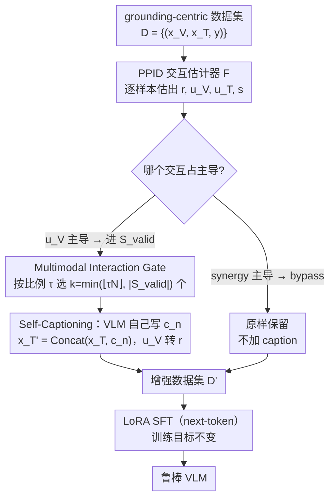

# Self-Captioning Multimodal Interaction Tuning: Amplifying Exploitable Redundancies for Robust Vision Language Models

**会议**: ICML 2026  
**arXiv**: [2605.08145](https://arxiv.org/abs/2605.08145)  
**代码**: 无  
**领域**: 多模态VLM  
**关键词**: 模态冗余、PID 分解、自我描述、鲁棒指令微调、模态污染

## 一句话总结
本文借助 Pointwise Partial Information Decomposition 量化视觉-文本模态交互，并提出 Multimodal Interaction Gate：自动挑出「图像独有信息占主导」的样本让 VLM 自我生成 caption 灌入文本侧，从而把 unique 视觉信号转成 redundant 共享信号，使 VLM 在模糊或被污染输入下的视觉幻觉下降 38.3%、一致性提高 16.8%。

## 研究背景与动机

**领域现状**：当前主流 VLM 指令微调（如 LLaVA、SmolVLM 系）刻意降低文本-图像冗余、让任务相关信息只集中在图像上，以强制模型「visual grounding」，从而抑制纯文本捷径。

**现有痛点**：这种过度 grounding 策略带来了反作用——一旦图像被噪声/遮挡污染，或者文本本身已经模糊，模型缺乏可以「互相补位」的共享信息，幻觉和不一致输出立即暴露；既有的鲁棒性方案（如基于冗余度的目标函数 Wörtwein/Nguyen 等）只在「数据里本就有冗余」时才有效，对 grounding-centric 数据集失效。

**核心矛盾**：visual grounding 与 modality robustness 在数据层面是矛盾的——减少冗余利于 grounding，增加冗余利于鲁棒，而当前数据集策展完全凭直觉，没有可量化的冗余调节旋钮。

**本文目标**：(1) 提出一个量化框架，用 PID 把模态交互拆成 redundant $R$ / unique $U_V, U_T$ / synergistic $S$；(2) 设计一套系统化的数据增强算法，把可被利用的冗余 $R$ 显式拉高，同时保证不破坏 synergy 主导样本的结构。

**切入角度**：作者注意到 grounding-centric 数据集普遍呈现「visual unique $U_V$ 占主导」分布，那么只要把这部分专属视觉信息「翻译」到文本里就能直接转换为冗余信号，而图像端不动、$I(X_V; Y)$ 保持不变。

**核心 idea**：让 VLM 给自己挑的样本「写 caption」，把图像独有信息搬到文本端，把 $U_V$ 转成 $R$，从而在不改图的前提下系统提升模态冗余度。

## 方法详解

### 整体框架
输入：一份 grounding-centric 指令数据集 $\mathcal{D}=\{(x_V, x_T, y)\}$。流程分三步：(1) 用 PPID 估计器 $\mathcal{F}$ 对每个样本估出 $r, u_V, u_T, s$ 四个交互量；(2) Multimodal Interaction Gate 按阈值 $\tau$ 选出 $u_V$ 占主导的子集 $S_{valid}$，把这些样本送入 VLM 自身或更小的 caption 模型生成描述 $c_n$，与原文本拼接为 $x_T' = \text{Concat}(x_T, c_n)$，而 synergy 占主导的样本被显式放过；(3) 用增强后的 $\mathcal{D}'$ 微调 VLM（SmolVLM、LLaVA-OneVision-1.5），训练目标无改动，仅在数据侧加 LoRA SFT。

### 关键设计

**1. 基于 PPID 的样本级交互估计器：把「冗余」从直觉概念落成 per-sample 可估的标量**

要做「按需把视觉独有信息搬到文本端」，前提是先能逐样本判断哪些样本是 $U_V$ 占主导。本文用 Pointwise Partial Information Decomposition 在嵌入空间近似 $r, u_V, u_T, s$ 四个交互量：对每个样本算 point-wise specificity $i^+(x_m;y)=h(x_m)$ 与 ambiguity $i^-(x_m;y)=h(x_m|y)$，redundant specificity 取两模态最小值 $r^+=\min_m i^+(x_m;y)$、redundant ambiguity 取 $r^-=\min_m i^-(x_m;y)$，于是 $r=r^+-r^-$；再由 $i(x_m;y)=r+u_m$ 反推 $u_V,u_T$，整体多模态信息减去三者得协同量 $s$（entropy 用 KNIFE 高斯混合可微估计，分类器用 3 层 MLP）。之所以要 sample 级而非整体级估计，是因为只有精确识别到「哪些样本可以安全转换」，后面的 Gate 才能既不误伤协同样本、又把冗余转换做对——这把模态交互从「dataset 级标签」变成了「per-sample 信号」。

**2. Multimodal Interaction Gate：挑出可转换样本、控制注入比例，且显式放过协同样本**

有了 per-sample 交互量，Gate 负责决定「给谁加 caption」。先令合格集 $S_{valid}=\{n\mid u_{V,n}=\max(r_n,u_{V,n},u_{T,n},s_n)\}$，即只有当视觉独有信息 $u_V$ 是该样本最大交互时才合格；再按全局比例 $\tau$ 选出 $k=\min(\lfloor\tau N\rfloor,|S_{valid}|)$ 个样本调 captioner 生成 $c_n$ 拼到文本上。关键细节是协同（synergy）占主导的样本（如 UR-FUNNY）被显式 bypass——实验证实对这类样本强行加 caption 会让 $U_T$ 暴涨 +750%，把宝贵的 synergy 替换成 unique-text 噪声，所以「拒绝转换某类样本」本身就是设计的一部分。而阈值 $\tau$ 则成了一个「冗余强度」旋钮，与下游 robustness 单调对应，给数据策展提供了可重复的协议而非凭感觉调比例。

**3. Self-Captioning SFT 工作流：让 VLM 自己当 captioner，闭环增强数据且不引入外部知识**

最后一步是把选中的样本交给 captioner 写描述、灌回文本侧再做 SFT。本文刻意用 VLM 自己（或更小的 SmolVLM-2B）当 captioner，而非外接一个大模型——目的是避免额外模型的参数知识混入成为 confounder，保证「冗余度 $R$」是实验里唯一的独立变量。训练前对 25% 或 50% 的 Cauldron 样本生成 caption 写入文本侧，再挂 LoRA 做标准 next-token SFT，caption 生成与训练解耦、成本可摊销。担心小 captioner 不够好？实测即使只有 2B 也能让 $R$ 升 243%、$U_V$ 降 43%，因为 caption 误差会随注入比例上升被平均掉——小模型已经够用，这也呼应了那条跨 256M→8B 五个尺寸都成立的单调关系。

### 损失函数 / 训练策略
训练损失就是标准的 LoRA SFT next-token prediction，没有引入新目标，所有 robustness 收益都来自数据侧的 $R$ 注入。captioning 时温度 0、长度受限，避免无关漂移。task-specific 设置完整跑 MI Gate；open-ended 通用设置因无法定义 $y$，退化为「随机选 25%/50% 全部加 caption」的弱化版本。

## 实验关键数据

### 主实验

| 模型族 | $\tau$ | $\Delta Acc \uparrow$ | $\Delta VI \downarrow$ | $\Delta LI$ | $\Delta Consist. \uparrow$ |
|--------|--------|------------------------|--------------------------|-------------|------------------------------|
| SmolVLM (256M/500M/2B) | 25% | +2.7% | -23.6% | +9.5% | +8.5% |
| SmolVLM (256M/500M/2B) | 50% | +4.0% | **-38.3%** | +15.2% | **+16.8%** |
| LLaVA-OneVision (4B/8B) | 25% | +2.4% | -34.4% | +2.9% | +6.2% |
| LLaVA-OneVision (4B/8B) | 50% | +2.5% | -6.5% | -6.8% | +5.5% |

### 消融实验

| 配置 | $R$ 变化 | $U_V$ 变化 | $U_T$ | 说明 |
|------|---------|-----------|-------|------|
| Baseline (Hateful Memes train) | $0.0553$ | $0.3465$ | $-0.0125$ | 原始数据 |
| + Random text 拼接 | +23% | -2% | $0$ | 仅证明加文本不够，必须有语义 |
| + SmolVLM-2B caption | **+243%** | **-43%** | $0$ | 小 captioner 已足够 |
| + Qwen2.5-32B caption | **+319%** | **-51%** | $0$ | 更大 captioner 边际收益有限 |
| Synergy-dominated UR-FUNNY + caption | +0% | +0% | **+750%** | 失败用例，验证 Hypothesis 5 |

### 关键发现
- $\tau$ 越大（注入 caption 比例越高）模态污染下的性能稳定度 $\Delta P$ 越高，且这一单调关系跨 5 个 SmolVLM/LLaVA 尺寸（256M→8B）一致成立，证明小 captioner 的 caption 噪声会被平均掉。
- 冗余度提升存在「trade-off」：视觉幻觉 VI 下降的同时，language-induced 错误和 mixed 错误小幅上升，因为模型确实更频繁地用文本通道——这恰好验证了 Hypothesis 1。
- 通用基准上（MMMU、MMStar、MathVista、TextVQA）冗余增强常带来意外的「正向副作用」，例如 8B 模型 MMMU 从 41.4 升到 49.9，作者归因为更稳健的多模态融合也提升了通用 grounding 任务。

## 亮点与洞察
- 用 PID 的 redundant specificity/ambiguity 把「冗余」从直觉概念落地为 sample-level 可估的标量，使数据增强第一次有了可量化的目标信号；这套估计器与下游模型解耦，可以套到任何已经训好的多模态 backbone 上。
- MI Gate 提供了一个非常优雅的「单旋钮」：通过 $\tau$ 在 robustness 与 grounding 之间连续滑动，给后续 dataset curation 提供了可重复实验的协议，而不是凭感觉调比例。
- Synergy-bypass 这个细节非常关键：作者用 UR-FUNNY 验证了「不加 caption」反而是设计的一部分——这种「显式拒绝转换某类样本」的思路可以迁移到任何 PID 驱动的数据增强方法，避免「越增强越糟糕」。

## 局限与展望
- 估计器依赖训练好的辅助分类器与 entropy estimator，开放生成任务（无离散 $y$）只能退化为「随机加 caption」，丢失了 Gate 选择能力，结果一致性下降（4B 模型 $\Delta LI$ 在 $\tau=50\%$ 反而变正）。
- 仅在 vision+text 两模态、且以图→文方向做转换；反向（文→图，需要扩散模型）和 audio/video 等模态虽给出 proof-of-concept，但成本与误差控制都未系统量化。
- caption 的质量上限决定 $r$ 的上限，对于细粒度结构、空间关系、OCR 等任务，2B captioner 大概率会丢失关键 unique 信息，导致 $r$ 涨而 $u_V$ 也涨——需要 captioner 能力检测器配合。

## 相关工作与启发
- **vs Wörtwein et al. 2024 / Nguyen et al. 2025**: 他们把 redundancy 写进训练目标函数，但前提是数据本身有冗余；本文从数据侧主动制造冗余，互为补充。
- **vs LLaVA-1.5 / Cauldron 风格 grounding 数据**: 这些工作刻意降低冗余以增强 grounding，本文反向操作并证明在 modality 污染场景下牺牲 grounding 换 robustness 是值得的。
- **vs Mixture-of-Interaction 专家 (Xin et al. 2025)**: 他们用 PID 指导专家分工，仍是「用」交互；本文是「改」交互，提供了完全不同的算法路径。
- **vs HallusionBench / GQA-corruption 评测协议**: 本文不是新的 benchmark，而是把已有 robustness 协议第一次系统地与 PID 量度挂钩，给「robustness 提升」配上了可解释的信息论指标。
- **vs 单纯 caption 数据扩增**: 不挑样本随机加 caption（论文中的 Random text 对照）只能拿到 +23% 的 $R$ 提升而且会引入负 $U_T$，证明 MI Gate 的「样本选择」环节才是真正贡献。

## 评分
- 新颖性: ⭐⭐⭐⭐⭐ 首次把 sample-level PPID 落到数据增强、并系统验证「转 unique 为 redundant」的可行性。
- 实验充分度: ⭐⭐⭐⭐ 5 个尺寸 × 两个 VLM 族 + 模态污染 + 通用基准 + 失败案例 + bi-directional 概念验证。
- 写作质量: ⭐⭐⭐⭐ 5 个 hypothesis 与实验一一对应，论证链清晰；公式略密集，但 Figure 配合直观。
- 价值: ⭐⭐⭐⭐ 为多模态指令数据策展提供了可量化的 dial，工程上立即可用且开销极低。

<!-- RELATED:START -->

## 相关论文

- [\[AAAI 2026\] Difference Vector Equalization for Robust Fine-tuning of Vision-Language Models](../../AAAI2026/multimodal_vlm/difference_vector_equalization_for_robust_fine-tuning_of_vis.md)
- [\[CVPR 2026\] MM-SeR: Multimodal Self-Refinement for Lightweight Image Captioning](../../CVPR2026/multimodal_vlm/mm-ser_multimodal_self-refinement_for_lightweight_image_captioning.md)
- [\[AAAI 2026\] Leveraging Textual Compositional Reasoning for Robust Change Captioning](../../AAAI2026/multimodal_vlm/leveraging_textual_compositional_reasoning_for_robust_change_captioning.md)
- [\[CVPR 2026\] TRivia: Self-supervised Fine-tuning of Vision-Language Models for Table Recognition](../../CVPR2026/multimodal_vlm/trivia_self-supervised_fine-tuning_of_vision-language_models_for_table_recogniti.md)
- [\[ICML 2026\] CG-MLLM: Captioning and Generating 3D Content via Multi-modal Large Language Models](cg-mllm_captioning_and_generating_3d_content_via_multi-modal_large_language_mode.md)

<!-- RELATED:END -->
