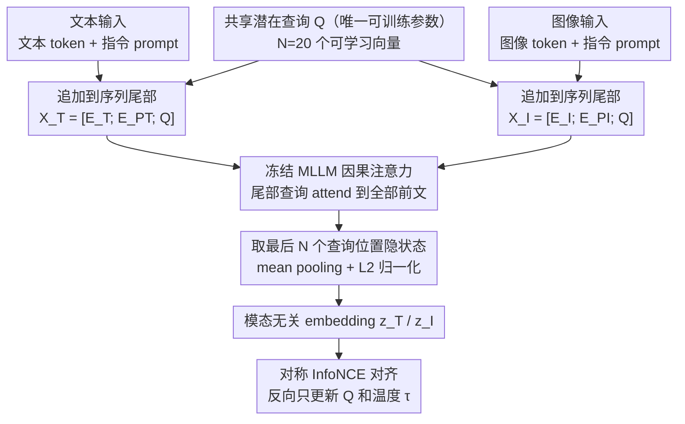

# SLQ: Bridging Modalities via Shared Latent Queries for Retrieval with Frozen MLLMs

**会议**: ICML 2026  
**arXiv**: [2604.13710](https://arxiv.org/abs/2604.13710)  
**代码**: <https://github.com/CnFaker/SLQ>  
**领域**: 多模态 VLM / 跨模态检索 / 参数高效微调  
**关键词**: 冻结 MLLM, Shared Latent Queries, 知识感知推理检索, 对比学习, KARR-Bench

## 一句话总结
SLQ 把一小组"共享潜在查询" $\mathbf{Q}$ 追加到图像/文本 token 序列尾部，借助 MLLM 自身的因果注意力聚合全局上下文，**只训练几千个查询参数**就让冻结的 MLLM 变成检索器，在 COCO/Flickr30K 上胜过全量微调和 LoRA，并配套发布了考验"隐式知识推理"能力的 KARR-Bench。

## 研究背景与动机

**领域现状**：多模态大模型 (MLLM) 如 InternVL3、Qwen3-VL 等通过统一 Transformer 处理交错图文输入，相比 CLIP/BLIP 的双塔架构能捕获更丰富的跨模态语义交互。最近一系列工作 (GME, MM-Embed, VLM2VEC, MMRet) 想把 MLLM 改造成检索器以利用其推理能力。

**现有痛点**：(1) **侵入式微调**——主流做法是全量微调或 LoRA + 对比学习目标，但这种**生成式对齐 → 判别式对齐**的目标错配会扭曲预训练语义空间、引起灾难性遗忘 (semantic degradation)；(2) **训练效率灾难**——对比学习需要超大 batch 维持负样本多样性，全量微调 billion 参数 backbone 在大 batch 下计算成本高到不可承受 (training inefficiency)；(3) 多数 baseline 用 `<EOS>` 最后一个 token 的隐状态作为全局 embedding——但 last token 是"信息瓶颈"，难以压缩复杂语义，作者的诊断实验 (Figure 2) 显示它在隐式推理任务（如"2+7 命的动物"暗示猫）上完全失败。

**核心矛盾**：MLLM 的预训练已经把视觉+语言对齐到了**同一表示空间**（这是它们能做零样本 VQA 的根本），但要么完全不微调（zero-shot 检索性能差），要么大改参数（破坏预训练空间）——缺少一个"轻量但有效"的中间方案。

**本文目标**：(1) **保持 backbone 冻结**——不动一个预训练参数；(2) 用一种轻量机制**激发** MLLM 的隐式知识与推理能力做检索；(3) 解决"用什么 token 做 embedding"——既不用 last token 也不用 pooling 所有 token；(4) 配套一个真正能区分"模式匹配 vs 知识推理"的检索 benchmark。

**切入角度**：作者做了一个诊断实验——给冻结的 InternVL3-1B 喂入一个**零初始化的额外 query token** 接在序列尾部，让它经过因果注意力"看遍"前面所有 token；用其最终隐状态做检索。结果：在"模式匹配"任务上 query 和 last token 都成功，但在"知识检索 (basic associations)"上 last token 给出几乎无差异的低区分度分数，query 保持高 margin；在"逻辑推理"上 last token 完全失败、query 成功找到目标。这说明 MLLM **已经有**做推理检索的能力，只是 last token 卡在了信息瓶颈。

**核心 idea**：用一小组"共享的可学习潜在查询"作为**模态无关的全局聚合器**，借 MLLM 自身的因果注意力从图像/文本序列中提取统一的检索 embedding——**只学查询，不动 backbone**。

## 方法详解

### 整体框架
冻结 MLLM backbone + 一小组 $N$ 个可学习的 Shared Latent Queries $\mathbf{Q} \in \mathbb{R}^{N \times D}$（在 InternVL3-8B 上 $N=20$，总参数仅 $20 \times D \approx$ 几万）。文本输入：$\mathbf{X}_T = [\mathbf{E}_T; \mathbf{E}_{P_T}; \mathbf{Q}]$（文本 embedding + 文本指令 prompt + 共享查询）；图像输入：$\mathbf{X}_I = [\mathbf{E}_I; \mathbf{E}_{P_I}; \mathbf{Q}]$。两种输入都喂入冻结 MLLM $\mathcal{M}$ 走一遍因果注意力，取**最后 $N$ 个位置**的隐状态（对应查询位置），mean pooling + L2 归一化得到 embedding $\mathbf{z}_T, \mathbf{z}_I \in \mathbb{R}^D$。用对称 InfoNCE 损失对齐两个 embedding 空间。推理时这些查询位置的输出就是模态无关的全局 embedding 用于检索。训练只更新 $\mathbf{Q}$ 和温度 $\tau$，backbone 完全冻结。

### 关键设计

**1. 共享潜在查询追加到序列尾部：借因果注意力把变长序列压成定长检索向量**

诊断实验已经指明 last token 是信息瓶颈，那就别再用它。SLQ 的做法是引入 $N$ 个可学习查询 $\mathbf{Q}$，并把它们追加到序列末尾——而不是像 CoOp/VPT 那样 prepend 在前面。这个位置选择是有讲究的：decoder-only MLLM 用因果注意力，只有排在最后的 token 才能 attend 到前面所有 token，所以尾部追加的查询天然就是"全局聚合器"，正好对应检索需要看遍全局上下文的需求；prepend 风格里查询只是前置的 conditioning signal，还得另找一个 [CLS] 之类的 summary token，而 decoder-only MLLM 根本没有自然的 [CLS]。同一组 $\mathbf{Q}$ 既附给图像也附给文本（这就是"Shared"的由来），分别走一遍冻结模型，取最后 $N$ 个位置的隐状态 $\mathbf{H}^Q_T = \mathbf{H}_T[-N:]$、$\mathbf{H}^Q_I = \mathbf{H}_I[-N:]$，mean pooling 加 L2 归一化得到 $\mathbf{z}_T = \bar{\mathbf{h}}_T / \|\bar{\mathbf{h}}_T\|_2$。用 $N=20$ 个查询而非单个，相当于多头汇聚再平均，信息带宽比单一 last token 宽得多；而共享而非给两个模态各配一组，则强制 backbone 把图文投到同一参数化空间，避开了双塔风各学独立投影的对齐难题。

**2. 冻结 backbone、只训练查询：把预训练里已对齐的语义空间完整保住**

诊断实验的另一层含义是——MLLM 已经学到了对齐的多模态语义空间，检索任务不是要重新教它，而是要激发已有能力。所以 SLQ 训练时反向传播只更新 $\mathbf{Q}$ 和温度 $\tau$，backbone 的 attention、FFN、embedding 全部不动。InternVL3-8B 总参数 8B，但可训练参数只有 $N \times D = 20 \times D$（$D$ 是隐维度，万级），而 LoRA 要更新几 M 参数、全量微调要更新整个 backbone。这么做的直接收益是不会因为"生成式对齐→判别式对齐"的目标错配而扭曲预训练空间、引发灾难性遗忘；附带的好处是训练参数只有万级，不再依赖超大 batch 堆负样本，绕开了对比学习的 batch size 内卷。

**3. KARR-Bench：构造一个真考"隐式知识推理"而非模式匹配的检索基准**

现有 COCO/Flickr30K 的 caption 是描述性的（"a red car" 直接配红车图），检索器靠表面特征匹配就能命中，反而掩盖了 MLLM 的推理优势。KARR-Bench 用三阶段 pipeline 逼检索器去推理：先从 COCO 测试集 5000 张图里做视觉锚定实体筛选，去掉抽象概念、确保目标都视觉可验证；再用 GPT-5-mini 把目标身份编码成隐式推理 query——不提目标名也不用同义词，比如不说 "cat" 而说 "the animal with 9 lives"，得到约 4500 候选；最后由四名标注员交叉验证，剔除 MLLM 幻觉和弱关联，接受率 60-70%，留下 2915 条高质量图文对。query 横跨 6 个维度：工具与器具用途（18.8%）、上下文与空间关系（18.1%）、功能关系（17.4%）、文化象征（19.4%）、百科知识（14.9%）、逻辑与数学（11.4%）。这样检索器必须动用隐式知识加逻辑才能命中，是对 MLLM 检索器更公平的考场。

### 损失函数 / 训练策略
对称 InfoNCE 损失 $\mathcal{L} = \frac{1}{2}(\mathcal{L}_{I2T} + \mathcal{L}_{T2I})$，每个方向是标准 batch 内对比 softmax 损失，温度 $\tau$ 可学。InternVL3 (1B, 8B) / Qwen3-VL (2B, 4B) 四种 backbone。在 Flickr30K/COCO/KARR-Bench 上用 COCO 训练 5 epoch；MMEB 上用 MMEB-train 训 1 epoch；global batch size 1024（8B 用 512），$N = 20$。

## 实验关键数据

### 主实验
对比双塔模型 (CLIP, BLIP, FLAME) + MLLM-based 全量微调 baseline (E5-V-7B, VLM2VEC-7B, GME-7B 等) + SLQ 多个规模。

| 数据集 | 方法 | I→T R@5 | T→I R@5 | 参数 |
|--------|------|---------|---------|------|
| Flickr30K | CLIP ViT-L | 98.3 | 89.0 | 全量 |
| Flickr30K | VLM2VEC-7B (full FT) | **99.5** | 95.0 | 7B 微调 |
| Flickr30K | SLQ (InternVL3-8B) | 99.4 | **95.1** | **~万级** |
| COCO 5K | VLM2VEC-7B (full FT) | 88.4 | 73.8 | 7B 微调 |
| COCO 5K | SLQ (InternVL3-8B) | **89.1** | **79.7** | **~万级** |
| MMEB Overall | VLM2VEC-7B† | 62.9 | — | 7B 微调 |
| MMEB Overall | UniME-7B† | 66.6 | — | 7B 微调 |
| MMEB Overall | **SLQ-8B†** | **67.5** | — | **~万级** |

### 消融实验

| 配置 | 关键指标 | 说明 |
|------|---------|------|
| SLQ 完整（冻结 backbone + $N$=20 queries） | 最优 | — |
| Last token baseline (零 shot) | 模式匹配通过、知识推理失败 | 诊断 query 优于 last token |
| Single query (N=1) | 性能下降 | 多查询提供更宽信息带 |
| 全量 fine-tune | 平均同等或更弱、GPU 时数高得多 | 验证非侵入更优 |
| LoRA | 介于 SLQ 与全量之间 | 仍轻微破坏预训练空间 |

### 关键发现
- **参数效率惊人**：SLQ-8B 用万级参数就在 MMEB 上达到 67.5 平均分，胜过 7B 全量微调的 VLM2VEC (62.9) 和 UniME (66.6)——验证了"激发 > 重训"的核心观点。
- **多模态共享 query 是关键**：图像和文本共用同一组 $\mathbf{Q}$，强制 backbone 把两种模态投到同一隐空间，比双塔分投影更对齐。
- **尾部追加 + causal attention** 比 prepend 风的 CoOp/VPT 更适合 decoder-only MLLM——因果掩码让追加 query 能 attend 到所有上下文。
- 在 KARR-Bench 上 SLQ 比 last token 类基线"实质性提升"，说明该 benchmark 确实能区分模式匹配与推理能力。

## 亮点与洞察
- **"激发预训练能力" vs "重新训练"的范式对比**：本文给出了非常清晰的论据——LLM/MLLM 的预训练已经学到了所需对齐空间，只需要一个"接口"暴露出来，而不是再做侵入式修改。
- **诊断实验设计极佳**：Figure 2 三个难度等级（模式匹配 / 知识检索 / 逻辑推理）的对比图，几乎一图证明了 last token 的瓶颈与 query 的优势。
- **KARR-Bench 是社区需要的工具**：把"知识感知 + 隐式推理"作为一类检索任务系统化评测，避免现有 benchmark 被"shortcut"分数压平的问题。
- 这套"加少量 query token + 冻结 backbone"的 PEFT 策略可迁移到：检索增强生成 (RAG)、向量索引服务、跨模态 Re-ranking、多语言对齐等。

## 局限与展望
- $N$ 个 query 是超参，论文固定 $N=20$ 没有大规模扫描；不同任务可能最优 $N$ 不同。
- 仅在 COCO/Flickr30K/MMEB/KARR-Bench 上验证，**长文档检索**、**视频检索**、**音频-文本检索**等场景需要进一步验证。
- KARR-Bench 由 GPT-5-mini 生成 query + 人工筛选——GPT 生成可能引入风格偏差，未来更大样本和多 LLM 生成可能更稳健。
- 推理时每张图/每条文本仍要跑完整 MLLM 前向（虽不更新参数）——比 CLIP 类双塔模型推理慢；SLQ 的优势主要在**训练成本**而非**推理速度**。
- 完全冻结 backbone 也意味着无法吸收新领域知识——若目标域与预训练分布差异大（如医学图像）可能受限。

## 相关工作与启发
- **vs VLM2VEC / MMRet / GME / MM-Embed (全量微调或 LoRA + last token)**：他们改参数 + 用 `<EOS>` 隐状态；SLQ 不改参数 + 用 query 隐状态。MMEB 上 SLQ-8B 67.5 胜过 VLM2VEC-7B 62.9、UniME-7B 66.6，且训练参数少几个数量级。
- **vs ColPali / VisRAG (multi-vector)**：他们用多向量表示（更精细但存储贵）；SLQ 是单向量 + 多 query 聚合，更简洁。
- **vs CoOp / MaPLe / VPT (prompt tuning)**：那些 prepend 学习 token 适配 CLIP 类 encoder-only；SLQ append 适配 decoder-only MLLM，借因果注意力实现"全局聚合"。
- **vs BLIP-2 Q-Former**：Q-Former 引入额外 cross-attention 模块；SLQ 完全用 MLLM 自身 self-attention，零额外模块。
- **vs E5-V (last token + Matryoshka)**：他们也是 MLLM 转检索器，但用 last token 受限于信息瓶颈；SLQ 用多 query 解决该瓶颈。

## 评分
- 新颖性: ⭐⭐⭐⭐ "尾部追加共享查询 + 冻结 backbone"是简洁有效的设计；KARR-Bench 的构造也有独立价值
- 实验充分度: ⭐⭐⭐⭐ 四种 backbone 规模 × 四个 benchmark 全面比较；缺更多 ablation（如 $N$ 的扫描、prompt 内容影响）
- 写作质量: ⭐⭐⭐⭐⭐ 诊断实验 → 方法 → benchmark 三段论结构清晰，Figure 2 极强说服力
- 价值: ⭐⭐⭐⭐⭐ 让 MLLM 检索化的训练成本降几个数量级，工程上立即可用；KARR-Bench 为社区提供推理检索评测工具

<!-- RELATED:START -->

## 相关论文

- [\[AAAI 2026\] Bridging Modalities via Progressive Re-alignment for Multimodal Test-Time Adaptation (BriMPR)](../../AAAI2026/multimodal_vlm/bridging_modalities_via_progressive_re-alignment_for_multimo.md)
- [\[CVPR 2026\] CodeMMR: Bridging Natural Language, Code, and Image for Unified Retrieval](../../CVPR2026/multimodal_vlm/codemmr_bridging_natural_language_code_and_image_for_unified_retrieval.md)
- [\[ICML 2026\] Calibrated Multimodal Representation Learning with Missing Modalities](calibrated_multimodal_representation_learning_with_missing_modalities.md)
- [\[NeurIPS 2025\] CyIN: Cyclic Informative Latent Space for Bridging Complete and Incomplete Multimodal Learning](../../NeurIPS2025/multimodal_vlm/cyin_cyclic_informative_latent_space_for_bridging_complete_and_incomplete_multim.md)
- [\[ICML 2026\] Referring Multiple Regions with Large Multimodal Models via Contextual Latent Steering](referring_multiple_regions_with_large_multimodal_models_via_contextual_latent_st.md)

<!-- RELATED:END -->
