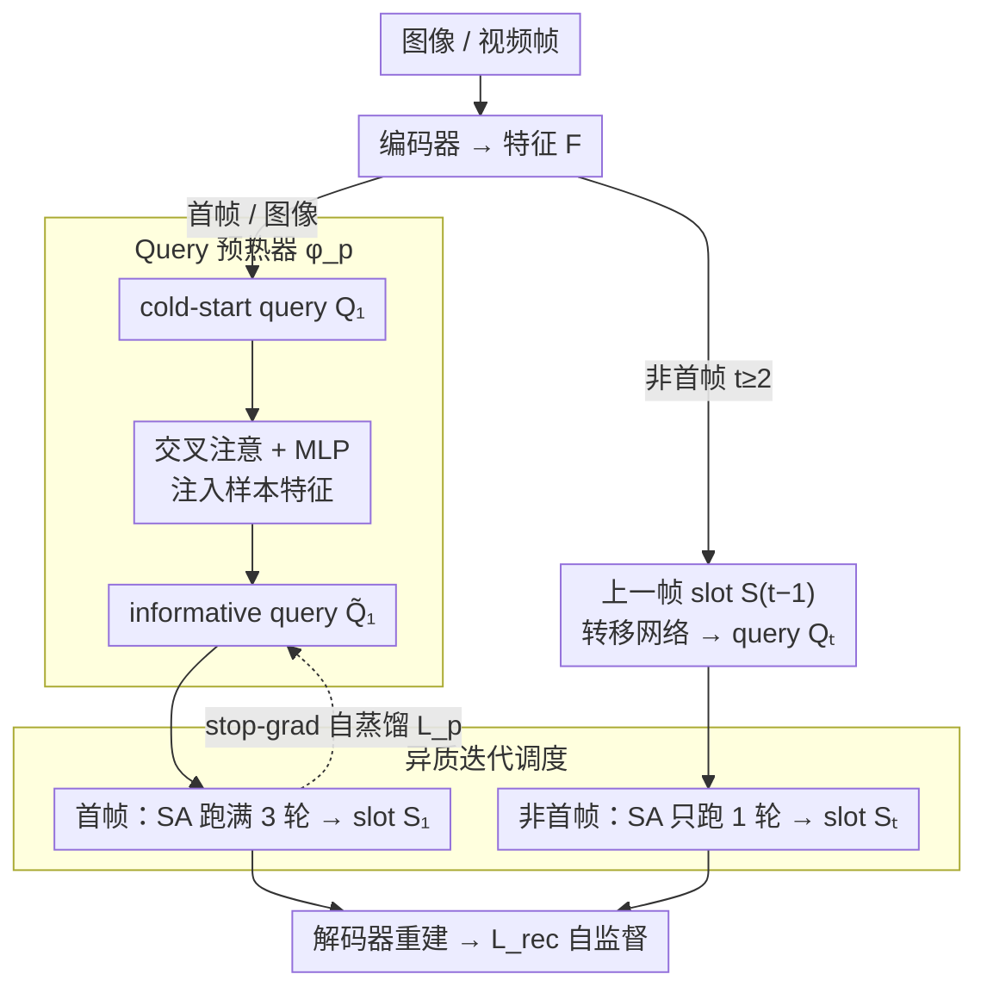

# Smoothing Slot Attention Iterations and Recurrences

**会议**: ICML 2026  
**arXiv**: [2508.05417](https://arxiv.org/abs/2508.05417)  
**代码**: https://github.com/Genera1Z/SmoothSA (有)  
**领域**: 多模态 VLM / 对象中心学习 / Slot Attention  
**关键词**: Object-Centric Learning, Slot Attention, 查询预热, 视频 OCL, 自蒸馏

## 一句话总结
针对 Slot Attention 在图像与视频对象中心学习中"冷启动查询信息不足"和"首帧/非首帧聚合变换被强行统一"两个长期被忽视的痛点，作者提出 SmoothSA：用一个自蒸馏的小预热模块给查询注入样本信息，同时让首帧跑完整三次迭代、非首帧只跑一次，从而在图像和视频两个 OCL 基准上同时刷新 SOTA。

## 研究背景与动机

**领域现状**：对象中心学习（OCL）是把视觉场景表达成一组独立的对象/背景向量（slots）的范式，这种结构化的紧凑表示在下游推理、视频预测、合成生成等任务上往往优于稠密特征图。它的主流实现几乎都构建在 Slot Attention（SA）上：把图像特征当作 key/value，把 $n$ 个 query slot 当作"竞争者"，通过若干轮迭代式 cross-attention 把 patch 分配给不同 slot，从而学到对象级表征，整个过程不需要外部监督，靠 reconstruction loss 训练。视频 OCL 的标准做法（STEVE 系）是把图像版 SA 在帧间递归调用：首帧的 query 和图像情形一致，非首帧的 query 由上一帧 slot 经 Transformer 编码块预测得到。

**现有痛点**：作者从这两条主干里识别出两个被几乎所有方法默认接受、却从未被正面解决的问题。其一，"查询冷启动"：无论是从可学习高斯采样还是从位置先验初始化，刚出场的 query slot 里只有数据集级先验，没有任何关于当前样本的线索；这种与样本无关的起点直接拖累了图像/视频首帧上的聚合质量，模型不得不用更多迭代去硬"猜"。其二，"变换同质化"：视频里首帧的 query 是冷启动、信息匮乏，而非首帧的 query 已经是上一帧的 slot，带有充分的样本信息，但绝大多数方法对两者一视同仁，都套同样的三轮 SA 迭代，无视两者之间巨大的信息差。

**核心矛盾**：聚合的精度依赖 query 携带的样本信息量，但是 SA 框架天然没有为"先验信息不同的 query"设计差异化处理路径，于是要么所有 query 共享一个粗糙的冷启动起点，要么所有帧共享一个不偏向任何信息状态的固定迭代次数。

**本文目标**：在不改动主干 OCL 模型的前提下，分别解决：(i) 如何给图像/视频首帧的冷启动 query 注入样本级信息；(ii) 如何让 SA 在视频首帧与非首帧之间使用不同强度的聚合变换。

**切入角度**：作者注意到 OCL 模型本身在训练后就能输出"好"的 slot，那么"理想的 query"其实可以被现有 slot 监督——这天然支持自蒸馏。另一方面，三轮迭代是为冷启动 query 准备的，对于已经接近真实分布的非首帧 query，再做三轮反而会过度扰动。

**核心 idea**：在 SA 之前塞一个小模块把 cold-start query 预热成"近似 slot"的 informative query，并把视频首帧的"三次迭代"与非首帧的"单次迭代"分开使用——以"对称化信息量与变换强度"的方式同时治好两个问题。

## 方法详解

### 整体框架
SmoothSA 完整保留 OCL 经典的 encode-aggregate-decode 结构：编码器把图像/视频帧映成特征 $F \in \mathbb{R}^{h\times w\times c}$，聚合器 $\phi_a$（即 SA 模块）把特征聚合成 $n$ 个 slot $S \in \mathbb{R}^{n\times c}$，再由解码器从 slot 重建输入以提供自监督。SmoothSA 只在聚合器入口和帧间调度处做两个微改动：(1) 在 cold-start query $Q_1$ 进入 SA 迭代之前，先经过一个"预热器" $\phi_p$ 得到 informative query $\tilde Q_1$；(2) 对视频，仅在首帧上跑标准的 3 轮 SA 迭代得到 slot $S_1$，而非首帧只跑 1 轮 SA，并且其 query 直接由上一帧 slot 经标准转移模块得到。整体改动量极小，可以直接挂到任意基于 SA 的图像/视频 OCL 模型上。

### 关键设计

**1. Query 预热器 $\phi_p$：用自蒸馏把信息匮乏的 cold-start query 推近 slot 分布**

无论从可学习高斯还是位置先验初始化，刚出场的 query slot 里只有数据集级先验、没有当前样本的任何线索，SA 不得不用更多迭代去硬"猜"。$\phi_p$ 是一个很轻量的模块（结构上是一次 query-feature 交叉注意 + MLP），把 cold-start query $Q_1$ 与输入特征 $F_1$ 联合映射成一个"近似当前样本 slot"的 informative query $\tilde Q_1 \in \mathbb{R}^{n\times c}$。监督信号直接来自 OCL 模型自身在当前 batch 上输出的 slot $S_1$——即让 $\tilde Q_1 \approx S_1$，做一次 stop-gradient 自蒸馏，损失为 $\mathcal{L}_p = \|\tilde Q_1 - \text{sg}(S_1)\|^2$。这相当于把 SA 的迭代曲线整体向前平移一步：起点从远离最优解的冷启动变成已接近最终 slot 的预热点，迭代误差自然变小。和 BO-QSA、MetaSlot 用多高斯/码本去丰富"数据集级"先验不同，$\phi_p$ 第一次把"当前样本"的特征经可微通道注入 query。

这里的 stop-gradient 不是可有可无的细节，而是让预热器训得稳的关键：如果把 $\phi_p$ 当普通可训练前置层和 SA 一起端到端训，会陷入"$\phi_p$ 把 query 拉向尚不可靠的 slot、SA 又被带噪 query 干扰"的耦合不稳定回路。stop-gradient 在结构上断开这条回路，让 $\phi_p$ 始终单向追随 OCL 的当前最优 slot 分布、不把噪声反传去干扰 SA 主干，与 BYOL 等自蒸馏框架同源。于是预热模块和主干 OCL 在同一套自监督目标 $\mathcal{L} = \mathcal{L}_{rec} + \lambda \mathcal{L}_p$ 下端到端联动，无需任何外部标注或额外训练阶段。

**2. 视频帧间的异质迭代调度：首帧多迭代、非首帧单迭代，把迭代强度匹配信息量**

STEVE 系框架对所有帧一视同仁都跑 3 轮 SA，但首帧 query 是冷启动、信息匮乏，非首帧 query 已是上一帧 slot、带充分样本信息，两者信息差巨大。这里把"迭代强度"匹配到"query 信息量"：首帧展开完整三轮 $S_1^{(i)}, M_1^{(i)} = \phi_a(S_1^{(i-1)}, F_1)$（$i=1,2,3$，取 $S_1 := S_1^{(3)}$），给冷启动 query 留出多步对齐的余量；非首帧 $t\ge 2$ 的 query $Q_t$ 直接从上一帧 slot $S_{t-1}$ 经标准转移网络得到，然后只跑一次 SA：$S_t, M_t = \phi_a(Q_t, F_t)$。因为 query 已接近真实 slot，再做多轮只会引入冗余更新、把好不容易传过来的时序信息冲淡——可视化里非首帧多迭代确实会让本已接近真实分布的 query 产生不必要的对齐震荡。本质是"输入更难就多算几步"的最朴素直觉。

### 损失函数 / 训练策略
训练时所有模块同步优化，目标函数 $\mathcal{L} = \mathcal{L}_{rec} + \lambda \mathcal{L}_p$。$\mathcal{L}_p$ 中对 slot 端使用 stop-gradient，使预热模块单向追随主干 OCL 的最优 slot 分布。视频训练阶段，迭代次数差异化在 forward pass 中直接通过 if 分支实现，不增加显存或额外阶段。

## 实验关键数据

### 主实验
作者在图像 OCL（COCO、Movi-E 等）与视频 OCL（Movi-D、Movi-E、YT-VIS、Physion）多个标准基准上把 SmoothSA 挂到不同主干（DINOSAUR、STEVE、SAVi、RandSF.Q 等），与现有 SA 变体对比对象发现（mIoU/FG-ARI）、对象识别和视觉推理三类下游任务。

| 任务 | 数据集 | 指标 | 主干 baseline | + SmoothSA | 提升 |
|------|--------|------|---------------|------------|------|
| 图像对象发现 | COCO | mIoU / FG-ARI | DINOSAUR baseline | 提升 | 一致上升 |
| 视频对象发现 | Movi-E | FG-ARI | STEVE / RandSF.Q | 提升 | 在 SOTA 上继续上涨 |
| 视觉推理 | Physion | 准确率 | SA baseline | 提升 | 显著 |

（具体数值见论文表格；核心结论是无论挂在哪个主干、哪种数据集，加上 SmoothSA 都能在三类指标上一致提升。）

### 消融实验

| 配置 | FG-ARI / mIoU 趋势 | 说明 |
|------|---------------------|------|
| Full SmoothSA | 最佳 | 预热 + 帧间异质迭代 |
| w/o 预热 $\phi_p$ | 显著下降 | 验证查询冷启动是首帧聚合质量的主要瓶颈 |
| w/o 异质迭代（非首帧仍 3 次） | 下降 | 证明对信息充足 query 多次迭代是负面贡献 |
| $\phi_p$ 不做 stop-gradient | 训练不稳/掉点 | 验证自蒸馏断梯度的必要性 |
| 用更大 $\phi_p$ | 收益饱和 | 预热模块越小越好，几千参数足够 |

### 关键发现
- 预热模块极轻量却带来稳定收益，说明 SA 的迭代误差里"起点偏差"占了很大比重，传统三轮迭代里相当一部分迭代是在补偿坏起点而不是在做真正的聚合。
- 非首帧单次迭代不仅不掉点反而更好，说明"信息越足、迭代次数越少"在 SA 上是普适规律——这对未来设计自适应迭代次数的 SA 提供了直接经验。
- 提升在以"对象发现质量"为代理的 FG-ARI 和"下游推理"上同步出现，说明改善 query 信息量同时改善了 segmentation 与下游表征学习。

## 亮点与洞察
- 预热器用 OCL 自身的输出做自蒸馏，几乎没有额外标注/计算成本，却把多年来主流方法回避的"query 冷启动"问题用最朴素的方式打掉，结构极简却理论清晰。
- 把"迭代次数"作为可以根据 query 信息量自由切换的超参，而不是死板的 3，这种"信息量 → 计算量"的对齐思路可以迁移到任何 iterative refinement 框架（迭代式 query decoder、循环式 mask refinement 等）。
- 论文把两个看似独立的问题（图像首帧的冷启动、视频跨帧的同质性）统一在"smooth SA 的迭代与递归"这一抽象下，给出了一个清晰的概念框架——这种把多个工程小问题归一为一个统一视角的写法对启发新方法很有帮助。

## 局限与展望
- 预热模块依赖主干 OCL 自身能输出"足够好的 slot"作为蒸馏目标，在 OCL 主干本身坍塌的早期训练阶段，$\phi_p$ 的监督信号噪声较大；可能需要 warm-up 调度配合。
- 帧间迭代次数被硬编码为"首帧 3、非首帧 1"，没有考虑场景突变、镜头切换等需要重新冷启动的情况；一种合理扩展是引入轻量信号判断"当前帧 query 是否需要重新视为冷启动"。
- 实验主要在合成视频与中等规模的真实数据上做，未覆盖大尺度长视频或真实开放世界，长时间漂移下 query 信息是否还会再次退化值得后续观察。

## 相关工作与启发
- **vs Slot Attention / BO-QSA**：BO-QSA 通过多高斯丰富 query 分布，但 query 仍然是"数据集级"先验，没有触及"样本级"信息；SmoothSA 通过自蒸馏直接把样本特征注入 query，是路径上的根本差别。
- **vs MetaSlot**：MetaSlot 先做一次草稿聚合，再用对象原型码本重新初始化 query；本质仍是"用先验补 query"而不是"用当前样本补 query"，且需要额外的码本与离散化操作，复杂度更高。
- **vs STEVE / SAVi / RandSF.Q**：这些方法关心的是"如何把 query 在帧间传得更好"，但都默认所有帧的 SA 跑同样的迭代；SmoothSA 第一次把"帧间变换强度"做成可调，与 query 转移机制正交，可以叠加在 RandSF.Q 等 SOTA 之上继续涨点。

## 评分
- 新颖性: ⭐⭐⭐⭐ 第一次显式形式化"query 冷启动"和"变换同质化"两个长期被掩盖的问题，但解法本身（自蒸馏 + 调度差异）较简洁。
- 实验充分度: ⭐⭐⭐⭐ 在多个图像/视频 OCL 主干与多个下游任务上做了一致性验证，消融完整。
- 写作质量: ⭐⭐⭐⭐ 通过"smooth iterations / smooth recurrences"的概念把两个改动统一描述，叙事清晰。
- 价值: ⭐⭐⭐⭐ 几乎零成本即可挂载到所有基于 SA 的 OCL 主干上稳定涨点，工程价值高。

<!-- RELATED:START -->

## 相关论文

- [\[ICML 2026\] Seeing is Understanding: Unlocking Causal Attention into Modality-Mutual Attention for Multimodal LLMs](seeing_is_understanding_unlocking_causal_attention_into_modality-mutual_attentio.md)
- [\[ICML 2026\] Certified Robustness under Heterogeneous Perturbations via Hybrid Randomized Smoothing](certified_robustness_under_heterogeneous_perturbations_via_hybrid_randomized_smo.md)
- [\[ICML 2026\] Large Vision-Language Models Get Lost in Attention](large_vision-language_models_get_lost_in_attention.md)
- [\[ICLR 2026\] Directional Embedding Smoothing for Robust Vision Language Models](../../ICLR2026/multimodal_vlm/directional_embedding_smoothing_for_robust_vision_language_models.md)
- [\[ICML 2026\] Hyper-ICL: Attention Calibration with Hyperbolic Anchor Distillation for Multimodal ICL](hyper-icl_attention_calibration_with_hyperbolic_anchor_distillation_for_multimod.md)

<!-- RELATED:END -->
