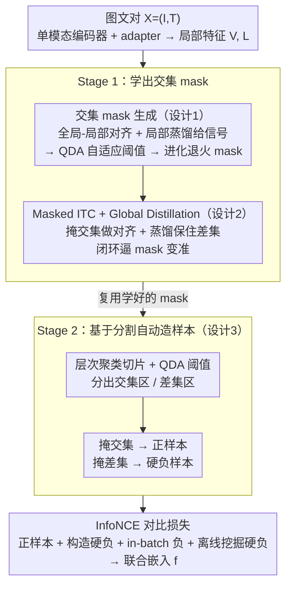

# SOLAR: Self-supervised Joint Learning for Symmetric Multimodal Retrieval

**会议**: ICML2026  
**arXiv**: [2605.15868](https://arxiv.org/abs/2605.15868)  
**代码**: 论文称"Code and benchmark will be available soon"，暂未正式开源  
**领域**: 多模态VLM  
**关键词**: 对称多模态检索, 自监督联合学习, 交集-差集解耦, 掩码对比学习, 多模态嵌入  

## 一句话总结
SOLAR 提出第一套面向"对称 MM2MM 检索"（查询和文档都是 image+text 对、且角色可互换）的两阶段自监督学习框架——第一阶段通过全局-局部对齐 + QDA 自适应阈值学习出"交集 mask"以解耦图文的共享/独有信息，第二阶段利用该 mask 通过对图文不同区域分别掩码构造正/硬负样本做对比学习，并配套发布 214 个人工校验的 sym-MM2MM benchmark；最终以 0.2B 参数和 768 维嵌入超过最强 7.75B VLM 基线 7.08 个百分点。

## 研究背景与动机

**领域现状**：多模态检索通常被分成 UM2MM、MM2UM、MM2MM 几类。当前 UniIR、VLM2Vec、MM-Embed、GME、mmE5 等通用多模态嵌入模型都默认采取"query 是 unimodal 或一种特定结构、content 是另一种结构"的非对称范式，且都依赖监督学习——用人工标注好的 query-document 对训练。

**现有痛点**：真实世界存在大量"query 和 content 是结构对称、语义可互换"的检索场景，作者用电商例子说明——用户拿"T 恤正面图 + 背面描述"去搜，希望召回"背面图 + 正面描述"。这种"对称 MM2MM (sym-MM2MM)"任务对模型的要求是把图文组合理解为一个整体，并能跨越模态推断隐含属性（颜色、目标人群等）；现有非对称模型在 sym-MM2MM 上不仅表现一般，根本无法对"角色互换"做训练。

**核心矛盾**：sym-MM2MM 的天然标注成本极高——"语义等价"的判断本身就是主观的细颗粒度任务，人工大规模标注既贵又慢；而合成数据又受限于生成模型自身能力且难以过滤低质量样本。这就形成了"数据瓶颈" vs "现代 AI 靠 web-scale 自监督才能 scale"之间的张力。

**本文目标**：在不依赖任何 sym-MM2MM 人工标注的前提下，让模型能够从随手可得的图文对（image-caption pairs）中学到"图和文是否构成同一语义整体"的判别能力；同时配套发布该任务的评测 benchmark。

**切入角度**：任意 web 图文对都同时包含"两个模态都覆盖的共享概念（交集）"和"只在一个模态中出现的独有细节（差集）"。如果能自动把这两者分开，就能用程序化方式造样本——把交集掩掉的图文仍能彼此重建（正样本），把差集掩掉则丢失了不可恢复的信息（硬负样本）。

**核心 idea**：用"交集 mask"作为枢纽，把对称检索的语义等价性问题转化为图文共享内容的对齐 + 模态独有内容的保留这两件可学习的事。

## 方法详解

### 整体框架
SOLAR 的编码侧由五个组件构成：vision encoder $\mathcal{E}_V$（如 DINOv2 或 CLIP-vision）、language encoder $\mathcal{E}_L$（如 BGE-m3 或 CLIP-text）、两个两层 MLP adapter $\mathcal{A}_V, \mathcal{A}_L$ 把单模态特征投到共享空间、以及三层 attention 组成的 VL-encoder $\mathcal{E}_{VL}$ 做跨模态融合。推理时输入图文 $\mathbf{X}=(\mathbf{I}, \mathbf{T})$ 经单模态编码 + adapter 得到 patch 级视觉特征 $\mathbf{V}$ 和 token 级文本特征 $\mathbf{L}$，把局部特征 $\mathbf{V}', \mathbf{L}'$ 与一个可学习 `[CLS]` token 拼接后送入 $\mathcal{E}_{VL}$，输出 `[CLS]` 位置即作为最终联合嵌入 $\mathbf{f}$。

训练分成两个 stage：Stage 1 学一个能可靠区分图文交集与差集的 intersection mask；Stage 2 用该 mask 自动生成正/硬负样本做对比学习。整个流程无需任何人工标注，仅消费 80 万张 LAION-5B 上的无标注图文对。

### 关键设计

**1. 交集 mask 生成：用全局-局部对齐 + QDA 自适应阈值，自动标出图文共享的部分（Stage 1 核心）**

整套方法的枢纽是一个能区分图文「交集 vs 差集」的 mask，但既然没有 sym-MM2MM 标注，就得让这个 mask 自己长出来——前提是先有一个「图文之间哪里对齐」的可量化信号。SOLAR 用 Global-to-Local Alignment 构造它：对一个正样本，其局部特征与「伙伴模态全局表征」的平均相似度应高于任何 batch 内负样本，写成 hinge 形式 $\mathcal{L}_{L2V}=[\mathrm{mean}(\mathbb{S}_{L2V}^-)+\delta-\mathrm{mean}(\mathbb{S}_{L2V}^+)]_+$（对称地有 $\mathcal{L}_{V2L}$）。但 GLA 信号的可靠性依赖局部特征本身靠谱，于是再加 Local Distillation 强迫学生局部特征与强单模态教师（DINOv2、BGE-m3）的相似度排序一致 $\mathcal{L}_\mathrm{LD}^L=1-\frac{1}{N}\sum_k\mathrm{corr}(\mathbf{S}_k^{\mathcal{T}},\mathbf{S}_k)$，打破「学生不靠谱 → 信号不靠谱」的循环依赖。拿到信号后，MaskGen 把每个 patch/token 对伙伴模态全局向量的相似度收集起来，正负样本各形成一个高斯分布，用一维 QDA 求两高斯密度相等的交点 $\tau$（解 $\mathcal{N}(\tau;\mu^+,(\sigma^+)^2)=\mathcal{N}(\tau;\mu^-,(\sigma^-)^2)$）当阈值——之所以不用固定阈值，是因为不同模型、不同训练阶段相似度分布差异巨大。最后用进化掩码 $\mathbf{M}=\rho\mathbf{1}+(1-\rho)\hat{\mathbf{M}}$ 让 $\rho$ 从 1 退火到 0，避免训练早期 mask 噪声把模型带崩。

**2. Masked ITC + Global Distillation：一边逼 mask 越来越准、一边防止差集信息被抹掉（Stage 1 训练机理）**

光有 MaskGen 还不够，得有训练目标驱动 mask 真正变准。SOLAR 把进化掩码 $\mathbf{M}_V,\mathbf{M}_L$ 施加到 $\mathcal{E}_{VL}$ 的 self-attention 上，只让 `[CLS]` 注意到交集部分得到 $\mathbf{f}_V,\mathbf{f}_L$，再加双向 InfoNCE 的 Masked ITC 损失 $\mathcal{L}_\mathrm{ITC}$。这本质上是 mask 自己的监督信号——「若掩掉的真是交集，那剩下的内容仍能让两模态对齐」——形成闭环：mask 越准、对齐损失越低、越鼓励 MaskGen 继续按「对齐有效性」调 mask。但只优化 ITC 有个副作用：模型可能为了让对齐收敛而把差集（模态独有信息）彻底抛弃。于是再引入 Global Distillation 作反作用力，要求学生「未 mask 的」全局嵌入与教师在 batch 内的相似度结构对齐 $\mathcal{L}_\mathrm{GD}^L=1-\mathrm{corr}(\mathbf{S}^\mathcal{T},\mathbf{S})$，保住颜色、品牌这类独有判别细节——这对后面区分硬负样本至关重要。Stage 1 总目标是 $\mathcal{L}=\mathcal{L}_\mathrm{ITC}+\lambda_1\mathcal{L}_\mathrm{GLA}+\lambda_2\mathcal{L}_\mathrm{GD}+\lambda_3\mathcal{L}_\mathrm{LD}$。

**3. 基于分割的自动正/硬负样本构造：同一个 mask 既造正样本又造硬负样本（Stage 2 核心）**

有了可靠的交集 mask，Stage 2 就能程序化造对比样本，关键洞察是：掩掉交集 = 「共享部分挖了，但伙伴模态还在、整体语义可重建」→ 天然是正样本；掩掉差集 = 「唯一标识独有细节的部分挖了、信息不可恢复」→ 天然是硬负样本。文本侧直接对相似度高于 $\tau_L$（交集）的 token 随机掩码造正样本、对低于 $\tau_L$（差集）的造负样本。图像侧因为单 patch 信息冗余（MAE 类工作早证明单 patch 掩掉会被周边补回、破坏不了语义），改先对局部视觉特征 $\mathbf{V}'$ 做层次聚类得到 coarse 语义片段 $\mathbf{R}_k$，每片段对文本的相关度由 $s_k=\sum_{p\in\mathbf{R}_k}\mathbf{S}_{L2V}(p)/|\mathbf{R}_k|$ 评分，高于 $\tau_V$ 的进交集造正样本、低的进差集造负样本。最后把 anchor + 正样本 + 三类负样本（构造的差集掩码负样本 + in-batch 负样本 + 离线挖掘的硬负样本）一起送进 InfoNCE：

$$\mathcal{L}=\frac{1}{N}\sum_i\log\frac{\sum_{j\in\mathbb{D}^{+i}}\exp(\langle\mathbf{f}^i,\mathbf{f}^j\rangle/\eta)}{\sum_{k\in\mathbb{D}^{+i}\cup\mathbb{D}^{-i}}\exp(\langle\mathbf{f}^i,\mathbf{f}^k\rangle/\eta)}$$

这种「同一个 mask 既造正又造负」的对偶式合成，绕开了对生成模型的依赖，把对比学习里「如何造硬负样本」这一老难题直接解决。

### 损失函数 / 训练策略
Stage 1 总损失 $\mathcal{L} = \mathcal{L}_\mathrm{ITC} + \lambda_1 \mathcal{L}_\mathrm{GLA} + \lambda_2 \mathcal{L}_\mathrm{GD} + \lambda_3 \mathcal{L}_\mathrm{LD}$ 同时跑掩码对齐 + 全局-局部对齐 + 双层蒸馏，并通过进化退火 $\rho$ 平滑过渡到硬 mask。Stage 2 用 InfoNCE 形式的对比损失加 3 类负样本进行端到端训练。所有训练在 80 万 LAION-5B 图文对上进行，主体编码器用 LoRA 微调，VL-encoder 与 adapter 从 0 训练，不使用任何 sym-MM2MM 标签。

## 实验关键数据

### 主实验

在新发布的 sym-MM2MM benchmark（214 个三元组 + 100 万 LAION 候选池）上，作者评测 Recall@1/5/10、mR、Precision 以及二者均值 Avg。下表节选了论文 Table 1 中最具代表性的对比（R@1 / mR / Precision / Avg / 参数量 / 嵌入维度）：

| 方法 | 监督性质 | R@1 | mR | Precision | Avg | #Param | #Dim |
|------|---------|------|------|------|------|------|------|
| CLIP-SF | 监督, encoder | 55.61 | 82.55 | 73.36 | 77.96 | 0.43B | 768 |
| MM-Embed | 监督, VLM | 55.61 | 82.09 | 75.70 | 78.89 | 7.75B | 4096 |
| GME | 监督, VLM | 56.07 | 80.37 | 74.77 | 77.57 | 7.75B | 3584 |
| UniME | 监督, VLM | 59.81 | 83.02 | 73.36 | 78.19 | 7.49B | 3584 |
| mmE5 | 监督, VLM | 57.94 | 84.58 | 76.64 | **80.61** | 10.12B | 4096 |
| Qwen3-VL-Embedding | 监督, VLM | 56.54 | 81.15 | 74.77 | 77.96 | 7.75B | 4096 |
| CLIP-SF-ZS | 无监督, encoder | 53.27 | 80.22 | 71.03 | 75.62 | 0.15B | 512 |
| **SOLAR-B+D** (本文) | 无监督, encoder | 72.90 | 87.54 | **85.51** | 86.53 | 0.71B | 768 |
| **SOLAR-C** (本文) | 无监督, encoder | **77.57** | **90.81** | 84.58 | **87.69** | 0.20B | 768 |

SOLAR-C 在 Avg 上比最强监督 VLM 基线 mmE5 高 7.08 个百分点，且参数量小 ~50 倍、嵌入维度小 5 倍以上；R@1 从 59.81（UniME 最佳监督）跃升到 77.57，是近 18 个百分点的提升。

### 消融实验

下表为 Stage 1 消融（节选自论文 Table 2）：

| 配置 | Stage 1 后 Avg | Stage 2 后 Avg | 与完整模型差距 |
|------|--------|--------|------|
| Full SOLAR (含全部损失) | 85+ | 86.53 | — |
| 仅 $\mathcal{L}_\mathrm{ITC}$ | 79.5 | 81.5 | -5.0 |
| 去掉 $\mathcal{L}_\mathrm{ITC}$ | 83.3 | 82.6 | -3.9 |
| 去掉 $\mathcal{L}_\mathrm{GLA}$ | 80.8 | — | 显著下降 |

### 关键发现
- 即便经过 Stage 2 的强化，仅靠 $\mathcal{L}_\mathrm{ITC}$ 的版本 Avg 仍比完整模型低 5 个点，说明 GLA + LD + GD 三件套是让交集 mask 真正"长出来"的不可省结构。
- 反过来，去掉 $\mathcal{L}_\mathrm{ITC}$ 后掉 3.9 个点（小于去掉 GLA 等），表明对齐损失更像是"放大器"，而 GLA/LD 是产生信号的"传感器"，二者缺一不可。
- SOLAR 用 0.15–0.71B 的小模型在 sym-MM2MM 上彻底翻盘 7.75B–10B 的 VLM 模型，强烈印证了"任务适配的数据生成机制 > 通用大模型 + 通用数据"的判断。
- Precision 指标（直接看正样本是否能击败硬负样本）的提升幅度（85+ vs 73~76）甚至超过 Recall@k，说明 SOLAR 的真实差异在判别硬对——这正是"交集 vs 差集"训练范式针对性最强的能力。

## 亮点与洞察
- **把"交集/差集"的几何直觉变成可执行算法**：作者借用集合论的最简单直觉（共享 = 交集、独有 = 差集），并用 GLA + QDA 把这一直觉操作化为可微的 mask 学习目标，使得"互换性"成为对比学习里的一个具体训练信号，而不是一个抽象的口号。
- **用对手做自己的训练数据**：掩交集生成正样本、掩差集生成硬负样本——这种"同一个 mask 既造正又造负"的对偶式数据合成思想，把传统对比学习里"如何造硬负样本"这一行业难题直接解决，且不依赖任何生成模型，极具迁移到其他对称对偶任务的潜力（如双文档比较、多视图三维匹配等）。
- **QDA 自适应阈值 + 进化退火**是非常实用的组合 trick：前者解决"分布漂移"，后者解决"早期 mask 不可信"，二者协同让无监督训练在 80 万样本上就能稳定收敛，这套配方对其他需要"自学阈值"的自监督任务有直接借鉴价值。
- **小模型 + 自监督打败大监督 VLM** 这条结论在 sym-MM2MM 这种"标注极昂贵"的任务上具有强烈范式意义：当任务难以标注、但 web 数据丰富时，让数据生成机制与任务结构对齐，比堆参数更划算。

## 局限与展望
- benchmark 仅 214 个三元组，虽然作者强调质量经过人工 + 多模态生成 pipeline 严格筛选，但规模偏小，未来在更大规模（千级、万级）人工或半自动标注的对称基准上验证是必要的。
- 当前 mask 生成假设"每个图文对都同时包含交集和差集"，在某些极端样本（如完全描述性的 caption + 同主题图）上交集 = 整体，可能让 mask 退化；对这类边界样本的兜底策略论文未深入讨论。
- 单模态教师（DINOv2、BGE-m3）的能力上限决定了 LD 信号的天花板；如果未来切换到更弱的 unimodal backbone（例如轻量级 SSL 模型），SOLAR 的优势能否保持仍待验证。
- Stage 2 的硬负样本依赖 Stage 1 阈值的稳定性，论文未给出端到端联合训练或多轮交替更新的版本——这或许是进一步提升性能的方向。

## 相关工作与启发
- **vs UniIR / VLM2Vec / MM-Embed / GME / mmE5 等通用多模态嵌入模型**：它们都依赖 query/document 角色不对称的监督数据，迁移到 sym-MM2MM 时即便参数量 7.75B–10B 也只能达到 Avg 78–80；SOLAR 用 < 1B 的无监督模型直接领先 6–10 分，说明"任务结构特化的自监督"在 sym-MM2MM 上是结构性优势而非工程优势。
- **vs CLIP / DINO 等自监督单模态/双流模型**：CLIP 的图文对齐目标只对齐"全局-全局"，不区分交集和差集；SOLAR 在此之上引入 mask 与差集保留的二阶结构，使得联合嵌入既"对齐共享"又"保留独有"——这是 sym-MM2MM 判别硬负所需的核心能力。
- **vs MAE / SimMIM 等掩码自监督**：MAE 类工作用 mask 做重建是为了 representation pretraining；SOLAR 把 mask 用于"语义可重建性"的对比信号——同样是"masking"，目标完全不同，揭示了 mask 这一原语在多模态对齐中的新用法。
- **vs 基于合成数据的 sym-MM2MM 尝试**（如 Zhang et al. 2024）：合成路线被生成模型能力卡死且需要繁重的质量过滤；SOLAR 把"合成"换成"掩码 web 数据"，绕开生成模型瓶颈，数据规模可直接 scale 到亿级 LAION。

## 评分
- 新颖性: ⭐⭐⭐⭐⭐ 首次形式化对称 MM2MM 检索任务，并提出一套自监督交集/差集解耦框架，思想结构上明显有别于现有所有多模态嵌入方法。
- 实验充分度: ⭐⭐⭐⭐ 与 10 个 SOTA 监督基线在新建 benchmark 上对比，覆盖 Recall@k + Precision + FPS + 参数量，并附 Stage 1 / Stage 2 双段消融；benchmark 规模偏小是唯一遗憾。
- 写作质量: ⭐⭐⭐⭐ 任务定义、动机推导、训练机制衔接非常清晰，公式记号严谨；少量符号（mask 的下标、损失下标）在长公式里阅读负担稍重。
- 价值: ⭐⭐⭐⭐⭐ 对实际产品（电商、内容推荐、设计匹配）有非常具体的应用价值，且 small-model + self-supervised 的胜利将影响后续多模态嵌入方向的研究路径。

<!-- RELATED:START -->

## 相关论文

- [\[CVPR 2025\] Self-Supervised Spatial Correspondence Across Modalities](../../CVPR2025/multimodal_vlm/self-supervised_spatial_correspondence_across_modalities.md)
- [\[CVPR 2026\] TRivia: Self-supervised Fine-tuning of Vision-Language Models for Table Recognition](../../CVPR2026/multimodal_vlm/trivia_self-supervised_fine-tuning_of_vision-language_models_for_table_recogniti.md)
- [\[CVPR 2025\] BadVision: Stealthy Backdoor Attack in Self-Supervised Learning Vision Encoders for Large Vision Language Models](../../CVPR2025/multimodal_vlm/stealthy_backdoor_attack_in_self-supervised_learning_vision_encoders_for_large_v.md)
- [\[ICLR 2026\] Breaking the Limits of Open-Weight CLIP: An Optimization Framework for Self-supervised Fine-tuning of CLIP](../../ICLR2026/multimodal_vlm/breaking_the_limits_of_open-weight_clip_an_optimization_framework_for_self-super.md)
- [\[ICLR 2026\] U-MARVEL: Unveiling Key Factors for Universal Multimodal Retrieval via Embedding Learning](../../ICLR2026/multimodal_vlm/u-marvel_unveiling_key_factors_for_universal_multimodal_retrieval_via_embedding_.md)

<!-- RELATED:END -->
