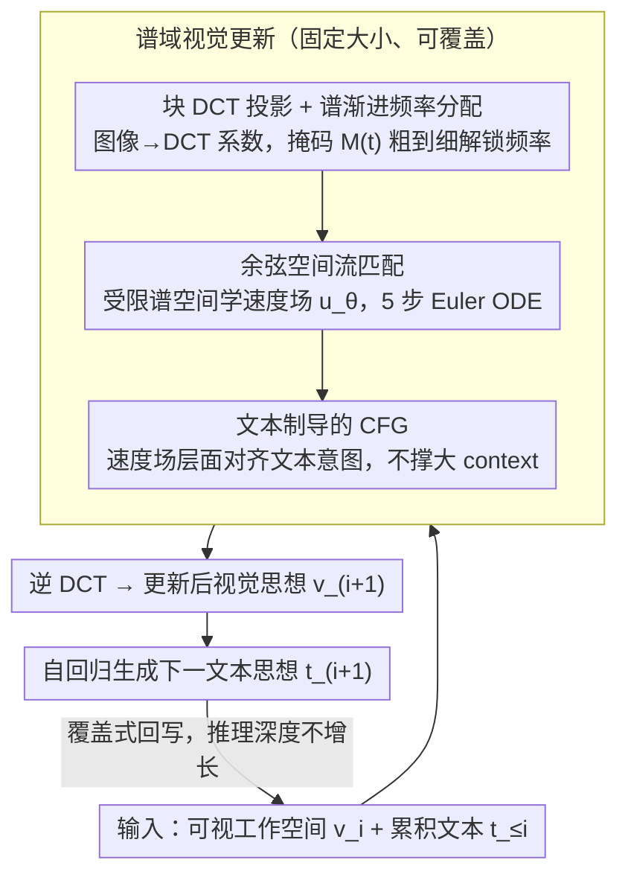

# Spectral-Progressive Thought Flow for Lightweight Multimodal Reasoning

**会议**: ICML 2026  
**arXiv**: [2606.02842](https://arxiv.org/abs/2606.02842)  
**代码**: 待确认  
**领域**: 多模态推理 / LLM 推理效率  
**关键词**: 多模态空间推理, 流匹配, 谱方法, 渐进式频率, 效率优化

## 一句话总结
SpecFlow 把多模态空间推理从"像素思维"切到"谱思维"——用块离散余弦变换 + 流匹配 + 渐进式频率激活在固定大小的谱工作空间里维护可视化中间思想，加上分类器无关引导（CFG）让文本制导视觉演化，在保持空间推理精度的同时把 KV 缓存削减 1.6–2.1×。

## 研究背景与动机

**领域现状**：多模态空间推理（路径规划、目标搜索、空间关系判断）是评估 VLM 推理能力的重要方向。主流是"文本-图像交织链式思维"（MVoT）——每步自回归生成可视化中间思想并累积。

**现有痛点**：MVoT 范式有根本可扩展性问题——每个中间视觉思想可能上千 visual tokens（$O(10^3)$），远多于文本 tokens（$O(10^2)$）；推理步数一多，上下文长度、KV 缓存、内存带宽急速膨胀。显式 token 剪枝靠启发式标准无法适应多步推理动态，隐式潜在空间推理缺可解释性和对空间状态的显式控制。

**核心矛盾**：多模态空间推理要保持精度，但要控制中间表示规模；现有方法要么精度下降、要么成本不降。根本原因是误用了像素空间的密集表示——中间思想其实只需要捕捉全局布局和几何关系。

**本文目标**：设计一个轻量、可扩展的多模态空间推理框架，使内存占用和计算成本不随推理深度增长。

**切入角度**：观察到块离散余弦变换的强能量压缩性——大部分能量集中在少数低频系数。直觉：空间推理早期只需要全局布局（低频），细节（高频）可延后激活，启发渐进式频率调度。

**核心 idea**：在谱域（DCT 空间）而非像素空间维护固定大小可视工作空间，用流匹配做确定性状态转移，CFG 把文本意图与视觉演化对齐——推理步数不涨、成本恒定。

## 方法详解

### 整体框架
推理流程是交替的文本生成 + 视觉更新循环：每步 $i$，给定当前可视工作空间 $\hat{v}_i$ 和累积文本 $\hat{t}_{\leq i}$，先通过流匹配生成更新后的视觉思想 $\hat{v}_{i+1}$，再基于新视觉状态自回归生成下一文本思想 $\hat{t}_{i+1}$。关键是**视觉状态固定大小、可被覆盖**，不像 MVoT 那样累积增长。视觉更新这一步在谱域里完成，三个关键设计串在一起：先把视觉状态投到频率受限的 DCT 谱空间（设计 1），再在这个空间里用流匹配跑确定性 ODE 生成新状态（设计 2），其中速度场由 CFG 做文本制导（设计 3）。

### 关键设计

**1. 块 DCT 投影 + 谱渐进频率分配：把稠密视觉状态压成频率受限的谱系数，再逐步解锁高频**

MVoT 的根本问题是每个中间视觉思想动辄上千 token、推理一深就爆。本文的切入点是块离散余弦变换的强能量压缩性——大部分能量集中在少数低频系数。于是把图像分解成频率分量：低频管全局布局（位置、空间配置），高频管细节纹理；再用一个时间依赖的掩码 $M(t)$ 控制激活范围，$t$ 从 0 起只放开 DC 加邻近低频，随 $t$ 升到 1 逐步解禁中频和高频，激活的频率数 $m(t) = \sum_{u, v} M_t(u, v)$ 单调非降，形成一条粗到细的 curriculum。这么做的道理是——空间推理早期其实只需要全局布局，逼模型一上来就建细粒度像素表示纯属浪费。和启发式剪枝相比，频率掩码是原理驱动、可微、且天然契合多步推理的压缩方式。

**2. 余弦空间流匹配：在频率受限空间学确定性速度场，少量 ODE 步就生成视觉思想**

扩散或自回归每步要采样多次，多步推理累积下来延迟很重。SpecFlow 改用流匹配做确定性、低步数（如 5 步 Euler）的状态转移。系数轨迹 $X(t)$ 遵循 ODE $\frac{dX}{dt} = u_\theta(\tilde{X}(t), t, c)$，其中 $\tilde{X}(t) = M(t) \odot X(t)$ 是套上掩码后的谱系数；训练用标准流匹配损失

$$\mathcal{L}_{FM} = \mathbb{E}\|u_\theta(M(t) \odot X_t, t, c) - (X_0 - X_1)\|_2^2$$

$X_t = (1 - t) X_1 + t X_0$，$X_0 = D_b(x_0)$ 是数据的 DCT 系数、$X_1 \sim \mathcal{N}(0, I)$。系数按频率排序后，掩码 $M(t)$ 自然把"先低频后高频"的层级动态强加进了流匹配过程。比起隐式潜在方法，谱域操作保留了频率语义——哪些频率在何时被激活一目了然，便于调试和控制。

**3. 文本制导的 CFG：在速度场层面对齐文本与视觉演化，且不撑大 context**

多步推理里视觉得跟着当前文本意图走，否则会跑偏。SpecFlow 借分类器无关引导实现：训练时以概率 $p_{\text{drop}}$ 随机丢掉条件 $c_i$，让模型同时学会带条件的 $u_\theta(\cdot, t, c_i)$ 和无条件的 $u_\theta(\cdot, t, \emptyset)$；推理时构造引导速度

$$u^{\text{guid}}_\theta = u_\theta(\tilde{X}, t, \emptyset) + w \cdot (u_\theta(\tilde{X}, t, c_i) - u_\theta(\tilde{X}, t, \emptyset))$$

差分项把"由文本归因的速度变化方向"隔离出来，实验里 $w=4$ 最平衡。关键优势在于——它是在速度场层面而非样本层面做引导，所以完全不需要往轨迹里累积可视 token、不扩展 context 长度，正好规避了 MVoT 那条"token 越堆越多"的死路。

## 实验关键数据

### 主实验（多模态空间推理基准）

| 基准 | 方法 | 准确率 (%) ↑ | FLOPs (G) ↓ | 延迟 (s) ↓ | 内存 (GB) ↓ |
|------|------|----------|------------|----------|----------|
| VSR | VoCoT | 68.88 | 20342.4 | 0.65 | 56.37 |
| VSR | Heima | 51.69 | 10394.5 | 0.40 | 38.84 |
| VSR | **SpecFlow** | **70.14** | 11169.7 | 0.41 | 39.53 |
| V-Star | VoCoT | 59.87 | 22334.0 | 0.71 | 59.28 |
| V-Star | PCCoT | 44.40 | 13963.5 | 0.50 | 42.31 |
| V-Star | **SpecFlow** | **61.28** | 13985.5 | 0.45 | 41.22 |
| EmbSpatial | SparseVLM | 63.89 | 20785.2 | 0.74 | 51.93 |
| EmbSpatial | **SpecFlow** | **67.79** | 17731.5 | 0.44 | 42.57 |
| Winoground | VoCoT | 70.09 | 28092.9 | 0.80 | 62.23 |
| Winoground | **SpecFlow** | **70.47** | 18390.1 | 0.49 | 46.94 |

VSR 上比 Heima 精度高 18.5% 而延迟可比；V-Star 比 PCCoT 高 16.9%；EmbSpatial 超 SparseVLM 3.9%。

### 消融实验：谱调度策略（Maze 与 FrozenLake）

| 环境 | 策略 | 准确率 (%) | 延迟 (ms) | FLOPs (G) |
|------|------|----------|---------|---------|
| Maze | Fixed（仅低频） | 90.39 | 1.13 | 12723.3 |
| Maze | Linear | 94.37 | 1.96 | 16752.2 |
| Maze | **Cosine** | 94.12 | 1.29 | 13976.7 |
| FrozenLake | Fixed | 82.37 | 1.42 | 13672.5 |
| FrozenLake | Linear | 87.79 | 2.97 | 18265.1 |
| FrozenLake | **Cosine** | 87.94 | 1.73 | 15991.1 |

### 关键发现
- KV 缓存从 5.4–5.9 GB 降到 3.0–3.5 GB（1.6–1.8× 削减），动态决策任务上达 2.1× 削减——流匹配范式内在属性。
- 固定低频方案虽快但精度溜坡 3–5%，证明渐进式激活是粗细平衡的关键。
- 纯流匹配（DiffThinker）在复杂推理下精度不足；SpecFlow 通过 CFG 在长推理序列上获大幅提升。

## 亮点与洞察
- **从像素思维到谱思维**：核心洞察是中间可视化思想不需要像素级细节；打破"累积 token"陷阱，可推广到任何需要多步可视化推理的任务。
- **流匹配在受限空间的应用**：用掩码 $M(t)$ 显式编码频率约束，既保留确定性低步数生成优势，又通过分层激活诱导粗到细推理策略。
- **CFG 在多步推理中的巧妙应用**：在 **不扩展 context** 前提下实现文本制导——关键是在速度场层面而非样本层面组合条件分支。
- **固定工作空间的可扩展性**：Markov 假设让内存占用与推理深度完全解耦，对长推理序列特别突出。

## 局限与展望
- 实验主要基于 Qwen3-VL-8B，对更大 / 更小模型泛化未明确。
- 频率掩码 $M(t)$ 是预设的（Linear / Cosine 固定），任务自适应谱预算策略有进一步探索空间。
- ODE 求解步数 $T = 5$ 固定，没系统探索"动态调整步数"。
- 解释性虽然比隐式潜在空间好，但频率激活与推理步骤的具体对应仍需可视化分析。

## 相关工作与启发
- **vs MVoT / VoCoT**：MVoT 范式 visual tokens 无限累积，VoCoT 优化 prompt 但未根本解决；SpecFlow 用固定工作空间 + 非自回归彻底绕过。
- **vs FastV / LightFastV 等启发式剪枝**：启发式剪枝对多步推理动态不友好；SpecFlow 用原理驱动的谱分解避免过度剪枝。
- **vs Heima / CODI 等隐式潜在推理**：隐式方法缺显式约束、学习难度大；SpecFlow 在连续隐空间注入谱结构硬约束，紧凑性 + 可解释性兼备。
- **vs DiffThinker**：纯流匹配无文本制导；SpecFlow 通过 CFG 对齐文本-视觉演化，复杂推理成功率显著提升。

## 评分
- 新颖性: ⭐⭐⭐⭐⭐  从像素到谱空间的范式转变 + 流匹配在频率受限空间的应用 + CFG 在多步推理中的巧妙集成。
- 实验充分度: ⭐⭐⭐⭐⭐  6 个基准 × 3 类任务 × 4 个模型对比 + 频率调度 / CFG / ODE 步数消融，边际效应明确。
- 写作质量: ⭐⭐⭐⭐  逻辑清晰，频率能量分析图直观；动态频率预算细节留在附录略简。
- 价值: ⭐⭐⭐⭐⭐  解决多模态 VLM 长推理 KV 缓存爆炸的根本瓶颈，1.6–2.1× 内存削减直接可用，表示空间精心选择 vs 蛮力压缩的设计哲学有长期指导意义。

<!-- RELATED:START -->

## 相关论文

- [\[ACL 2025\] Progressive Multimodal Reasoning via Active Retrieval](../../ACL2025/multimodal_vlm/progressive_multimodal_reasoning_via_active_retrieval.md)
- [\[CVPR 2026\] ReaGEN: Adaptive Generation of Structured Chains-of-Thought for Efficient Multimodal Reasoning](../../CVPR2026/multimodal_vlm/reagen_adaptive_generation_of_structured_chains-of-thought_for_efficient_multimo.md)
- [\[CVPR 2026\] Can We Build Scene Graphs, Not Classify Them? FlowSG: Progressive Image-Conditioned Scene Graph Generation with Flow Matching](../../CVPR2026/multimodal_vlm/can_we_build_scene_graphs_not_classify_them_flowsg_progressive_image-conditioned.md)
- [\[CVPR 2026\] MM-SeR: Multimodal Self-Refinement for Lightweight Image Captioning](../../CVPR2026/multimodal_vlm/mm-ser_multimodal_self-refinement_for_lightweight_image_captioning.md)
- [\[ICML 2026\] VEENA: Interpreting and Enhancing Emotional Circuits in Large Vision-Language Models via Cross-Modal Information Flow](interpreting_and_enhancing_emotional_circuits_in_large_vision-language_models_vi.md)

<!-- RELATED:END -->
