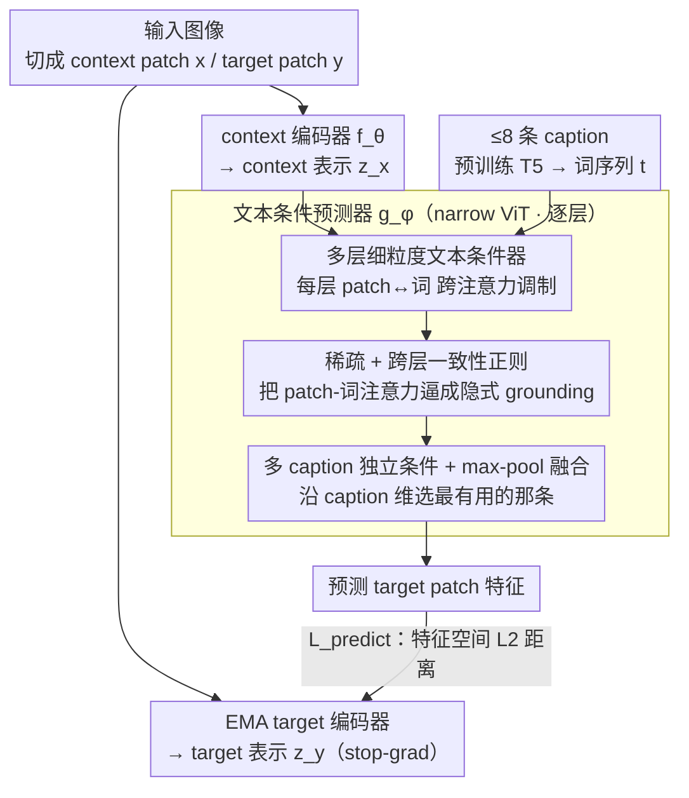

# Text-Conditional JEPA for Learning Semantically Rich Visual Representations

**会议**: ICML 2026  
**arXiv**: [2605.03245](https://arxiv.org/abs/2605.03245)  
**代码**: 无  
**领域**: 多模态VLM / 自监督表示学习  
**关键词**: JEPA、文本条件、特征预测、细粒度视觉语言、跨注意力

## 一句话总结
本文提出 TC-JEPA，把 I-JEPA 的 mask 特征预测器额外条件化在图像 caption 上，通过多层稀疏跨注意力让 patch 表示在文本"提示"下变得可预测，从而在不用对比损失的前提下学到语义更丰富、对密集预测尤其友好的视觉表征。

## 研究背景与动机

**领域现状**：视觉自监督学习目前由两类方法主导。一类是不变性方法（DINO、MoCo v3、iBOT 等），通过让同图不同增强视图的表示一致来学习高层语义；另一类是掩码图像建模（MIM），其代表 I-JEPA 在特征空间预测被 mask 掉的 patch，相比 MAE 等像素重建方法更易兼顾局部结构与高层语义。

**现有痛点**：I-JEPA 的核心 pretext 任务存在内在不确定性 —— 给定上下文 patch 去预测某个 mask 位置的特征时，可能的合理答案非常多（例如在狗的图像里被 mask 的位置既可以是书架也可以是干净墙面）。这种歧义让训练对 masking 策略极为敏感，当上下文与 target 互信息低时，特征预测退化、甚至发生表示坍缩。已有的位置条件编码器、随机位置编码等修补方案并没有引入新的信息源。

**核心矛盾**：JEPA 想要"用预测代替对齐"，但只用图像信号根本无法消除被 mask 区域的多模态歧义。歧义不解决，预测目标就不收敛到语义有意义的表征。

**本文目标**：(i) 给 JEPA 预测器注入额外的信息源以降低预测不确定性；(ii) 不引入对比损失、不依赖 grounding 标注，仍能学到比 CLIP/SigLIP 更细粒度的视觉语言对齐。

**切入角度**：图像的人工或合成 caption 几乎都描述了场景组成（"狗 + 书架"），它恰好告诉模型 mask 区域可能"应该是什么"。把这条监督喂给预测器而不是编码器，就能在保留 JEPA 表征结构的同时大幅压缩预测分布。

**核心 idea**：用细粒度的"文本条件预测器"代替原始 JEPA 预测器 —— patch 特征不再是无条件的特征向量，而是被 caption 词序列"调制"的、可预测的隐变量；caption 仅在预训练阶段使用，下游推理时丢弃。

## 方法详解

### 整体框架
TC-JEPA 在结构上沿用 I-JEPA：图像被切成 context patch $x$ 与 target patch $y$，context encoder $f_\theta$ 与 EMA target encoder $f_{\bar\theta}$ 分别给出 $z_x, z_y$，narrow ViT 预测器 $g_\phi$ 在 mask token 位置预测 $\hat z_y$，训练 loss 是 $\mathcal{L}_{\text{predict}}=\frac{1}{|B_y|}\sum_j\|\hat z_{y_j}-z_{y_j}\|_2$。关键变化是：给 $g_\phi$ 同时输入一组（最多 $N=8$）caption，用预训练 T5 把每条 caption 映射成词序列 $t\in\mathbb{R}^{d_t\times S}$，在预测器的每一层 patch 表示上叠加对 $t$ 的跨注意力调制。整条 pipeline 只用特征预测损失训练，不用 contrastive、不用 grounding 框。三个核心改动都集中在预测器内部——逐层文本条件、稀疏+一致性正则、多 caption max-pool 融合——编码器与 EMA target 分支沿用 I-JEPA。

### 关键设计

**1. 多层细粒度文本条件器：让每个 patch 按需挑相关词来辅助预测**

I-JEPA 的病根在于"给上下文 patch 去预测 mask 位置特征"本身是高度多解的——狗的图里被 mask 的地方既可能是书架也可能是干净墙面，歧义大到训练对 masking 策略极敏感、甚至坍缩。caption 恰好告诉模型那块"应该是什么"，所以本文把文本喂进**预测器**而非编码器。具体做法是在预测器的每一层都让 patch 特征 $q\in\{\hat z_x^{(l)}, \hat z_y^{(l)}\}$ 与 caption 词序列 $t$ 做一次轻量跨注意力：$q^{(l)}=W_Q^{(l)}q$、$K^{(l)}=W_K^{(l)}t$、$V^{(l)}=W_V^{(l)}t$，然后残差更新 $q\leftarrow q+\sum_s\text{softmax}(q^{(l)\top}K_{:,s}^{(l)})V_{:,s}^{(l)}$，再接一个 MLP + LayerNorm。

相比"把 caption 当额外 token 拼到预测器输入"的 sequence conditioning，逐层跨注意力既不延长 ViT 序列、又能在所有层持续注入文本信号，而不是只在底层生效。作者的核心论点是要让 patch 表示变成"在文本提示下可预测的"，所以条件必须深入每一层，才能在 patch 与 word 之间长出稀疏对应、反过来约束 patch 表示与语言对齐。

**2. 稀疏 + 跨层一致性正则：把跨注意力逼成隐式 visual grounding**

没有显式 grounding 监督时，跨注意力很容易退化成"对所有词都平均关注"的无意义平均，文本条件就白给了。本文对每个 patch 在每层算出 patch-word 余弦相似度 $O_i^{(l)}=\max(\cos(q^{(l)},K^{(l)}),0)$，再加两道约束：一是 $\ell_1$ 稀疏惩罚 $\mathcal{L}_{\text{sparse}}=\frac{1}{|B_x|+|B_y|}\sum_i\frac{1}{L}\sum_l\|O_i^{(l)}\|_1$，逼每个 patch 只挑少数关键词；二是跨层一致性 $\mathcal{L}_{\text{consistency}}=\frac{1}{|B_x|+|B_y|}\sum_i\frac{1}{L}\sum_l\|O_i^{(l)}-\bar O_i\|_1$（$\bar O_i=\frac{1}{L}\sum_l O_i^{(l)}$），逼同一 patch 在不同层选词保持稳定。

两个约束一起把训练自发推向"每个 patch 对应几个稳定相关词"，相当于在零标注下隐式构造出 visual grounding，让文本条件真正帮到预测任务。消融里去掉这两项后注意力立刻退化为均匀、文本调制失效。

**3. 多 caption 独立条件 + 特征级 max-pool 融合：保留每条视角再选最有用的那条**

一张图常配有多条 caption。如果把它们拼成一个长句让同一 patch 同时关注，不同 caption 的条件信号会互相干扰。本文改成每条 caption 独立条件化预测器：第 $l$ 层先用第 $n$ 条 caption $t^n$ 各自算出 $\hat z_{y_{j,n}}^{(l)}$ 和 $\hat z_{x_{i,n}}^{(l)}$，再沿 caption 维 $n$ 做 max-pool 得到该层输出喂下一层。这样既保留了每条 caption 的差异化视角，max-pool 又自然选出"对该 patch 最有用"的那条，相当于 caption 级别的稀疏选择。

最终训练目标把三项合到一起（$N$ 为 caption 数，$\lambda=0.1$、$\beta=0.5$）：

$$\mathcal{L}=\mathcal{L}_{\text{predict}}+\frac{\lambda}{N}\sum_n\mathcal{L}_{\text{sparse}}^n+\frac{\beta}{N}\sum_n\mathcal{L}_{\text{consistency}}^n$$

消融显示多 caption max-pool 明显优于单 caption（$N=1$），因为单条 caption 很难覆盖一张图里的所有视觉细节。

### 损失函数 / 训练策略
总 loss 包含特征预测项、稀疏项与一致性项，target encoder 沿用 EMA + stop-gradient 防坍缩。预训练数据集为 IN-1k / IN-21k（用 ShareGPT4V 合成 8.3–8.7 条/图 caption）以及 CC12M+YFCC15M 图文对（同样补合成 caption）。骨干尝试 ViT-B/16、ViT-L/16、ViT-H/14，IN-21k 训 600–300 epoch，超参对 $\lambda,\beta$ 不敏感。

## 实验关键数据

### 主实验

| 任务 | 模型 / 数据 | I-JEPA / StoP | TC-JEPA | 提升 |
|------|------------|---------------|---------|------|
| IN-1k linear (ViT-H/14, IN-1k) | Top-1 | 79.3 / 79.6 | 80.4 | +1.1 |
| IN-1k linear (ViT-L/16, IN-21k) | Top-1 | 77.2 (I-JEPA) | 82.1 | +4.9 |
| ADE20k mIoU (linear, ViT-H/14) | mIoU | 36.9 / 36.6 | 39.5 | +2.6 |
| COCO det (ViT-H/14) | AP$^b$ | 53.7 / 53.5 | 55.2 | +1.5 |
| ADE20k mIoU (ViT-L/16, CC27M) | mIoU | – | 42.1 | 新 SOTA |
| vs SigLIP2 (ViT-L/16, ADE20k mIoU) | mIoU | 24.6 | 41.2 | +16.6 |

第二张表对比的是图文对预训练域：TC-JEPA 在 IN-21k 上的 ADE20k mIoU 已经超过用 5× 数据蒸馏的 DINOv2 (41.8) 与 75× 数据的 Web-DINO (40.3)；用 CC27M 训出 42.1，明显比同等数据的 CLIP/SigLIP 更适合密集任务。

### 消融实验

| 配置 | IN-1k Top-1 / ADE20k mIoU | 说明 |
|------|---------------------------|------|
| Full TC-JEPA (ViT-L/16, IN-21k) | 82.1 / 41.2 | 完整方法 |
| 去 sparse + consistency 约束 | 明显下降 | patch-word 注意力退化为均匀，文本调制失效 |
| Sequence conditioning（拼 caption 入输入） | 弱于 cross-attn | 条件只在浅层、序列变长开销大 |
| 单 caption（$N=1$） | 弱于 $N=8$ max-pool | 单 caption 难覆盖所有视觉细节，max-pool 多 caption 收益明显 |
| I-JEPA baseline | 77.2 / 38.2 | 无文本条件 |

### 关键发现
- 文本条件对密集任务（分割、检测）收益远高于分类，说明降低预测不确定性主要改善了 patch 局部特征质量，正好打中 SigLIP 等对比方法的短板。
- 在 IN-21k 上 TC-JEPA 的 ADE20k mIoU 与组合了 invariance + MIM 的 Franca 持平，证明 fine-grained 文本条件可以替代手工增强的不变性约束。
- 数据放大时 TC-JEPA 的 scaling 曲线全程压在 I-JEPA 之上，而 I-JEPA 在 IN-1k 分类上甚至看不到清晰 scaling，说明文本信号是稳定 scaling 的关键。

## 亮点与洞察
- 把"文本"放在 predictor 而不是 encoder 里是个关键转向：encoder 不再被语言压缩到 CLIP 那种全局抽象，patch 特征仍保留视觉细节，但变成了"在文本提示下可预测"的隐变量；下游推理时丢弃文本仍可用纯图像表征，部署上完全兼容现有视觉骨干。
- 用稀疏 + 一致两个温和正则把跨注意力推成隐式 visual grounding，绕开了 grounding 数据的强依赖，这种"用辅助 loss 驱动 attention 形成语义对齐"的思路可以推广到任何需要 cross-modal alignment 的预训练。
- 多 caption max-pool 融合是一个很实用的小 trick：避免了拼接造成的"同 patch 同时被多源 caption 干扰"问题，融合操作放在特征空间而非 token 空间，开销小、自带稀疏选择。

## 局限与展望
- TC-JEPA 需要每张图配 5–10 条合成 caption，对 caption 质量与数量敏感，工业级部署时合成 caption 的 LMM 成本不可忽视。
- 文本条件只在预训练阶段，下游推理无法显式利用文本 prompt 做 zero-shot 检索/分类，所以 IN-1k 上仍稍落后专门的对比图文方法在 zero-shot 上的表现（论文未对比 zero-shot 检索）。
- 多层跨注意力 + 多 caption 让预测器额外计算量不小，scaling 到 ViT-G 级别时训练成本与稳定性还需要验证。
- 论文未深入讨论合成 caption 的偏差与 hallucination 会如何反过来污染表征，这在更换 caption 生成器时可能放大。

## 相关工作与启发
- **vs I-JEPA / StoP / CAPI**：同属 latent MIM，但 TC-JEPA 把"不确定性"问题从架构 trick（位置条件、随机位置编码、cluster 预测）转换为"引入新信息源（文本）"，思路更直接，效果上也全面领先。
- **vs CLIP / SigLIP 系列**：同样使用 image-caption pair，但 TC-JEPA 不用 contrastive loss，特征空间没有被全局对齐压扁，所以在密集任务上大幅领先；劣势是没法直接做 zero-shot 图文检索。
- **vs DINOv2 / iBOT / Franca**：这些方法靠"invariance+MIM"组合得到强表征，需要精心设计的图像增强；TC-JEPA 用文本条件替代增强，在 IN-21k 上 mIoU 已与 Franca 持平甚至更好，提示"语言可以是另一种数据增强"。
- **vs SPARC / DreamLIP（用合成 caption 的细粒度对比方法）**：同样使用合成 caption，但 TC-JEPA 把 caption 当作预测器条件而非对比目标，对密集任务更友好。

## 评分
- 新颖性: ⭐⭐⭐⭐ 把 caption 注入 JEPA 预测器是一个相对自然但此前未被认真做出的方向，cross-attention + 稀疏一致正则 + 多 caption max-pool 的组合有明确的工程贡献。
- 实验充分度: ⭐⭐⭐⭐ 覆盖 3 个模型规模、3 种数据规模、分类/检测/分割多任务，并与 MIM、invariance、contrastive 三类方法系统对比。
- 写作质量: ⭐⭐⭐⭐ 动机推导清晰，方法图 + 公式结合较好，但部分章节为塞满 8 页略显紧凑。
- 价值: ⭐⭐⭐⭐ 为 JEPA 系列方法打开了"弱文本监督"这条 scaling 路径，对密集预测、视觉基础模型的下游应用价值高。

<!-- RELATED:START -->

## 相关论文

- [\[ICML 2026\] CHARM: 用 Multimodal JEPA + 通道描述做时间序列 foundation embedding](giving_sensors_a_voice_multimodal_jepa_for_semantic_time-series_embeddings.md)
- [\[ICML 2026\] Conditional Diffusion Sampling](conditional_diffusion_sampling.md)
- [\[ICML 2025\] M3-JEPA: Multimodal Alignment via Multi-gate MoE based on JEPA](../../ICML2025/multimodal_vlm/m3-jepa_multimodal_alignment_via_multi-gate_moe_based_on_the_joint-embedding_pre.md)
- [\[AAAI 2026\] Conditional Information Bottleneck for Multimodal Fusion: Overcoming Shortcut Learning in Sarcasm Detection](../../AAAI2026/multimodal_vlm/conditional_information_bottleneck_for_multimodal_fusion_overcoming_shortcut_lea.md)
- [\[NeurIPS 2025\] Learning Shared Representations from Unpaired Data](../../NeurIPS2025/multimodal_vlm/learning_shared_representations_from_unpaired_data.md)

<!-- RELATED:END -->
