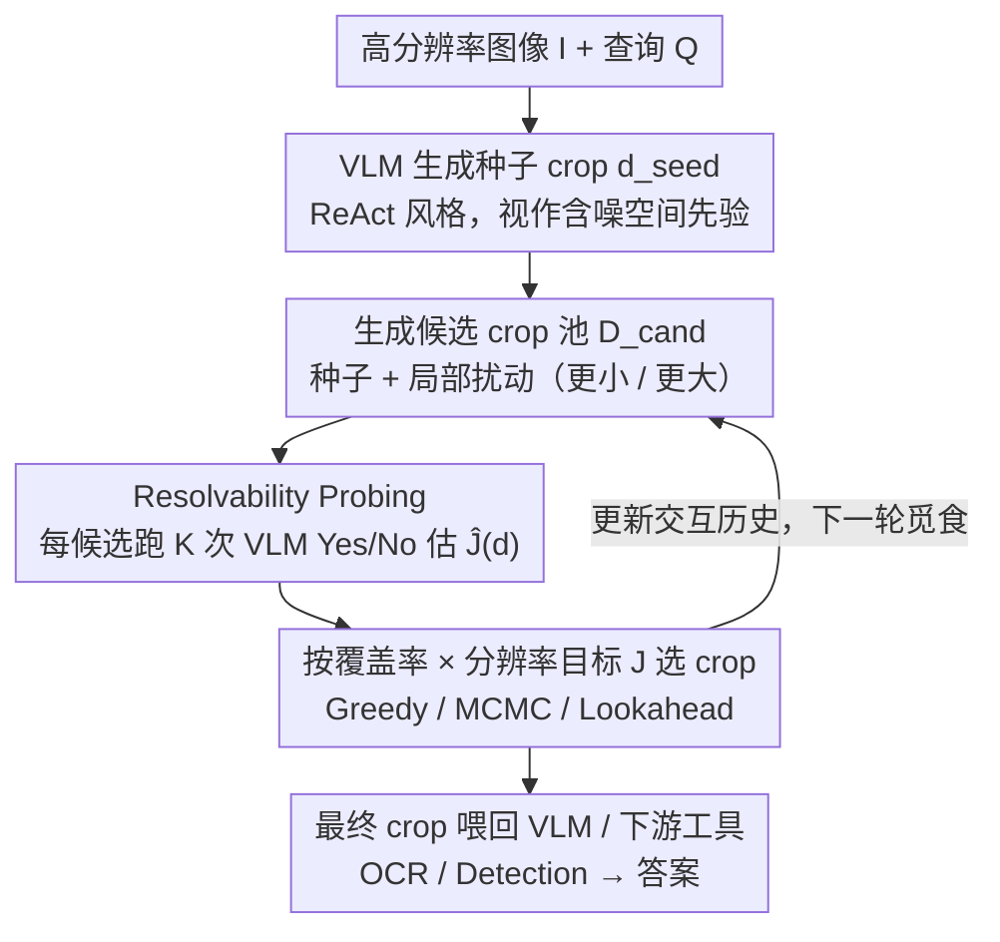

# The Perceptual Bandwidth Bottleneck in Vision-Language Models: Active Visual Reasoning via Sequential Experimental Design

**会议**: ICML 2026  
**arXiv**: [2605.01345](https://arxiv.org/abs/2605.01345)  
**代码**: 无  
**领域**: 多模态VLM / 主动视觉 / 视觉Agent  
**关键词**: 感知带宽瓶颈, 贝叶斯实验设计, 主动视觉推理, 高分辨率, 训练免费

## 一句话总结
本文把"VLM 看不清细节"形式化为一个序贯贝叶斯最优实验设计 (S-BOED) 问题,并基于"覆盖率 × 分辨率"的可计算代理目标提出训练免费的 FOVEA 模块,在高分辨率/遥感等基准上稳定超过 Direct 与 ReAct-style 基线。

## 研究背景与动机

**领域现状**:现代 VLM (Qwen3-VL、GPT-5、Gemini 2.5 等) 在整体场景理解上已经很强,主流的高分辨率处理方式分两类:一是把图像下采样后整图喂进固定 token 数的 ViT 编码器;二是引入工具调用,让 VLM 通过 ReAct 或 latent CoT 自己提 crop 命令,再调 OCR / detection 等专家工具。

**现有痛点**:在小物体计数、OCR、精细空间定位这些 fine-grained 任务上,所有现成 VLM 都表现出"感知盲" —— 哪怕推理逻辑很简单也会错。下采样导致小物体在被编码前就"消失"了;ReAct 风格的 crop 又是启发式的,经常切错地方;sliding window 暴力扫又太贵且引入大量干扰。

**核心矛盾**:作者指出这是一个**感知带宽瓶颈**问题 —— ViT 把任意分辨率图像压成固定 token 数,造成不可避免的"视野 vs 分辨率"权衡:看得宽就看不清细节,看得清细节就看不到全局。这不是单纯的语义推理失败,而是"在有限带宽下没拿到任务相关证据"的失败。

**本文目标**:把"看哪儿"这个决策从 ad-hoc 启发式变成一个有决策论基础的最优实验设计问题,并给出在 gigapixel 连续空间里实际可算的代理目标。

**切入角度**:类比科学家做实验 —— 每次选一个 foveation (crop) 就是选一个实验设计 $\mathbf{d}$,目标是降低对潜在变量 $\boldsymbol{\theta}=\{\ell, y\}$ (目标位置 + 语义答案) 的不确定性。BOED 框架天然适合这个"主动信息觅食"过程。

**核心 idea**:用"覆盖率 × 分辨率"乘积作为期望信息增益的可计算代理,并把它包装成一个 plug-in 模块去 refine VLM 自己提出的 crop。

## 方法详解

### 整体框架
输入是高分辨率图像 $I$ 和查询 $Q$。VLM 先按 ReAct 风格生成一个种子 crop $\mathbf{d}_{\text{seed}}$,FOVEA 把它视作含噪的空间先验(不直接信任),围绕它生成候选 crop 池 $\mathcal{D}_{\text{cand}}=\{\mathbf{d}_{\text{seed}}, \mathbf{d}_{\text{small}}, \mathbf{d}_{\text{large}}\}$,对每个候选用 resolvability probe 估一个 utility 分 $\hat{\mathcal{J}}$,再用优化器(Greedy / MCMC / Lookahead)选出最优 crop。被选中的视图会更新交互历史 $\mathcal{H}_t$,作为下一轮觅食的搜索状态 —— 所以 FOVEA 是一个序贯 refine 过程,能利用前几轮的正/负证据。最终 crop 喂回 VLM 或下游工具 (OCR/Detection) 产出答案。整个过程**完全训练免费**,只是在推理时多调几次 VLM 当 scorer。

### 关键设计

**1. S-BOED 形式化与三层概率模型:把"看哪儿"变成最优实验设计。** 针对现有方法把 crop 决策当成 ad-hoc 启发式的问题,本文把主动视觉重新表述成序贯贝叶斯最优实验设计 —— 每选一个 foveation(crop)$\mathbf{d}$ 就像科学家选一次实验,目标是降低对潜变量 $\boldsymbol{\theta}=\{\ell, y\}$(目标位置 + 语义答案)的不确定性。模型分三层把约束讲清:**物理层**定义感知带宽 $\mathcal{B}$、信息密度 $\rho(\mathbf{d})=\mathcal{B}/A(\mathbf{d})$ 和分辨率概率 $\phi(\mathbf{d})=f_{\text{sat}}(\rho(\mathbf{d}))$(sigmoid 形式,对应"语义 Nyquist 速率");**生成层**引入二元 visibility 事件 $\mathcal{S}$,只有当目标既被空间覆盖 ($\ell\in\mathbf{d}$) 又被分辨率解析 ($\phi=1$) 时才 $\mathcal{S}=1$,这时 observation $\mathbf{z}$ 才携带关于 $y$ 的语义信息,否则退化成背景噪声 $p_0$;**决策层**把目标定为最大化期望信息增益 (EIG)。作者特别指出这个问题违反 active learning 常用的子模性假设 —— 单看"宽视野"或"随机放大"信息增益都接近 0,只有它们的序列组合才有大增益,出现"信息悬崖" (Information Cliff),所以必须 look-ahead 而不能纯贪心。

**2. 可计算的 Coverage-Resolution 目标:把 EIG 退化成几何可见性。** BOED 里的 EIG 是 nested expectation 形式,在 gigapixel 连续空间根本算不动。本文靠三个递进假设把它化简成一个标量目标 —— Factorised Belief ($p_t(\ell, y)\approx p_t(\ell)\cdot p_t(y)$)、Calibrated Visibility ($H(\mathcal{S}|\mathbf{z},\mathbf{d})\approx 0$)、Ideal Observer ($H(y|\mathbf{z},\mathcal{S}=1)\approx 0$) —— 推导出 $U_t(\mathbf{d})\approx H_t(y)\cdot\mathcal{J}_t(\mathbf{d})$,其中 $\mathcal{J}_t(\mathbf{d})=\left(\int_{\mathbf{x}\in\mathbf{d}}p_t(\mathbf{x})d\mathbf{x}\right)\cdot \phi(\mathbf{d})$ 正是"覆盖率 × 分辨率"乘积。由于 $H_t(y)$ 与设计 $\mathbf{d}$ 无关,最大化 EIG 就等价于最大化 $\mathcal{J}_t$。这一步的妙处在于把语义推理的复杂目标退化成几何上的可见性最大化:把"理解"的负担留给 backbone VLM、把"搜索"的负担留给 FOVEA,正是这种 separation of concerns 让训练免费的推理时优化成为可能。

**3. Resolvability Probing 与三种优化器:用 VLM 自己当打分器。** 真实场景里没有 ground-truth belief map,$\mathcal{J}$ 算不出来。FOVEA 的解法是引入二元 resolvability 信号 $r\in\{0,1\}$,定义 $\hat{\mathcal{J}}(\mathbf{d})\approx P(\text{VLM}(I_\mathbf{d}, Q)=\text{"Yes"})$,即"这个 crop 里有没有足够回答问题的视觉证据",对每个候选 crop 跑 $K$ 次随机 probe 取平均(论文取 $K=3$)。它把 VLM 自己当成 critic,无需训练任何打分模型,只多调几次 VLM。在此之上 FOVEA 支持三档优化器,构成一条 compute-accuracy 谱:**Greedy**(默认,直接选 $\hat{\mathcal{J}}$ 最大的)、**MCMC-style**(迭代扰动 crop 做局部 refine)、**Lookahead**(用 simulated next-state 的 $\hat{V}(\mathbf{d}, \mathcal{H}_{t-1})$ 而非 immediate score 打分,专门对付信息悬崖)。作者明确 resolvability probe 不是 EIG 的精确估计器,而是 S-BOED 视角下的经验代理;三档优化器让用户能按延迟预算在精度与开销间切换。

### 损失函数 / 训练策略
**完全训练免费**,没有任何参数更新。FOVEA 只在推理时插入到 VLM 的 crop 调用链路上,通过额外的 $|\mathcal{D}_{\text{cand}}|\times K$ 次 VLM probe 来选 crop,代价是额外 token,但收益是 crop 质量上升。

## 实验关键数据

### 主实验

| 方法 | Backbone | MME-RealW | CV-Bench | V* | HR-4K | HR-8K | 均值 |
|------|----------|-----------|----------|-----|-------|-------|------|
| GPT-5 | 闭源 | 55.0 | 84.9 | 77.0 | 78.1 | 75.5 | 74.1 |
| Gemini 2.5 Flash | 闭源 | 58.5 | 87.3 | 80.1 | 83.4 | 80.9 | 78.0 |
| Direct | Qwen3-VL-30B | 48.2 | 81.2 | 81.2 | 80.0 | 75.9 | 73.3 |
| ReAct | Qwen3-VL-30B | 51.1 | 81.3 | 83.8 | 80.8 | 78.3 | 75.1 |
| RAP | Qwen3-VL-30B | 40.8 | 72.2 | 86.4 | 79.6 | 80.6 | 71.9 |
| **FOVEA** | Qwen3-VL-30B | **54.6** | **84.8** | **85.3** | **84.5** | 79.2 | **77.7** |
| Direct | Qwen3-VL-8B | 47.6 | 84.5 | 76.9 | 74.5 | 70.9 | 70.9 |
| ReAct | Qwen3-VL-8B | 48.1 | 83.9 | 78.8 | 77.7 | 73.8 | 72.5 |
| **FOVEA** | Qwen3-VL-8B | **49.9** | **84.7** | **83.6** | **80.9** | **75.4** | **74.9** |

30B 上 FOVEA 把 ReAct 的 75.1 提到 77.7,接近 Gemini 2.5 Flash 的 78.0;8B 上从 72.5 提到 74.9。同一策略在两种规模 backbone 上都 work。

### 消融实验 (Remote Sensing 子集,search-dominated)

| 配置 | 准确率 | 说明 |
|------|--------|------|
| Direct (30B) | ~35% | 单整图,无主动搜索 |
| ReAct | 45.1% | 启发式 crop |
| FOVEA-Greedy | ~48% | 加 resolvability probe |
| FOVEA-MCMC | ~50% | 迭代 refine |
| **FOVEA-Lookahead** | **54.7%** | 显式 look-ahead 应对信息悬崖 |
| Oracle Crop | ~65% | 给定人工标注 crop 的上界 |

### 关键发现
- FOVEA 在搜索主导 (search-dominated) 的遥感场景增益最大,Lookahead 比 Greedy 还能再涨 6+ 点,印证了"信息悬崖"假说 —— 在这类任务里 immediate gain 信号不足,必须 look-ahead
- Oracle crop 与 FOVEA-Lookahead 之间仍有 ~10 点差距,作者明确把这分解为"搜索瓶颈"和"识别瓶颈"两部分,说明就算 crop 给对了,VLM backbone 自己的识别推理也会错
- 在 accuracy-compute 曲线上,Greedy / MCMC / Lookahead 形成一组单调递增的 operating points,FOVEA 实际上是一族策略而不是单点 —— 这给了"推理时 scaling"一个新的轴:不是只在文本 CoT 里多花 token,而是多花 token 去主动获取视觉证据

## 亮点与洞察
- **把 active vision 重新挂到 BOED 这棵成熟决策论树上**:之前的工具型 VLM agent (Thyme、RAP) 都是 RL 训出来的端到端策略,FOVEA 反过来给了一个完全训练免费但有理论支撑的方案,核心 trick 就是"覆盖率 × 分辨率"这个一行公式的代理目标
- **"信息悬崖"这个观察非常直击要害**:解释了为什么纯贪心策略在高分辨率任务上经常摆烂 —— 不是模型蠢,是子模性假设根本不成立,这把"为什么需要 look-ahead"提到了理论必然的高度
- **Resolvability probing 这个 trick 很可迁移**:它本质上是用 VLM 当自己的 critic ($P(\text{VLM}=\text{Yes})$ 作为 utility),完全可以搬到 web agent / 工具调用 / RAG 检索 ranking 等场景,只要任务有"二元 yes/no 验证"形式

## 局限与展望
- 作者承认依赖 Ideal Observer 假设,在 backbone VLM 自己就会幻觉的图上,oracle crop 也救不了
- proposal-limited 是硬伤:如果种子 crop 完全偏离真目标区域,局部 refine 和 look-ahead 都救不回来,作者把它叫 cold-start 问题,提出 multi-seed 缓解但没深入做
- resolvability probe 要额外跑 VLM,推理时间显著上升;FOVEA 应被看成 compute-accuracy 曲线上的一族点,不适合所有延迟敏感场景
- 未来方向:训练一个 amortised 的轻量 policy 直接预测好的 crop,或加 meta-policy 决定"何时该启动 FOVEA"

## 相关工作与启发
- **vs ReAct / Thyme / RAP**:他们用 RL 或启发式让 VLM 自己提 crop,本文不动 backbone,只在推理时加一层 BOED 优化,训练成本为零但有理论保证;实验上 30B 时 FOVEA (77.7) > RAP (71.9)
- **vs BED-LLM (Choudhury et al. 2025)**:他们把 BOED 用在离散问题选择 (question selection) 上,FOVEA 把它拓展到连续 gigapixel 视觉空间,需要额外处理 visibility gating 和信息悬崖
- **vs 普通 visual CoT**:文本 CoT 多花 token 是在"思考",FOVEA 多花 token 是在"看",作者把这当作推理时 scaling 的另一个正交轴

## 评分
- 新颖性: ⭐⭐⭐⭐⭐ S-BOED + 信息悬崖 + 覆盖率分辨率乘积,理论 framing 很完整也很新
- 实验充分度: ⭐⭐⭐⭐ 四个高分辨率 benchmark + 两种 backbone + 三种 optimiser 都跑了,Oracle gap 分析也漂亮,但只在 Qwen3-VL 家族验证略单薄
- 写作质量: ⭐⭐⭐⭐⭐ 三层概率模型 (物理 → 生成 → 决策) 的组织很清晰,假设和近似都明示
- 价值: ⭐⭐⭐⭐ 训练免费 + 即插即用,实战部署门槛低,但 probe 开销大、cold-start 没解决限制了直接落地

<!-- RELATED:START -->

## 相关论文

- [\[ICML 2026\] Active Exploring like a Pigeon: Reinforcing Spatial Reasoning via Agentic Vision-Language Models](active_exploring_like_a_pigeon_reinforcing_spatial_reasoning_via_agentic_vision-.md)
- [\[NeurIPS 2025\] PhysVLM-AVR: Active Visual Reasoning for Multimodal Large Language Models in Physical Environments](../../NeurIPS2025/multimodal_vlm/physvlm-avr_active_visual_reasoning_for_multimodal_large_language_models_in_phys.md)
- [\[ICML 2026\] Mitigating Perceptual Judgment Bias in Multimodal LLM-as-a-Judge via Perceptual Perturbation and Reward Modeling](mitigating_perceptual_judgment_bias_in_multimodal_llm-as-a-judge_via_perceptual_.md)
- [\[CVPR 2026\] Act2See: Emergent Active Visual Perception for Video Reasoning](../../CVPR2026/multimodal_vlm/act2see_emergent_active_visual_perception_for_video_reasoning.md)
- [\[CVPR 2026\] VGent: Visual Grounding via Modular Design for Disentangling Reasoning and Prediction](../../CVPR2026/multimodal_vlm/vgent_visual_grounding_via_modular_design_for_disentangling_reasoning_and_predic.md)

<!-- RELATED:END -->
