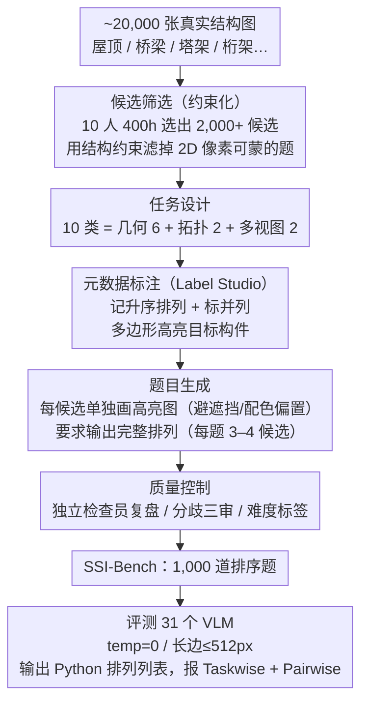

# Thinking in Structures: Evaluating Spatial Intelligence in Constraint-Governed Spaces

**会议**: ICML 2026  
**arXiv**: [2602.07864](https://arxiv.org/abs/2602.07864)  
**代码**: https://ssi-bench.github.io  
**领域**: 多模态VLM  
**关键词**: 空间智能, 结构化推理, 排序问答, VLM 基准, 三维约束

## 一句话总结
作者构造了 SSI-Bench，一个由 1,000 道排序型 VQA 组成、聚焦"受约束的结构化空间"（屋顶、桥梁、塔架等真实 3D 结构）的基准，要求 VLM 对 3-4 个候选构件按几何或拓扑准则给出完整排列；评测 31 个 VLM 后发现最强闭源模型 Gemini-3-Flash 仅 33.6%、最佳开源 GLM-4.6V 22.2%，而人类 91.6%，揭示当前 VLM 在受几何/连接/物理可行性共同约束的真实 3D 场景下缺乏一致的空间推理能力。

## 研究背景与动机

**领域现状**：空间智能基准沿多条轴扩张——单视图 vs 多视图（SpatialRGPT、ViewSpatial-Bench）、图像 vs 视频（VSI-Bench、STI-Bench）、人工 vs 自动标注（MMSI-Bench、Spatial457）等。这些工作都把空间推理建模为"场景中心"，即基于无约束的室内/室外日常环境去测距测向。

**现有痛点**：场景中心基准存在根本歧义——单张图像下 3D 关系往往欠定（同一物体可能更小也可能更远），多种 3D 配置都能解释同一 2D 观察。结果是模型靠外观先验或数据集偏置就能"猜对"，无法甄别其是否真正恢复 3D 结构。

**核心矛盾**：现实世界中真正可靠的空间推理常发生在 *结构受约束* 的场景（桥梁、屋顶、塔架），那里几何规律、连通性约束、物理可行性把候选 3D 状态严格收窄；但既有基准要么走完全无约束的日常场景，要么走极简合成形状（CLEVR、Spatial457），都没能保留"真实视觉复杂度 + 强结构约束"这一组合。

**本文目标**：（i）形式化定义结构中心空间推理 SCSR（Structure-Centric Spatial Reasoning）；（ii）构造一个保留真实 3D 复杂度、又能让候选关系唯一可判的 VQA 基准；（iii）以排序题为评测载体，逼迫模型解析所有候选间的相对 3D 关系；（iv）系统评测 31 个 VLM 并诊断典型失败模式。

**切入角度**：把场景表示成节点-构件图 $\mathbf{s}=(V,E,\mathbf{G},\mathbf{A})$，几何自由度 $\mathbf{G}$ 与离散属性 $\mathbf{A}$ 受 *显式等式约束* $\mathbf{c}(\mathbf{s})=\mathbf{0}$ 与 *不等式约束* $\mathbf{h}(\mathbf{s})\leq\mathbf{0}$ 限制；这些约束不直接喂给模型，而是用来 *构造* 使候选排序唯一可判的样本。这样既保留视觉真实复杂度，又能严格定义 ground truth。

**核心 idea**：把空间智能评测从"测距测向"提升为"排序所有候选 3D 关系"，并通过结构约束让排序唯一可判，从而把模型的空间推理能力与 2D 像素 shortcut 解耦。

## 方法详解

### 整体框架
SSI-Bench 的构造与评测形成一条以人工为主的流水线：（1）候选筛选——从 Unsplash/Pexels/Pixabay 等无版权图库与作者自拍中扫过 ~20,000 张结构图，10 名研究员 400+ 小时筛出 2,000+ 候选，覆盖空间桁架、钢塔、斜拉桥、木桁架、配筋框架、管线系统等常见结构，并刻意滤掉那些靠 2D 像素就能蒙对的题；（2）任务设计——10 个类别分为几何族与拓扑族，外加多视图子集；（3）元数据标注——用 Label Studio 记录升序排列、标注并列项，并标多边形高亮目标构件；（4）题目生成——为每个候选单独画一张高亮图以避免遮挡和颜色偏置，再实例化成全排序问答；（5）质量控制——独立检查员复盘，分歧三审，并给每题打难度标签；最后在统一协议下零样本评测 31 个 VLM。这条流水线背后由三个核心设计支撑：约束化的候选筛选让 ground truth 唯一可判、10 类任务体系铺开能力诊断、排序型问答协议逼模型解析全部候选关系——下文逐一展开。

### 关键设计

**1. SCSR 形式化 + 三类结构约束：用约束让 ground truth 唯一可判**

场景中心基准的死穴是歧义——单张图里"物体更小"和"物体更远"可以解释同一观察，多种 3D 配置都说得通，于是模型靠外观先验就能蒙对，根本测不出它有没有真的重建 3D。SSI-Bench 把每张图建模成结构状态 $\mathbf{s}=(V,E,\mathbf{G},\mathbf{A})$，可行集 $\mathcal{M}=\{\mathbf{s}:\mathbf{c}(\mathbf{s})=\mathbf{0},\,\mathbf{h}(\mathbf{s})\leq\mathbf{0}\}$ 受三类约束限定：几何规律（构件长度/方向的对称等等式约束）、拓扑连通性（图 $\mathcal{G}=(V,E)$ 决定哪些节点共线/共面）、物理可行性（不相交、支撑条件等不等式）。

关键的巧思是这些约束**不喂给模型**，而是在构造样本时用来筛掉那些候选排序模糊的题、只留下排序唯一确定的题。模型推理时只看图像，但 ground truth 因约束而唯一，这就把"必须真正恢复 3D 结构"逼成了答对的唯一途径，从根上堵死了 2D 外观 shortcut。

**2. 排序型 VQA 评测协议：用全排序逼模型解析所有候选关系**

要测"全关系理解"而非"猜中一两个"，本文用 $K \in \{3,4\}$ 个候选的全排序题取代二选一/多选一。每题给候选集 $\mathcal{C}=\{c_i\}_{i=1}^K$ 和准则函数 $f_\tau(\mathbf{s}, c)$（如质心高度、主方向与地面夹角、节点群凸包体积），ground truth 是 $\pi^\star=\arg\mathrm{sort}_{\pi\in S_K}(f_\tau(\mathbf{s}, c_{\pi(1)}), \dots, f_\tau(\mathbf{s}, c_{\pi(K)}))$，模型必须输出一个可解析的 Python 列表表达完整排列。评测同时报 Taskwise Accuracy（全排序精确匹配）和 Pairwise Accuracy（成对一致性）。

全排序的好处直接体现在难度上：成员级任务（$K=4$）的全排序随机基线仅 $1/4!\approx 4.2\%$、群组级任务（$K=3$）为 $1/3!\approx 16.7\%$，混合后整体随机基线 12.85%，远低于二元题的 50%；且要做对必须解析全部 $\binom{K}{2}$ 对关系，"猜对一两个"的策略被边缘化。

**3. 10 类任务覆盖几何 + 拓扑 + 多视图：在约束空间里铺开能力诊断**

单一任务（比如只测距离）容易被现成 prior 解决，所以基准铺了 10 类任务。几何族 6 类——Ground Height（按质心高度排序）、Ground Angle（按主方向与地面夹角）、Dimension（按主方向长度）、Relative Distance（按主轴最小距离）、Area（按平面凸包面积）、Volume（按 3D 凸包体积）；拓扑族 2 类——Hop Distance（按连通图最短路径跳数）、Cycle Length（按最小环长）；外加两个 Multi-View 子集，各配两张图（一张高亮参考构件 Member 0、一张高亮目标），强制跨视图对应。

这套组合迫使模型在同一基准内同时调动心理旋转、截面推理、遮挡推理、力路径推理等多种能力，从而能细粒度地诊断出它到底在哪一环上短板——例如多视图任务上的低分就直接指向跨视图对应能力的缺失。

### 损失函数 / 训练策略
基准仅做评测，不训练任何模型。所有 31 个 VLM 都在 temperature=0、图像最长边压到 512 像素的统一协议下零样本推理，使用任务专属 prompt 模板。

## 实验关键数据

### 主实验
表 2 摘录 SSI-Bench 上代表性模型的 Taskwise Accuracy（按几何均值、拓扑均值与总均值），完整 10 任务结果见原文。

| 模型 | 几何均值 | 拓扑均值 | 总均值 | vs Random (12.85%) |
|------|----------|----------|--------|--------------------|
| Human (Average) | ~91 | ~89 | **91.60** | +78.75 |
| Gemini-3-Flash (proprietary) | ~33 | ~32 | **33.60** | +20.75 |
| GPT-5.2 | ~30 | ~26 | 29.10 | +16.25 |
| Gemini-3-Pro | ~29 | ~29 | 29.50 | +16.65 |
| Seed-1.8 | ~25 | ~29 | 25.90 | +13.05 |
| GLM-4.6V (best open-source) | ~22 | ~23 | 22.20 | +9.35 |
| Qwen3-VL-235B-A22B | ~21 | ~24 | 21.90 | +9.05 |
| InternVL3.5-2B (worst large) | ~12 | ~7 | 11.10 | −1.75 |
| Random Guessing | 12.85 | 12.85 | 12.85 | 0 |

### Thinking 影响分析
作者对 Gemini-3-Pro（high vs low thinking）与 Qwen3-VL-30B-A3B（Thinking vs Instruct）做了对照。

| 设置 | 不带 thinking | 带 thinking | 提升 |
|------|--------------|-------------|------|
| Gemini-3-Pro (low → high) | 27.1% | 29.5% | +2.4 |
| Qwen3-VL-30B-A3B (Instruct → Thinking) | 20.6% | 22.5% | +1.9 |

### 关键发现
- VLM 与人类差距巨大：最强闭源模型 Gemini-3-Flash 才 33.60%，最佳开源 GLM-4.6V 22.20%，距人类 91.60% 有 60+ 个点的鸿沟；许多开源模型甚至贴近 12.85% 的随机基线，说明 SCSR 不能靠 2D 浅层启发式蒙混。
- 闭源 vs 开源裂痕显著：所有开源模型上限在 22% 附近，与 Gemini-3 系列拉开 10+ 点；同时 GLM 系列内部 4.5V→4.6V 仅 +0.8 点，说明 *仅靠 scale up 不足以解决*。
- Thinking 增益有限且非单调：思考令牌使用量 vs 准确率不是单调上升，在中等使用量处达峰，使用越多反而下降；token usage 与有效推理的关联很弱，多余 token 常对应"在错误的 3D 假设上反复纠缠"。
- 多视图与 Volume 任务上 thinking 甚至负向：对依赖全局一致 3D 重建的任务，更长推理反而放大错误。

### 错误分析（基于 Gemini-3-Pro 100 题人工诊断）
作者总结了四类典型失败模式：构件范围错误（在遮挡下把可见片段当成整根）、对象识别错误（混淆楼梯踏板与斜支撑、把斜杆当水平）、计算与比较逻辑错误（在体积题上优化投影面积、用直角高度代替斜高）、视图融合错误（多视图下找不到 Member 0 的对应）。

## 亮点与洞察
- 把"结构约束"作为构造样本的隐含先验、而不是显式输入，巧妙地把基准本身变成 3D grounding 的探针——模型只能从图像反推 3D，而 ground truth 的唯一性由作者保证，这一思路可以直接搬到机器人抓取、医学解剖结构推理等领域。
- 排序题作为评测载体是个被低估的好选择：随机基线低、避免单题猜中、强制全关系解析，比常见的二选一/多选一更适合衡量"真懂"。
- "Thinking 提升仅小幅、token usage 与准确率非单调"的发现非常重要——它暗示当前推理增强 VLM 的瓶颈不在推理长度而在 3D 表示，简单加 chain-of-thought 解决不了 SCSR。
- 错误分类（范围/识别/计算/视图）可以直接拿来设计针对性改进：例如范围错误可用部件分割辅助、视图融合可用几何对应学习。
- 评测 31 个模型 + 人类基线 + Random 基线的对照非常充分，论文的"诊断价值"远大于"刷榜价值"。

## 局限与展望
- 1,000 道题目规模相对较小，几何族占比偏高、拓扑族（Hop Distance、Cycle Length）样本只有几百题，对小族内的细分趋势统计力弱。
- 现成图像主要来自 Unsplash/Pexels/Pixabay，结构类型仍以"美图友好"的桥梁、塔架、屋顶为主，工业级 CAD/BIM 场景（管道走向、力流路径）尚未覆盖。
- 多视图子集中部分图像由作者自拍补齐，存在视角配对偏置；扩展到 6 视图甚至 NeRF/3DGS 渲染图能更全面诊断 3D 一致性。
- 评测全部零样本，没有探索"给模型一张额外的草图或点云作为辅助"是否能跨越 33% 门槛；这是一个明确的后续方向。
- 错误分析仅以 Gemini-3-Pro 为代表，结论是否普适到其他模型族还需进一步验证。

## 相关工作与启发
- 与 VSI-Bench、SpatialRGPT、SpatialVLM 等 *场景中心* 空间基准互补：那一脉评测无约束日常环境的距离/方向，SSI-Bench 评测约束场景下排序，两者交叉诊断 VLM 的空间能力谱。
- 与 MMSI-Bench、ViewSpatial-Bench、MindCube 等多视图基准联动：本工作的 Multi-View 子集已直接对标这一方向，并报告与单视图任务的差异。
- 与 PartNet、3DCoMPaT++、ABC、GeoQA 等结构理解基准相比：那些工作显式给出 part label 或几何输出，而 SSI-Bench 隐式探针——只要求回答空间关系题，让模型自己重建结构，更接近真实推理场景。
- 对未来 VLM 训练的启发：构件级分割监督、跨视图对应学习、显式 3D 中间表示（如 NeRF/3DGS 蒸馏）可能比简单加 chain-of-thought 更能突破 SCSR 瓶颈；同时，*受约束的样本构造* 方法可以推广到医学影像（解剖学约束）、自动驾驶（道路几何约束）等高确定性领域作为下一代基准范式。

## 评分
- 新颖性: 待评
- 实验充分度: 待评
- 写作质量: 待评
- 价值: 待评

<!-- RELATED:START -->

## 相关论文

- [\[CVPR 2026\] SpatialScore: Towards Comprehensive Evaluation for Spatial Intelligence](../../CVPR2026/multimodal_vlm/spatialscore_towards_comprehensive_evaluation_for_spatial_intelligence.md)
- [\[ICLR 2026\] On the Generalization Capacities of MLLMs for Spatial Intelligence](../../ICLR2026/multimodal_vlm/on_the_generalization_capacities_of_mllms_for_spatial_intelligence.md)
- [\[CVPR 2026\] Scaling Spatial Intelligence with Multimodal Foundation Models](../../CVPR2026/multimodal_vlm/scaling_spatial_intelligence_with_multimodal_foundation_models.md)
- [\[CVPR 2026\] SpatialTree: How Spatial Intelligence Branches Out in MLLMs](../../CVPR2026/multimodal_vlm/spatialtree_how_spatial_intelligence_branches_out_in_mllms.md)
- [\[ICML 2026\] ReVSI: Rebuilding Visual Spatial Intelligence Evaluation for Accurate Assessment of VLM 3D Reasoning](revsi_rebuilding_visual_spatial_intelligence_evaluation_for_accurate_assessment_.md)

<!-- RELATED:END -->
