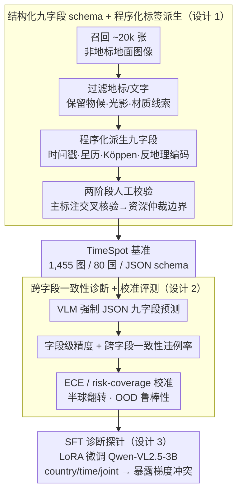

# TimeSpot: Benchmarking Geo-Temporal Understanding in Vision-Language Models in Real-World Settings

**会议**: ICML 2026  
**arXiv**: [2603.06687](https://arxiv.org/abs/2603.06687)  
**代码**: https://TimeSpot-GT.github.io  
**领域**: 多模态VLM  
**关键词**: 地理-时间推理, VLM 基准, 物理一致性, 校准, 监督微调

## 一句话总结
作者构建了一个覆盖 80 个国家、1,455 张真实地面图像的 TimeSpot 基准，强制 VLM 同时给出"何时（季节/月份/分钟级本地时间/日相）"与"何地（洲/国/气候带/环境类型/经纬度）"九字段结构化预测，结果显示即便最强模型 Gemini-2.5-Flash-Thinking 也只达到 77.59% 国家准确率、892.54 km 中位地理距离误差，分钟级时间准确率不到 34%，说明 VLM 严重缺乏基于物理线索的地理-时间联合推理能力。

## 研究背景与动机

**领域现状**：近年 VLM 在图像地理定位上取得显著进展，主流路线包括跨视角检索（VIGOR、OpenStreetView-5M）、统一嵌入（GeoCLIP）、以及链式推理增强的 LLMGeo / IMAGEO-Bench 等。这些工作都把任务建模为"图像 → 坐标"的空间检索。

**现有痛点**：现有基准几乎只评测"何地"，要么报告 retrieval rank，要么报告坐标误差；"何时"几乎被忽略，模型不需要预测季节、月份、本地时间或日相，也不必满足"北半球 7 月不下雪"这类跨字段一致性约束。结果是高空间精度可以与严重不合物理的输出并存。

**核心矛盾**：真实世界部署（灾害响应、交通规划、具身导航、世界模型）要求模型同时给出 *可验证* 的时空预测，并保证内部一致性；但当前 VLM 在训练目标和评估协议上都没有显式的时间物理监督，于是模型只能依赖图像表层语义（地标、文字）做粗粒度记忆，无法回归到太阳几何、植被物候等长尾物理线索。

**本文目标**：（i）构造一个强制 VLM 联合预测时空九字段、可机器审计一致性的非地标向基准；（ii）系统评测当前开源/闭源/推理增强 VLM 的极限；（iii）通过 SFT 检验显式监督是否能弥补这一短板。

**切入角度**：以"非地标地面照片 + 程序化派生标签 + 人工二次校验"为数据骨架。程序化标签从拍摄时间戳和地理坐标推太阳高度角、Köppen 气候、月份和季节，自然保证物理一致性；人工只在边界情况充当审计员。如此既能 scale，又能让 ground truth 自带可验证语义。

**核心 idea**：把"何时何地"重新定义为一个 *受约束的结构化预测* 问题，并把跨字段一致性当作一等公民评测指标，由此暴露 VLM 在物理 grounding 上的系统性失败。

## 方法详解

### 整体框架
TimeSpot 把每张图像 $x$ 映射到结构化标签 $y=(y^{\mathrm{temp}}, y^{\mathrm{geo}})$，其中 $y^{\mathrm{temp}}=(s, m, \tau, \phi)$ 表示季节、月份、本地时间 HH:MM、日相，$y^{\mathrm{geo}}=(C, \kappa, z, e, (\lambda,\varphi))$ 表示洲、国、气候带、环境类型、经纬度。数据集构建分四步：（1）从 web 与作者自拍中召回 ~20,000 张候选地面图像；（2）过滤掉地标和文字主导的样本，保留物候/光影/材质这种细粒度物理线索；（3）从 EXIF + 地理坐标 *程序化* 派生九字段；（4）3 名主标注员 + 2 名资深审核员两阶段人工校验（主标注交叉核验、资深仲裁边界情形），共 ~600 小时。最终产出 1,455 张图覆盖 80 国，按统一 JSON schema 存储。评测阶段强制 VLM 输出九字段 JSON，除字段级精度外还做月-季-半球对齐、日相-时间-经度兼容、气候-坐标合理性等跨字段一致性审计，并辅以 ECE/risk-coverage 校准与半球翻转/OOD 鲁棒性测试。最后作者把 LoRA SFT 当作诊断探针，在 Qwen-VL2.5-3B 上分别做 country/time/joint 微调，借此回答"显式监督能否补齐物理 grounding"。

### 关键设计

**1. 结构化九字段 schema + 程序化标签派生：让 ground truth 来自物理公式而非众包猜测**

检索式基准的硬伤是 ground truth 本身没有跨字段语义——模型只要 hit top-k 就算赢，"7 月雪景"这种物理矛盾根本无从察觉。TimeSpot 把"何时何地"拆成 9 个既可独立打分、又必须互相一致的字段，并让 GT 全部由确定性物理派生得到：月份直接取 EXIF 时间戳；季节用气象定义 + 半球修正（北半球 6-8 月为夏、南半球反过来）；日相通过计算太阳高度角 $\theta_\odot$ 与 civil/nautical/astronomical 阈值比较（如 $\theta_\odot < -6^\circ$ 即 civil twilight）；本地时间从时区 + 星历推得；气候带按 Köppen-Geiger 由 $(\lambda, \varphi)$ 查表；洲/国/坐标直接从经纬度反向地理编码。

所有派生都是确定性的，人工审核员只对照图像光影与植被反向校验、剔除元数据被破坏的样本。这样 GT 自带可验证语义，"违反物理"的输出可以被自动 flag，从而倒逼模型做物理一致的联合推理、而非靠地标记忆蒙混。

**2. 跨字段一致性诊断 + 校准指标：把"看似准确但物理矛盾"的失败单独揪出来**

字段级精度高，不代表输出自洽。TimeSpot 在精度之外单设一组一致性违例率：月-季不一致率（在预测国对应半球下，预测月份不属于预测季节的比例）、日相-时间错位率（$|\Delta t| > 1\text{h}$）、洲-国不一致率等；再用 Expected Calibration Error $\mathrm{ECE}=\sum_b \frac{|B_b|}{N}|\mathrm{acc}(B_b)-\mathrm{conf}(B_b)|$ 和 risk-coverage 曲线衡量置信度可靠性，并用半球翻转测试与硬 OOD 切分查鲁棒性。

这套诊断的价值在实验里很直白：QwenVL-3B 的 phase-time 违例只有 0.21%，看起来很一致，但它 MD>1000 km 的错误率高达 95.19%——单一维度"准确"完全掩盖了全局崩溃，只有把一致性当一等公民评测，才能区分"真懂物理"和"靠先验拼凑"。

**3. SFT 干预实验作为诊断工具：回答"显式监督能否补齐物理 grounding"**

最后一块不是为刷榜，而是把 SFT 当探针。作者用 LoRA 在 Qwen-VL2.5-3B 上分别做 country-only、time-only、joint 三种微调（40% 分层切分训练、60% 评测），观察每个任务自身的提升和对其他任务的拖累，并把训练目标解释成"光照不变特征"（利于国别）与"光照敏感特征"（利于时间）之间的梯度竞争。

结果讲清了"为什么 SFT 不够"：country-SFT 把 country 从 14.20% 推到 19.24%，却把 time 从 22.06% 拖到 21.78%；joint SFT 能部分缓解但仍低于单任务峰值。这暴露了共享 LoRA 参数下的梯度冲突，从而为后续 constraint-aware RL 或物理先验注入提供了明确动机。

### 损失函数 / 训练策略
基准本身只评测，不训练。SFT 诊断部分使用标准的指令微调交叉熵损失，配合 LoRA 适配器在 Qwen-VL2.5-3B-Instruct 上跑 5 个 epoch；评测时所有模型 temperature=0，输出强制成 JSON，再走规范化解析（标签规范化、经纬度符号化）。

## 实验关键数据

### 主实验
评测 31 个 VLM（含闭源、开源 ≤11B、开源 >11B、推理增强），并对比本科生与领域专家两组人类基线。表 1 摘录代表性模型的关键指标。

| 模型 | 国家 Acc↑ | MD (km)↓ | 季节 Acc↑ | 时间 ±1h Acc↑ | 时间 MAE↓ |
|------|----------|----------|----------|---------------|-----------|
| Gemini-2.5-Flash-Thinking | **77.59** | **892.54** | 51.13 | 22.19 | 4:03 |
| Gemini-2.5-Flash | 77.25 | 917.61 | 50.92 | 25.15 | 3:56 |
| GPT-5-mini | 68.27 | 1389.79 | 58.43 | 21.55 | 4:10 |
| GLM-4.5V-106B-MoE | 69.68 | 1280.87 | 57.55 | 30.51 | 4:09 |
| Qwen-VL2.5-7B | 73.96 | 4719.95 | 61.46 | 25.68 | 3:47 |
| GLM-4.1V-9B-Thinking | 68.34 | 1788.77 | 58.02 | **33.74** | 3:58 |
| o4-mini | 71.82 | 1359.96 | **65.81** | 23.91 | 4:04 |
| Human (Expert) | 67.89 | 1040.42 | 86.56 | 57.89 | **1:36** |
| Human (Undergrad) | 45.98 | 2800.49 | 68.89 | 41.92 | 2:41 |

### 一致性诊断
即使是最强模型也存在大量跨字段矛盾，"低违例 ≠ 高准确"。

| 模型 | Phase-Time 错位 (>1h) ↓ | 月-季不一致 ↓ | 国-MD>200 km 矛盾 ↓ | MD>1000 km 比例 ↓ |
|------|------------------------|---------------|--------------------|--------------------|
| GPT-5-mini | 15.95% | 0.89% | 16.98% | 17.25% |
| InternVL3-78B | 11.82% | 0.62% | 27.42% | 37.73% |
| QwenVL-3B | 0.21% | 0.82% | 12.78% | **95.19%** |

### 关键发现
- 最强 VLM 国家准确率超过本科生人类，但分钟级时间预测仍比专家差 ~2.5 小时，说明 VLM 能记 *地理 stereotype*，却没有连续 4D 物理世界模型。
- 推理增强（thinking）一致带来小幅提升（Gemini-2.5-Flash → Flash-Thinking 国家+0.34%、MD−25 km），印证多步显式推理能更好整合低显著性光影线索。
- 秋季季节判断在所有模型上"集体崩盘"，反映 VLM 主要靠绿/雪等强色彩线索做季节判定，缺乏对物候渐变的细致 grounding。
- 模型在 GPT-5-mini 上从 sun/shadow 线索能拿到 60.5% 季节准确率，但时间 ±1h 仍然 <25%，表明模型把光照当 *语义相关物* 而非 *物理推断输入*。

## 亮点与洞察
- 把地理定位重新框架为"九字段结构化预测 + 跨字段一致性审计"，单这一招就让原本看似强大的 VLM 暴露出大量"物理矛盾"输出——这种评测思想可以直接迁移到任何需要多变量联合推理的领域（医学影像多标签、自动驾驶场景理解）。
- *程序化派生标签 + 人工审计* 的混合方案既保证 scale 又保证物理正确性，是社区构造未来"可验证基准"的良好范式。
- 用 SFT 作为诊断而非刷榜的做法很优雅：它清晰展示了 single-task LoRA 下的梯度冲突，从而为后续"光照敏感 / 光照不变特征解耦"或 constraint-aware RL 提供动机。
- 一致性指标和精度指标可以正交分离，QwenVL-3B 的 phase-time 一致性反而最好但 MD>1000 km 比例 95% 的对比，提醒研究者不要被单维度刷分误导。

## 局限与展望
- 数据规模 1,455 张相对较小，作者承认低频区域统计稳定性依赖分层抽样；扩展到 ≥10k 张同时保持人工审计成本是挑战。
- 评测全靠 OpenRouter API（~$1,450 USD、4–5 亿 tokens），对闭源模型版本漂移和价格波动敏感，复现性受外部条件牵制。
- SFT 实验仅在 Qwen-VL2.5-3B 单一架构上做，是否对更大/更新结构（如 GLM-4.6V、Qwen3-VL-235B）依然存在同样的梯度冲突未验证；亟需在 RL 与约束注入两条路线上做对照。
- 数据集源于 web 和作者自拍，存在欧洲/北美过度采样、岛国上限效应等长尾问题，对 Southern Hemisphere Summer (56 张) 的统计估计偏脆弱。

## 相关工作与启发
- 与跨视角定位（VIGOR、OpenStreetView-5M、GeoCLIP）正交：那条线优化"何地"的检索精度，本工作假设强空间先验后专注"何时 + 跨字段一致"。
- 与 LLMGeo / IMAGEO-Bench / ETHAN / FAIRLOCATOR 等 LLM-geolocation 基准互补：它们引入了 chain-of-thought 与公平性维度，但都缺时间字段；TimeSpot 的 schema 设计可以直接被这些工作复用扩展。
- 与遥感 VQA（EarthVQA、GEOBench-VLM、HRVQA）拉开距离：那些工作以航拍/卫星为主、强调分类与分割；TimeSpot 强调地面 ground-level 的物理 grounding。
- 对世界模型与具身智能研究的启示：温度、光照、物候这些"软约束"是任何 4D 世界模型的必要先验，建议在 VLM pretraining 中显式加入太阳几何 / Köppen 气候等物理 head 作为多任务损失，而非完全依赖图文对齐。

## 评分
- 新颖性: 待评
- 实验充分度: 待评
- 写作质量: 待评
- 价值: 待评

<!-- RELATED:START -->

## 相关论文

- [\[ICLR 2026\] GTR-Bench: Evaluating Geo-Temporal Reasoning in Vision-Language Models](../../ICLR2026/multimodal_vlm/gtr-bench_evaluating_geo-temporal_reasoning_in_vision-language_mod.md)
- [\[ICLR 2026\] Can Vision-Language Models Answer Face to Face Questions in the Real-World?](../../ICLR2026/multimodal_vlm/can_vision-language_models_answer_face_to_face_questions_in_the_real-world.md)
- [\[ICML 2026\] Benchmarking and Enhancing VLM for Compressed Image Understanding](benchmarking_and_enhancing_vlm_for_compressed_image_understanding.md)
- [\[ICML 2026\] Immuno-VLM: Immunizing Large Vision-Language Models via Generative Semantic Antibodies for Open-World Trustworthiness](immuno-vlm_immunizing_large_vision-language_models_via_generative_semantic_antib.md)
- [\[CVPR 2026\] World in a Frame: Understanding Culture Mixing as a New Challenge for Vision-Language Models](../../CVPR2026/multimodal_vlm/world_in_a_frame_understanding_culture_mixing_as_a_new_challenge_for_vision-lang.md)

<!-- RELATED:END -->
