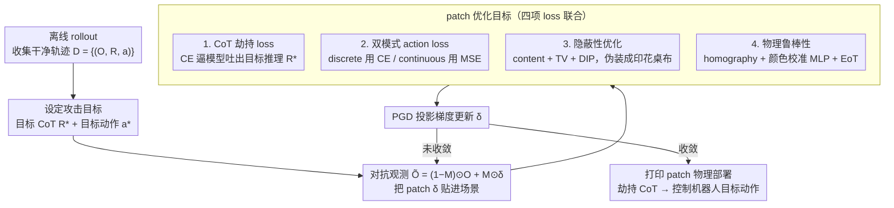

# TRAP: 用对抗 patch 劫持 VLA 的 CoT 推理实现目标行为攻击

**会议**: ICML 2026  
**arXiv**: [2603.23117](https://arxiv.org/abs/2603.23117)  
**代码**: TRAP-website（项目页）  
**领域**: VLA 安全 / 对抗攻击 / 具身 AI  
**关键词**: VLA, Chain-of-Thought, 对抗 patch, 目标行为劫持, 物理攻击

## 一句话总结
TRAP 是第一个针对 reasoning VLA 的目标行为劫持攻击——通过桌布大小的物理对抗 patch 劫持 VLA 的 CoT 推理（边界框/轨迹/子任务），让机器人在用户指令保持「拿苹果」时改为「拿刀给人」；在 MolmoAct/GraspVLA/InstructVLA 三种 CoT 范式上平均 ASR 52.54%，真实世界打印 patch 在 GraspVLA 上 occlusion-free 部署 86.7% 干扰成功率、33.3% 完全控制率。

## 研究背景与动机

**领域现状**：Vision-Language-Action（VLA）模型通过端到端训练让机器人能在开放世界做操作任务（OpenVLA、$\pi_0$、GraspVLA），近期加入 Chain-of-Thought（CoT）推理后产生「reasoning VLA」——先生成子任务分解、目标边界框或预测轨迹这种中间推理，再生成动作。CoT 不仅提升泛化，还被认为能提升可解释性和安全性。

**现有痛点**：(1) 现有 VLA 对抗攻击主要是 untargeted 的——扰乱感知（UPA-RFAS）或动作生成（RoboticAttack）让任务失败，但不能精确控制；(2) 这些攻击都针对 vanilla VLA，没研究 CoT 引入后的新攻击面；(3) CoT 让模型把「任务意图」显式吐出来（如「我要先抓苹果，然后递给人」），这同时给攻击者提供了精准切入点。

**核心矛盾**：CoT 被宣传为「提升 VLA 安全性和可解释性」，但作者的 preliminary experiment（Table 1）显示，当 instruction 和 CoT 冲突时，GraspVLA 几乎完全跟随 CoT（TSR=94.2% vs 0%）；其他模型上 CoT 也至少跟 instruction 有相当的影响力。也就是说，CoT 不是 safety net 而是新的攻击表面——攻击者只要劫持中间 CoT 就能控制最终动作，而不需要碰 user instruction。

**本文目标**：证明 CoT 推理可以被对抗 patch（一个可物理打印的桌布、不修改 instruction）劫持，让 VLA 执行 attacker-specified 的目标行为；并在三种代表性 reasoning VLA paradigm（discrete-token integrated、continuous-regression integrated、hierarchical）上验证攻击的普适性。

**切入角度**：先做 preliminary experiment 量化「CoT 在 action generation 中的因果作用」——分别做 instruction masking 和 cross-sample shuffling，确认 CoT 是强因果信号；然后基于这个观察设计「CoT hijacking loss + action loss + 隐蔽性 loss」联合优化的 patch attack。

**核心 idea**：把对抗目标从「让 action 直接出错」改成「让 CoT 输出 attacker-defined 内容」——CoT hijacking loss 是 cross-entropy 对目标 CoT token 序列 $R^*$，action loss 根据 VLA 是 discrete/continuous 分别用 CE/MSE 兜底，再加 content loss + TV loss + DIP 优化保证物理可打印 + 视觉隐蔽。

## 方法详解

### 整体框架

威胁模型：白盒（已知 VLA 架构/参数/梯度），攻击者可以在场景里放一个对抗 patch（如桌布、墙贴），用户 instruction 始终是良性的（attacker 不能改）。攻击有效要求 patch 在整个 rollout（多步推理）中持续有效。

攻击 pipeline：(1) 离线收集 clean trajectory $\mathcal{D} = \{(O, R, a)\}$；(2) 优化 patch $\delta$ 满足 $\min_{\delta} \mathbb{E}_{\tau \sim \mathcal{D}}[\mathcal{L}_{\mathrm{cot}} + \lambda_1 \mathcal{L}_{\mathrm{action}} + \lambda_2 \mathcal{L}_{\mathrm{content}} + \lambda_3 \mathcal{L}_{\mathrm{tv}}]$，其中前两项（CoT 劫持 + action）保证攻击有效、后两项（content + TV，外加 DIP 重参数化）保证隐蔽；(3) 用 PGD 投影梯度迭代更新 $\delta_{t+1} = \mathrm{Proj}(\delta_t + \eta \nabla L)$；(4) 物理部署阶段再加 homography 几何变换 + 颜色校准 MLP + EoT 数据增强，跨越「数字 patch → 打印桌布」的现实鸿沟。

### 关键设计

**1. CoT hijacking loss 作为主信号：直接让中间推理吐出攻击者指定的内容**

preliminary experiment（Table 1）显示，当 instruction 和 CoT 冲突时 GraspVLA 几乎完全跟 CoT 走（cross-sample shuffling 后 TSR=94.2%），所以最划算的切入点不是 action 而是 CoT——劫持了中间推理就等于劫持了整条推理-动作管道，而且不用碰 user instruction。所有主流 reasoning VLA 都用 VLM 走 next-token prediction 出 CoT（不管 CoT 是 subtask 文本、bbox 坐标 token 还是轨迹点 token），所以 CoT loss 统一用交叉熵让模型在对抗观测下生成目标序列 $R^*$：$\mathcal{L}_{\mathrm{cot}} = -\sum_{t=1}^T \log P_\theta(r_t^* | r_{<t}^*, \tilde{O}, I)$，其中对抗观测 $\tilde{O} = (1-M) \odot O + M \odot \delta$。相比直接攻 action（如 RoboticAttack），CoT 是个有清晰离散监督的语言序列，梯度更稳、目标更精确，而且作为 mid-level 抽象能在整个 rollout 的多个 action 时间步上保持一致——光这一项 $\mathrm{TRAP}_{\mathrm{CoT\text{-}only}}$ 就能在 GraspVLA 上拿 69.04% ASR。

**2. discrete/continuous 双模式 action loss：兜底覆盖两类 action head**

CoT-to-action 的 coupling 在不同 VLA 上强弱不一——GraspVLA 强（CoT 直接 condition action），InstructVLA 弱（hierarchical 两段式、高层 CoT 与低层 policy 解耦），所以仅靠 CoT loss 不够，需要 action loss 把劫持可靠落到 action 层。针对两类 head 分别处理：MolmoAct 这类 discrete-token action（动作量化成 bin 当 token 出）用 $\mathcal{L}_{\mathrm{action}}^{\mathrm{disc}} = -\log P_\theta(a^* | R^*, \tilde{O}, I)$；GraspVLA/InstructVLA 这类 continuous regression（diffusion、flow matching、MLP head）用轨迹 waypoint 上的 MSE $\mathcal{L}_{\mathrm{action}}^{\mathrm{cont}} = \|f_{\mathrm{traj}}(a) - f_{\mathrm{traj}}(a^*)\|_2^2$。必要性看 InstructVLA：CoT-only 攻击只有 4.03% ASR（action 出现 mode collapse 重复动作），加 action loss 后涨到 33.71%。

**3. 隐蔽性优化：content loss + TV loss + DIP 把噪声 patch 伪装成印花桌布**

纯 PGD 优化出来的 patch 全是高频噪声，人一眼就能看出异常，根本没法在真实场景部署。隐蔽性靠三件套联手：content loss $\mathcal{L}_{\mathrm{content}} = \frac{1}{C_l H_l W_l} \|\phi_l(\delta) - \phi_l(I_{\mathrm{ref}})\|_2^2$ 用预训练 CNN 第 $l$ 层特征把 patch 拉向一张参考图（如跑车），让它带上自然图案的内容与结构；TV loss 惩罚相邻像素差、抑制高频伪影并保证颜色连续（也利于物理打印）；DIP（Deep Image Prior）不直接在像素空间优化 $\delta$，而是优化一个 CNN $f_\theta$ 的参数、令 $\delta = f_\theta(z)$，借 CNN 结构的隐式正则让 patch 更平滑、噪点更少。三者叠加后 patch 看起来就是一块普通印花桌布，即使被人看见也不易起疑——物理实验里 DIP 版本相比纯 PGD 版本攻击效果几乎不掉（34% vs 38%），说明隐蔽和有效可以兼得。

**4. 物理鲁棒性：homography + 颜色校准 MLP + EoT 跨越「数字 patch → 打印桌布」的现实鸿沟**

数字空间优化出的 patch 直接贴到图像平面是不够的——真实部署里它是平铺在桌面、被相机斜着拍进画面的，还要经历打印-拍摄的色彩失真。论文用三件套补上这个 sim-to-real gap：homography 用一个 $3\times3$ 单应矩阵 $\mathbf{H}$ 把 patch 从桌面平面到图像平面的投影建模进优化，让 patch 在真实视角的几何形变下仍有效；颜色校准用一个 MLP 学习「数字仿真色 → 物理打印色」的映射，优化时就把 patch 颜色分布对齐到物理现实；EoT（Expectation over Transformation）在一组变换分布上对 patch 求期望优化，提升它对视角/光照扰动的鲁棒性。这套让真正打印出来当桌布的 patch 在真实世界 GraspVLA 上仍拿到 86.7% 单步劫持成功率。

### 优化过程

PGD 投影梯度 $\delta_{t+1} = \mathrm{Proj}_{\|\cdot\|_\infty \le \epsilon}(\delta_t + \eta \nabla_\delta L)$，pixel update step $8/255$，batch size 4。Anneal regularization：早期 content+TV 权重大保证隐蔽，后期 decay 让攻击效果占主导。优化单 H800 GPU，simulator 评测用单 RTX 4090，每任务 25 layout 训练 + 10 unseen layout 测试，每任务 175 rollout。

## 实验关键数据

### 主实验：三种 VLA 上的攻击效果

| 方法 | MolmoAct ASR / Score | InstructVLA ASR / Score | GraspVLA ASR / Score | 平均 ASR / Score |
|------|---|---|---|---|
| Random Noise | 0.97 / -0.377 | 3.39 / -0.328 | 0.32 / -0.306 | 1.56 / -0.337 |
| Action Attack (TMA-like) | 9.68 / 0.128 | 6.77 / -0.274 | 0.00 / -0.295 | 5.48 / -0.147 |
| $\mathrm{TRAP}_{\mathrm{CoT\text{-}only}}$ | 49.52 / 0.342 | 4.03 / -0.033 | 69.04 / 0.390 | 40.86 / 0.233 |
| **TRAP** | 48.06 / **0.390** | **33.71** / **0.172** | **75.84** / **0.425** | **52.54** / **0.329** |
| TRAP（unseen layout） | 48.00 / 0.183 | 31.60 / 0.131 | 75.20 / 0.402 | 51.60 / 0.239 |

TRAP 在所有三种 VLA 上都大幅超过 Action Attack（平均 ASR 52.54% vs 5.48%）；CoT-only 在 GraspVLA 上几乎媲美 TRAP（69 vs 75），但在 InstructVLA 上崩盘（4 vs 33）——验证 action loss 在 hierarchical VLA 上必要。Unseen layout 性能几乎不掉（51.60 vs 52.54），证明 patch 学到的是 layout-invariant 特征。

### 指令变体鲁棒性

| Instruction 变体 | MolmoAct ASR | InstructVLA ASR |
|------|------|------|
| Original | 72.0 | 67.4 |
| Paraphrasing（句法变） | 70.6 | 25.1 |
| Extra-Context（加无关描述） | 60.0 | 44.8 |

MolmoAct 在指令变体下基本稳健（trajectory-based CoT 对语言变化不敏感），但 InstructVLA 因为 text-based subtask 分解对语言变化更脆，paraphrasing 后 ASR 暴跌——说明 patch 学的是「对象-名称」绑定而非「指令-模板」触发。

### 真实世界部署（GraspVLA）

| 部署 | 单步推理劫持成功率 | 全过程完全控制率 |
|------|---|---|
| Occlusion-free（patch 平铺桌面） | 13/15 = 86.7% | 5/15 = 33.3% |
| Object-occluded（patch 当桌布、物体压在上面）+ PGD | 19/50 = 38.0% | — |
| Object-occluded + DIP（更隐蔽） | 17/50 = 34.0% | — |

DIP 优化让 patch 视觉上更像普通印花桌布，攻击效果几乎不掉（38% vs 34%）——证明 stealthy 和 effective 能兼得。

### 关键发现

- **CoT 在 reasoning VLA 中是强因果信号**：Cross-sample shuffling 实验显示 GraspVLA 几乎完全跟 CoT 走（cross-sample TSR=94.2%），即使 CoT 跟 instruction 矛盾。这从根本上证明 CoT 不是 safety net 而是 attack surface。
- **patch 学到了「概念-视觉特征」映射**：attention 可视化（Figure 4）显示 patch 让 VLA 的注意力从 benign 目标（orange）转移到 adversarial 目标（coke can），且 transfer 是「概念级」而非「位置级」。
- **TRAP 跨 layout 泛化好**：unseen layout ASR 51.60 vs train 52.54，几乎不掉，说明 patch 捕捉的是 model-level vulnerability 而不是 layout-specific shortcut。
- **从 RT-1-finetuned 转移到 pre-trained MolmoAct**：ASR 从 48% → 18.39%，仍有效但显著下降——说明 fine-tuning 会重构 vulnerability 表面，但 attacker 仍能通过 surrogate model 做黑盒攻击。
- **DIP 让 stealthy 和 effective 能兼得**：物理 patch 看起来像普通印花桌布，攻击效果仅微降——这对真实世界 deployment 的威胁评估有警示意义。

## 亮点与洞察

- **第一个针对 reasoning VLA 的 targeted attack**：之前 VLA 对抗工作只能做 untargeted 性能下降，TRAP 是第一次能精确指定「让机器人拿刀而不是苹果」的目标行为劫持，从威胁等级上是质的提升。
- **CoT 既是泛化工具也是攻击表面**：把社区对 CoT 的普遍乐观（更好可解释、更安全）拉回现实——CoT 让中间意图显式化，反而给了攻击者精确切入点。
- **三种 VLA paradigm 通吃**：MolmoAct（discrete-token integrated）、GraspVLA（continuous regression integrated）、InstructVLA（hierarchical）覆盖了 reasoning VLA 的主要架构，攻击对所有架构都有效说明这是范式级缺陷而非个例。
- **物理可打印 + 隐蔽 + 鲁棒**：实际把 patch 打印在纸上当桌布，在 GraspVLA 上仍 86.7% 干扰成功，是真正能在物理世界部署的攻击。
- **轻量级防御方案**：附录给出三个 CoT 类型对应的 lightweight detector（bbox 用 open-vocabulary detector、trace 用一致性检查、text 用 lightweight encoder），millisecond 级延迟，性能接近 GPT-5 baseline——给社区一个立刻可用的补丁。

## 局限与展望

- **白盒为主**：核心实验需要 VLA 的参数和梯度，黑盒迁移性虽然测了（MolmoAct cross-checkpoint ASR 从 48% → 18%）但远不够强；真实部署里攻击者拿不到目标 VLA 参数。
- **任务局限在 pick-and-place**：reasoning VLA 当前对 long-horizon 任务能力本身就不行，所以攻击也只在短程操作上验证；多步组合任务上的攻击需未来工作。
- **patch 需要场景定制**：每个新任务/新场景要重新优化一个 patch，没有 universal patch。
- **防御能否破解攻击**：作者自己提的 detector 召回率 BCR/ARR 都没到 100%，TRAP 的优化目标如果加入「避开 detector」的对抗信号，攻防博弈可能持续升级。
- **stealthiness 评估偏主观**：DIP 输出虽然视觉上像桌布，但「行人是否能识别为可疑」这种 human evaluation 缺失。
- **真实场景的伦理边界**：物理世界对抗攻击的公开 release 是 dual-use，论文做了 impact statement 但 patch 优化代码的公开会显著降低复现门槛。

## 相关工作与启发

- **vs RoboticAttack / TMA**：他们用 action-guided loss 做 untargeted patch 攻击；TRAP 用 CoT-guided loss 实现 targeted 行为劫持，威胁等级跨了一个数量级。
- **vs UPA-RFAS**：他们攻击视觉编码器表征做 untargeted 干扰；TRAP 攻击 CoT 推理做 targeted 行为，是不同攻击表面的探索。
- **vs LLM jailbreak 类工作**：纯 LLM jailbreak 改 prompt 让 LLM 越界，TRAP 不改 user instruction 而是用物理 patch 通过 CoT 间接控制 action，对应 embodied AI 的攻击范式。
- **vs Adversarial Patch（Athalye et al. 2018）**：经典对抗 patch 主要针对图像分类，TRAP 把它推广到 VLA 的 CoT-action pipeline，需要克服 multi-step trajectory consistency 和 physical realism。
- **启发**：随着 LLM/VLA 越来越多依赖中间推理（CoT、ToT、ReAct），中间推理过程本身就是新的对抗表面，所有「让 model 显式 think」的设计都需要重新做 security audit。下一波 AI safety research 很可能会聚焦「reasoning chain 的攻击/防御」这个层面。

## 评分

- 新颖性: ⭐⭐⭐⭐⭐ 第一个针对 reasoning VLA 的 targeted 行为劫持，发现 CoT 是新攻击表面，理论 + 实证都新。
- 实验充分度: ⭐⭐⭐⭐⭐ 三种 VLA paradigm 全覆盖、simulation + real-world + cross-checkpoint transfer + 完整 ablation + 轻量级 detector 防御对比，攻防都做了。
- 写作质量: ⭐⭐⭐⭐ 威胁模型清晰，loss 设计推理直接，real-world 实验有视频证据；少数公式（如 Score）介绍偏简略。
- 价值: ⭐⭐⭐⭐⭐ 直接揭示了 embodied AI 部署的物理安全风险，对所有 reasoning VLA 部署者都是必读警示，并提供了开箱即用的轻量级防御。

<!-- RELATED:START -->

## 相关论文

- [\[ICML 2026\] VLA-Arena：评估视觉语言动作模型的开源框架](vla-arena_an_open-source_framework_for_benchmarking_vision-language-action_model.md)
- [\[ICML 2026\] VLANeXt：构建强大 VLA 模型的配方](vlanext_recipes_for_building_strong_vla_models.md)
- [\[ICML 2026\] Any3D-VLA: Enhancing VLA Robustness via Diverse Point Clouds](any3d-vla_enhancing_vla_robustness_via_diverse_point_clouds.md)
- [\[CVPR 2026\] TIPSv2: Advancing Vision-Language Pretraining with Enhanced Patch-Text Alignment](../../CVPR2026/multimodal_vlm/tipsv2_patch_text_alignment.md)
- [\[CVPR 2026\] ViRC: Enhancing Visual Interleaved Mathematical CoT with Reason Chunking](../../CVPR2026/multimodal_vlm/virc_enhancing_visual_interleaved_mathematical_cot_with_reason_chunking.md)

<!-- RELATED:END -->
