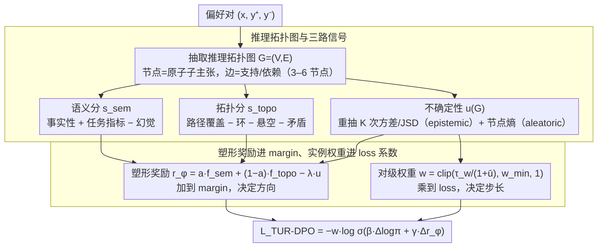

# TUR-DPO: Topology- and Uncertainty-Aware Direct Preference Optimization

**会议**: ICML 2026  
**arXiv**: [2605.00224](https://arxiv.org/abs/2605.00224)  
**代码**: 无  
**领域**: 对齐RLHF / 偏好优化 / 不确定性估计 / LLM推理  
**关键词**: DPO, 推理拓扑图, 不确定性加权, instance-weighted Bradley-Terry, RL-free 对齐

## 一句话总结
TUR-DPO 在 DPO 的偏好 logit 上同时叠加一个"语义+拓扑结构"塑形奖励差和一个"按每对样本不确定性"动态降权的实例权重，让模型在保持 RL-free 训练简洁性的同时，显式奖励推理过程的结构合理性并削弱脆弱偏好对的影响，从而在 GSM8K / MATH / BBH / QA 等推理类任务上系统超过 DPO 与 IPO，并在多数任务上追平 PPO。

## 研究背景与动机

**领域现状**：偏好对齐已经成为大模型贴近人类意图的主流路径。RLHF + PPO 是标准做法，效果强但工程栈复杂（在线 rollout、独立 value head、奖励整形、严格 KL 控制）；DPO 把这一套压缩成一个无需在线采样的封闭式损失，直接最大化"偏好回答相对参考策略的对数胜率"，在多个 benchmark 上追平甚至超过 PPO，因此被广泛采用。

**现有痛点**：DPO 把每一对 (y+, y-) 当成对整段序列的扁平标签——它只奖励 what is said，不奖励 how it is derived，也没有任何机制对噪声标签或"链路脆弱"的偏好对降权。在数学推理、事实问答、多步逻辑这类对推理过程结构敏感的任务上，这两点缺陷直接导致模型容易学到"流畅但结构破碎"的答案；ORPO / SimPO / KTO / IPO 等 RL-free 变体改的是损失形式或参考策略，并未注入推理结构或不确定性。

**核心矛盾**：（a）想要 PPO 那样能塑形奖励、能区分推理质量，又不想付出在线 rollout + value learning 的工程代价；（b）想要 DPO 那样简单稳定，又希望显式区分"扎实推理"与"花言巧语"，并自动抑制噪声偏好对带来的训练不稳定。

**本文目标**：（1）在不引入在线采样、不引入独立 critic 的前提下，给 DPO 注入"推理结构合理性"与"按对不确定性"两类信号；（2）保留 DPO 的封闭式优化结构，使新方法可以直接插入现有 DPO 训练管线；（3）给出理论解释，说明这一改动等价于带实例权重的 Bradley-Terry 估计 + 经塑形奖励的 KL 正则化策略优化。

**切入角度**：把每个候选回答先抽出一张轻量级"推理拓扑图"（节点=原子子主张，边=支持/依赖关系），从图中提取语义分数、拓扑分数、不确定性分数三路标量；把它们组合成一个塑形奖励差和一个每对权重，分别加进 DPO logit 与 loss 系数。

**核心 idea**：把"推理拓扑 + 不确定性"作为 DPO 偏好 margin 上的两个加法项与一个乘法项（$w \cdot \log\sigma(\beta \Delta\log\pi + \gamma \Delta r_\phi)$），从而在 RL-free 框架内既奖励 how 又抑制噪声。

## 方法详解

### 整体框架
训练循环与 DPO 完全一致：维持策略 $\pi_\theta$ 与参考策略 $\pi_{\text{ref}}$（固定或按 EMA 缓更新），训练数据为成对偏好 $\mathcal{D}=\{(x_i,y_i^+,y_i^-)\}$。对每个 $(x,y)$，TUR-DPO 额外做四步：（a）从回答抽取小型有向图 $G=(V,E)$，节点 3-6 个；（b）计算语义分 $s_{\text{sem}}(x,y)$、拓扑分 $s_{\text{topo}}(G)$、不确定性分 $u(G)$；（c）把它们线性组合成塑形奖励 $r_\phi(x,y,G)=a f^{\text{sem}}_\phi(s_{\text{sem}}) + (1-a)f^{\text{topo}}_\phi(s_{\text{topo}}) - \lambda u(G)$；（d）把对内不确定性平均映射成每对权重 $w \in [w_{\min},1]$，把塑形奖励差 $\gamma\Delta r_\phi$ 加到 DPO logit 上，并把 $w$ 作为 loss 的乘法系数。整套设计不引入在线采样、不引入 value head，参数量集中在一个小型线性 calibrator $\phi$ 上。

### 关键设计

**1. 推理拓扑图与三路信号：把"怎么推出来的"变成可计算的标量**

DPO 只看 what is said、不看 how it is derived，这一设计就是要把"怎么推"显式量化出来。对每条回答先抽一张 3-6 个节点的小有向图 $G=(V,E)$（节点是原子子主张，边是支持/依赖关系），再从图里导出三路标量。拓扑分把传统 DPO 看不见的结构性失败显式打分——最小有效路径覆盖 $q_{\text{path}}$、环数 $c_{\text{cycle}}$、悬空节点 $d_{\text{dangling}}$、局部矛盾 $q_{\text{contradict}}$ 线性加权 $s_{\text{topo}}(G)=\alpha_1 q_{\text{path}}-\alpha_2 c_{\text{cycle}}-\alpha_3 d_{\text{dangling}}-\alpha_4 q_{\text{contradict}}$；语义分把节点级事实性 $q_{\text{fact}}$、任务指标 $q_{\text{task}}$（EM/ROUGE）和幻觉惩罚 $q_{\text{hall}}$ 线性组合；不确定性分则同时抓两类——epistemic 来自对同一回答重抽 $K$ 次图后统计拓扑分方差与图分布散度 $u_{\text{epi}}=\mathrm{Var}(s_{\text{topo}}^{(k)})+\mathrm{JSD}(\mathcal{P}^{(k)})$，aleatoric 来自节点正确概率经 $\tau$ 平滑后的二元交叉熵均值 $u_{\text{ale}}=\frac{1}{|V|}\sum_v[-\tilde p_v\log\tilde p_v-(1-\tilde p_v)\log(1-\tilde p_v)]$，合成 $u(G)=\lambda_{\text{epi}}u_{\text{epi}}+\lambda_{\text{ale}}u_{\text{ale}}$。这里全部用线性形式而非神经评分器，是为了避免奖励 hacking 与梯度爆炸，并让每一项贡献可解释、可单独消融；同时引入两类不确定性，使得偏好脆弱时（重抽图不一致、或节点验证概率在 0.5 附近游离）能给出更大的 $u$，触发后面的对级降权。

**2. 塑形奖励进 margin、实例权重进 loss 系数：方向与步长各管各的**

有了三路信号，怎么塞进 DPO 而不破坏它的封闭式结构？本文的分工很巧。塑形奖励 $r_\phi=a f^{\text{sem}}_\phi(s_{\text{sem}})+(1-a)f^{\text{topo}}_\phi(s_{\text{topo}})-\lambda u(G)$（$f^{\text{sem}}_\phi$、$f^{\text{topo}}_\phi$ 各是带 $(\gamma,b)$ 两参的线性 calibrator）以加法项 $\gamma\Delta r_\phi$ 进入偏好 margin，决定"该往哪边走"；每对权重 $w=\mathrm{clip}(\tau_w/(1+\bar u),\,w_{\min},\,1)$（$\bar u=(u(G^+)+u(G^-))/2$）则作为外层乘子，决定"该走多远"。最终损失为

$$\mathcal{L}_{\text{TUR-DPO}}=-w\cdot\log\sigma(\beta[\Delta\log\pi_\theta-\Delta\log\pi_{\text{ref}}]+\gamma\Delta r_\phi)$$

一个 prompt 有 $k$ 个候选时扩展为 Plackett-Luce 列表损失提高利用率。把塑形奖励放进 margin 而非像 PPO 那样单独优化，保留了 DPO 的封闭式最优解和稳定性；把 $w$ 放在外层当每对学习率乘子而非改 margin，既能压低噪声对的梯度幅值，又不改变 BT 似然形式——理论上整体仍是一个 instance-weighted Bradley-Terry 估计。

**3. 工程最小化：每个增量模块都能单独关停，保住一条从 DPO 平滑迁移的路径**

作者把 TUR-DPO 定位成 DPO 的补丁而非替代，所以刻意把额外开销压到最小：全部增量集中在"抽小图 + 跑本地 verifier + 算方差/散度"，不需要 value head，也不需要 reward model 训到收敛，图大小限制在 3-6 节点，拓扑、语义两路分数标准化后量纲对齐。更关键的是可关停设计——某数据集没有可靠抽图器就把拓扑系数设 0，退化成只有不确定性加权的 DPO；拿不到不确定性就把 $w$ 设为常数，退化成只塑形 margin 的 DPO。calibrator $\phi$ 参数量很小，也顺带缓解了 reward 模型常见的过拟合与 reward hacking。正是这种模块化和可关停，让它有机会在真实大模型工程栈里被采纳。

### 损失函数 / 训练策略
核心损失即 Eq.(9) 的 $\mathcal{L}_{\text{TUR-DPO}}$；多候选时使用 Plackett-Luce 列表损失（每对权重沿用 top-2 对的 $w$）。理论上把它写成带实例权重的 Bradley-Terry 负对数似然，等价于在塑形奖励 + KL 正则下的策略优化；Lemma 2.1 给出标签翻转噪声率 $\epsilon$ 下的偏差上界 $(1-w_{\min})\epsilon$，说明 $w_{\min}$ 越大、$\epsilon$ 越小，权重-标签依赖带来的偏差越小，这反过来解释了为什么对 $\tau_w,\lambda$ 的超参扫描会在 win-rate 上呈现宽平台。

## 实验关键数据

### 主实验

| 任务 | 指标 | DPO | IPO | PPO | TUR-DPO |
|------|------|-----|-----|-----|---------|
| GSM8K | EM (%) | 58.7 | 58.9 | 62.0 | **62.8 / 63.1** (judge / human) |
| MATH mini | EM (%) | 33.4 | 33.8 | 35.5 | **36.0 / 36.4** |
| BBH subset | Acc (%) | 43.9 | 44.3 | 46.0 | **46.7 / 47.2** |
| Open QA | EM/F1 | 41.8 | 42.5 | 45.4 | **45.1 / 45.7** |
| Summ TLDR | Win-rate (%) | 61.2 | 61.9 | 63.7 | **64.8 / 64.1** |
| HH single-turn | Win-rate (%) | 65.5 | 66.1 | **67.9** | 67.9 / 67.2 |

TUR-DPO 在所有推理与事实型任务上稳定超过 DPO 与 IPO，并在 GSM8K / MATH / BBH / TLDR 上追平或超过 PPO；只有在风格化 HH 单轮对话上 PPO 在 LLM-judge 下仍领先 0.7-0.8 pt，但人评下差距进一步缩小。

### 消融实验

| 配置 / 维度 | 关键指标 | 说明 |
|------|---------|------|
| Full TUR-DPO | GSM8K EM 62.8 / Struct 70.4 / ECE 0.087 | 完整方法 |
| vs ORPO | EM 59.4 / Struct 58.3 | 缺结构信号，结构分明显落后 |
| vs SimPO | EM 60.1 / Struct 59.7 | 同样缺结构信号 |
| vs KTO | EM 58.7 / Struct 61.2 | prospect-theoretic 加权但无结构 |
| vs IPO | EM 58.9 / Struct 60.5 | 经典 BT 替代但无塑形 |
| Q1 短输出 → Q4 长输出 | GSM8K 相对增益 +1.2% → +7.8% | 输出越长，结构与不确定性塑形带来的相对增益越大 |
| 结构特征回归 | path coverage 系数 +0.28 / cycle -0.34 / contradict -0.29 / size 不显著 | 关键贡献来自"减少环与矛盾、增加最小有效路径覆盖"，而非"让回答更长" |
| 错误类型 | TUR-DPO 的"logical leap"从 28→19, "contradiction"从 10→7 | 推理跳跃与矛盾下降最显著，正对应拓扑奖励的设计目标 |

### 关键发现
- **结构信号是核心增益来源**：与 ORPO/SimPO/KTO/IPO 同算力对比，TUR-DPO 在结构分上从 ~60 跃到 70.4、ECE 从 ~0.10 降到 0.087；回归分析显示"环数与矛盾分"贡献最大，"图大小"不显著，证明增益来自结构质量而非回答冗长。
- **输出越长收益越大**：四分位段的相对增益从 +1.2% 单调升到 +7.8%，说明 TUR-DPO 在长推理链上抑制脆弱步骤的能力最强，这正是 vanilla DPO 最容易踩坑的场景。
- **抑制了"幻觉与逻辑跳跃"两类错误**：人工分桶 100 条错误后看到 logical leap 与 contradiction 下降最多，hallucinated entity 也有下降；但 formatting/missing final answer 反而上升，作者指出靠轻量后处理即可缓解。
- **保留 DPO 简洁性**：与 PPO 相比无在线 rollout、无独立 value head、无 KL schedule；理论上仍是 instance-weighted Bradley-Terry 估计，并由 Lemma 2.1 给出 $(1-w_{\min})\epsilon$ 偏差界，解释了对 $\tau_w,\lambda$ 不敏感的"宽平台"现象。

## 亮点与洞察
- **把"推理结构"作为 logit 加法项的最小代价补丁**：用 3-6 节点的小图就能捕捉环、悬空、矛盾三类常见结构失败，这种"小图+线性分数"的极简设计远比训练独立 critic 友好，可直接复用到任意 DPO 类管线（KTO/IPO/ORPO 都可以做同样改造）。
- **"塑形奖励进 margin / 不确定性进 loss 系数"的分工**：margin 决定"该往哪边走"，loss 系数决定"该走多远"，分别对应了 DPO 的方向与步长，这种正交注入避免了二者互相干扰，也保证了优化形式仍是封闭式 BT。
- **理论与实验对齐**：Lemma 2.1 给出的偏差界 $(1-w_{\min})\epsilon$ 与实验中"超参扫描呈宽平台"的稳定性观察相互印证；这种"理论可证明，超参可放松"的组合是工程友好型对齐方法的理想形态。
- **可迁移性**：拓扑图 + 不确定性两路信号天然不依赖具体 transformer 架构，作者还报告了多模态与长上下文设置下的一致提升，提示该思路可在更广的偏好任务上复用。

## 局限与展望
- 拓扑图的抽取严重依赖"原子子主张分解器"与"节点 verifier"的质量，作者未充分讨论抽图器本身的失败模式如何反噬训练；当抽图器是同源 LLM 时，可能出现"模型给自己打高分"的循环偏置。
- 主实验集中在 7-8B 模型，未验证在 70B+ 与高度对齐过的强模型上塑形奖励是否仍带来等量增益；在已经接近 reward ceiling 的模型上，结构信号可能被压缩到边际。
- formatting/missing final answer 错误升高暴露出"重结构而轻表层格式"的副作用，目前仅靠后处理缓解，缺乏端到端的统一目标。
- 不确定性的 $K$ 次重抽图带来的训练开销在长上下文场景可能显著增加，作者承认随长度增长成本上升但未给出明确预算分析。
- HH 风格任务上 PPO 在 LLM-judge 下仍小幅领先，提示对纯风格化偏好，塑形奖励可能不如端到端 RLHF 的奖励信号丰富。

## 相关工作与启发
- **vs DPO**：DPO 把每对偏好当扁平标签优化；TUR-DPO 在同一封闭式损失内额外注入塑形奖励差与对级不确定性权重，是 DPO 的纯加法补丁。
- **vs PPO/RLHF**：PPO 通过 rollout + reward model + KL 整形显式塑形，TUR-DPO 用塑形 margin 模拟其效果但完全免去 rollout 与 value head；在推理任务上追平或超过 PPO 同时保持 DPO 工程栈。
- **vs ORPO / SimPO**：这两者改的是参考策略形式（reference-free 与 odds-ratio），但未注入结构信号；TUR-DPO 在同等算力下显著领先，证明"换参考策略形式"不能替代"显式奖励结构"。
- **vs KTO / IPO**：KTO 引入 prospect-theoretic 加权，IPO 是 BT 的理论修正；它们都缺少结构与不确定性两个维度，因此即便理论更干净，结构分与 ECE 仍明显落后。
- **vs uncertainty-only 噪声标签方法**：传统按样本不确定性降权的工作通常只动 loss 系数；TUR-DPO 同时动 margin（塑形）与 loss（降权），并在 Bradley-Terry 框架内给出一致性结果。

## 评分
- 新颖性: ⭐⭐⭐⭐ 把"推理拓扑图 + epistemic/aleatoric 不确定性"以加法+乘法两路最小侵入注入 DPO，组合方式与理论解释都比较干净。
- 实验充分度: ⭐⭐⭐⭐ 覆盖 GSM8K / MATH / BBH / QA / TLDR / HH 等多类任务，含人评、显著性检验、结构回归、错误分桶、与 4 个 RL-free 基线及 PPO 的对照；代码未公开为减分项。
- 写作质量: ⭐⭐⭐⭐ 公式、流程、消融组织清晰，三路信号的命名与符号一致；Lemma 2.1 与实验"宽平台"现象形成互证，可读性强。
- 价值: ⭐⭐⭐⭐ 给出一条"无需放弃 DPO 简洁性即可显著提升推理类对齐质量"的实用路径，且模块可关停、可迁移到 KTO/IPO/ORPO 等其他 RL-free 损失，落地友好。

<!-- RELATED:START -->

## 相关论文

- [\[ICLR 2026\] Uni-DPO: A Unified Paradigm for Dynamic Preference Optimization of LLMs](../../ICLR2026/multimodal_vlm/uni-dpo_a_unified_paradigm_for_dynamic_preference_optimization_of_llms.md)
- [\[CVPR 2026\] Dynamics-Aware Preference Optimization for Vision-Language Models](../../CVPR2026/multimodal_vlm/dynamics-aware_preference_optimization_for_vision-language_models.md)
- [\[CVPR 2025\] SymDPO: Boosting In-Context Learning of Large Multimodal Models with Symbol Demonstration Direct Preference Optimization](../../CVPR2025/multimodal_vlm/symdpo_boosting_in-context_learning_of_large_multimodal_models_with_symbol_demon.md)
- [\[CVPR 2026\] Uncertainty-Aware Knowledge Distillation for Multimodal Large Language Models](../../CVPR2026/multimodal_vlm/uncertainty-aware_knowledge_distillation_for_multimodal_large_language_models.md)
- [\[ICML 2026\] Furina: Fragmented Uncertainty-Driven Refusal Instability Attack](furina_fragmented_uncertainty-driven_refusal_instability_attack.md)

<!-- RELATED:END -->
