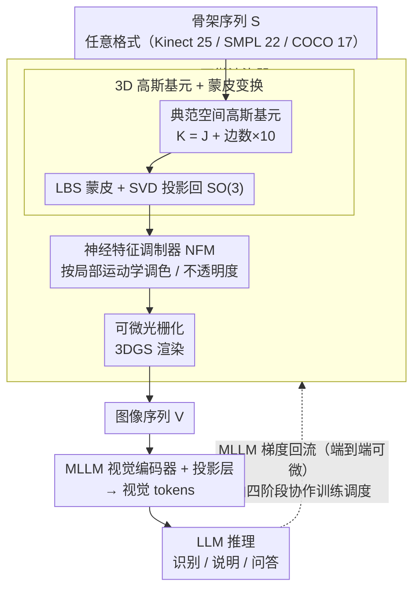

# 通用骨架理解：可微渲染与 MLLMs

**会议**: ICML 2026  
**arXiv**: [2603.18003](https://arxiv.org/abs/2603.18003)  
**代码**: https://github.com/wangzy01/SkeletonLLM  
**领域**: 多模态 VLM / 3D 视觉 / 人体理解  
**关键词**: 骨架理解, 差异化渲染, 多模态大模型, 动作识别, 格式无关性

## 一句话总结
通过将骨架序列渲染为图像让 MLLMs 能够理解多种格式的骨架数据——实现通用骨架理解，解决跨模态和格式异构问题。

## 研究背景与动机

**领域现状**：MLLMs 在视觉-语言任务上表现强劲，但只能处理图像/视频等视觉模态，无法直接理解骨架这类结构化非视觉数据。同时骨架数据面临严重的格式碎片化——Kinect v2 有 25 个关节，MoCap 有 22 个 SMPL 关节，2D 位置估计有 17 个 COCO 关节。

**现有痛点**：传统方法分两类——特征-文本对齐法（如 CLIP 对齐，将骨架编码器输出压缩为单一向量与文本对齐，造成表示瓶颈）和 LLM 离散化法（如 MotionGPT，用 VQ-VAE 量化运动为码本，量化本身有损且码本对格式依赖强）。两类方法都没充分激活 MLLMs 的视觉理解能力。

**核心矛盾**：骨架与 MLLMs 的模态不匹配——骨架是结构化坐标，MLLMs 原生理解图像；同时跨格式泛化要求模型架构不能绑定具体骨架拓扑。

**本文目标**：设计统一框架使单一模型能处理任意骨架格式，支持识别、说明和问答等多任务。

**切入角度**：与其压缩骨架或量化为离散符号，不如将骨架"翻译"为 MLLMs 原生的视觉模态——可直接复用 MLLMs 的视觉理解能力。

**核心 idea**：设计可微分、格式无关的骨架渲染器 DrAction，将任意格式骨架序列渲染为图像，让梯度从 MLLM 反向流回渲染器使渲染优化为下游任务最优。

## 方法详解

### 整体框架
SkeletonLLM 流程为"渲染—推理—回应"（Render-Reason-Respond）三阶段。输入骨架序列 $\mathbf{S}=\{\mathbf{p}_t\}_{t=1}^T$，可微渲染器 DrAction 把它渲染成图像序列 $\mathbf{V}=\{\mathbf{I}_t\}_{t=1}^{T'}$（渲染），经 MLLM 视觉编码器与投影层得到视觉 tokens 后做语言推理（推理），最终生成识别/说明/问答结果（回应）。DrAction 内部依次是典范空间高斯基元、LBS 蒙皮变换、神经特征调制器（NFM）、可微光栅化。整个流程端到端可微，因此 MLLM 的任务梯度能一路回流到渲染器；这条回流链由四阶段协作训练来调度，逐步把随机初始化的渲染器训成 MLLM 看得懂、又能分辨细微动作的视觉接口。

### 关键设计

**1. 3D 高斯基元 + 蒙皮变换：把任意格式的骨架变成可微渲染的人体**

骨架要"翻译"成图像，第一步得有一个能跟着关节动、又能被微分渲染的人体表示。本文不用网格而用 $K$ 个可变形 3D 高斯基元来表示人体（$K = J + \text{边数}\times 10$：$J$ 个高斯锚在关节上，其余沿每条骨边各采样 10 个），这些高斯定义在典范姿态空间里。每个关节 $i$ 的运动写成一个刚体变换 $\mathbf{T}_i \in \mathrm{SE}(3)$，再通过线性融合蒙皮（LBS）把关节运动传给高斯：融合旋转 $\tilde{\mathbf{R}}_k = \sum_i w_{k,i} \mathbf{R}_i$，因为加权和未必还是合法旋转，再用 SVD 极分解把它投影回 $\mathrm{SO}(3)$。格式无关性正是从这里来的——高斯数 $K$、关节数 $J$、边数都从输入骨架动态读取，所以同一套机制能直接吃 Kinect 的 25 关节、SMPL 的 22 关节或 COCO 的 17 关节；遇到没有方向信息的格式就令 $\mathbf{R}_i=\mathbf{I}_3$，退化成纯平移。用高斯而非网格，关键就在它支持微分渲染，梯度才能从 MLLM 一路回流到这里。

**2. 神经特征调制器（NFM）：让渲染图自己"动"起来，区分同一姿态的不同运动阶段**

光有正确姿态还不够——一张静态图分不清"手抬到一半"和"手停在那里"是同一姿态的不同运动阶段。NFM 针对的就是这个：它根据每个高斯的局部运动学自适应地调颜色和不透明度。对高斯 $k$，先聚合它关联关节的位置 $p_k^t$ 和速度 $v_k^t$（用有限差分算速度），和基础特征拼起来后过一个单层 GRU 做时间建模，输出 RGB 残差、不透明度残差以及一个显著性门，最终不透明度为 $\alpha_k = \sigma(\alpha_k^{\mathrm{base}} + \Delta\alpha_k) \cdot \sigma(g_k)$。这样运动剧烈的部位会在渲染图里被突出出来，把原本只能靠多帧才能体现的动态信息直接编码进单帧外观，让下游 MLLM 一眼就能抓到运动显著区域。

**3. 四阶段协作训练：化解"随机渲染器配不上预训练 MLLM"的鸡生蛋难题**

随机初始化的渲染器一开始渲出来的是噪声，预训练 MLLM 根本看不懂，梯度也就无从谈起——这是个先有鸡还是先有蛋的死结。本文用四个递进阶段把它解开：①对齐预热，冻住 MLLM 只优化渲染器，先让它渲出 MLLM 能认的图；②判别式微调，用混淆动作对做二分类，把渲染器逼到能分辨细微差别的判别边界上；③因果推理蒸馏，用教师模型生成步骤式因果链来教模型"为什么是这个动作"；④识别精化，冻住已经成熟的渲染器，只更新投影层和 LoRA 做任务收尾。四个阶段从"视觉可识别"到"判别边界"到"因果理解"再到"任务精化"层层推进，既避免了训练初期梯度不稳定，也防止渲染坍缩成无意义图案。

## 实验关键数据

### 主实验：开放词汇动作识别

| 数据集 | 分割 | TDSM | MotionGPT | InternVL3-8B 基线 | SkeletonLLM | 提升 |
|--------|------|------|-----------|------------------|-------------|------|
| NTU-60 | 55/5 | 86.49 | 29.88 | 76.08 | **87.37** | +0.88% |
| NTU-60 | 30/30 | 25.88 | 8.57 | 26.95 | **37.84** | +11.96% |
| NTU-120 | 60/60 | 27.21 | 5.15 | 25.12 | **34.94** | +7.73% |

### 跨格式迁移精度

| 源格式 | 目标格式 | TDSM | MotionGPT | SkeletonLLM |
|--------|---------|------|-----------|------------|
| Kinect v2 (NTU-60) | Kinect v1 (NW-UCLA) | 43.19 | 10.35 | **68.50** |
| MoCap (HumanML3D) | Kinect v2 (NTU-60) | 23.15 | 12.40 | **54.80** |

### 关键发现
- DrAction 可微性的关键性——相同 InternVL3-8B 骨干下，固定渲染器 76.82%，可微 DrAction 87.48%。
- 训练阶段贡献——去掉 CR-Distill 后下降 3.2%，去掉 Disc-FT 下降 2.1%。
- 极限稀疏场景——30/30 分割是最严格挑战，SkeletonLLM 相对 InternVL3 提升 41%。

## 亮点与洞察
- **模态翻译思想优雅**：将非视觉数据渲染为视觉，直击 MLLMs 的原生优势。
- **格式无关性的通用设计**：高斯基元数、关节融合权从输入骨架动态读取，首次实现 Kinect↔MoCap↔2D 位置的无缝跨格式迁移。
- **协作训练策略的递进设计**：4 阶段分工避免初期梯度不稳定或渲染坍缩。

## 局限与展望
- 渲染计算成本未详细分析。
- 跨数据集泛化受限——论文未评估在完全不同数据源上的泛化能力。
- 多人场景支持不足——框架设计支持多人输入但实验未报告多人场景性能。

## 相关工作与启发
- **vs 特征-文本对齐法（PURLS/TDSM）**：本文渲染保留完整时空信息，格式还依赖于特定拓扑。
- **vs LLM 离散化法（MotionGPT/MotionLLM）**：本文渲染格式无关，无信息损失。
- **vs 直接编码法（SKI-LVLM）**：本文端到端优化让 MLLM 梯度指导渲染。

## 评分
- 新颖性: ⭐⭐⭐⭐⭐  模态翻译范式新颖，格式无关的可微渲染首创。
- 实验充分度: ⭐⭐⭐⭐⭐  覆盖多数据集、多格式、多任务，跨格式迁移结果特别有说服力。
- 写作质量: ⭐⭐⭐⭐  方法清晰，部分数学推导可更简洁。
- 价值: ⭐⭐⭐⭐⭐  解决骨架-MLLM 对齐的通用方案，应用潜力大。

<!-- RELATED:START -->

## 相关论文

- [\[ICML 2026\] FreeRet: MLLMs as Training-Free Retrievers](freeret_mllms_as_training-free_retrievers.md)
- [\[ICML 2026\] Multimodal Continual Learning with MLLMs from Multi-scenario Perspectives](multimodal_continual_learning_with_mllms_from_multi-scenario_perspectives.md)
- [\[CVPR 2026\] Linking Perception, Confidence and Accuracy in MLLMs](../../CVPR2026/multimodal_vlm/linking_perception_confidence_and_accuracy_in_mllms.md)
- [\[ICML 2026\] iVGR: Internalizing Visually Grounded Reasoning for MLLMs with Reinforcement Learning](ivgr_internalizing_visually_grounded_reasoning_for_mllms_with_reinforcement_lear.md)
- [\[ICML 2026\] Injecting Distributional Awareness into MLLMs via Reinforcement Learning for Deep Imbalanced Regression](injecting_distributional_awareness_into_mllms_via_reinforcement_learning_for_dee.md)

<!-- RELATED:END -->
