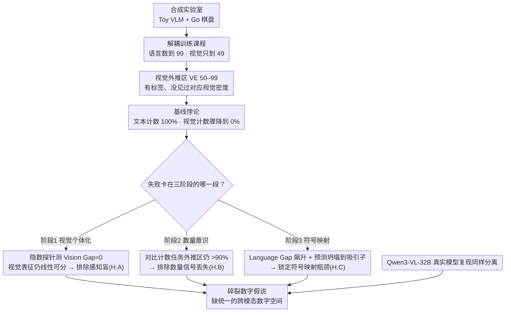

# 揭示视觉-语言模型中的视觉计数瓶颈

**会议**: ICML 2026  
**arXiv**: [2605.30170](https://arxiv.org/abs/2605.30170)  
**代码**: https://github.com/Russellpang/semproj  
**领域**: 多模态 VLM  
**关键词**: 视觉计数, 系统泛化, 象征映射, VLM, 分布外泛化

## 一句话总结
通过将视觉计数分解为三个认知阶段——发现 VLM 的计数失败根源不在视觉感知或数量理解，而在符号映射阶段无法将视觉表征投影到正确的文本标记，反映出模型缺乏统一的跨模态数字表示空间。

## 研究背景与动机

**领域现状**：大型 VLM 在插值任务中表现优异，但在系统泛化任务上表现不佳，特别是视觉计数任务。

**现有痛点**：当图像中物体数量超出训练分布时，VLM 从接近完美准确率立刻崩溃到接近随机猜测，但造成失败的具体原因不清楚。

**核心矛盾**：模型在文本领域可完美学到递归计数规则（计数到 99），但在视觉领域仅用 49 个物体训练后无法推广到 50 个物体——表明文本能力与视觉能力之间存在严重断裂。

**本文目标**：（1）识别计数失败的具体瓶颈；（2）排除视觉感知或数量推理作为根本原因；（3）定位失败到符号映射阶段。

**切入角度**：将视觉计数分解为三阶段——视觉个体化、数量意识、符号映射，通过线性探针技术在合成环境和实际基础模型上逐一验证。

**核心 idea**：用分离的诊断框架（Vision Gap 和 Language Gap）证明模型内部保留了正确的视觉数量表征但无法将其映射到对应文本标记——支持"碎裂数字假说"。

## 方法详解

### 整体框架
两层实验设计——先在可控合成实验室（自训练的轻量级 Toy VLM + Go 棋盘数据集）里严格控制训练分布，再到最先进基础模型（Qwen3-VL-32B）上复现验证。诊断主线是把视觉计数拆成三个认知阶段——视觉个体化、数量意识、符号映射，并对应三个互斥假设 A/B/C。借助隐数探针测得的 Vision Gap 排除阶段 1（感知盲），借助对比计数任务排除阶段 2（数量信号丢失），最后用 Language Gap 飙升、预测坍塌到"吸引子"的现象，把失败锁定到阶段 3 的符号映射，支撑"碎裂数字假说"。

### 关键设计

**1. 解耦训练课程：人为制造"知道标签但没见过视觉密度"的外推区**

要把跨模态问题从噪声里隔离出来，就得精确控制模型见过什么。作者设计两阶段课程模拟 VLM 预训练动态：阶段 1 语言预训练让解码器掌握递归后继函数（能数到 99），阶段 2 视觉对齐却把视觉训练限制在 $N\le 49$。这就造出一个关键的视觉外推区（50–99）——模型在文本侧知道"50""51"这些标签，却从没见过对应的视觉物体密度。比起在真实数据集上靠噪声遮蔽来制造困难，这种"文本知识与视觉经验不匹配"的人为错位能干净地把跨模态断裂单独拎出来研究。

**2. 隐数探针诊断工具：绕过语言解码器，直接量视觉表征里到底有没有数量信息**

光看模型输出的数字对不对，没法判断错在哪个阶段。作者训一个线性分类器 $f_{probe}: \mathbb{R}^d \to \{0,1\}$ 检测视觉编码器输出里每个位置有没有物体，聚合成隐数 $N_H = \sum_{i=1}^L f_{probe}(z_i)$。关键是探针只在分布内（$N\le 49$）训练，再拿到外推区评估，并定义两个 gap：Vision Gap $|N_H - N_G|$ 衡量感知误差，Language Gap $|N_H - N_P|$ 衡量语言模块对齐误差。如果外推区里 Vision Gap 接近 0 而 Language Gap 飙升，就说明视觉表征本身没问题、问题出在它没被正确翻译成文本——这把失败位置精确钉到了符号映射阶段。

**3. 对比计数任务验证数量意识：把"生成数字"换成"判断两量是否相等"**

即便显式计数失败，也可能是数量信号还在、只是生成阶段卡住。作者把枚举任务改成二元分类——模型只需判断两个输入的基数是否相同，不用生成任何具体数字标记，从而绕过符号表达瓶颈，直接测它有没有保住数量感知。结果是模型在视觉外推区即使显式计数 0% 正确，对比任务仍能保持 >90% 准确率，证明数量信号根本没丢，失败纯粹来自生成端的符号映射。这三招正交地逐一排除"感知盲""推理丢"，最后把锅坐实到符号映射，支撑了"碎裂数字假说"。

## 实验关键数据

### 主实验

| 评估集合 | 视觉计数准确率 | 文本计数准确率 | 含义 |
|---------|--------------|---------------|------|
| 分布内（ID，0-49） | 100% | 100% | 训练范围内完美 |
| 视觉外推（VE，50-99） | 0% | 100% | 语言能力不能自动映射到视觉 |
| 完全外推（FE，100-120） | 0% | ~99% | 文本先验单独不足 |

### 诊断指标

| 阶段 | Vision Gap | Language Gap | 结论 |
|------|-----------|-------------|------|
| 视觉个体化（H.A） | ≈0（保持线性可分） | 飙升（>0） | 非感知失败 |
| 数量意识（H.B） | 低 | 高，对比任务 >90% | 非推理丧失 |
| 符号映射（H.C） | 低 | 高，预测崩溃到"吸引子" | **确认符号映射瓶颈** |

### 关键发现
- 视觉编码器在外推制度上保持稳健、线性可分的数量表征，排除感知盲目性。
- 即使在显式计数失败时模型也能在对比任务中准确判断两个不同模态的量是否相等。
- 计数失败不是随机噪声而是结构化的——预测不断坍塌到"吸引子"（视觉训练边界 49、文本先验 90/99、低频幻觉如 9）。
- 视觉与文本计数激活的注意力头几乎完全不重叠（95.7% 不同），表明模型使用两个隔离的"计数子程序"。
- 在 Qwen3-VL 上验证——即使经过万亿级 token 预训练同样的分离现象持续，显示这是架构特性而非规模问题。

## 亮点与洞察
- **精妙的分解框架**：将计数失败从单一黑盒诊断转化为三阶段分析，通过正交实验逐步排除最后精准定位到符号映射。
- **隐数探针的创意应用**：通过线性探针结合干预分析不仅检测信息存在还确立因果链路。
- **"碎裂数字假说"的理论洞察**：揭示 VLM 根本瓶颈不在计算能力而在表示统一性。

## 局限与展望
- 合成实验中的 Go 棋盘任务虽严控变量但过于简化。
- 仅针对 Qwen3-VL 一个基础模型验证，其他 VLM 架构情况未知。
- 论文诊断了问题但未提供解决方案。
- 超越计数的更高阶推理任务中相同瓶颈的普遍性有待验证。

## 相关工作与启发
- **vs 系统泛化文献**：以往工作聚焦视觉分布偏移；本文首次在 VLM 框架下系统分解多模态泛化，发现语言与视觉间的表示断裂。
- **vs VLM 基准评估**：既有评估只报准确率指标；本文通过机制可解释性（线性探针+电路分析）深入内部揭示准确率掩盖的结构性缺陷。

## 评分
- 新颖性: ⭐⭐⭐⭐⭐  首次严格分解 VLM 计数失败到三阶段并用因果诊断工具定位，提出碎裂数字假说。
- 实验充分度: ⭐⭐⭐⭐⭐  合成与真实模型双层验证 + 隐数探针 + 干预分析 + 电路追踪多维诊断。
- 写作质量: ⭐⭐⭐⭐⭐  逻辑链条清晰，三假设递进排除。
- 价值: ⭐⭐⭐⭐⭐  对多模态模型可靠性的深刻理解，为 VLM 设计和安全性研究提供重要指导。

<!-- RELATED:START -->

## 相关论文

- [\[ICML 2026\] 3ViewSense: Spatial and Mental Perspective Reasoning from Orthographic Views in Vision-Language Models](3viewsense_spatial_and_mental_perspective_reasoning_from_orthographic_views_in_v.md)
- [\[ICML 2026\] VisionPulse：多模态推理中的动态视觉稀疏化](visionpulse_dynamic_visual_sparsity_for_efficient_multimodal_reasoning.md)
- [\[ICML 2026\] Hyper-ICL: Attention Calibration with Hyperbolic Anchor Distillation for Multimodal ICL](hyper-icl_attention_calibration_with_hyperbolic_anchor_distillation_for_multimod.md)
- [\[ICML 2026\] Dimension-Free Multimodal Sampling via Preconditioned Annealed Langevin Dynamics](dimension-free_multimodal_sampling_via_preconditioned_annealed_langevin_dynamics.md)
- [\[ICML 2026\] ATHA: 通过打破尾部对齐改进 CLIP 在源数据无关跨域小样本上的适配](improving_clip_adaptation_by_breaking_tail_alignment_for_source-free_cross-domai.md)

<!-- RELATED:END -->
