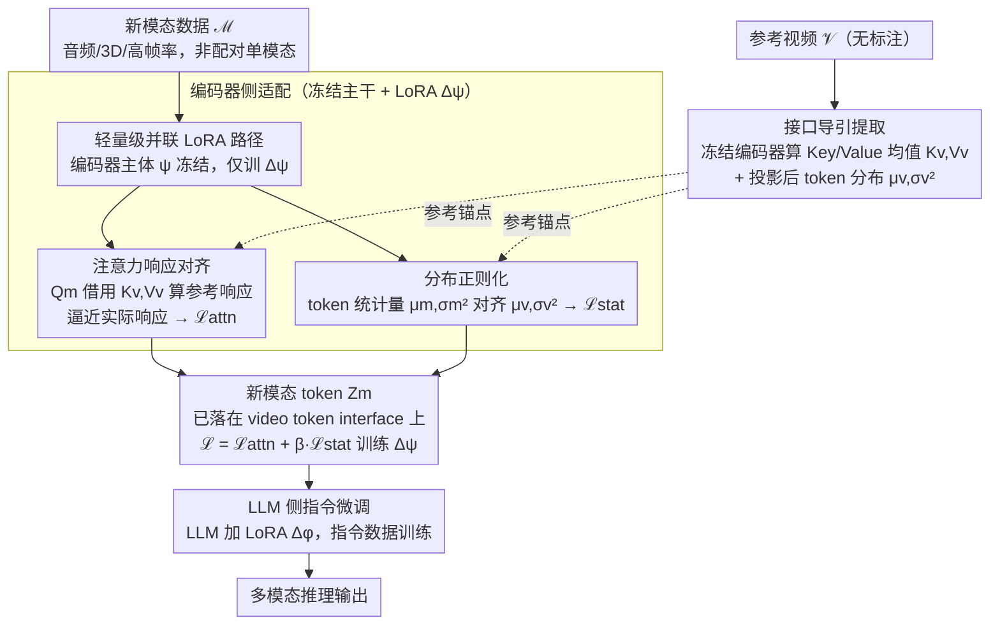

# V-LynX: Token Interface Alignment for VideoX LLMs

**会议**: ICML 2026  
**arXiv**: [2606.00508](https://arxiv.org/abs/2606.00508)  
**代码**: 待确认  
**领域**: 多模态 VLM / 模态适配  
**关键词**: Video LLM, 模态适配, 轻量级适配, Token Interface, 多模态对齐

## 一句话总结
V-LynX 通过发现 Video LLM 内部的**连续 token interface（流形）**——视觉编码器 + 投影层雕刻出的与 LLM 内部操作空间兼容的几何先验——仅用轻量级 LoRA（68.7M 参数）和**未配对的单模态数据**就能将新模态（音频、3D、高帧率视频）高效集成到预训练 Video LLM 中，AVSD 上 CIDEr 145.7 vs PAVE 134.5（参数减少 46%）。

## 研究背景与动机

**领域现状**：Video LLM 在 RGB 视频理解上表现出色，但多数仅支持 RGB + 文本，缺乏对音频、3D 几何、高帧率视频等其他感官信号的支持。现有扩展方法（如 PAVE）需要为每个新模态设计重型专用编码器、复杂融合机制和成对的多模态监督，导致参数膨胀和架构复杂度上升。

**现有痛点**：
- 每加一个新模态都要训练大型模态专用编码器，参数成本线性增长。
- 需要成对多模态数据（如音频-视频-文本三元组）进行对齐，获取困难且昂贵。
- 重新训练编码器易引发灾难性遗忘，破坏已有 video-language 对齐。

**核心矛盾**：Video LLM 的视觉通路（编码器 + 投影层）与其说是把图像映射到固定词汇，不如说已经学会了一个与 LLM 内部操作空间兼容的几何先验——那么如何利用这个先验来适配新模态，而不需要重建整个通路？

**本文目标**：回答一个根本性问题——如何有效地重用 Video LLM 内部化的视觉通路来适配新模态，同时避免灾难性遗忘和数据瓶颈。

**切入角度**：作者发现 Video LLM 的视觉编码器和投影层实际上雕刻出了一个**连续几何空间**（称为 token interface），这个空间充当感知与固定词汇约束之间的桥梁，允许 LLM 将连续视觉信号当作独立的非符号实体处理——只需将新模态输入映射到这个已有的 token interface。

**核心 idea**：通过轻量级 LoRA 并联通路 + 分布对齐策略（注意力响应对齐 + 统计分布正则化），在仅使用单模态非配对数据的前提下，把新模态表示无缝适配到 video-induced token interface 上。

## 方法详解

### 整体框架
三阶段：
1. **接口导引提取**：从预训练 Video LLM 对一批参考视频的处理中提取该模型对 video token 的处理方式（注意力 Key/Value 均值、投影层后 token 分布均值和方差），作为新模态适配的目标锚点。
2. **编码器侧适配**：在冻结的视觉编码器中并联轻量 LoRA（$\Delta\psi$），通过对新模态输入做注意力响应对齐和分布正则化，使其在编码器内部激活与 video 模态兼容的 attention 行为，同时产出分布兼容的 token。
3. **LLM 侧指令微调**：在 LLM 中加 LoRA（$\Delta\phi$），通过指令微调让 LLM 学会利用新模态 token 推理。

### 关键设计

**1. 轻量级并联 LoRA 路径：主视觉通路冻结，只为新模态加少量可学习参数**

每加一个新模态就训一个大编码器，参数成本线性膨胀、还容易把已有的 video 对齐冲掉（灾难性遗忘）。V-LynX 的做法是复用而非重建：新模态输入走 $\mathbf{Z}_m=p_\theta(g_{\psi+\Delta\psi}(\mathbf{X}_m))$，其中编码器主体 $\psi$ 全程冻结、只训一个 LoRA 增量 $\Delta\psi$。这样既继承了 video 预训练沉淀在 $\psi$ 里的知识、又用 $\Delta\psi$ 灵活适应新模态特性，额外参数只 68.7M（PAVE 要 127–475M）。冻结主通路是抗遗忘的关键，低秩增量则保证参数效率——每个新模态只需挂一份小 LoRA。

**2. 注意力响应对齐：让新模态借用 video 的 Key-Value 先验，实现无需配对数据的对齐**

V-LynX 的核心洞察是 Video LLM 的编码器 + 投影层已经雕出一个连续的 token interface，新模态只要学会「在这个 video 空间里怎么提问」即可，不必重建整条通路。具体地，给定新模态的 Query $Q_m^{(l)}$，不用它自己的 Key-Value，而是用 video 导引的参考 Key-Value $(K_v^{(l)},V_v^{(l)})$ 算出参考响应 $\tilde{O}_m^{(l)}=\text{Attn}(Q_m^{(l)},K_v^{(l)},V_v^{(l)})$，再逼着新模态的实际响应 $O_m^{(l)}=\text{Attn}(Q_m^{(l)},K_m^{(l)},V_m^{(l)})$ 向它靠拢，损失 $\mathcal{L}_{\text{attn}}=\sum_l\|O_m^{(l)}-\tilde{O}_m^{(l)}\|_1$。因为参考侧的视觉「世界」（Key-Value）保持稳定，跨模态对齐就不再需要成对的序列监督——新模态只需学会询问的方式；而且这是功能级别（注意力响应）的对齐，比直接拉平特征相似度更能保住原始 video 语义。消融里去掉它掉 4.6%，是三个组件中影响最大的。

**3. 分布正则化：把新模态 token 的统计量对齐到 video token，让 LLM 能正确接收**

投影层之后的 token 分布是被 LLM 直接「看到」的，分布若不匹配，LLM 输出就会异常；但若用过强的特征对齐去硬掰，又会抹掉新模态自己的特性。V-LynX 取一个折中——只对齐统计量：预计算 video token 分布 $(\mu_v,\sigma_v^2)$，约束新模态 token 分布 $(\mu_m,\sigma_m^2)$ 向它靠近，损失 $\mathcal{L}_{\text{stat}}=\|\mu_v-\mu_m\|_2+\|\sigma_v^2-\sigma_m^2\|_2$。只管均值和方差对齐、不管具体特征，既保证 LLM 能正常处理新模态 token、又给新模态保留了特性空间的自由度，是「能用」和「保模态特性」之间的平衡点。

### 训练目标
$\mathcal{L}_{V\text{-LynX}} = \mathcal{L}_{\text{attn}} + \beta \cdot \mathcal{L}_{\text{stat}}$。LoRA 秩 $r = 64$。然后 LLM LoRA 通过标准监督微调（指令微调）训练。

## 实验关键数据

### 主实验对比

| 任务 | 数据集 | 指标 | PAVE-0.5B | V-LynX-0.5B | PAVE-7B | V-LynX-7B | 参数减少 |
|------|--------|------|----------|------------|---------|-----------|--------|
| **音频-视觉 QA** | AVSD | CIDEr | 134.5 | **145.7** (+8.3%) | 152.9 | **163.0** (+6.6%) | -46% vs PAVE-0.5B |
| 音频-视觉 QA | AVQA | Acc. | 90.4 | **93.1** | 93.8 | **94.2** | |
| **3D 推理** | ScanQA | CIDEr | 84.2 | **87.1** | 103.4 | **107.4** | -80% vs PAVE-0.5B |
| 3D 推理 | ScanQA | EM@1 | 23.1 | **26.4** (+14.3%) | 29.1 | **29.7** | |
| **高帧率视频** | VideoMME | Avg. | 46.0 | **52.8** (+14.8%) | 59.9 | **62.7** | -81% vs PAVE-0.5B |

### 消融实验（ScanQA）

| 配置 | CIDEr | BLEU-4 | EM@1 | 说明 |
|------|-------|--------|------|------|
| V-LynX（完整） | 87.1 | 14.3 | 26.4 | 完整模型 |
| 去掉注意力对齐 | 81.0 | 11.8 | 23.5 | 掉 4.6%（关键组件） |
| 去掉分布正则化 | 86.2 | 13.4 | 25.6 | 掉 0.9%（辅助稳定） |
| 去掉接口适配 | 77.3 | 10.9 | 22.4 | 掉 12.7%（最关键） |

### 关键发现
- **注意力对齐是主要驱动**：移除注意力对齐导致 4.6% 掉点，是三个组件中影响最大的——体现"在编码器内部对齐"这一设计的重要性。
- **LoRA 秩的鲁棒性**：rank=8 时也达 86.1 CIDEr，rank=64 最佳 87.1——低秩适配足以捕捉模态适配关键信息。
- **参考视频集无需同分布**：用音频相关视频（57k）作为 reference 反而达 87.7 CIDEr——interface 健壮，不需要严格同分布参考集，大大降低部署难度。
- **参数高效的 scalability**：0.5B 模型用 68.7M 额外参数就超 7B 版 PAVE（256.7M）；7B 版 V-LynX（195.0M）比 PAVE-7B（475.0M）少 59% 参数但性能更好。

## 亮点与洞察
- **Token Interface 的发现**：该论文最核心的贡献不是方法本身，而是发现并形式化了 Video LLM 内部的这个连续流形；用 t-SNE 可视化展示 frame embedding 和 vocabulary embedding 的关系揭示了这个"软 token"空间，为后续多模态扩展奠定理论基础——可推广到其他多模态 LLM（图-文、3D-文）。
- **无序列对适配的巧妙设计**：传统多模态对齐需要成对数据（A-B-C 三元组），V-LynX 通过在注意力层级用 video 的 Key-Value 作"参考锚点"实现单模态数据对齐——大大降低数据成本；可迁移到任何需要跨模态但缺乏对齐数据的场景。
- **分布 vs 特征的权衡**：相比直接特征相似度对齐，分布正则化更巧妙——保留新模态特性空间自由度，只确保统计性质匹配，避免过度对齐导致的语义损失。

## 局限与展望
- 所有实验基于 LLaVA-OV 单 backbone，未在其他 Video LLM（VideoChat3、Qwen-Video）上验证通用性。
- reference videos 选择虽证明无需严格同分布但仍需手工指定；若能自适应选择最 informative 的 reference 集可进一步降低成本。
- 多模态融合仍是逐个添加（音频 + 3D 分别训 LoRA），未探索三个以上模态同时融合时是否出现 interference。
- 改进：在多个 backbone 上验证建立通用 token interface 理论；用主动学习自适应选择 reference video 集；探索同时对齐多模态时的 Pareto 最优。

## 相关工作与启发
- **vs PAVE**（Liu et al. 2025）：PAVE 用独立的模态编码器 + 交叉注意力融合，需要大量成对数据 + 额外参数；V-LynX 复用冻结主编码器 + 分布对齐，参数少 59%（0.5B 下少 81%）且性能更好——本质上用几何约束代替复杂编码器设计。
- **vs Video-LLaMA / VideoLLaMA2**：通过扩展现有音频编码器或集成 prefab 编码器（ImageBind）支持多模态，仍是"编码器堆砌"范式；V-LynX 的核心创新在"复用而非添加"。
- **vs Parameter-Efficient Prompting**（Li & Liang 2021）：受 soft token 概念启发，但不是提示层面的参数效率而是表示层面的多模态适配，是思想的自然演进。

## 评分
- 新颖性: ⭐⭐⭐⭐⭐  Token Interface 发现 + 分布对齐的简洁设计都是创新；用单模态数据实现跨模态对齐在多模态 LLM 领域是突破性的。
- 实验充分度: ⭐⭐⭐⭐  四大任务维度（音频 / 3D / 高帧率视频 / 多视角）+ 充分消融和对比基准；仅限 LLaVA-OV 一个 backbone 略有遗憾。
- 写作质量: ⭐⭐⭐⭐  逻辑清晰，方法介绍详细；偶有冗余段落。
- 价值: ⭐⭐⭐⭐⭐  高效的参数化 + 实用的无对齐数据方案 + 可推广的理论视角，对多模态 LLM 的工程和科学都有显著贡献。

<!-- RELATED:START -->

## 相关论文

- [\[ICML 2026\] RESTORE: 通过矫正失真改进视觉 Token 缩减以提升 MLLM 推理效率](improving_visual_token_reduction_via_rectifying_distortions_for_efficient_multim.md)
- [\[ICML 2026\] Deep Pre-Alignment for VLMs](deep_pre-alignment_for_vlms.md)
- [\[NeurIPS 2025\] SCOPE: Saliency-Coverage Oriented Token Pruning for Efficient Multimodal LLMs](../../NeurIPS2025/multimodal_vlm/scope_saliency-coverage_oriented_token_pruning_for_efficient_multimodel_llms.md)
- [\[ICML 2026\] DenseMLLM: Standard Multimodal LLMs for Dense Prediction](densemllm_standard_multimodal_llms_for_dense_prediction.md)
- [\[ICML 2026\] Gated Relational Alignment via Confidence-based Distillation for Efficient VLMs](gated_relational_alignment_via_confidence-based_distillation_for_efficient_vlms.md)

<!-- RELATED:END -->
