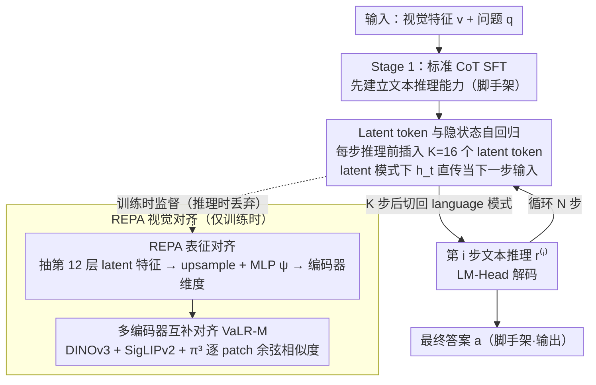

# Vision-aligned Latent Reasoning for Multi-modal Large Language Model

**会议**: ICML 2026  
**arXiv**: [2602.04476](https://arxiv.org/abs/2602.04476)  
**代码**: 项目页有（论文末尾提供）  
**领域**: 多模态VLM / 视觉推理 / 测试时扩展  
**关键词**: 潜空间推理, 视觉对齐, REPA, MLLM, Test-time scaling

## 一句话总结
本文提出 VaLR：在 MLLM 的 CoT 推理每一步之前插入若干"潜在 token"，并用 DINOv3/SigLIP/π³ 等视觉编码器的 patch 特征对这些 token 做表征对齐（REPA），从而在长链推理中持续把视觉信息"喂回"模型，把 Qwen2.5-VL 在 VSI-Bench 上的准确率从 33.0% 拉到 52.9%，并首次让 MLLM 表现出"推理越长越准"的 test-time scaling 行为。

## 研究背景与动机

**领域现状**：现有 MLLM（Qwen2.5-VL、LLaVA 系列）普遍把视觉特征当作"初始上下文"——一次性塞进序列头部，然后让 LLM backbone 用纯文本 CoT 推理。这种做法在短上下文 VQA 上效果不错，但在需要长链推理的任务（多视角空间推理、数学几何）上会失灵。

**现有痛点**：作者在 Figure 2 的"推理长度分析"中给出最直接的证据：Ocean-R1 在 MMVP 上随着生成长度从 100 token 增长到 300 token，准确率从 62.7% 跌到 56.5%；其它 latent reasoning 方法（Monet、CoVT、LVR）也都在长链上崩塌。换句话说，文本 LLM 享有的 "test-time scaling law"（更长思考→更高准确率）在多模态域里反过来变成了"长链=幻觉更多"。

**核心矛盾**：根因是**视觉信号的渐进衰减**——自回归生成每多一个文本 token，注意力对头部视觉 token 的权重就被稀释一次，到生成几百个 reasoning token 后，模型已经几乎"忘了"图片长什么样。早期把图像 token 当固定 prefix 注入的方案（CoVT、Monet）无法解决这个问题，因为视觉信息始终只在序列开头。

**本文目标**：设计一种机制，能在 CoT 的**每一步推理之前**都重新"激活"模型对图像的感知，而且这种激活既不依赖测试时调用外部视觉编码器（避免推理开销），又能保留长链推理的能力。

**切入角度**：受 LLM 域 latent reasoning（Coconut）和 REPA（用外部视觉特征监督 diffusion 中间层）两条线启发，作者假设：**让 MLLM 的中间隐状态在训练时与冻结视觉编码器的 patch 特征对齐**，模型就能学到"自己生成视觉锚点"的能力，测试时无需外部编码器也能持续保持视觉 grounding。

**核心 idea**：在每个文本 reasoning 步骤前插入 K 个特殊 latent token 作为"视觉 checkpoint"，训练时用 DINOv3 等编码器的 patch 特征通过余弦相似度监督这些 latent token 对应的隐状态，让 latent token 自主承担"刷新视觉记忆"的角色。

## 方法详解

### 整体框架
VaLR 在标准 MLLM（Qwen2.5-VL-7B）上做两阶段 SFT。推理时序列形如 $v, q \to (\ell_{[1:K]}^{(1)}, r^{(1)}, \ell_{[1:K]}^{(2)}, r^{(2)}, \cdots) \to a$，即视觉特征 + 问题 → (K 个 latent token + 第 i 步文本 reasoning) × N 步 → 最终答案。latent token 段用 `<latent>` / `</latent>` 控制边界。在 latent 模式下，模型把上一步的隐状态 $h_t$ 直接当作下一步的输入 embedding（绕过 LM-Head 和 token embedding 表）；在 language 模式下回归标准的 token embedding 输入。每段 latent 固定走 $K=16$ 步后强制切回 language 模式。整套训练分两阶段：Stage 1 先用标准 CoT SFT 把文本推理能力建起来（脚手架），Stage 2 才插入 latent token 并施加 REPA 视觉对齐——而视觉对齐只在训练时存在，推理时整条监督分支丢弃。

### 关键设计

**1. Latent token 与隐状态自回归：在每个文本 reasoning step 前预留 K 个「思考槽」做内部刻画**

纯语言 CoT 强制把所有中间状态压扁成离散 token，信息瓶颈太窄、装不下丰富视觉细节。VaLR 给模型加了段「草稿纸」：训练数据预处理时把 CoT 从 $v,q\to(r^{(i)})_{i=1}^N\to a$ 改写成 $v,q\to(\ell_{[1:K]}^{(i)},r^{(i)})_{i=1}^N\to a$，在每步文本推理前插入 K 个 latent token。前向时遇到 `<latent>` 后，下一步的输入嵌入直接用上一步的最后隐状态 $E_{t+1}=[E_t;h_t]$ 而非 token embedding $[E_t;e(x_{t+1})]$，即让模型在连续隐空间里自由发挥 $K=16$ 步、再切回语言模式用 LM-Head 解码后续文本。用连续隐状态直传而非离散 token，保留了更多视觉细节，相当于专门留出一段空间做视觉锚定。

**2. REPA 表征对齐到外部视觉编码器：用 DINOv3 等 patch 特征监督 latent token，把视觉 grounding「内化」进来**

光有 latent token 这个载体还不够，得让它真的携带视觉信息。VaLR 借 REPA 的思路：对第 $i$ 步，从 MLLM 中间层（默认第 12 层、约总层数中间）抽出 K 个 latent token 的特征 $\mathbf{F}_{\text{MLLM}}^{(i)}$，upsample 到与视觉编码器 patch 数 P 对齐、再经 MLP $\psi$ 投到编码器维度，与 $\mathbf{F}_\phi^{(i)}=\phi(I^{(i)})$ 做 patch-wise 余弦相似度对齐：

$$\mathcal{L}_{\text{REPA}}=-\frac{1}{NP}\sum_{i,p}\text{sim}(\hat{\mathbf{F}}_{\text{MLLM}}^{(i)}[p,:],\mathbf{F}_\phi^{(i)}[p,:])$$

关键是外部编码器只在训练时用、推理时完全丢弃——latent token 自己已经学会产生视觉对齐的特征。消融能看出这是命门：去掉视觉对齐后准确率从 41.5% 跌回 34.0%（等同 vanilla SFT），而用 DINOv3 这种自监督编码器比用 Qwen 自带 encoder 还能再涨 1.9%，说明起作用的是「对齐目标本身」而非外部信息泄漏。

**3. 多编码器互补对齐（VaLR-M）：同时对齐多个语义/几何编码器，让 latent token 装下异质视觉知识**

不同编码器擅长不同的视觉子空间，单一对齐覆盖不全。VaLR-M 定义 $\mathcal{L}_{\text{REPA}}^{\text{multi}}=\frac{1}{M}\sum_m\mathcal{L}_{\text{REPA}}^{(m)}$，给每个编码器 $\phi_m$ 单配一个 projection head $\psi_m$，论文用 DINOv3（细粒度 appearance）+ SigLIPv2（语义）+ π³（3D 几何）三种 ViT-L。控制实验显示分工很清晰：加 π³ 对 VSI-Bench 这种 3D 多视角任务贡献最大（+10p+），加 DINOv3/SigLIPv2 对 BLINK/MMVP 等感知任务贡献最大，三者全开拿到全榜最优 52.9%。这等于把「专家分工」显式注入 latent 空间，让 MLLM 在内部蒸馏出一个 mini 的多视图视觉 backbone，而且组合时无干扰、纯叠加，说明 latent 空间足够大可以容纳多源知识。

### 损失函数 / 训练策略
两阶段 curriculum：Stage 1 用 450K CoT VQA 数据（Zebra-CoT / CogCoM / Visual-CoT / OneThinker-SFT 等混合）做标准 SFT 建立基础文本 CoT 能力，loss 为 $\mathcal{L}_{\text{CE}}$；Stage 2 在同一批数据上加入 latent token 与 REPA，总损失 $\mathcal{L} = \mathcal{L}_{\text{CE}} + \lambda \mathcal{L}_{\text{REPA}}$，其中 $\lambda = 0.5$，$K = 16$。两阶段都冻结 native vision encoder，只训 decoder（Stage 2 还训 projection MLP），4 卡 A100、Zero-2、AdamW、lr 1e-5 / 2e-6。

## 实验关键数据

### 主实验
VSI-Bench（多视角 3D 空间推理）8 个子任务 + 5 个感知 benchmark 上对比 GPT-4o / Claude-4 / Qwen2.5-VL 基座 / 三种 latent reasoning baseline。

| 模型 | VSI-Bench Avg | BLINK | MMVP | V* | CVBench |
|------|---------------|-------|------|-----|---------|
| GPT-4o | 34.0 | 63.0 | 68.7 | 42.9 | 79.2 |
| Qwen2.5-VL-7B（base） | 33.0 | 55.7 | 56.0 | 76.4 | 74.5 |
| + vanilla SFT | 33.7 | 56.6 | 58.7 | 78.0 | 77.0 |
| + Monet（latent baseline） | 14.0 | 49.1 | 50.0 | 83.3 | 71.1 |
| + CoVT | 18.6 | 56.0 | 58.7 | 78.0 | 80.0 |
| + VaLR-S（DINOv3） | 41.5 | 63.1 | 60.3 | 86.4 | 83.1 |
| + VaLR-M（DINOv3+SigLIP+π³） | **52.9** | **64.7** | 60.3 | **86.9** | **87.6** |

VaLR-M 在 VSI-Bench 上把 base 模型 +19.9 个百分点，超 GPT-4o 18.9 个点。注意现有 latent reasoning 方法（Monet、CoVT、LVR）在多视角 3D 任务上**全部崩盘**到 14-19%，反衬"无视觉再注入"的潜空间推理是死路。

### 消融实验

| 配置 | VSI-Bench | BLINK | MMVP | V* |
|------|-----------|-------|------|-----|
| Qwen2.5-VL-7B | 33.0 | 55.7 | 56.0 | 76.4 |
| + vanilla SFT | 33.7 | 56.6 | 58.7 | 78.0 |
| + VaLR w/o VA（去掉对齐） | 34.0 | 57.1 | 56.7 | 75.9 |
| + VaLR w/ QE（用 Qwen 自己编码器） | 39.6 | 58.9 | 60.0 | 81.7 |
| + VaLR（DINOv3） | 41.5 | 63.1 | 60.3 | 86.4 |

对齐层位置（Front/Middle/Last 即 4/12/27 层）实验显示中间层（第 12 层）最优，与 REPA 原论文及多项关于"视觉信息集中在 MLLM 中层"的研究一致。

### 关键发现
- **REPA 是命门**：去掉对齐时 VaLR 退化为 vanilla SFT，加上对齐才是 +8p+ 的真正来源；这说明 latent token 本身只是"载体"，关键在于把视觉信号显式塞进中间层。
- **Test-time scaling 显现**：Figure 2 中 VaLR 是唯一一个"推理越长越准"的方法，其它方法都在某个长度后崩塌；这把 LLM 域的 scaling law 首次迁移到了多模态。
- **多编码器协同有"专家化"**：π³ 专门拉高 3D 多视角任务，DINOv3/SigLIP 专门拉高感知任务，组合后无干扰、纯叠加，说明 latent 空间足够大可以容纳多源知识。
- **数据 scaling >20× 更快收敛**：Figure 3 显示 VaLR 用 50K 数据已达到 vanilla SFT 用 450K 才能到的 V* 水平。

## 亮点与洞察
- 把"latent reasoning"和"REPA"两条独立线索揉到一起，落点不是"更花哨的架构"而是"补回 MLLM 长链推理的真正瓶颈——视觉信号衰减"，这种问题诊断+对症下药的路径感很强。
- **推理时不需要外部编码器**这点工程价值很高：部署时一个 Qwen2.5-VL-7B 即可，视觉对齐能力已经被蒸馏进了 MLLM 的中间层。这和很多"训练时贵推理时贵"的多编码器方法形成对比。
- 用 latent token 当"视觉刷新槽"这个抽象可以迁移到很多场景：例如长上下文文档 RAG（每隔几步用 latent token 重激活检索特征）、视频长描述（每隔 N 帧用 latent token 拉回视觉特征）。
- π³ 这种几何专门编码器加入能在 3D 任务上拉 +10p+，说明潜空间对齐天然适配"非语言可描述"的视觉模态。这给"如何把 3D / 触觉 / 音频塞进 LLM"提供了一条不靠 captioning 的新路。

## 局限与展望
- 作者承认 latent token 数量 K=16 是固定的，未做自适应；不同推理步骤对视觉信息的"饥饿程度"显然不同，理应有学习的预算分配。
- 训练数据全是合成 CoT（Zebra-CoT 等），其在"非推理型 VQA"（如视觉描述、风格判断）上的影响未充分评估，可能存在过拟合到 reasoning 数据分布的风险。
- 多编码器对齐意味着训练时多消耗几个 ViT-L 的前向；4×A100 的预算虽然能跑，但放大到 32B / 72B base 模型成本就显著。
- π³ 这类几何编码器需要多视角输入，对单图 VQA 不适用；多模态 latent 对齐还远没探完所有视觉表征家族。
- Test-time scaling 的曲线虽然在 MMVP 上一直增长，但实际推理预算 vs 收益的"边际曲线"作者没系统刻画，工业落地时的"什么时候应该停"还是个开放问题。

## 相关工作与启发
- **vs CoVT / Monet**：他们把视觉特征当固定 prefix 一次性注入，VaLR 在每个 reasoning step 前动态再注入，是"静态 → 动态"的范式跳变，也是表 1/2 上他们崩盘而 VaLR 涨点的根本原因。
- **vs Coconut（hao2024training）**：Coconut 在纯文本 LLM 上做 latent reasoning，无视觉监督；VaLR 把这一思路迁移到 MLLM 并用 REPA 解决了"latent 空间会丢失视觉信息"的问题。
- **vs REPA（yu2024repa）**：原 REPA 用于 diffusion 中间层对齐，VaLR 把它搬到了 autoregressive MLLM 的 latent token 上，证明了 REPA 的适用范围远不止生成模型。
- **vs Visual CoT / Imagine-then-Reason**：那一派显式生成中间图像/视觉 token 来辅助推理，开销大且会受图像生成器质量限制；VaLR 在 latent 空间完成同样目标，更轻量更可控。

## 评分
- 新颖性: ⭐⭐⭐⭐ — latent reasoning 与 REPA 两条已有线索的精彩组合，但单独看任何一项都非原创。
- 实验充分度: ⭐⭐⭐⭐⭐ — 6 个主 benchmark、多编码器/层位置/数据规模/推理长度全面消融，且首次刻画 multimodal test-time scaling 曲线。
- 写作质量: ⭐⭐⭐⭐ — 动机讲得极清楚，Figure 2 一图杀死所有 baseline；但 REPA 那段公式可以再精简。
- 价值: ⭐⭐⭐⭐⭐ — VSI-Bench +19.9p 是真实有用的收益，且推理时不增加外部模型，几乎可以"白送"地嫁接到现有 MLLM 训练流程。

<!-- RELATED:START -->

## 相关论文

- [\[ICML 2026\] CG-MLLM: Captioning and Generating 3D Content via Multi-modal Large Language Models](cg-mllm_captioning_and_generating_3d_content_via_multi-modal_large_language_mode.md)
- [\[CVPR 2026\] Joint-Aligned Latent Action: Towards Scalable VLA Pretraining in the Wild](../../CVPR2026/multimodal_vlm/joint-aligned_latent_action_towards_scalable_vla_pretraining_in_the_wild.md)
- [\[ICLR 2026\] Multi-modal Data Spectrum: Multi-modal Datasets are Multi-dimensional](../../ICLR2026/multimodal_vlm/multi-modal_data_spectrum_multi-modal_datasets_are_multi-dimensional.md)
- [\[ICML 2026\] Referring Multiple Regions with Large Multimodal Models via Contextual Latent Steering](referring_multiple_regions_with_large_multimodal_models_via_contextual_latent_st.md)
- [\[ICML 2026\] Model-Dowser: Data-Free Importance Probing to Mitigate Catastrophic Forgetting in Multimodal Large Language Models](model-dowser_data-free_importance_probing_to_mitigate_catastrophic_forgetting_in.md)

<!-- RELATED:END -->
