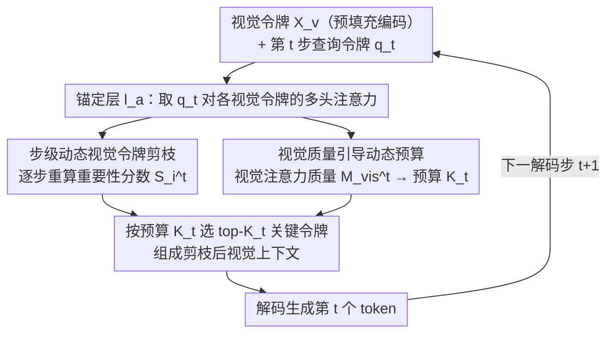

# VisionPulse：多模态推理中的动态视觉稀疏化

**会议**: ICML 2026  
**arXiv**: [2605.31457](https://arxiv.org/abs/2605.31457)  
**代码**: 待确认  
**领域**: 多模态 VLM  
**关键词**: 视觉令牌剪枝, 推理效率, 动态预算分配, 多模态推理

## 一句话总结
VisionPulse 提出训练无关的步级视觉令牌动态剪枝框架——根据每个解码步骤中变化的视觉依赖性自适应调整保留令牌数，仅保留 5% 视觉令牌的同时维持推理精度，将推理长度缩短 11.2%。

## 研究背景与动机

**领域现状**：大型多模态模型在多步推理任务中表现出色但推理时延成为关键瓶颈。现有视觉令牌压缩方法主要在预填充阶段进行单次剪枝。

**现有痛点**：这种"静态剪枝"假设选择的视觉令牌在整个推理过程中保持相关性不变。预填充阶段模型对视觉的注意力很低，此时选择的固定子集可能丢弃后续推理步骤中变得关键的令牌，同时在文本主导步骤中仍保留冗余视觉上下文。

**核心矛盾**：视觉证据需求在推理过程中高度依赖于当前推理状态而非保持恒定。某些步骤需广泛视觉证据，其他步骤主要由语言推理驱动。

**本文目标**：设计步级动态视觉令牌剪枝框架，能在每个解码步骤根据当前视觉依赖性调整保留的令牌集合。

**切入角度**：通过实证分析发现模型在每个解码步骤的视觉注意力质量与有效激活的视觉令牌数量之间存在强正相关关系。这一轻量级信号可用于预测每一步的最优预算。

**核心 idea**：将视觉令牌剪枝从"预填充一次性决策"改为"逐步动态选择"，利用视觉注意力质量计算每一步令牌保留预算。

## 方法详解

### 整体框架
VisionPulse 是一个训练无关框架，把视觉令牌的选择从「预填充阶段一次性决定」改成「解码阶段逐步重做」。视觉令牌 $X_v$ 在预填充时正常编码，之后每生成一个 token 就重新挑一次：在第 $t$ 个解码步，于某个**锚定层** $l_a$ 取当前查询令牌 $q_t$ 对各视觉令牌的注意力，一路据此算出每个视觉令牌的**重要性分数** $S_i^t$（步级动态剪枝），另一路把整体的**视觉注意力质量** $M_{\mathrm{vis}}^{t}$ 转成这一步该保留多少令牌的**动态预算** $K_t$（视觉质量引导），最后选出 top-$K_t$ 个最关键令牌组成剪枝后的视觉上下文、解码出当前 token，再进入下一步循环。整个流程只复用模型已有的注意力统计量，不额外训练任何模块。

### 关键设计

**1. 步级动态视觉令牌剪枝：每个解码步重新选一次，而非预填充一锤定音**

静态剪枝的隐患是——它假设预填充阶段选出的那批视觉令牌在整个推理过程里一直相关，但预填充时模型对视觉的注意力本来就低，此时选的固定子集很可能丢掉了后续步骤才变关键的令牌。VisionPulse 把选择搬到每一个解码步：对视觉令牌集合 $X_v = \{v_1, ..., v_N\}$，在某个**锚定层** $l_a$（从该层起开始剪枝）于第 $t$ 步算重要性 $S_i^t = \frac{1}{H}\sum_{h=1}^{H}A_{t,h}^{(l_a)}(q_t, v_i)$（当前查询令牌对各视觉令牌的多头平均注意力，沿用 FastV 的打分但逐步重算），再选前 $K_t$ 个 $X_v^t = \{v_i \mid i \in \text{Top-}K_t(\{S_i^t\}_{i=1}^N)\}$。和静态方案最大的区别是 $K_t$ 不是固定值——它精确追踪"这一步到底需要多少视觉令牌"，把"何时需要看图、看多少"这个细粒度需求落到了每一步。

**2. 视觉注意力质量引导的动态预算：用一个轻量信号决定每步保留多少**

$K_t$ 怎么定？本文实证发现一个强信号：每步的视觉注意力质量 $M_{\mathrm{vis}}^{t} = \frac{1}{H}\sum_{h=1}^{H}m_{t,h}^{\mathrm{vis}}$（其中 $m_{t,h}^{\mathrm{vis}} = \sum_{i=1}^{N_v}A_{t,h}^{(l_a)}(q_t, v_i)$ 是该头对全体视觉令牌的注意力和）与实际被激活的视觉令牌数呈 0.82-0.95 的强正相关。于是直接把它转成预算 $K_t = M_{\mathrm{vis,max}}^t \cdot N_v$，再用温度 $\tau < 1$ 控制剪枝激进程度。这样高视觉需求的步骤自动多留令牌、文本主导的步骤激进剪枝，全程靠一个现成的注意力统计量驱动，不必额外训练一个复杂的令牌重要性预测器。

**3. 耦合瓶颈：为什么按需剪枝不只省算力，还能让推理更短更准**

这是支撑前两个设计、也是本文区别于纯效率工作的核心洞察——冗余视觉上下文有**双重代价**。第一重是算力：总开销 $\mathcal{F}_{\text{total}} \approx L \cdot [(p+v)(8d^2+4md)+4d(p+v)^2]_{\text{prefill}} + L \cdot \sum_{t=1}^{g}[(8d^2+4md)+4d(p+v+t)]_{\text{decoding}}$ 对生成长度 $g$ 和初始上下文 $(p+v)$ 都是二次复杂度，而多模态场景里 $v \gg p$，视觉令牌就是主导项。第二重、也是更关键的代价——保留完整视觉上下文会让模型每一步都受到与当前查询无关的视觉线索干扰，诱导它生成不必要的推理步骤、甚至走上错误推理路径，于是推理链被无谓拉长。正是这一耦合关系让 VisionPulse 的按需剪枝「一举两得」：剪掉真正无关的视觉令牌，既省算力又顺手缩短推理链。它也解释了实验里那个反直觉现象——错误的剪枝策略竟能同时让精度下降、推理变长，因为它没剪掉真正的干扰，反而越搅越乱。

## 实验关键数据

### 主实验

| 方法 | 视觉令牌保留比 | CharXiv 生成长 ↓ | 精度 ↑ | InfoVQA 生成长 ↓ | 精度 ↑ | ChartQA 生成长 ↓ | 精度 ↑ | 平均长度变化 | 平均精度 |
|------|-------------------|------------------------|--------|------------------|--------|------------------|--------|---------------------|---------|
| 基准（全令牌）| 100% | 4068.0 | 47.60% | 623.1 | 84.37% | 510.0 | 77.12% | - | - |
| VisionZip | ≤10% | 4986.2 | 13.90% | 2533.3 | 22.66% | 2039.7 | 30.24% | +54.2% | -39.7% |
| FastV | ≤10% | 5960.1 | 12.70% | 2963.6 | 20.63% | 1485.5 | 16.28% | +63.2% | -47.6% |
| LOOK-M | ≤10% | 5555.2 | 19.80% | 2694.1 | 40.94% | 2007.1 | 57.68% | +54.2% | -24.5% |
| **VisionPulse** | **≤10%** | **3770.7** | **47.30%** | **530.7** | **83.62%** | **422.9** | **76.72%** | **-12.3%** | **-0.6%** |
| **VisionPulse** | **≤5%** | **3645.1** | **45.20%** | **665.0** | **81.90%** | **510.0** | **75.16%** | **-11.2%** | **-1.8%** |

### 消融

| 配置 | 平均视觉保留比 | RealWorld QA 精度 | MMVet 精度 | MIA-Bench 精度 | 平均生成长度缩减 | 平均精度变化 |
|-----------|------------------|--------|--------|--------|---------------------|------------|
| 完整模型 | 100% | 72.81% | 60.96% | 93.44% | - | - |
| FastV 静态 | 5.0% | 54.12% | 24.27% | 75.03% | +22.2% | -32.5% |
| VisionPulse 固定 1% | ~1% | 71.90% | 49.17% | 92.03% | +27.9% | -6.2% |
| VisionPulse 固定 5% | 5.0% | 72.81% | 59.45% | 93.22% | -7.6% | -0.8% |
| VisionPulse 随机预算 | 3.0% | 69.28% | 58.02% | 91.49% | +0.2% | -3.7% |
| **VisionPulse 动态预算** | **1.9%** | **72.54%** | **59.00%** | **95.09%** | **-16.6%** | **-0.3%** |

### 关键发现
- 在 ≤5% 视觉令牌保留极端剪枝设定下，VisionPulse 几乎完全保留原始性能（精度仅下降 0.3-1.8%），而现有静态剪枝方法精度下降达 24.5%-50.9%。
- VisionPulse 基于每一步实际需求移除真正无关视觉信息，使推理长度平均缩短 11.2%-12.3%。
- 不正确剪枝策略出现矛盾现象：既减少精度又增加推理成本（LOOK-M 5% 保留下生成长度增加 108% 精度仍下降 38.6%）。
- 动态预算在平均 1.9% 保留率下保持精度只下降 0.3%。

## 亮点与洞察
- **关键洞察的实证支撑**：图 1 可视化展示视觉注意力质量动态变化，从经验现象出发推导方法设计。
- **计算优雅的预算分配机制**：用视觉注意力质量这一轻量级信号预测每步令牌保留数，避免复杂学习器。
- **耦合瓶颈的发现与解决**：揭示冗余视觉信息不仅增加计算还能诱导错误推理。
- **方法的通用性与可迁移性**：建立在 FastV 重要性计算之上但原理上可适配任何其他令牌评分方案。

## 局限与展望
- 仅在推理时生效，无法通过联合学习进一步优化。
- 温度参数手工调整。
- 计算成本分析的简化（假设均匀层间复杂度分布）。
- 主要测试 CoT 推理任务，其他多模态任务效果需验证。
- 改进：多层级剪枝；自适应温度调度器；融入多模态指令微调阶段。

## 相关工作与启发
- **vs VisionZip**：单次剪枝；本文中间层逐步剪枝捕捉变化需求。
- **vs FastV**：单次决策升级为多步自适应；精度保留从 60%-70% 提升到 98%+。
- **vs LOOK-M**：本文在更细粒度（每个生成步骤）和更动态维度上超越。
- **启发**："步级多模态需求"观点可推广到文本令牌动态选择或联合多模态预算分配。

## 评分
- 新颖性: ⭐⭐⭐⭐⭐  从"固定剪枝"到"步级动态剪枝"是根本性观念转变。
- 实验充分度: ⭐⭐⭐⭐⭐  7 基准 + 7 对比方法 + 充分消融 + 跨 LMM 骨干验证。
- 写作质量: ⭐⭐⭐⭐⭐  逻辑链条清晰，关键发现用对比鲜明的表格呈现。
- 价值: ⭐⭐⭐⭐⭐  直接降低推理成本、提升推理可靠性，训练无关易于部署。

<!-- RELATED:START -->

## 相关论文

- [\[ICML 2026\] CSMR (Look on Demand): A Cognitive Scheduling Framework for Visual Evidence Acquisition in Multimodal Reasoning](look_on_demand_a_cognitive_scheduling_framework_for_visual_evidence_acquisition_.md)
- [\[ICML 2026\] Learn to Think: Improving Multimodal Reasoning through Vision-Aware Self-Improvement Training](learn_to_think_improving_multimodal_reasoning_through_vision-aware_self-improvem.md)
- [\[CVPR 2026\] ReaGEN: Adaptive Generation of Structured Chains-of-Thought for Efficient Multimodal Reasoning](../../CVPR2026/multimodal_vlm/reagen_adaptive_generation_of_structured_chains-of-thought_for_efficient_multimo.md)
- [\[ICML 2026\] Dimension-Free Multimodal Sampling via Preconditioned Annealed Langevin Dynamics](dimension-free_multimodal_sampling_via_preconditioned_annealed_langevin_dynamics.md)
- [\[ICML 2026\] Hyper-ICL: Attention Calibration with Hyperbolic Anchor Distillation for Multimodal ICL](hyper-icl_attention_calibration_with_hyperbolic_anchor_distillation_for_multimod.md)

<!-- RELATED:END -->
