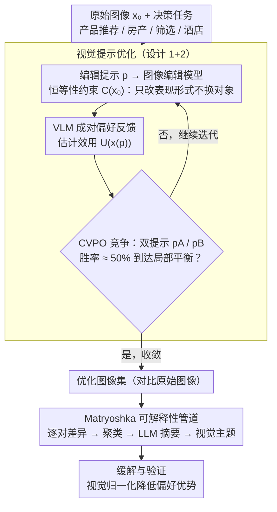

# 视觉说服力：什么影响了视觉-语言模型的决策？

**会议**: ICML 2026  
**arXiv**: [2602.15278](https://arxiv.org/abs/2602.15278)  
**代码**: https://github.com/MaggieCherepLabs  
**领域**: 多模态 VLM  
**关键词**: 视觉说服力, VLM 决策, 视觉偏好, 提示优化, 解释性

## 一句话总结
本论文通过系统使用图像编辑模型修改视觉属性（保持语义不变），发现 VLM 存在显著视觉偏好；提出三种视觉提示优化方法揭露这些偏好，开发自动可解释性管道理解驱动决策的视觉主题，并通过视觉归一化缓解风险。

## 研究背景与动机

**领域现状**：当前 VLM 评估主要聚焦功能性指标，但实际应用中 VLM 被部署为代理系统做出重要决策——如自动推荐产品、筛选候选人、评估房产等。

**现有痛点**：现有 VLM 评估缺乏对模型视觉偏好结构的深入理解。研究表明 LLM 代理对文本提示极敏感，但 VLM 视觉偏好的脆弱性知之甚少。当这些模型自动化运行时，任何隐藏视觉偏好都可能被恶意利用或导致大规模偏差。

**核心矛盾**：如何系统发现和量化 VLM 视觉偏好？传统做法（收集大量自然变化数据集）成本高、覆盖不全。

**本文目标**：（1）开发系统方法揭露 VLM 视觉偏好；（2）定量评估这些偏好对模型决策的影响；（3）识别和解释驱动决策的视觉主题；（4）提出缓解策略。

**切入角度**：当前图像编辑模型（Gemini 3、Qwen-Image-Edit）具有精细视觉可控性，可用这些模型迭代修改图像同时通过 VLM 成对选择反馈来优化编辑方向——本质上是在探索模型的隐藏效用函数。

**核心 idea**：将 VLM 决策函数视为隐藏视觉效用景观，通过"显露偏好"（revealed preference）——系统编辑和成对比较——来推断和探索这个景观。

## 方法详解

### 整体框架
三阶段——（1）**视觉提示优化**：从原始图像出发用图像编辑模型根据优化反馈迭代修改图像直到达到局部平衡；（2）**自动可解释性管道**：通过多阶段聚合（Matryoshka 摘要）将优化后图像与原始图像的差异抽象为高层次视觉主题；（3）**缓解与验证**：测试视觉归一化的有效性。

### 关键设计

**1. 恒等性约束下的优化：只改表现形式，不许偷换对象**

要探测 VLM 的视觉偏好，得保证编辑出来的图还是"同一个东西"，否则优化器会偷懒——直接把对象换成另一个 VLM 更喜欢的物体来骗高分。本文用一个恒等性约束集 $\mathcal{C}(x_0) = \{x \in \mathcal{X}: I(x, x_0) = 1\}$ 框住这件事，把优化写成 $\max_{p \in \mathcal{P}} U_\tau(x(p))$ s.t. $x(p) \in \mathcal{C}(x_0)$，即只在"语义保持"的图像子集里搜索能最大化 VLM 效用 $U_\tau$ 的编辑提示 $p$。这样所有编辑都只动表现形式（光照、角度、布局、风格），不动对象本质，探到的偏好才真正反映模型对"怎么呈现"的倾向，而非对"换成什么"的偏好。

**2. 三种竞争式视觉提示优化（VTG/VFD/CVPO）：在嘈杂偏好反馈下探效用函数**

VLM 的偏好反馈是成对、带噪的，怎么在离散编辑提示空间里稳定收敛是难点。三种方法都走"提议-评估"循环但停止机制各异：VisualTextGrad（VTG）用一个 LLM 评论员产出文本梯度反馈，但在噪声里没法有效停下来；VisualFeedbackDescent（VFD）改用多评论员投票决胜负，更稳但平均要 24.9 次迭代。本文新提的 Competitive Visual Prompt Optimization（CVPO）把优化建模成一场竞争——同时维持两个竞争者提示 $p_A, p_B$，每轮让 $k$ 个评委做一致性检查，当胜率逼近 50%（即两个提示已分不出高下、到达局部平衡）就停。这个停止条件让 CVPO 平均只要 17.4 次迭代、成本降 63%，还在多数模型上拿到最佳效果。

**3. Matryoshka 多阶段可解释性管道：把像素差异抽象成可读的视觉主题**

光找到"VLM 更爱哪张图"还不够，得说清它偏爱的是什么视觉特征。这条管道分两阶段递归抽象：第一阶段用 VLM 逐对比较原始图和优化图，生成细粒度差异描述；第二阶段把这些描述嵌入、按相似性聚类、再用 LLM 对每个簇摘要。"Matryoshka"指的是高层簇是从低层摘要再摘要得来的，层层套娃但保留可追溯性，所以既能为成千上万张优化图自动生成解释，又能从高层主题一路下钻回具体图像对。一个有意思的副产物是——不同优化方法常收敛到相似的视觉主题，这暗示探到的偏好不是某个方法的人为产物，而是 VLM 本身稳定的性质。

## 实验关键数据

### 主实验：优化效果评估

| 数据集/任务 | 原始图像 | 零样本编辑 | 优化后 | 提升（相对原始） |
|------------|--------|----------|-------|--------------|
| 产品推荐 | 0.27 ± 0.03 | 0.48 ± 0.02 | 0.55 ± 0.02 | +78% |
| 房产搜索 | 0.31 ± 0.02 | 0.51 ± 0.02 | 0.62 ± 0.02 | +100% |
| 候选人筛选 | 0.29 ± 0.03 | 0.47 ± 0.02 | 0.58 ± 0.02 | +100% |
| 酒店预订 | 0.26 ± 0.03 | 0.52 ± 0.02 | 0.61 ± 0.02 | +135% |

### 优化方法对比

| VLM | VTG | VFD | CVPO | 最优-次优差异 |
|-----|-----|-----|------|-------------|
| Qwen-3-VL 235B | 0.131 | 0.601 | 0.771 | +0.170 |
| GPT-5 Mini | 0.190 | 0.561 | 0.766 | +0.205 |
| Gemini 3 Flash | 0.140 | 0.604 | 0.761 | +0.157 |
| GPT-4o | 0.179 | 0.566 | 0.749 | +0.183 |
| Claude Sonnet 4.5 | 0.310 | 0.603 | 0.594 | -0.010 |

### 关键发现
- 零样本编辑已显著有效——基础提示就能将选择概率提高 0.2-0.4。
- CVPO 性能最稳定——9 个 VLM 中 7 个上超越 VFD。
- 效率显著差异——VTG 100% 预算，VFD 74.6%，CVPO 仅 36.9%。
- 人类研究验证（N=154）：CVPO 优化结果在人类头对头比较中排名最高。
- 视觉主题收敛性——不同优化方法收敛到类似主题暗示稳定 VLM 性质。
- 缓解策略不完全性——视觉归一化降低优势但无法完全消除。

## 亮点与洞察
- **方法论创新**：首次系统将提示优化扩展到视觉域，CVPO 竞争框架与平衡停止条件是巧妙设计。
- **多层次证据体系**：1.8M+ API 调用、125k+ 生成图像、4 任务域、人类验证、自动可解释性。
- **关键洞察"演示材料的隐藏优化"**：揭示了 AI 治理的关键风险——图像优化若被恶意利用可系统操纵 VLM 代理决策。
- **可复用设计思路**：Matryoshka 摘要、恒等性约束、竞争框架都可推广。

## 局限与展望
- 计算资源需求大限制了可扩展性。
- 恒等性维护边界模糊（背景着装的伦理张力）。
- 人类验证规模有限（N=154）。
- 提示蒸馏使用相同优化集合的图像可能影响外部效度。
- 改进：研究 VLM 对抗鲁棒性训练；开发视觉审计工具；扩展多模态场景；研究 VLM 偏好差异。

## 相关工作与启发
- **vs 对抗例子研究**：对抗追求最小感知变化扰动；本文关注感知显著但语义保持的自然变化。
- **vs 行为 ML 与智能体评估**：前期工作在文本域；本文扩展到视觉域且首次开发系统发现方法。
- **vs 提示优化文献（TextGrad、Feedback Descent）**：本文将反馈梯度原理扩展到多模态。
- **vs 自动可解释性**：本文用类似思想解释黑盒 VLM 行为输出，是补充性外部可解释性方法。

## 评分
- 新颖性: ⭐⭐⭐⭐⭐  首次系统用视觉提示优化探索 VLM 隐藏视觉偏好。
- 实验充分度: ⭐⭐⭐⭐⭐  大规模实验，证据链完整；唯一遗憾是人类样本量小。
- 写作质量: ⭐⭐⭐⭐  逻辑清晰，方法阐述细致。
- 价值: ⭐⭐⭐⭐⭐  对 AI 安全与治理具重大现实意义。

<!-- RELATED:START -->

## 相关论文

- [\[ICML 2026\] VisionPulse：多模态推理中的动态视觉稀疏化](visionpulse_dynamic_visual_sparsity_for_efficient_multimodal_reasoning.md)
- [\[ICML 2026\] Hyper-ICL: Attention Calibration with Hyperbolic Anchor Distillation for Multimodal ICL](hyper-icl_attention_calibration_with_hyperbolic_anchor_distillation_for_multimod.md)
- [\[ICML 2026\] Dimension-Free Multimodal Sampling via Preconditioned Annealed Langevin Dynamics](dimension-free_multimodal_sampling_via_preconditioned_annealed_langevin_dynamics.md)
- [\[ICML 2026\] iVGR: Internalizing Visually Grounded Reasoning for MLLMs with Reinforcement Learning](ivgr_internalizing_visually_grounded_reasoning_for_mllms_with_reinforcement_lear.md)
- [\[ICML 2026\] Find, Fix, Reason: Context Repair for Video Reasoning](find_fix_reason_context_repair_for_video_reasoning.md)

<!-- RELATED:END -->
