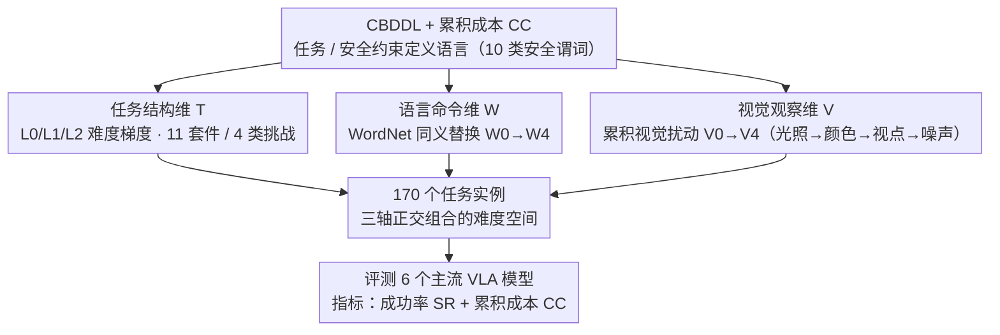

# VLA-Arena：评估视觉语言动作模型的开源框架

**会议**: ICML 2026  
**arXiv**: [2512.22539](https://arxiv.org/abs/2512.22539)  
**代码**: https://github.com/VLA-Arena/VLA-Arena  
**领域**: 机器人学 / 视觉语言动作模型 / Agent  
**关键词**: 视觉语言动作模型, 基准评估, 机器人操纵, 泛化性能, 安全性约束

## 一句话总结
VLA-Arena 提出结构化 VLA 基准——通过任务结构、语言命令和视觉观察三个正交维度系统量化难度，用 170 个任务揭示现有 VLA 模型在泛化、视觉感知和安全性上的关键缺陷。

## 研究背景与动机

**领域现状**：VLA 模型正迅速发展——从 RT-1、RT-2 到最新 π0、UniVLA 已展现跨具身、跨场景、长期操纵能力，但能力边界和失败模式缺乏定量刻画。

**现有痛点**：现有机器人学基准（LIBERO、VLABench、RoboCasa）三大问题——（1）任务设计过于简化，单一复杂度水平定义；（2）要么关注噪声鲁棒性要么关注任务泛化，难以理解模型如何在多维度并发挑战时表现；（3）忽视安全约束，理想环境运行。

**核心矛盾**：高在分布内任务（L0）上的表现能否真实反映模型泛化能力？模型是通过鲁棒多模态理解还是脆弱模式匹配工作？

**本文目标**：设计基准能系统量化 VLA 能力边界，区分真正语言-视觉-动作理解与表面模式记忆，同时评估安全性。

**切入角度**：通过三个正交维度同时控制任务难度——任务结构复杂度、语言指令语义变化、视觉观察系统扰动。

**核心 idea**：构建"三轴难度空间"基准系统，通过结构化、可控、可重复任务设计将 VLA 评估从"通过/失败"二元判断升级为"能力前沿在哪里"精细诊断。

## 方法详解

### 整体框架
VLA-Arena 是一套**结构化任务设计**：底层先用 **CBDDL（约束行为定义语言）**统一定义任务、动态实体和安全约束，再在其上通过**三个正交维度**实例化难度——（1）**任务结构维（T 轴）**：170 个任务分 11 套件、按四类挑战（安全 / 干扰 / 泛化 / 长期）组织，每个任务有 L0/L1/L2 三级难度；（2）**语言命令维（W 轴）**：W0–W4 用 WordNet 同义替换逐步扰动指令；（3）**视觉观察维（V 轴）**：V0–V4 累积施加视觉扰动（光照→颜色→视点→噪声）。三轴彼此正交、可独立调节，组合出一个可量化的难度空间，最后用成功率（SR）和累积成本（CC）评测模型。

### 关键设计

**1. CBDDL（约束行为定义语言）+ 累积成本：把安全约束做成基准的第一公民**

现有 VLA 基准几乎都在理想环境里只看"任务成不成"，完全不管模型是不是撞了障碍、把物体砸了地、超了力矩——这些在真机部署里恰恰是致命的。CBDDL 扩展标准 BDDL，原生支持动态实体、扰动和安全谓词，用 10 类安全谓词（碰撞、力矩限制、物体坠落等）把"安全"精确定义进任务里。配套的累积成本（CC）把瞬时危险和终态危险一起算账：

$$CC(\tau) = \sum_{t=0}^{L-1} c^{inst}(s_t, a_t) + \alpha \cdot c^{term}(s_L),$$

其中 $\alpha=10$ 给终态危险加重权。这样基准就能区分"完成了任务但一路违反安全约束"和"真正安全的成功"两种结果——对现实部署这正是最该分开的两件事。

**2. 任务结构维（T 轴）：用 L0/L1/L2 难度梯度戳穿"记忆冒充泛化"**

现有基准往往只有单一复杂度，模型在它上面拿了高分，你却分不清这是真泛化还是把训练分布背了下来。T 轴把任务的"固有难度"定义为**离训练分布的距离**，并切成三级递进梯度：L0 是分布内技能（复刻训练分布的直接指令、熟悉的物体摆放），L1 是近分布泛化（数量缩放、同类新实例、熟悉概念的新组合、干扰物、简单安全约束），L2 是远分布挑战（结构不同的新工作流、违反习得 affordance 的摆放、密集干扰 / 动态障碍、严格安全约束、全新物体类别）。这 170 个任务再按四类挑战（安全 / 干扰 / 泛化 / 长期）组织成 11 个套件。难度梯度的价值在于把"能不能做"升级成"从哪一级开始崩"——一个模型若 L0 优异却在 L1/L2 大幅掉点，就暴露了它靠记忆而非泛化。

**3. 有原则的语言扰动（基于 WordNet）：用同义替换戳穿关键词死记**

如果一个 VLA 只是把指令里的关键词和动作死记成映射，那它在原始指令下表现好、其实根本没"理解"语言。VLA-Arena 的诊断办法是先识别指令里的语义插槽（动作词、目标词、地点词），再用 WordNet 找语义距离为 1 的同义词替换，难度等级 W0（原始）→ W4（4 个插槽全替换）就是被替换的插槽数。WordNet 而非随机改写或模板替换，保证替换后的指令既自然又可控。判别逻辑很干净：一个真正理解语言的模型应当对同义改写鲁棒，而一个做表面关键词匹配的模型会在 W0 表现好、W4 崩溃——崩的幅度直接量化了它有多依赖死记。

**4. 累积层级化视觉扰动（V0–V4）：逐层加码精确定位视觉鲁棒性的崩溃点**

视觉鲁棒性不是一个 0/1 的事，模型可能扛得住轻微光照变化却挡不住视点偏移，所以需要把视觉挑战拆成可分辨的层级。V0–V4 在前一层基础上逐层累积：V0 标准 → V1 光照扰动 → V2 物体颜色随机化 → V3 视点偏移 → V4 高斯噪声，对应着从较轻的自然变化一路逼近极端 sim-to-real 失配和神经网络捷径。这种累积阶梯能精确定位每个模型从哪一层开始失效——实测里 π0 在 StatePreservation 任务上 V3 就从 0.8 跌到 0.2，说明它依赖的是脆弱的像素级捷径而非鲁棒的视觉表征。

## 实验关键数据

### 主实验：六个主流 VLA 模型

| 任务维 | 模型 | L0-SR | L1-SR | L2-SR | L1+L2 下降 | 关键发现 |
|--------|------|-------|-------|-------|-----------|---------|
| Safety-StaticObstacles | π0 | 1.0 | 0.7 | 0.3 | 70% | 最强模型也在 L2 崩溃 |
| Safety-StaticObstacles | OpenVLA | 0.6 | 0.6 | 0.0 | 100% | 无法处理 L2 多障碍 |
| Distractor | π0 | 0.9 | 0.1 | 0.0 | 100% | 干扰物大幅影响 |
| Extrapolation-UnseenObjects | π0 | 0.8 | 0.5 | 0.0 | 100% | 新物体完全失败 |
| Long Horizon | π0 | 0.9 | 0.0 | 0.0 | 100% | 无法组合技能 |

### 消融

| 任务类型 | 扰动维度 | W0 | W2 | W4 | 趋势 | 洞察 |
|---------|---------|-----|-----|-----|------|------|
| StatePreservation | 语言 | 0.8 | 0.8 | 0.7 | 平缓 | 依赖视觉线索 |
| StatePreservation | 视觉 | 0.8 | 0.7 | 0.1 | 陡峭跌落 | V3+V4 崩溃 |
| UnseenObjects | 语言 | 0.8 | 0.4 | 0.1 | 单调递减 | 需真正理解 |
| UnseenObjects | 视觉 | 0.8 | 0.5 | 0.0 | 陡峭跌落 | 视觉同样致命 |

### VLM vs VLA 视觉接地差距

| 视觉级别 | Qwen3-VL-8B 定位准度 | VLA 平均掉点 |
|---------|---------------------|-------------|
| V0 | 100% | - |
| V1 | 100% | 13.5% |
| V2 | 100% | 24.0% |
| V3 | 96.7% | 30.5% |
| V4 | 93.3% | 50.5% |

**核心发现**：揭示"灾难性遗忘"——微调使 VLA 放弃通用视觉概念。VLM 在 V4 仅下降 6.7%，VLA 在 V4 掉 50.5%，说明微调过程模型重学针对特定像素分布的反演而非保留鲁棒表示。

### 关键发现
- 记忆化优于泛化——所有模型 L0 优异但 L1-L2 普遍掉 50%-100%。
- 视觉捷径猖獗——π0 在 StatePreservation 任务 V3 就从 0.8 跌到 0.2。
- 语义理解缺失——语言扰动导致 UnseenObjects 单调递减（0.8 → 0.1）。
- Sim-to-Real 验证：Franka 真机 L0→L2 性能下滑（60%→3.3%）和安全违反（0/10→4/10）基本再现。

## 亮点与洞察
- **三轴正交设计的威力**：每个维度独立但相互正交，能精确隔离失败原因。
- **CBDDL + CC 指标的创新**：安全性直接融入基准定义，累积成本巧妙惩罚瞬时危险和终态失败。
- **WordNet 驱动的有原则语言扰动**：相比随机改写或模板变换更自然且可控。
- **Sim-to-Real 验证的严谨性**：在实 Franka 机器人验证模拟结果可迁移性。
- **排名反转现象**：不同难度层级最优模型不同说明每个等级提供非冗余洞察。

## 局限与展望
- VLA-Arena 基于 MuJoCo 模拟，覆盖真实场景有限。
- 数据集规模不足以完全消除微调的数据影响。
- 关键词替换基于 WordNet，对非英文支持有限。
- 长期维"技能组合"相对简单（最多 3 子技能）。
- 改进：多体身学习；动态环境；开放词汇；在线学习评估。

## 相关工作与启发
- **vs LIBERO/RoboCasa**：本文引入"三轴难度空间"和安全维度，诊断能力大幅提升。
- **vs VLABench**：VLABench 强调语言多样性但任务设计平坦；VLA-Arena 通过正交维度分解。
- **vs LIBERO-Pro/Plus**：本文更系统化，不仅视觉维有 V0-V4，语言维也有 W0-W4 分级诊断。
- **启发**：基准设计应从"能做什么"升级为"边界在哪里"；安全性应是基准第一阶级公民。

## 评分
- 新颖性: ⭐⭐⭐⭐⭐  首创"三轴正交难度空间"和"W/V 扰动诊断探针"组合。
- 实验充分度: ⭐⭐⭐⭐⭐  6 主流 VLA + 170 任务 + 真实 Franka 验证 + 详细消融。
- 写作质量: ⭐⭐⭐⭐⭐  逻辑清晰，图表精心设计。
- 价值: ⭐⭐⭐⭐⭐  对 VLA 社区的影响是结构性的。

<!-- RELATED:START -->

## 相关论文

- [\[ICML 2026\] VLANeXt：构建强大 VLA 模型的配方](vlanext_recipes_for_building_strong_vla_models.md)
- [\[ICML 2026\] Any3D-VLA: Enhancing VLA Robustness via Diverse Point Clouds](any3d-vla_enhancing_vla_robustness_via_diverse_point_clouds.md)
- [\[ICML 2026\] TRAP: 用对抗 patch 劫持 VLA 的 CoT 推理实现目标行为攻击](trap_hijacking_vla_cot-reasoning_via_adversarial_patches.md)
- [\[AAAI 2026\] FT-NCFM: An Influence-Aware Data Distillation Framework for Efficient VLA Models](../../AAAI2026/multimodal_vlm/ft-ncfm_an_influence-aware_data_distillation_framework_for_efficient_vla_models.md)
- [\[CVPR 2026\] Joint-Aligned Latent Action: Towards Scalable VLA Pretraining in the Wild](../../CVPR2026/multimodal_vlm/joint-aligned_latent_action_towards_scalable_vla_pretraining_in_the_wild.md)

<!-- RELATED:END -->
