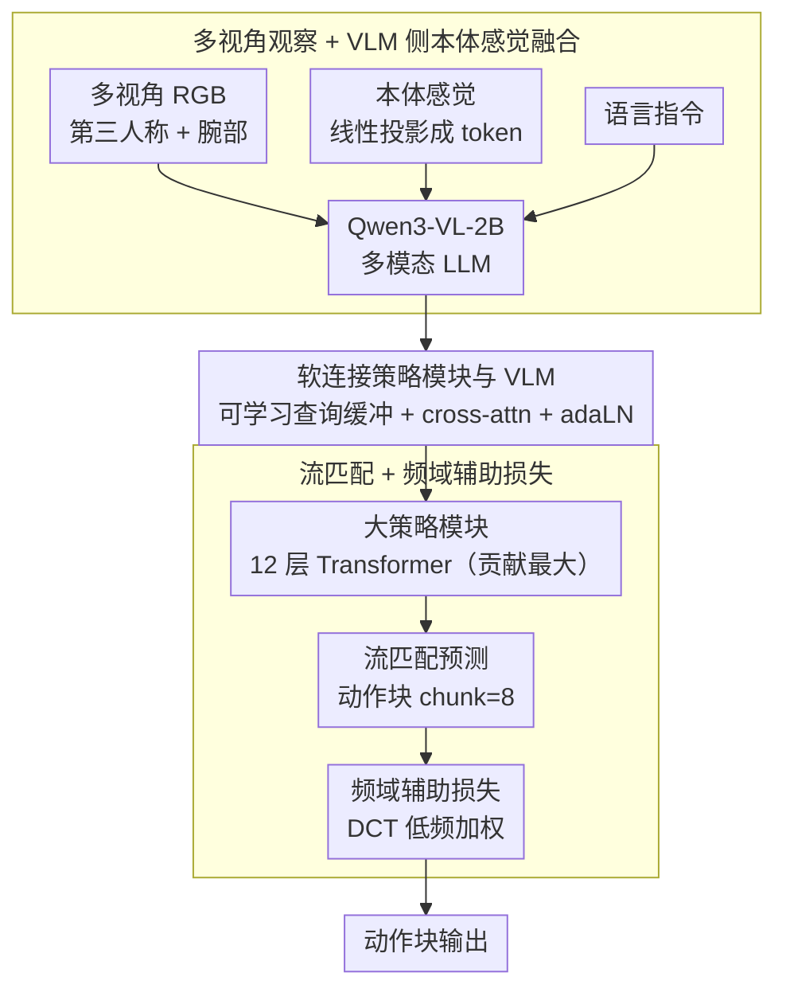

# VLANeXt：构建强大 VLA 模型的配方

**会议**: ICML 2026  
**arXiv**: [2602.18532](https://arxiv.org/abs/2602.18532)  
**代码**: https://github.com/DravenALG/VLANeXt  
**领域**: 具身智能 / VLA / 机器人学习  
**关键词**: 视觉语言动作模型, 机器人学习, VLA 设计空间, 多模态融合, 指令条件控制

## 一句话总结
本文系统探索 VLA 模型的设计空间，通过 500+ 对照实验提炼出 12 条关键设计原则——构建高效强大的 VLANeXt 模型，在 LIBERO 基准上超越 SOTA，并在真实机器人任务中验证了设计原则的有效性。

## 研究背景与动机

**领域现状**：VLA 模型利用预训练 VLM 为通用机器人策略学习提供视觉和语言理解能力。已有众多 VLA 模型被提出（RT-2、OpenVLA、π 系列等），但训练协议和评估设置存在重大差异。

**现有痛点**：VLA 领域仍处于"原始汤"阶段——想法众多但缺乏系统性。不同方法采用不同 VLM 骨干、架构设计、损失函数，难以公平对比。

**核心矛盾**：如何在统一框架下系统比较 VLA 设计选择，区分出哪些设计真正有效？

**本文目标**：在统一框架和评估设置下重新审视 VLA 设计空间，找出可复现、可通用的设计配方。

**切入角度**：从 RT-2 出发沿三个维度逐步演进——基础组件、感知要素、动作建模。这个系统化消融路径能清晰展示每个设计选择的贡献。

**核心 idea**：通过大规模对照实验（>500 次）在统一评估协议下逐步优化设计，将碎片化 VLA 方法论整合成 12 条可操作的设计原则。

## 方法详解

### 整体框架
VLANeXt 不是凭空提出的单一新架构，而是从 RT-2 式极简 baseline 出发、沿三个维度（基础组件、感知要素、动作建模）逐步消融演进出来的"配方终点"。最终管道为：多视角 RGB（第三人称 + 腕部）、本体感觉、语言指令一起喂进 Qwen3-VL-2B 多模态 LLM；LLM 各层输出经"软连接"（可学习查询缓冲区 + cross-attention + adaLN 注入时间步）平滑过渡到一个 12 层大策略模块（这是贡献最大的基础组件，相对 baseline +33.8%）；策略模块以流匹配预测长度为 8 的动作块，并叠加频域辅助损失压制轨迹抖动。下图按数据流自上而下展开，三个关键设计分别对应输入融合、VLM-策略连接、动作建模三段。

### 关键设计

**1. 多视角观察 + VLM 侧本体感觉融合：把状态信息注到 VLM 而非策略模块**

机器人本体感觉（关节角、夹爪状态）和多视角观察都得整合进来，但注入位置很讲究。多视角 RGB 走多模态 LLM 的图像编码器，本体感觉则经线性投影变成 token、和视觉 token 一起喂进 VLM——关键是在 VLM 级别融合而不是等到策略模块再拼。原因是状态信息与视觉指令的对齐度在 VLM 级更高（98.0% vs 策略级 96.2%），多视角则补上单视角缺的几何线索（91.8% → 97.6%）。这条经验直接回答了"本体感觉该插哪"这个被很多 VLA 含糊处理的问题。

**2. 软连接策略模块与 VLM：在文本表示空间和动作预测空间之间架一座柔性桥**

RT-2 那种"文本 token 复用"是硬连接、容易欠拟合，MetaQuery 那种"完全解耦"又会损耗信息，两端都不理想。软连接走中间路线：仍是分层连接，但在 VLM 和策略模块之间插入一组可学习查询缓冲区，VLM 每层输出通过 cross-attention 与策略模块的查询交互，再用 adaLN 把时间步信息条件进去，于是信息在两个表示空间之间平滑过渡而非生硬拼接。这一改动在 LIBERO-plus 上拿到 56.2% 的最优性能，比松连接高 2.5%。

**3. 流匹配 + 频域辅助损失：把动作块当连续时间序列建模，并用频域正则压抖动**

动作块预测（chunk=8）本质是预测一段连续时间序列，回归损失在高性能区间已经被流匹配超越，所以主损失用流匹配建模连续动作分布。在此之上叠一个频域辅助损失：通过 DCT 把动作转到频域，对低频分量赋更高权重，$L_{\text{freq}} = \text{MSE}(\text{DCT}(\hat{a}), \text{DCT}(a))$，权重 $w(\text{freq}) \propto 1/(\text{freq}+1)$。这相当于借了时序预测领域"低频是主干、高频是抖动"的思想——惩罚高频偏差等于防止模型过拟合到轨迹抖动上，性能达到 99.0%（比纯回归 +1%），而且几乎不增加训练开销。

## 实验关键数据

### 主实验

| 方法 | LIBERO (%) | LIBERO-plus (%) | 模型大小 |
|------|-----------|----------------|--------|
| OpenVLA | 76.5 | 15.6 | 7B |
| OpenVLA-OFT | 97.1 | 69.6 | 7B |
| π₀ | 86.0 | 53.6 | 11B |
| π₀-Fast | 85.5 | 61.6 | 7B |
| NORA | 87.9 | 39.0 | 未知 |
| UniVLA | 95.2 | 42.9 | 未知 |
| FLOWER | 96.9 | 未报告 | 未知 |
| **VLANeXt** | **97.4** | **83.9** | **2.5B** |

VLANeXt 以 2.5B 模型大小（约 OpenVLA-OFT 的 1/3）超越所有 baseline。

### 消融实验

| 设计维度 | 配置 | LIBERO (%) | LIBERO-plus (%) |
|--------|------|-----------|-----------------|
| **基础组件** | 单层策略头 + 文本 token 复用 | 19.8 | <5.0 |
| | 分离策略头（2 层） | 30.2 | 16.6 |
| | 大策略模块（12 层） | 64.4 | 34.0 |
| | +动作分块(chunk=8) | 74.6 | 43.4 |
| | +流匹配损失 | 80.0 | 45.0 |
| | +Qwen3-VL-2B 骨干 | 90.0 | 53.7 |
| | +软连接 | 91.8 | 56.2 |
| **感知要素** | +多视角 | 97.6 | 80.5 |
| | +VLM 侧本体感觉 | 98.0 | 87.7 |
| **动作建模** | +频域辅助损失 | 99.0 | 93.1 |

### 关键发现
- 大策略模块贡献最大（+33.8%）。
- 强 VLM 骨干（+10.0%）优于单纯增加参数。
- 感知要素（多视角+本体感觉）合计 +13.0%。
- 频域损失虽简单但有效，计算开销可忽略。
- 视频历史无益——添加时间历史反而掉点（91.8% → 85.0%）。
- 本体感觉位置敏感——VLM 级注入远优于策略模块（98.0% vs 96.2%）。

## 亮点与洞察
- **系统性设计探索**：500+ 对照实验在统一框架下分解 VLA 设计空间，"配方"思维比"一锤子"创新对社区更有方法论意义。
- **多模态融合的深层洞察**：本体感觉应在 VLM 侧融合而非策略侧，多视角观察提供几何补偿。
- **时间序列思想迁移**：频域正则项从时序预测迁移到动作生成，简洁优雅大幅改善 LIBERO-plus 扰动鲁棒性。
- **效率-性能平衡**：2.5B VLANeXt 显著小于 OpenVLA-OFT 的 7B 但性能更优。
- **开源生态贡献**：发布统一轻量级框架降低 VLA 研究进入壁垒。

## 局限与展望
- 评估限于 LIBERO/LIBERO-plus 两个仿真基准，真实机器人验证样本量小。
- 数据集特性——LIBERO 主要是操纵任务，缺乏导航等多样化场景。
- 计算效率——2.5B 模型推理延迟、显存占用未详细报告。
- 改进：跨体型、跨任务设计迁移；自适应融合策略；结合在线学习；深入分析频域损失机制。

## 相关工作与启发
- **vs RT-2/OpenVLA**：VLANeXt 通过设计细节优化在 2.5B 规模超越 OpenVLA-OFT 7B。
- **vs π 系列**：π 紧耦合 11B；VLANeXt 软连接更轻量性能更优。
- **vs 世界模型方法（WorldVLA）**：辅助任务 +2% 但 3 倍训练时间；VLANeXt 用频域损失取代获更好效率-性能平衡。

## 评分
- 新颖性: ⭐⭐⭐⭐  系统化探索 VLA 设计空间，方法论贡献显著。
- 实验充分度: ⭐⭐⭐⭐⭐  500+ 对照 + 2 仿真基准 + 真实机器人 + 详尽消融。
- 写作质量: ⭐⭐⭐⭐  框架清晰，设计演进流畅。
- 价值: ⭐⭐⭐⭐⭐  为 VLA 领域从碎片化探索向系统化设计转变树立范例。

<!-- RELATED:START -->

## 相关论文

- [\[ICML 2026\] VLA-Arena：评估视觉语言动作模型的开源框架](vla-arena_an_open-source_framework_for_benchmarking_vision-language-action_model.md)
- [\[ICML 2026\] Any3D-VLA: Enhancing VLA Robustness via Diverse Point Clouds](any3d-vla_enhancing_vla_robustness_via_diverse_point_clouds.md)
- [\[ICML 2026\] TRAP: 用对抗 patch 劫持 VLA 的 CoT 推理实现目标行为攻击](trap_hijacking_vla_cot-reasoning_via_adversarial_patches.md)
- [\[AAAI 2026\] FT-NCFM: An Influence-Aware Data Distillation Framework for Efficient VLA Models](../../AAAI2026/multimodal_vlm/ft-ncfm_an_influence-aware_data_distillation_framework_for_efficient_vla_models.md)
- [\[CVPR 2026\] Joint-Aligned Latent Action: Towards Scalable VLA Pretraining in the Wild](../../CVPR2026/multimodal_vlm/joint-aligned_latent_action_towards_scalable_vla_pretraining_in_the_wild.md)

<!-- RELATED:END -->
