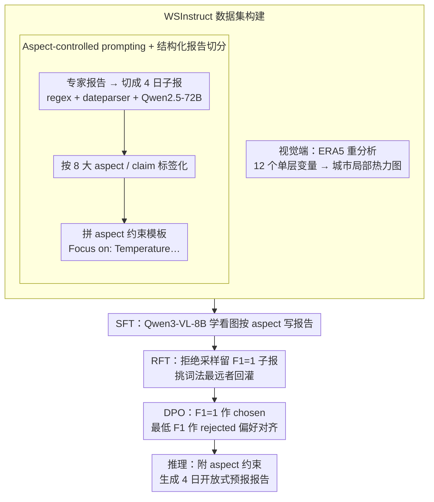

# WeatherSyn: An Instruction Tuning MLLM For Weather Forecasting Report Generation

**会议**: ICML 2026  
**arXiv**: [2605.07522](https://arxiv.org/abs/2605.07522)  
**代码**: https://github.com/compasszzn/WeatherSyn (有)  
**领域**: 多模态VLM / 气象AI / 报告生成  
**关键词**: 天气预报报告、指令微调、aspect-controlled prompting、RFT、DPO

## 一句话总结
WeatherSyn 把气象预报员的报告写作流程拆解成"看图→列要点→出稿"的多模态指令任务，先建了首个覆盖 31 个美国城市、8 类天气要素的 WSInstruct 数据集，再用 SFT→RFT→DPO 三段式微调 Qwen3-VL-8B，让一个 8B 开源模型在多种评测指标上稳定打过 GPT-5-Nano、Claude-3.7-Sonnet 等闭源大模型，并对未见城市有零样本泛化能力。

## 研究背景与动机

**领域现状**：传统天气预报报告依赖气象员阅读 NWP（Numerical Weather Prediction）模型输出的几百个变量场，再结合观测数据集体讨论后人工撰写，存在信息过载、效率低和主观偏差等问题。MLLM 已开始被尝试用于 weather captioning（WeatherQA、OmniEarth-Bench、Omni-Weather），但要么聚焦严重天气事件，要么是分类/多选题形式，没有真正解决"从初始大气场直接生成多日开放式预报报告"这一日常业务问题。

**现有痛点**：(1) 缺数据——公开的"配对视觉图像 + 专家撰写报告"几乎没有；(2) 开放式生成缺约束——同一天气情景下不同报告可能侧重温度、风、湿度等不同维度，无 aspect 控制时模型容易生成同质化、被高频要素主导的报告，且无法与 ground truth 做细粒度对齐评测；(3) 现有专用气象 MLLM 在自由文本生成上 reference 指标看似不低，但 LLM-judge 和专家评估几乎全为 0，说明语句通顺但事实错。

**核心矛盾**：开放式预报报告同时要满足"事实准确"（与初始大气场一致）和"表达多样"（接近专家写作风格），但小规模手工撰写的 SFT 数据只能教模型记住具体措辞，会陷入"语法对但要点不全"或"要点全但措辞死板"的二元困境。

**本文目标**：(1) 把"天气预报报告生成"形式化为 WFR 任务并构建首个 instruction tuning 数据集；(2) 设计一种能在 8B 开源 backbone 上系统超越闭源大模型的训练方案；(3) 验证模型在跨城市、跨地域、多时间步上的稳健性。

**切入角度**：作者抓住"专家写报告之所以高质量，是因为先在脑中按 aspect（温度/风/锋面…）逐项整理，再组织成连贯文字"这一结构性观察，把 aspect 作为显式 prompt 约束注入训练与推理；并借鉴 RFT/DPO 这类后训练方法，把"事实正确"和"表达多样"解耦——RFT 用来补齐措辞多样性，DPO 用来锁定事实正确性。

**核心 idea**：用 aspect-controlled prompting 把开放式报告问题"结构化"，再用 SFT→RFT→DPO 三阶段把"准确"与"多样"分阶段灌进同一个 8B VLM。

## 方法详解

### 整体框架
WeatherSyn 的核心是 WSInstruct 数据集 + 三阶段训练。WSInstruct 由两部分组成：(i) 视觉端——从 ERA5 重分析数据按城市裁剪出 12 个单层变量的局部热力图（如温度、降水、风等）；(ii) 文本端——专家撰写的 4 日开放式预报报告，被切成日级子报告并标注 aspect/claim。训练分三段：先 SFT 让模型学会"看图按 aspect 写报告"；再 RFT 用拒绝采样把"事实正确但措辞多样"的合成报告灌进去；最后 DPO 把"高 F1 报告"作为 chosen、"低 F1 报告"作为 rejected 做偏好对齐。推理时同样附加 aspect 约束以保证可对齐评测。

### 关键设计

**1. Aspect-controlled prompting + 结构化报告切分：把开放式报告强行变成"日期→aspect→文本"模板**

开放式报告没有约束时，模型会被训练集的要素分布支配、塌缩到最频繁的几类，既同质化又没法与 ground truth 做细粒度对齐评测。这里先把报告结构化：用正则 + dateparser 把"Today/星期几"等相对表达转成绝对日期，再用 Qwen-2.5-72B 按时间轴切成 4 个连续日子报（要求至少覆盖前 4 天中的 3 天），然后按专家定义的 8 大 aspect（temperature、wind、humidity、frontal system、pressure system、wave pattern、wind flow system、event）及其下的细粒度 claim 把报告标签化，prompt 模板形如 `<<date, weekday>> Report:\n## Focus on: Temperature, Humidity`，推理时所有 baseline 同样接收 aspect 列表以保证公平。效果是决定性的：没有 aspect 约束时 hit rate 仅 0.16，只在训练加约束、推理不加反而塌到 0.12（退化到最频繁的 "event"），训练+推理都加才推到 0.94——这是后续可对齐评测的前提。

**2. RFT：用拒绝采样把"事实正确但措辞多样"灌进模型**

SFT 数据规模小、措辞单一，模型容易只记住表层短语而非底层气象现象。RFT 对 2017–2020 子集，用 SFT 后模型以温度 0.9 采 40 份候选，用 Qwen-2.5-72B 抽 claim 算 step-level F1、只保留 F1=1 的子报，再用四种距离（编辑距离、TF-IDF、Jaccard、Sentence-BERT 余弦）从这些"事实正确"子报里挑出与原 ground truth 距离最大者，组装成新报告作为增广样本 $\mathcal{D}_\text{RFT}$ 回灌 Qwen3-VL-8B。训练仍是带掩码的 next-token loss $\mathcal{L}_\text{VLM} = -\mathbb{E}_{(Q,I,\{R^i\}_{i=1}^N)\sim\mathcal{D}} [\sum_{i=1}^N \log p_\theta(R^i \mid I, Q)]$，但 $N$ 不再固定为 1、按候选投票数自适应。动机很直接——同一份气象场可以合理表达成"temperatures rebound"或"increasing temperatures"等多种说法，这种"事实一致 + 词法多样"的样本最能强化图像-文本对齐，把 Wave Pattern、Wind Flow System 这些长尾 aspect 的 weighted F1 拉升 0.15–0.17。

**3. DPO：以 F1 为偏好信号锁定事实正确性**

RFT 解决了多样性，但 LLM-judge 和专家评测的 Top-1 比例还只有 11%–16%。DPO 在 2021 子集上对 RFT 模型采 40 份候选算 step-level F1，用 F1=1 的子报组装成 chosen $\mathcal{Y}_w$、F1 最低的组装成 rejected $\mathcal{Y}_l$，得到 1241 条偏好对，优化标准 DPO 目标 $\mathcal{L}_\text{DPO}(\pi_\theta, \pi_\text{ref}) = -\mathbb{E}[\log \phi(\beta \log \tfrac{\pi_\theta(\mathcal{Y}_w|x)}{\pi_\text{ref}(\mathcal{Y}_w|x)} - \beta \log \tfrac{\pi_\theta(\mathcal{Y}_l|x)}{\pi_\text{ref}(\mathcal{Y}_l|x)})]$，参考模型固定为 $\mathcal{M}_\text{RFT}$。用 F1 这种可自动计算、与气象 claim 直接挂钩的客观信号做偏好对齐，比 RLHF 拿真人标注便宜得多又更对口，DPO 后 LLM evaluation 的 Top-1 比例从 0.16/0.15 拉到 0.33/0.32，几乎翻倍。

### 损失函数 / 训练策略
- Stage 1（SFT）：$\mathcal{L}_\text{VLM}$，$N=1$，全 31 城混合训练。
- Stage 2（RFT）：同样 $\mathcal{L}_\text{VLM}$ 但 $N$ 由候选投票数动态决定，$\mathcal{D}_\text{RFT}$ 总 $\mathcal{I}$ 数 20412。
- Stage 3（DPO）：标准 DPO 目标，参考模型固定为 $\mathcal{M}_\text{RFT}$。
- 评测数据集：2017–2021 训练、2022 测试集 1292 条。

## 实验关键数据

### 主实验
WSInstruct test set 上五类评测综合对比（节选关键指标）：

| 模型 | BLEU-1 | ROUGE-L | Auto F1 | LLM Fact.Cons. (Top-1) | Expert Fact.Cons. (Top-1) |
|---|---|---|---|---|---|
| GPT-5.2 Thinking (2-shot) | 0.12 | 0.12 | 0.49 | 0.06 | 0.07 |
| Gemini-3 Pro Preview (2-shot) | 0.37 | 0.28 | 0.60 | 0.24 | 0.29 |
| Claude-3.7-Sonnet (2-shot) | 0.09 | 0.10 | 0.51 | 0.02 | 0.01 |
| WeatherQA (Qwen3-VL-8B) | 0.19 | 0.15 | 0.36 | 0.01 | 0.01 |
| **WeatherSyn (SFT)** | 0.43 | 0.31 | 0.55 | 0.11 | 0.11 |
| **WeatherSyn-RFT** | 0.43 | 0.31 | 0.59 | 0.16 | 0.17 |
| **WeatherSyn-DPO** | **0.44** | **0.32** | **0.59** | **0.33** | **0.29** |

8 类 aspect 的 weighted F1（节选）：WeatherSyn-DPO 在 Pressure System (0.72)、Frontal System (0.36)、Event (0.67) 等结构复杂 aspect 上的提升幅度都超过 5pp，与 Gemini-3 Pro 持平或反超。

### 消融实验

| 配置（Aspect Control） | 平均 hit rate | 说明 |
|---|---|---|
| Train ✗ / Test ✗ | 0.16 | 模型受训练分布主导，对低频 aspect 几乎不写 |
| Train ✓ / Test ✗ | 0.12 | 退化到训练里最频繁的 "event" aspect |
| Train ✓ / Test ✓ | **0.94** | aspect 显式约束在训练+推理两端都不可省 |

| 训练阶段 | LLM Fact.Cons. Top-1 | Avg Aspect F1 |
|---|---|---|
| SFT only | 0.11 | 0.55 |
| + RFT | 0.16 | 0.59 |
| + DPO | 0.33 | 0.59 |

### 关键发现
- 5 类评测里"reference-based"指标（BLEU/ROUGE）和"claim/LLM/expert-based"指标常出现反向：WeatherQA 在 BLEU-1 上 0.19 高于 Claude，但 LLM Fact.Cons. 反而都只有 0.01，说明 BLEU 等表面相似度不适合开放式气象报告，应以 claim F1 为主指标。
- RFT 主要拉升 aspect F1（多样性带来的事实覆盖），DPO 主要拉升 LLM/expert 评测的 Top-1 比例（事实精确性偏好），两阶段功能互补。
- 模型在 forecast 1→4 天上 F1 缓慢衰减，但 RFT 显著缓解了 Frontal System 和 Event aspect 上的时间衰减——长期预报这两类要素本就难，RFT 让模型抓住底层动力学而不是表层措辞。
- 泛化实验：训练随机一半城市、测试另一半时，零样本 WeatherSyn 超过 GPT-5-Nano/Claude 的 2-shot；甚至跨南北/东西大区测试时仍保持优势，说明模型学到的更接近"区域无关的气象规律"。
- Honolulu（海洋岛屿）、Flagstaff（高海拔高原）这种气候复杂城市上，WeatherSyn 相对 baseline 的差距更大；Charleston 这类气候模式简单的城市差距小，说明优势集中在"难情景"。

## 亮点与洞察
- **aspect-controlled prompting 是被低估的工程武器**：单纯加 aspect 约束这一改动就把 hit rate 从 16% 提到 94%，这套"显式给生成器列大纲"的模式可以迁移到任何开放式领域报告生成（金融、医疗、法律摘要）。
- **三段式 SFT→RFT→DPO 是中等规模 VLM 的标准路线**：作者用 RFT 解决"多样性"、DPO 解决"事实精确性"，把传统 RLHF 拆成两条便宜的合成数据路径，没有依赖任何人工偏好标注。
- **以可自动计算的客观信号做 DPO 偏好**：用 step-level F1 直接构造 chosen/rejected 对，这种"可验证 reward → 偏好对"的做法对所有有结构化标签的生成任务都通用，比 RLHF 调成本低一个数量级。
- **5 套互补评测体系**：作者明确指出 BLEU/ROUGE 在开放式气象报告上误导性强，因此并行汇报 Auto claim、Human-refined claim、LLM judge（4 个 judge 排名聚合）、Expert judge 四套指标，给后续做"难以单一指标度量"的领域写作打了样板。

## 局限与展望
- 数据集只覆盖 31 个美国城市，对热带、季风、极地等气候未验证；作者计划扩到全球范围，但跨气候带的迁移可能远不是简单数据增加可解决的。
- 当前只用初始时刻的大气场作为视觉输入，无法利用 NWP 提供的多时间步预测——附录 E.1 已显示加入 HRES 多步预测能进一步提升，但主方法故意限制以测纯推理能力，工程部署时应放开。
- DPO 阶段对不同 aspect 提升不一致，部分 aspect（Frontal System）DPO 后甚至略掉，说明用单一全局 F1 信号做偏好可能掩盖 aspect 间冲突；可考虑 aspect-conditioned reward 或多任务 DPO。
- 评测仍部分依赖 LLM-as-judge（GPT-5、Gemini、Claude、DeepSeek 四 judge 聚合），存在自我偏好风险；专家评测虽校正了 LLM judge 但只覆盖 144 条样本，统计噪声较大。
- 真正的预报员场景下还需处理动态更新（每小时新 ERA5、突发天气事件），论文未涉及在线更新或时序连续生成。

## 相关工作与启发
- **vs WeatherQA (Ma 等, 2024)**：WeatherQA 关注严重天气事件的多选/captioning，WSInstruct 直接生成多日开放式报告；同样基于 Qwen3-VL-8B 微调时 WeatherQA Auto F1=0.36 远低于 WeatherSyn-DPO 0.59，差距来自任务结构化（aspect）和后训练（RFT/DPO）。
- **vs Omni-Weather (Zhou 等, 2025)**：Omni-Weather 聚焦雷达降水临近预报，本文聚焦城市级多变量、多天的预报报告；两者在视觉输入分辨率和文本结构上完全互补。
- **vs OmniEarth-Bench (Wang 等, 2025)**：OmniEarth 提供多选题 benchmark，WeatherSyn 提供生成式 benchmark + 模型，定位互补。
- **启发**：这套"领域知识结构化为 aspect → 用 LLM 自动抽 claim 做评测 → 用 F1 做 DPO 偏好"流水线适用于任何"图像/数据→开放式领域报告"任务（放射科 CT 报告、卫星灾害评估报告、金融研报），可以直接套用模板。

## 评分
- 新颖性: ⭐⭐⭐⭐ 任务定义和 aspect-controlled prompting 是新的，但训练流水线（SFT+RFT+DPO）整体属于近年常见组合。
- 实验充分度: ⭐⭐⭐⭐⭐ 五套互补评测、aspect/城市/地理/时间步多维分析、消融完整，几乎覆盖所有可质疑维度。
- 写作质量: ⭐⭐⭐⭐ 数据集构建过程详尽，方法部分条理清晰；公式排版略乱（LaTeX 双花括号噪声），但不影响理解。
- 价值: ⭐⭐⭐⭐ 第一个公开数据集 + 开源 8B 模型打过 GPT-5-Nano/Claude 的天气报告生成 baseline，对气象 AI 落地具有直接工程参考价值。

<!-- RELATED:START -->

## 相关论文

- [\[ACL 2025\] MEIT: Multimodal Electrocardiogram Instruction Tuning on Large Language Models for Report Generation](../../ACL2025/multimodal_vlm/meit_multimodal_electrocardiogram_instruction_tuning_on_large_language_models_fo.md)
- [\[ICCV 2025\] MetaMorph: Multimodal Understanding and Generation via Instruction Tuning](../../ICCV2025/multimodal_vlm/metamorph_multimodal_understanding_and_generation_via_instruction_tuning.md)
- [\[ICML 2026\] Decentralized Instruction Tuning: Conflict-Aware Splitting and Weight Merging](decentralized_instruction_tuning_conflict-aware_splitting_and_weight_merging.md)
- [\[ICML 2026\] SAME: Stabilized Mixture-of-Experts for Multimodal Continual Instruction Tuning](same_stabilized_mixture-of-experts_for_multimodal_continual_instruction_tuning.md)
- [\[NeurIPS 2025\] Visual Instruction Bottleneck Tuning](../../NeurIPS2025/multimodal_vlm/visual_instruction_bottleneck_tuning.md)

<!-- RELATED:END -->
