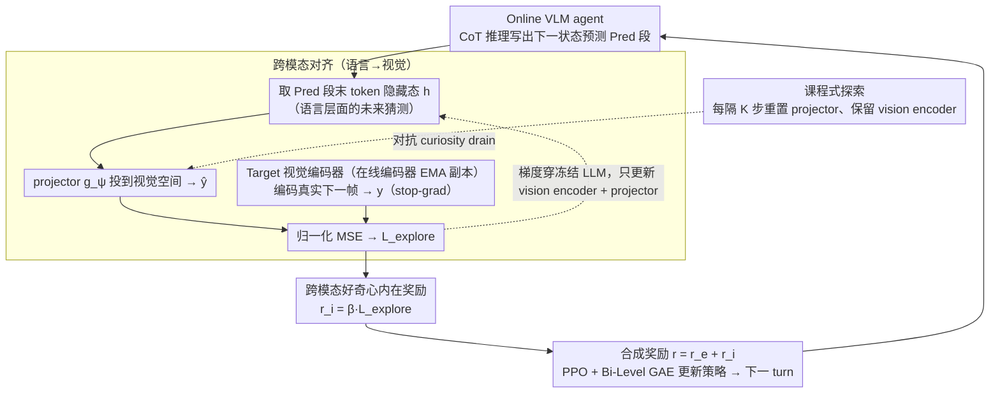

# What You Think is What You See: Driving Exploration in VLM Agents via Visual-Linguistic Curiosity (GLANCE)

**会议**: ICML 2026  
**arXiv**: [2605.03782](https://arxiv.org/abs/2605.03782)  
**代码**: 暂未公开 (无)  
**领域**: 多模态VLM / 强化学习 / Agent探索  
**关键词**: VLM agent、好奇心驱动探索、跨模态对齐、internal world model、curiosity drain

## 一句话总结
GLANCE 在 VLM agent 的强化学习里加了一个"想-看对齐"自监督头：让 LLM 在 CoT 里产出的"下一状态预测"通过一个轻量 projector 映射到由 EMA target 视觉编码器编码的真实下一帧表示，预测与实际之间的差距同时充当内在好奇心奖励、视觉编码器的训练信号、以及让 internalized world model "落地"的对齐损失；再配合周期性重置 projector 的课程探索机制对抗好奇心衰退，最终在 5 个 agentic 任务上稳定超过现有 exploitation-only 的 VLM-RL 方法。

## 研究背景与动机

**领域现状**：当前 VLM agent（VAGEN、InternVL-Agent 等）越来越倾向于把"world modeling"内化进策略里：用显式 CoT 在每一回合写 `<Obs>s_t</Obs><Res>z_t</Res><Pred>s_{t+1}</Pred>` 这样的结构化推理，然后给出动作 `<Ans>a_t</Ans>`，靠 PPO 类算法+稀疏外在奖励学到推理-行动一体的策略。

**现有痛点**：但这些方法本质上只是"被动开发已访问状态"——agent 只在它已经踩过的状态上精修推理，没有任何机制主动去找"自己模型说不清楚的地方"。在稀疏奖励任务（推箱子谜题、3D 导航）里很容易出现"完美描述死胡同却从未尝试别的路"这种伪成功；同时，传统好奇心方法（ICM、BYOL-Explore、Latent Curiosity）只看视觉到视觉的预测误差，与 VLM 内化的语言 world model 完全脱节——视觉表征学得再好，语言推理还可能持续幻觉。

**核心矛盾**：VLM agent 的 world model 已经从"外置 RNN/Transformer"搬进了 LLM 内部的 CoT，但好奇心机制还停留在外置 vision-only 形式；两者不对齐时，agent 会陷入两种失败模式之一：(a) 语言层面瞎想但视觉表征压根感知不到；(b) 视觉表征丰富但语言推理依旧脱离物理现实。

**本文目标**：构造一个统一目标，让"agent 想的"必须能预测"agent 看到的"，并把这种预测失败转化为主动探索动力；同时解决长时间训练中好奇心信号过快衰减的"curiosity drain"问题。

**切入角度**：作者抓住"linguistic prediction vs. visual reality"这个跨模态信号——VLM 在 `<Pred>` token 处的隐藏态本身就是模型对未来的语义级猜测，把它投影到视觉空间然后和真实下一帧表示对齐，预测误差就自然同时是 (i) 对齐损失（让 vision encoder 学语义可操作特征）、(ii) world model 接地的监督、(iii) curiosity 内在奖励——三鸟一石。

**核心 idea**：用"linguistic hypothesis ↔ visual reality"之间的跨模态预测误差代替"visual past ↔ visual future"，让好奇心成为"主动证伪"而不是"随机搜索"。

## 方法详解

### 整体框架
GLANCE 把 VLM agent 视为 partially observable MDP $(\mathcal{S}, \mathcal{A}, \mathcal{O}, T, R, Z, \gamma)$ 下的策略，构造一个 online-target 双流架构：(i) **Online VLM agent** $\boldsymbol{\theta} = (\mathbf{v}, \boldsymbol{\ell})$ 包含可训练 vision encoder $f_\mathbf{v}$、frozen LLM backbone $\Lambda_\boldsymbol{\ell}$ 和轻量 projector $g_\boldsymbol{\psi}$；(ii) **Momentum target network** $\boldsymbol{\phi}$ 是 vision encoder 的 EMA 副本。每个 turn $t$：online 生成 CoT $\Phi_t$ 包含状态预测 $s_{t+1}$，取 `<Pred>` 段末 token 的隐藏态 $h_{t+1} \in \mathbb{R}^d$ 作为"linguistic hypothesis"；执行动作 $a_t$ 得到 $o_{t+1}$，target 编码 $y_{t+1} = \text{sg}(f_\phi(o_{t+1}))$；online 用 projector 得 $\hat{y}_{t+1} = g_\psi(h_{t+1})$，两者归一化后做 MSE 得 $\mathcal{L}_\text{explore}$；这个 loss 同时回传去更新 $g_\psi$ 和 $f_\mathbf{v}$（LLM 冻结），又作为内在奖励 $r_t^i = \beta \cdot \mathcal{L}_\text{explore}$ 加到外在奖励 $r_t^e = r_t^\text{task} + r_t^\text{reason} + r_t^\text{format}$ 上。下面这张图把这个"想-看对齐"的自监督回环画出来：上半部分是三个关键设计串成的数据流，虚线是 $\mathcal{L}_\text{explore}$ 二次利用（回传更新编码器 + 当内在奖励）和课程式重置两条调控信号。

### 关键设计

**1. Linguistic-to-Visual Cross-modal Alignment：把 agent 用语言写的"未来猜测"翻译到视觉空间，与真实下一帧对齐**

传统 BYOL/SPR 类视觉自监督只能"视觉→视觉"预测，无法保证语言推理和视觉感知指向同一事物——视觉表征学得再好，语言推理仍可能持续幻觉。GLANCE 抓住"linguistic prediction vs. visual reality"这个跨模态信号：online VLM 在 `<Pred>s_{t+1}</Pred>` 这段 CoT 末尾位置的 Transformer 最后层 hidden state $h_{t+1}$ 就是"语言隐式编码的未来状态"，用轻量 projector 投到视觉空间得 $\hat{y}_{t+1} = g_\psi(h_{t+1})$；target 视觉编码器 $f_\phi$ 用 EMA 更新 $\phi \leftarrow \alpha \phi + (1-\alpha) \mathbf{v}$ 编码真正发生的下一帧得 $y_{t+1}$，对齐损失用 BYOL 风格的归一化 MSE $\mathcal{L}_\text{explore} = \|\frac{\hat{y}_{t+1}}{\|\hat{y}_{t+1}\|_2} - \text{sg}(\frac{y_{t+1}}{\|y_{t+1}\|_2})\|_2^2$，stop-gradient 加在 target 侧防坍缩。关键的"选择性梯度路由"是让梯度穿过冻结的 LLM 但只更新 projector $g_\psi$ 和 online vision encoder $f_\mathbf{v}$——既避免 language drift，又逼 vision encoder 学到"语义可操作"的特征，把 world model 从语言里拽到物理现实上。

**2. Cross-modal Curiosity as Intrinsic Reward：把对齐误差二次利用为内在奖励，驱动主动证伪**

标准 ICM 类好奇心只看视觉预测误差、和 LLM 推理脱节，可能出现"视觉表征学好但语言仍幻觉"的伪平衡。GLANCE 直接把当前 turn 的 $\mathcal{L}_\text{explore}$ 当内在奖励 $r_t^i = \beta \cdot \mathcal{L}_\text{explore}(\mathbf{v}, \boldsymbol{\psi}, t)$，与外在奖励合成 $r_t = r_t^e + r_t^i$ 后送入 PPO 风格的 Bi-Level GAE 做 token-到-turn 的层次化 credit assignment。直觉上 $\mathcal{L}_\text{explore}$ 大意味着"我语言里的下一状态预测和实际看到的差很多"，正是 known unknown、最值得探索的地方；反之低 loss 区域是模型已熟悉的状态。由于好奇心和 world model 接地是同一个目标，agent 必须同时改进推理和感知才能降 loss——这是它和 vision-only ICM 的根本区别。

**3. Curriculum Exploration：周期性重置 projector 对抗 curiosity drain**

作者发现一个新坍塌模式：LLM backbone 语义太强，轻量 projector 容易在训练早期就把语言 hidden state 拟合到"表层视觉特征"上，$\mathcal{L}_\text{explore}$ 快速逼近零、内在奖励消失，agent 误以为"已经掌握环境"——这不是表征崩了而是"已学完"假象，stop-gradient 救不了。GLANCE 周期性重新初始化 projector $g_\psi$ 权重、但保留逐渐进化的 vision encoder $f_\mathbf{v}$：新 projector 不带"老 trick"，被迫用 vision encoder 已学到的更丰富特征重新校准，把之前被旧 projector 平滑掉的细粒度差异重新暴露出来，构成自步课程。消融里去掉它，$\mathcal{L}_\text{explore}$ 在训练前 10%–20% 就趋于 0、探索停止。这是把课程学习思路用到自监督好奇心的巧妙变种，可迁移到任何"小适配器 + 大冻结模型"的对齐架构。

### 损失函数 / 训练策略
总优化目标分两路：
- **自监督路**：$\min_{\mathbf{v}, \boldsymbol{\psi}} \mathcal{L}_\text{explore}$，LLM 冻结。
- **RL 路**：PPO 最大化 $\mathcal{J}(\boldsymbol{\theta}) = \mathbb{E}[\sum_t \gamma^t r_t]$ 其中 $r_t = r_t^e + r_t^i$，使用 Bi-Level GAE 把 turn-level reward 反传到 token-level。
LLM 全程冻结只更新 projector + vision encoder + RL 中可训练适配层；target network 走 EMA $\phi \leftarrow \alpha \phi + (1-\alpha) \mathbf{v}$；Curriculum 步骤每 $K$ 个 iteration 重置一次 projector。

## 实验关键数据

### 主实验
五个 agentic 任务（Grid Puzzles、Sokoban、3D Navigation、Object Manipulation/PrimitiveSkill、Geometric/SVG Reconstruction），backbone 统一 Qwen2.5-VL-3B。主指标：puzzle/embodied 用平均成功率，SVG 用 DINO+DreamSim 平均感知相似度。

| Benchmark | VAGEN (exploitation-only) | GLANCE (本文) | 说明 |
|---|---|---|---|
| Sokoban 推箱子 | baseline | 显著提升 | 稀疏奖励 + 长 horizon，好奇心收益最大 |
| 3D Navigation | baseline | 显著提升 | 视觉 partial observability 强 |
| PrimitiveSkill 操作 | baseline | 显著提升 | 需要预测"叠/移"等物理后果 |
| Grid Puzzles | baseline | 显著提升 | 推理-感知耦合密 |
| SVG Reconstruction | baseline | 显著提升 | 用 DINO+DreamSim 平均 |

作者还报告了"零外在奖励"实验：把 $r_t^e$ 设为 0 只留 $r_t^i$，GLANCE 仍能学到有意义的探索策略，而 exploitation-only baseline 完全无法启动学习——直接证明跨模态好奇心可以独立驱动探索。

### 消融实验

| 配置 | 现象 | 说明 |
|---|---|---|
| 完整 GLANCE | 训练稳定、$\mathcal{L}_\text{explore}$ 持续衰减后被 curriculum 重新激发 | full 模型 |
| w/o Curriculum Exploration | 训练早期 $\mathcal{L}_\text{explore}$ 急速塌缩到 ≈0，agent 探索停止 | 验证 curiosity drain 真实存在且 curriculum 必要 |
| w/o cross-modal alignment（用纯视觉 BYOL）| 视觉表征学到了但语言推理仍幻觉，长 horizon 任务掉点 | 验证"必须用语言 hidden state 做查询"才能把 world model 接地 |
| w/o EMA target（在线网络当 target）| 表征坍缩 | 验证 stop-gradient + EMA 防坍缩是必需的 |

### 关键发现
- 跨模态好奇心可以独立于外在奖励工作：零 $r_t^e$ 下 GLANCE 仍能稳步学到探索策略，这是 vision-only ICM 完全做不到的，证明 "linguistic-visual" 信号本身就含足够的"问题在哪"的语义。
- Curriculum 重置 projector 是不可省的：去掉后 $\mathcal{L}_\text{explore}$ 在训练前 10%–20% 就趋于 0，agent 进入"觉得自己什么都会"的伪平衡——这是过去 BYOL 风格自监督在 VLM-RL 上没人讨论过的新坍塌模式。
- 选择性梯度路由（冻 LLM、放开 vision encoder 和 projector）兼顾了"语言不漂移"和"视觉学语义"，是把 self-supervised loss 放到 VLM 里的关键工程 trick。

## 亮点与洞察
- **"想-看对齐"作为统一目标**：作者用一个 $\mathcal{L}_\text{explore}$ 同时解决三个问题——内在奖励、视觉表征学习、world model 接地——这种"一个 loss 顺手解决多件事"的设计极简且优雅，是写论文时值得学习的"主线 idea 浓缩"。
- **取 `<Pred>` token 隐藏态作语义查询**：这一步把"VLM 内置 world model"与"自监督对齐"自然衔接，是抓住了 VLM agent 与传统 RL agent 架构差异的关键观察。
- **Curiosity Drain 概念**：作者命名并系统讨论的"轻量 projector 在富语义 backbone 前快速过拟合导致好奇心早衰"是一个真实但少被讨论的失败模式，提出的 curriculum 解法非常便宜（只是重置 projector 权重）但实测有效，思路可迁移到任何"小适配器+大冻结模型"的自监督对齐架构。
- **零外在奖励能学**：这种"纯好奇心驱动"的结果非常炸——它意味着 VLM agent 在新环境里可以先靠跨模态对齐自我热启动，等找到任务结构再叠加外在奖励。

## 局限与展望
- 论文目前没有公开代码（截至 arXiv v1），具体超参（$\beta$、curriculum 周期 $K$、EMA $\alpha$）只能从描述推测，复现门槛较高。
- 主实验只用 Qwen2.5-VL-3B 这一种 backbone，对更大模型（7B/72B）或更强 vision encoder（SigLIP-2、InternViT）是否需要重新调 curriculum 周期没有验证。
- "linguistic hypothesis = `<Pred>` token 末位 hidden state"这一定义比较硬，模型完全可能把关键信息藏在中间 token 上；可以考虑用 attention pooling 或对整段 `<Pred>` 做平均。
- 当前架构 vision encoder 在 RL 训练循环里在线更新，对 vision-language 对齐预训练的破坏未量化；某些下游 zero-shot 视觉能力可能掉点。
- 五个任务都还是较为受控的 simulator 环境，对真实 web/robot agent 这种 long-horizon、open-domain 场景的泛化未验证。

## 相关工作与启发
- **vs ICM / RND / Latent Curiosity (Pathak 等, 2017; Burda 等, 2018; Ermolov & Sebe, 2020)**：经典好奇心只看"视觉→视觉"或"动作→视觉"预测误差，GLANCE 改成"语言→视觉"对齐，从而直接接管 VLM 内化的 world model。
- **vs BYOL-Explore (Guo 等, 2022)**：BYOL-Explore 用 BYOL 风格视觉 bootstrap 做内在奖励，但与 LLM 推理脱节；GLANCE 沿用 BYOL 的 stop-gradient + EMA + 归一化 MSE 框架，但查询端换成 LLM hidden state。
- **vs VAGEN / InternVL-Agent (Wang 等, 2025; Chen 等, 2025)**：这些 VLM-RL 框架内化了 world model 但只做 exploitation；GLANCE 在它们基础上额外加 cross-modal curiosity loss，是即插即用的探索增强。
- **启发**：把"模态 A 的中间表示 → 模态 B 的真实表示"作为对齐损失+内在奖励的范式可以推广到其他多模态 agent——例如音频-视觉、文本-机械控制；只要存在 internalized world model 的语言/中间表示就能做。

## 评分
- 新颖性: ⭐⭐⭐⭐⭐ "linguistic prediction vs. visual reality"作为统一目标 + curiosity drain + curriculum projector 三个 idea 都是新的，组合得简洁。
- 实验充分度: ⭐⭐⭐⭐ 五个任务覆盖了 puzzle/导航/操作/重建多类，零外在奖励 ablation 很有力；但只用一个 backbone 略遗憾。
- 写作质量: ⭐⭐⭐⭐ 动机推导清晰，"thinking ↔ seeing"叙事一以贯之；公式排版被 arXiv HTML 噪声影响阅读体验。
- 价值: ⭐⭐⭐⭐ 给 VLM agent 的 RL 训练提供了一个可即插即用的探索模块，长 horizon/稀疏奖励任务上有明显收益，对具身/网页 agent 的训练范式有直接参考。

<!-- RELATED:START -->

## 相关论文

- [\[ACL 2026\] Revisit What You See: Revealing Visual Semantics in Vision Tokens to Guide LVLM Decoding](../../ACL2026/multimodal_vlm/revisit_what_you_see_revealing_visual_semantics_in_vision_tokens_to_guide_lvlm_d.md)
- [\[ACL 2026\] "I See What You Did There": Can Large Vision-Language Models Understand Multimodal Puns?](../../ACL2026/multimodal_vlm/i_see_what_you_did_there_can_large_vision-language_models_understand_multimodal_.md)
- [\[ACL 2025\] I See What You Mean: Co-Speech Gestures for Reference Resolution in Multimodal Dialogue](../../ACL2025/multimodal_vlm/i_see_what_you_mean_co-speech_gestures_for_reference_resolution_in_multimodal_di.md)
- [\[CVPR 2026\] Aligning What Vision-Language Models See and Perceive with Adaptive Information Flow](../../CVPR2026/multimodal_vlm/aif_adaptive_information_flow_vlm.md)
- [\[CVPR 2026\] See, Think, Act: Teaching Multimodal Agents to Effectively Interact with GUI by Identifying Toggles](../../CVPR2026/multimodal_vlm/see_think_act_teaching_multimodal_agents_to_effectively_interact_with_gui_by_ide.md)

<!-- RELATED:END -->
