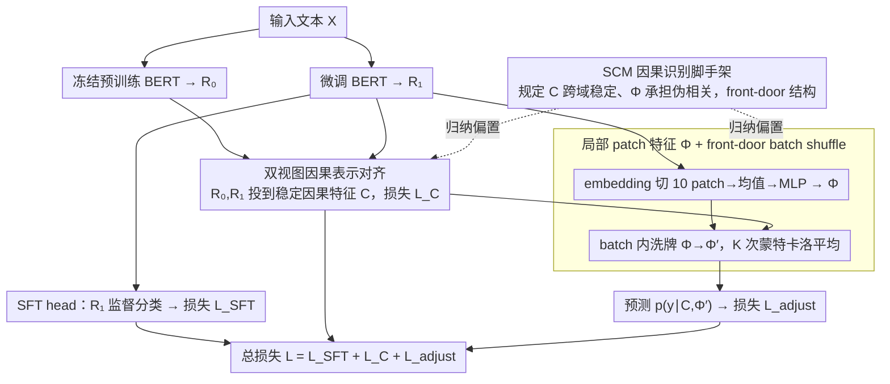

# Causal Fine-Tuning under Latent Confounded Shift

**会议**: ICML 2026  
**arXiv**: [2410.14375](https://arxiv.org/abs/2410.14375)  
**代码**: https://github.com/jialin-yu/CausalFineTuning (有)  
**领域**: NLP 理解 / 因果表示学习 / 分布外泛化  
**关键词**: 因果微调、隐变量混杂、front-door 调整、单域泛化、BERT

## 一句话总结
本文提出 Causal Fine-Tuning (CFT)：在标准 BERT 微调里嵌入一个 SCM 启发的"高级稳定特征 $C$ + 低级混杂敏感特征 $\Phi$"分解，并用 front-door 风格的 do-calculus 调整公式做预测，在文本伪相关注入攻击下显著优于 SFT/SWA/WISE 等单域泛化基线。

## 研究背景与动机
**领域现状**：基础模型（BERT/GPT/CLIP）的下游适配几乎都走"全参数 SFT 或 LoRA + ERM"的黑盒路线，把所有输入特征同等对待。

**现有痛点**：当训练数据存在隐变量驱动的伪相关时（例如 "Amazon" 标签和正面情感强相关），模型会学到捷径；部署时若伪相关翻转（Amazon 变成主要负面评论），模型急剧失效。传统 IRM 等不变性方法又要求多域标注或环境注释，对单域数据无能为力。

**核心矛盾**：标准微调里 $p(y\mid x;\sigma)=\sum_u p(y\mid u,x)\,p(u\mid x;\sigma)$ 中 $p(u\mid x;\sigma)$ 会随环境改变，但单域观测既识别不出 $u$ 也找不到环境标签，minimax 鲁棒优化在这种"看不见的混杂"下要么不可识别要么过度保守。

**本文目标**：单域微调下，把输入表示分解为(i) 跨环境稳定的因果分量 $C$；(ii) 环境敏感的低级局部分量 $\Phi$，并通过 do-calculus 调整把对 $\Phi$ 的依赖"抽掉"。

**切入角度**：把预训练 LM 自身当作"另一个隐式环境"——冻结模型给出 $R_0$，微调模型给出 $R_1$，两视图差异天然暴露了哪些维度对训练域敏感、哪些维度跨域稳定。

**核心 idea**：用 SCM 作归纳偏置，规定 $R_0,R_1$ 通过共享的稳定因果隐变量 $C$ 解释一致性、用低级局部特征 $\Phi$ 承担伪相关，再用 front-door 调整 $p(y\mid \mathrm{do}(x))=\sum_{\Phi',x'} p(y\mid\Phi',C)\,p(\Phi'\mid x')\,p(x')$ 在 batch 内 shuffle $\Phi$ 做 Monte-Carlo 估计。

## 方法详解

### 整体框架
训练阶段同时维护两个 BERT：冻结预训练模型 $p(r_0\mid x)$ 与微调模型 $p(r_1\mid x)$。每个样本经过三个 head：(1) SFT head 在 $R_1$ 上做有监督分类；(2) Causal head 学习从 $(R_0,R_1)$ 到稳定因果表示 $C$ 的映射；(3) Local head 从 $R_1$ 的 embedding 层抽 $\Phi$。最终预测器 $p(y\mid C,\Phi)$ 通过对 mini-batch 内 $\Phi$ 进行 $K=20$ 次 shuffle 做 do-calculus Monte-Carlo 调整。推理时丢弃冻结模型，$C$ 仅由 $R_1$ 估计，模型规模与标准 SFT 相同。

### 关键设计

**1. 基于 SCM 的因果识别 scaffold：把"哪些特征稳、哪些会变"画成一张可识别的图**

单域数据既识别不出隐变量 $u$、也没有环境标签，minimax 鲁棒优化要么不可识别要么过度保守。作者先用一张 SCM 图（Fig.2(b)）把问题结构化：高级稳定语义 $C$ + 低级混杂特征 $\Phi$ + 不可观测混杂 $U_S,U_\Phi$ + 环境 $\sigma$。图上假设 $\sigma$ 只通过 $S_1$ 影响 $R_1$、$\Phi$ 对 $Y$ 的影响完全经过 $C$（front-door 结构），再借 Von Kügelgen 的可识别性定理把 $C$ 写成不变投影 $p(C\mid R_0)\approx p(C\mid R_1)$。

这张图的价值在于把"训练-测试分布差异"精确等价于"$p(u\mid x;\sigma)$ 的变化"，从而论证 $p(y\mid\mathrm{do}(x))$ 在单域下能被 $p(y\mid\Phi,C)$ 加边际 $p(x)$ 写出来。问题于是从"对所有 $\sigma$ 都鲁棒"（minimax，过保守）转成"按 $\mathrm{do}(x)$ 的最大熵默认环境训练"，既可识别又不过度悲观。

**2. 双视图因果表示对齐 $\mathcal{L}_C$：把预训练模型当"免费的第二个环境"**

IRM 类不变性方法要多个真实环境，可 NLP 里环境标签几乎无从定义。作者的巧思是：冻结预训练模型给出 $R_0$、微调模型给出 $R_1$，这对"预训练 vs 微调"天然就是一对伪环境，它们的差异恰好暴露了哪些维度对训练域敏感、哪些跨域稳定。于是把两个视图都投到同一稳定因果空间 $C$，最小化 $\mathcal{L}_C=\mathbb{E}\,\|p(c\mid r_0)-p(c\mid r_1)\|_2^2 - H(p(c\mid r_0)) - H(p(c\mid r_1))$：第一项强制跨视图不变性，两个负熵项防止表示址缩到常数。

只用单域数据就逼出跨域稳定分量，正是靠这对伪环境替代了 IRM 的多域信号。这个设计的脆弱点也很明确——若把 $(R_1,R_1)$ 同视图替换进去（failure mode 实验），双视图信号消失，方法立刻退化成普通 SFT。

**3. 局部 patch 特征 $\Phi$ + front-door batch shuffle：用一行 shuffle 实现 do-calculus**

光分出 $C$ 还不够，得真的把伪相关那条因果路径切断。作者从微调模型的 embedding 层抽局部低层特征当伪相关代理：把 token 序列切成 10 个不重叠 patch，均值池化后过 MLP 得 $\Phi=\mathrm{MLP}(\frac{1}{10}\sum_i p_i)$——embedding 层最接近原始词形 / 数据源等低级线索。预测时在 mini-batch 内随机 shuffle $\Phi$ 得 $\Phi'\sim\hat{p}_B(\Phi)$，求 $\mathbb{E}_{\Phi'}[p(y\mid C,\Phi')]$，做 $K=20$ 次蒙特卡罗平均。

shuffle $\Phi$ 等价于断掉 $\sigma\to S_1\to R_1\leftrightarrow\Phi\leftrightarrow Y$ 这条 active collider 路径，把预测从 $p(y\mid x)$ 拽回 $p(y\mid\mathrm{do}(x))$。抽象的 do-calculus 就这样落成"对 batch 内 $\Phi$ 洗牌再平均"的一行代码，几乎不增训练成本——这是全文最实用的一招。

### 损失函数 / 训练策略
总目标 $\mathcal{L}=\mathcal{L}_{\text{SFT}}+\mathcal{L}_C+\mathcal{L}_{\text{adjust}}$，其中 $\mathcal{L}_{\text{adjust}}$ 是基于 shuffled $\Phi'$ 的交叉熵。优化器 AdamW，lr $5\times 10^{-5}$，10 个 epoch，BERT-base 初始化；保留一份冻结副本只用于 $R_0$ 抽取，训练完成后丢弃。

## 实验关键数据

### 主实验

| 数据集 | Test Spurious 10% | SFT | SWA | WISE | CFT |
|--------|------------------|-----|-----|------|-----|
| Yelp (Exp1, stop-word 攻击) | F1 | 49.24 | 62.92 | 55.91 | **58.40** (+9.16 vs SFT) |
| Amazon (Exp1) | F1 | 49.33 | 59.75 | 50.40 | **56.40** (+7.07) |
| Amazon (Exp2, data-source 攻击) | F1 | 37.78 | 47.41 | 31.83 | **49.22** (+11.44) |

在 ID（90% spurious）上 CFT 与 SWA/SFT 几乎并列，但 OOD（spurious 比例从 70% 降到 10%）越极端 CFT 优势越大；在原噪声 4× 与 8× 缩放下，CFT 超过 SWA 的差距进一步扩大。

### 消融实验

| 配置 | Spurious 10% F1 (Amazon) | 说明 |
|------|------------------------|------|
| Full CFT | 56.40 | 因果分解 + do-calculus |
| CFT-N（不做 do-shuffle，直接条件于 $\Phi$） | 48.00 | 留下 active collider，OOD 退化到 SFT 水平 |
| CFT-C（只用 $C$ 预测） | 53.40 | 比 SFT 强但弱于 full，说明 $\Phi$ 调整仍贡献几个点 |
| CFT-$\Phi$（只用 $\Phi$ 预测） | 12.40 | 几乎随机，证实 $\Phi$ 确实抓住了伪相关 |
| CFT (identical view $R_1,R_1$) | 37.24 | failure mode：去掉双视图信号后完全退化为 SFT |

### 关键发现
- $\Phi$ 单独预测在 OOD 上几乎随机（19/12 F1），反向证实其确实承担了伪相关，调整后才能让模型扛住分布翻转。
- 取消跨视图信号（identical view）方法立刻退回 SFT 水平，说明"双视图 + 不变性约束"是表示分解的真正源动力。
- shift 越强 CFT 越赢 SWA：默认噪声下 SWA 与 CFT 并驾齐驱，4×/8× 放大噪声后 CFT 全面领先，提示结构化方法在严重分布漂移下比通用正则更稳。
- 层选择敏感性研究（Table 6）显示 $\Phi$ 用 embedding 层在强 shift 下最稳，更高层选择在弱 shift 下仍有竞争力，符合"低层捕捉 shift-sensitive 线索、高层混杂语义"的预期。

## 亮点与洞察
- **把预训练模型当"免费环境"**：传统因果不变性方法（IRM/REx）必须收集多个真实环境，本文借冻结 vs 微调模型自然形成的两视图，用 Theorem 4.4 (Von Kügelgen) 一招拿到不变表示，省下多域数据收集成本，特别适合 NLP 这种环境标签难以定义的场景。
- **front-door + batch shuffle 实现极简 do-calculus**：把抽象的 $p(y\mid \mathrm{do}(x))$ 落地成"对 mini-batch 内 $\Phi$ 做 shuffle 然后平均"这一行代码级操作，几乎不增加训练成本却能切断隐式 collider 路径，思路漂亮且可迁移。
- **SCM 仅作 inductive bias，不强求识别真值**：作者明确说 $C/\Phi$ 是经验估计而非数据生成图的真实变量，方法工作的最低条件只是"两视图能区分一些信息"，failure mode 实验给出了诊断信号（$C\approx\Phi$ 时退化为 SFT），实用主义味道很重。

## 局限与展望
- 仅做文本情感分类 + 人为注入 spurious cue，没有覆盖真实的多源混杂（医院/平台/语言），尚不能证明在自然分布漂移下同样有效。
- 假设 front-door 结构成立（$\Phi$ 对 $Y$ 的效应完全经 $C$）——若现实里 $\Phi$ 直接残留对 $Y$ 的因果通路，识别就不再成立。
- shuffle $K=20$ 次的 batch 蒙特卡洛只对 batch 内分布建模，跨 batch 的 $p(\Phi)$ 估计仍依赖 i.i.d. 采样；patch 数（10）和 $\Phi$ 抽取层是经验选择，对超长文本或多模态尚需验证。
- 作者展望扩展到多模态：跨模态混杂变量 living in one modality but interacting with another 是合理且重要的下一步。

## 相关工作与启发
- **vs IRM/V-REx**：IRM 系列要求多域 + 环境标签学习不变特征 $\Phi(x)$，本文不需要环境标签，靠预训练-微调对实现"伪环境"对齐，单域数据可用。
- **vs SWA/WISE**：SWA/WISE 是通用 flat minima/参数插值正则，在中等 shift 下与 CFT 接近，但分布漂移越严重越被 CFT 超过，体现了"结构化因果调整"相对于"几何正则"的优势。
- **vs back-door causal attention (Yue 2020, Zhang 2020)**：back-door 需要观测混杂变量，本文用 front-door 适配"隐式混杂 + 文本"场景，与 Mao 2022 的 front-door causal intervention 一脉相承，但首次把"做 ERM 之外的 do-calculus 调整"做成可即插即用的 fine-tune 模块。

## 评分
- 新颖性: ⭐⭐⭐⭐ 把 front-door 调整 + 预训练/微调双视图对齐组合进 BERT 微调，问题切入和方法构造都有新意。
- 实验充分度: ⭐⭐⭐ 跨 Yelp/Amazon、多 shift 强度、多个消融和 failure mode 都覆盖了，但只在合成 spurious 注入上验证，缺乏真实多域数据。
- 写作质量: ⭐⭐⭐⭐ 因果图、定理、算法层层递进，明确区分"identification scaffold"与"实际学习的代理"，避免过度承诺。
- 价值: ⭐⭐⭐⭐ 给单域 NLP 微调提供了一个可即插即用的因果鲁棒化方案，对部署中常见的 dataset artifact 翻转有实际意义。

<!-- RELATED:START -->

## 相关论文

- [\[NeurIPS 2025\] Weak-to-Strong Generalization under Distribution Shifts](../../NeurIPS2025/nlp_understanding/weak-to-strong_generalization_under_distribution_shifts.md)
- [\[ACL 2026\] Lost in the Prompt Order: Revealing the Limitations of Causal Attention in Language Models](../../ACL2026/nlp_understanding/lost_in_the_prompt_order_revealing_the_limitations_of_causal_attention_in_langua.md)
- [\[ICML 2026\] Controlling the Risk of Corrupted Contexts for Language Models via Early-Exiting](controlling_the_risk_of_corrupted_contexts_for_language_models_via_early-exiting.md)
- [\[ACL 2026\] LexRel: Benchmarking Legal Relation Extraction for Chinese Civil Cases](../../ACL2026/nlp_understanding/lexrel_benchmarking_legal_relation_extraction_for_chinese_civil_cases.md)
- [\[ACL 2026\] MetFuse: Figurative Fusion between Metonymy and Metaphor](../../ACL2026/nlp_understanding/metfuse_figurative_fusion_between_metonymy_and_metaphor.md)

<!-- RELATED:END -->
