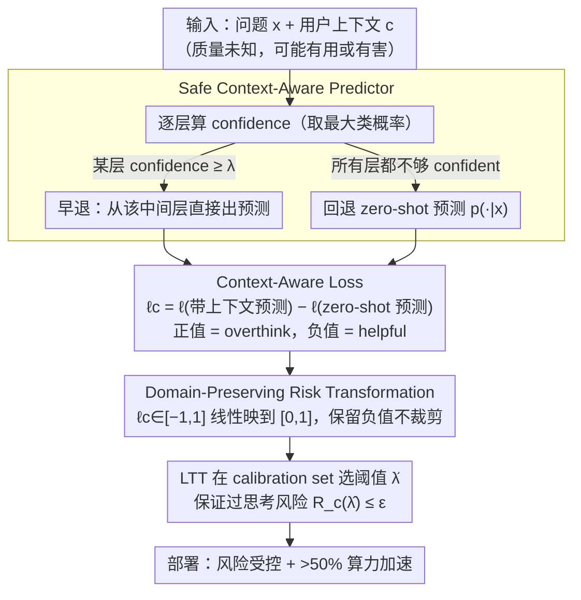

# Controlling the Risk of Corrupted Contexts for Language Models via Early-Exiting

**会议**: ICML 2026  
**arXiv**: [2510.02480](https://arxiv.org/abs/2510.02480)  
**代码**: https://github.com/andreawynn/controlling-corrupted-context-risk  
**领域**: NLP理解 / LLM安全 / 自适应推理  
**关键词**: 损坏上下文, 早退, 分布无关风险控制, 过思考, Learn-then-Test

## 一句话总结
本文把"用户提供的损坏上下文会降低 LLM 性能"这个问题形式化为风险控制——以 zero-shot 表现作"安全基线"，结合动态 early-exit（在中间层就出预测避免后层 overthink 有害上下文）+ context-aware 损失 + 改进的 Learn-then-Test 框架（保留负损失值用风险变换而非裁剪），在 9 个任务上既保证风险 ≤ user-specified $\epsilon$，又获得 > 50% 的算力加速。

## 研究背景与动机

**领域现状**：LLM 通过 prompt tuning / in-context learning 用用户提供的 context 适配任务，但损坏 context（无意标错、恶意注入、任务错指定）会显著降低输出质量；medical/clinical 部署场景里这种风险尤其严重（busy nurse 误标、biased clinician 偏见）。

**现有痛点**：（1）现有 hallucination 缓解多是 output post-processing 或全量 fine-tuning，缺乏"对任意用户上下文"的 principled safeguard；（2）Halawi 2024 指出 LLM 会 overthink 有害输入——中间层正确，深层反而被 harmful context 拽偏；他们提 prune attention heads，但是固定方案不能保证风险；（3）已有 early-exit 工作（CALM 等）做加速而非安全，没把 zero-shot 当 safe baseline。

**核心矛盾**：用户上下文质量未知——可能 helpful（要利用拿性能 + 加速）也可能 harmful（要丢弃回退 zero-shot）；需要一个能在两端都自适应的框架。

**本文目标**：（1）形式化"对损坏上下文的鲁棒性"为风险控制问题；（2）用 zero-shot 表现作 safe baseline 锚定；（3）通过 dynamic early-exit + 损失/risk 设计同时控风险 + 拿效率；（4）9 任务 5 模型 + 理论保证 + 实证验证。

**切入角度**：观察到（a）overthinking 主要在深层发生，early-exit 自然避免；（b）若 confidence 始终不够就 fallback 到 zero-shot 是个 robust 兜底；（c）用 context-aware loss $\ell_c = \ell(\bar y_\lambda(x,c), y) - \ell(\hat y(x), y)$ 量化"上下文带来的增益/损失"——正值就是 overthink、负值就是 helpful；（d）Learn-then-Test (LTT) 框架可在非单调风险上工作但要求 loss ∈[0,1]，本文用 risk-preserving 变换扩展到负损失。

**核心 idea**：safe context-aware predictor $\bar p_\lambda$ —— early-exit 出预测；若所有层 confidence 都不够，fallback 到 zero-shot；用 LTT 选 $\hat\lambda$ 保证 overthinking 风险 ≤ $\epsilon$。

## 方法详解

### 整体框架

base LLM $p$ 给定 $(x, c)$ → $p(\cdot|x, c)$；
1. **Safe context-aware predictor** $\bar p_\lambda$：从浅层到深层逐层算 confidence $\mathfrak{C}_l$，若 ≥ $\lambda$ 早退出；若所有层都不够，fallback 到 zero-shot $p(\cdot | x)$
2. **Context-aware loss** $\ell_c(\lambda; x, y, c) = \ell(\bar y_\lambda(x,c), y) - \ell(\hat y(x), y)$，正值 = overthink，负值 = helpful
3. **Risk control**：用 LTT 在 calibration set 上选 $\hat\lambda$ 使 $R_c(\hat\lambda) \leq \epsilon$
4. **Risk-preserving 变换**：把 $\ell_c \in [-1, 1]$ 线性变到 $[0, 1]$（不裁剪），保留负值信息

### 关键设计

**1. Safe Context-Aware Predictor：confidence 够就早退、始终不够就回退 zero-shot**

用户上下文质量未知——可能有用也可能有害，需要一个两端都能自适应的预测器。作者的做法是逐层算 confidence $\mathfrak{C}_l=\max_k p_l(k|x,c)$，从 layer 1 起遍历，第一个 $\ge\lambda$ 的层就出预测（早退能天然避开深层 overthink）；若所有层都不够 confident，就退回 zero-shot $p_L(\cdot|x)$，即 $\bar y_\lambda=\hat y_\lambda$ 当任一层 confident、否则 $\arg\max p_L(k|x)$。

关键在于把 zero-shot fallback 接进来：传统 early-exit 只为加速，而 zero-shot 是 pre-deployment 已充分测试的"已知 reliable"行为，一旦用户上下文有害，模型可以"装作没看见"退回安全基线。这一步把"加速"和"安全"统一进了同一个预测器。

**2. Context-Aware Loss：用 zero-shot 当参照系量化 overthinking**

要控风险，先得能测"上下文到底帮没帮忙"。作者定义 $\ell_c(\lambda;x,y,c)=\ell(\bar y_\lambda(x,c),y)-\ell(\hat y(x),y)$——同一模型下"用 context 的预测"减去"不用 context 的 zero-shot 预测"的损失差：正值说明 context 让结果更差（overthink），负值说明 context 帮了忙（helpful）。

以前的 early-exit loss 比较的是"早退 vs 全 forward"，可全 forward 本身已经被 harmful context 污染了，参照系是歪的。换成 zero-shot 当参照系，才能正确地把"context 是不是真有用"测出来，进而驱动后面的风险控制。

**3. Domain-Preserving Risk Transformation：让 LTT 能吃下含负值的损失**

Learn-then-Test 要求损失 $\ell\in[0,1]$，可 $\ell_c$ 天然带负值（helpful 时）。以往直接 clip 负值到 0，会丢掉"远好于 zero-shot"这部分信息，让 LTT 过保守。作者改用线性变换 $\ell'=(\ell_c-a)/(b-a)$、$\epsilon'=(\epsilon-a)/(b-a)$ 把 $\ell_c\in[-1,1]$ 映到 $[0,1]$，再在变换后空间选 $\hat\lambda$，并证明这个 $\hat\lambda$ 同时控制原始 risk $R(\ell)\le\epsilon$。

clip 之所以糟，是因为它无法区分"刚好等于 zero-shot"和"远好于 zero-shot"；保留这段信号后，LTT 就能在守住风险的前提下选更激进的早退，把效率多挤出 50%+。这是把"安全"和"效率"同时拿到的技术枢纽。

## 实验关键数据

### 9 任务跨 5 模型主结果（部分摘录）

| 任务 | Llama-3-8B baseline | + 早退（Loss-Clip）| **+ 本文方法** | 风险控制 ✓ |
|------|----------|--------|--------|------|
| AG News | 84.2 (慢) | 78.5 (快但保守) | **84.0** (快且 ε≤0.05) | ✓ |
| Financial | 79.3 | 73.8 | **78.9** | ✓ |
| TE-Hate | 65.4 | 58.7 | **64.8** | ✓ |
| SQuAD-v2.0 (open-ended) | 71.2 | 64.5 | **70.7** | ✓ |

风险变换让方法不再过度保守，accuracy 几乎不掉但 latency 大幅降。

### 效率提升（vs CALM clip 基线）

| 任务 | 本文加速 | Clip 加速 |
|------|--------|--------|
| AG News | **2.1×** | 1.3× |
| Financial | **1.8×** | 1.2× |
| TE-Atheism | **1.9×** | 1.2× |
| SQuAD-v2 | **1.7×** | 1.1× |

本文相比 clip 一致 > 50% 额外加速；所有任务都 > 1.7×。

### 风险控制验证

跨所有 task × model × $\epsilon$ ∈ {0.01, 0.05, 0.1}：empirical risk 始终 ≤ $\epsilon$（Figure 5/6），证明 DFRC 保证有效；不依赖 helpful/harmful context 的混合比例（验证了 distribution-free 性质）。

### Zero-shot fallback 的选择性

unsafe（unanswerable）questions 上 fallback 频率比 safe 高 **3.3×**（3.0% vs 0.9%）；fallback 发生时 zero-shot 在 71% case 上比 early-exit 好——证明 fallback 在该 fall 时 fall。

### 关键发现
- **zero-shot 作 safe baseline 是关键**：把 "context 该不该用" 形式化为"vs zero-shot"，整个 risk control 框架才能落地
- **risk-preserving 变换 vs clip**：clip 让 LTT 过保守损失加速；变换保留信号，加速 +50%+
- **跨 9 任务 + 5 模型一致**：方法不挑数据、不挑模型，从 LLaMA-2/3 到 LayerSkip 变体都受益
- **selective fallback**：fallback 频率与 unsafe-ness 强相关（3.3×），证明判别是 working

## 亮点与洞察
- **第一个把"用户上下文风险"做成 principled DFRC 问题**：以往 hallucination 缓解都是 heuristic post-processing；本文给出统计意义上的 $\epsilon$-控制保证，对 high-stakes（医疗、法律、金融）部署有真正意义
- **用 zero-shot 作 safe baseline 是聪明 framing**：以前没人想过 LLM 的"安全行为"该用 zero-shot 锚定——这把"知道少 vs 被骗"两端打通
- **risk-preserving 变换是技术贡献**：扩展 LTT 到含负损失是 small 但 important 的方法学改进，可推广到任何"既要安全又要效率"的 risk control 场景
- **效率是 free byproduct**：safe + 2× faster——以前都把 safety 和 efficiency 当 trade-off，本文证明设计对了可以同得

## 局限性 / 可改进方向
- 依赖 confidence-based 早退；某些任务（开放生成）confidence 不稳——可考虑 ensemble / learned exit
- zero-shot 本身在某些任务上可能差，fallback 也救不了——需要更强的 safe baseline 概念
- LTT 需要 calibration set $\mathcal{D}_{\text{cal}}$，分布偏移下 calibration 可能失效
- 仅在分类 + 开放 QA 验证；多轮对话、agent 任务上效果未知
- 没分析对 adversarial context（专门针对早退机制设计的攻击）的鲁棒性

## 相关工作与启发
- **vs CALM (Schuster 2022)**：CALM 做早退加速但 loss clip 过保守；本文用 risk-preserving 变换 + zero-shot fallback
- **vs Halawi 2024（attention head pruning）**：那个固定剪枝；本文动态早退 + DFRC 保证
- **vs Conformal Prediction**：那个给 prediction set 覆盖保证；本文给 risk 控制保证，更通用
- **启发**："zero-shot 作 safe baseline" 思路可推广到所有"用户提供输入可能有害"的场景（如 retrieval-augmented gen 用 baseline LLM 当 fallback、tool-use agent 用 no-tool 当 fallback）

## 评分
- 新颖性: ⭐⭐⭐⭐ DFRC + early-exit + zero-shot fallback 的组合是新的；单组件都有先例
- 实验充分度: ⭐⭐⭐⭐⭐ 9 任务 × 5 模型 + 风险控制理论验证 + clip vs 变换对比，完整
- 写作质量: ⭐⭐⭐⭐⭐ 形式化清晰，Figure 1/2/3 直观；从动机到方法到实验链条扎实
- 价值: ⭐⭐⭐⭐⭐ 直接服务 high-stakes LLM 部署（医疗、金融、法律），风险控制保证 + 效率提升双赢

<!-- RELATED:START -->

## 相关论文

- [\[ACL 2026\] The Imperfective Paradox in Large Language Models](../../ACL2026/nlp_understanding/the_imperfective_paradox_in_large_language_models.md)
- [\[AAAI 2026\] Language Models and Logic Programs for Trustworthy Tax Reasoning](../../AAAI2026/nlp_understanding/language_models_and_logic_programs_for_trustworthy_tax_reasoning.md)
- [\[ACL 2026\] AdapTime: Enabling Adaptive Temporal Reasoning in Large Language Models](../../ACL2026/nlp_understanding/adaptime_enabling_adaptive_temporal_reasoning_in_large_language_models.md)
- [\[ACL 2026\] Lost in the Prompt Order: Revealing the Limitations of Causal Attention in Language Models](../../ACL2026/nlp_understanding/lost_in_the_prompt_order_revealing_the_limitations_of_causal_attention_in_langua.md)
- [\[ACL 2026\] Table Question Answering in the Era of Large Language Models: A Comprehensive Survey](../../ACL2026/nlp_understanding/table_question_answering_in_the_era_of_large_language_models_a_comprehensive_sur.md)

<!-- RELATED:END -->
