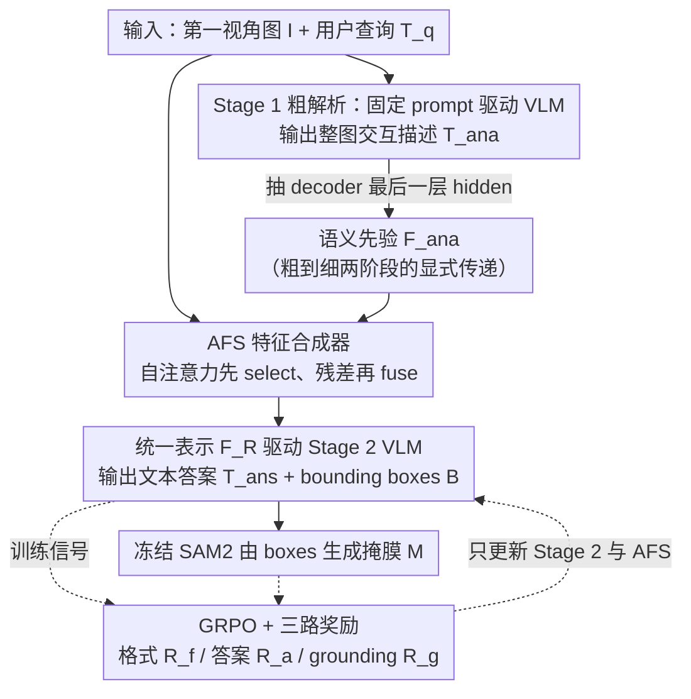

# EARL: Towards a Unified Analysis-Guided Reinforcement Learning Framework for Egocentric Interaction Reasoning and Pixel Grounding

**会议**: ICML 2026  
**arXiv**: [2605.14742](https://arxiv.org/abs/2605.14742)  
**代码**: https://github.com/yuggiehk/EARL  
**领域**: 第一人称视觉 / MLLM / 像素级 grounding / 强化学习 (GRPO)  
**关键词**: Ego-IRG、coarse-to-fine、Analysis-guided Feature Synthesizer、多面奖励、SAM2

## 一句话总结
EARL 用"粗解析-细响应"两阶段 MLLM 框架把第一视角交互理解任务（描述+答问+像素掩膜）做成统一管线：第一阶段输出整图交互的全局描述并把最后一层 hidden state 当作语义先验，再通过新的 Analysis-guided Feature Synthesizer 注入到第二阶段，用 GRPO + 三路奖励（格式/答案/grounding 准确率）联合训练，在 Ego-IRGBench 上 cIoU 反超 Seg-Zero 8.37%。

## 研究背景与动机

**领域现状**：第一人称视觉（FPV / egocentric）研究因为头戴设备的普及（GoPro、Aria 等）成为热点，目前主流方向是把"动作识别"、"图像描述"、"人物交互检测"这些子任务**独立**做，或者用 MLLM 端到端做 Ego-IRG（交互推理 + grounding）三件套——给一张第一视角图和一句用户 query，要同时输出 (i) 整体交互分析文本、(ii) 针对 query 的回答、(iii) 涉及实体的像素掩膜。

**现有痛点**：(1) 主流通用 MLLM（Qwen2.5-VL/InternVL3）在 Ego 数据上 cIoU 卡在 20-30 区间，根本没学会 ego 视角下"手-物"的几何约束；(2) ANNEXE 这种专门做 Ego-IRG 的方法虽然 analysis 文本生成挺好（CIDEr 1.49），但 grounding 仍然只有 36% cIoU；(3) RL 系的 Seg-Zero / Seg-R1 把通用分割推理做到 57% 上下，但缺乏 ego 任务特有的"交互上下文"先验。

**核心矛盾**：分析（understanding）和响应（answer+grounding）两个阶段之间的**信息流是断的**——前者好不容易理解了"手在握杯子"，后者却要从零开始为 query 重新读图。简单地把两阶段拼起来又会引入"噪声先验"问题：分析阶段产生的特征不全是有用的，盲目融合会拖累 grounding。

**本文目标**：把粗分析的语义显式传给细响应阶段，同时设计能选择性使用先验的融合模块，并用 RL 联合优化"文本对错"+"box 准不准"两个异质目标。

**切入角度**：作者观察到，分析阶段 VLM decoder 的最后一层 hidden embedding 就是一个天然的"交互语义先验"（global interaction descriptor $\mathbf{F}_{ana}$），只要设计一个"先选择再融合"的模块就能避免噪声污染。

**核心 idea**：用 coarse-to-fine 两阶段 + AFS（先用自注意力精炼分析先验，再加到主特征上）+ GRPO 多面奖励，统一解决文本、box、mask 三个异质输出。

## 方法详解

### 整体框架
输入：一张第一视角图 $\mathcal{I}$ + 用户查询 $T_q$。整个 pipeline 分两段：

- **Stage 1 (coarse-grained interpretation)**：固定 prompt $T_a$ = "Please analyze the interactions of hands and objects in detail"，由 VLM decoder $\mathcal{D}_{vlm}$ 输出整体描述 $T_{ana}$，**关键副产品**是最后一层 hidden 当作 global descriptor $\mathbf{F}_{ana}$。这个阶段用 cross-entropy loss 普通监督训练。
- **Stage 2 (fine-grained response)**：另一个 VLM decoder $\mathcal{D}_{vlm}^{\prime}$（Qwen2.5VL-7B）在 query 上给出文本答案 $T_{ans}$ 和 bounding boxes $\mathcal{B}$；boxes 喂给冻结的 SAM2 得到最终掩膜 $\mathcal{M}$。两阶段之间通过 AFS 把 $\mathbf{F}_{ana}$ 注入到主特征。这个阶段用 GRPO + 三路 reward 训练。

### 关键设计

**1. Coarse-to-fine 两阶段 + 语义先验显式传递：让第二阶段"开局就已经看懂这张图"**

朴素的两阶段 cascade 只把第一阶段的文本 $T_{ana}$ 拼进第二阶段的 prompt，信息在"理解→响应"之间被文本压缩掉一大半，第二阶段等于从零重新读图。EARL 的做法是第一阶段不只输出描述文本，还把 $\mathcal{D}_{vlm}$ 最后一层 hidden 抽出来当作 global interaction descriptor $\mathbf{F}_{ana}\in\mathbb{R}^{bs\times dim_i}$；第二阶段把它和 query 编码 $\mathcal{E}_t^{\prime}(T_q)$、视觉编码 $\mathcal{E}_v(\mathcal{I})$ 一起送进 AFS，得到统一表示 $\mathbf{F}_R=\mathcal{F}_s(\mathcal{E}_v(\mathcal{I}),\mathcal{E}_t^{\prime}(T_q),\mathbf{F}_{ana})$，再由 $\mathbf{F}_R$ 同时驱动文本答案、box、mask 三个输出。用 hidden state 而不是文本当先验有两个好处：信息密度高、不经文本瓶颈丢信息；并且天然和第二阶段的特征空间对齐，融合更顺——这正是它比"文本拼 prompt"的 cascade 强很多的原因。

**2. Analysis-guided Feature Synthesizer (AFS)：先 select 再 fuse，挡住"噪声先验"**

直接把 $\mathbf{F}_{ana}$ concat 或 cross-attn 到主特征 $\mathbf{F}_{emb}$（Qwen2.5-VL 先做视觉+文本对齐的输出）上，会把分析阶段产生的无用维度也一并带进来，反而拖累 grounding。AFS 的关键是先让先验对自己做一遍重权再融合：用 MLP $\phi_m$ 把 $\mathbf{F}_{ana}$ 降到 $dim$ 维并过 LayerNorm，reshape 成 $bs\times h\times w$（$h=w=\sqrt{dim}$）后用卷积生成 $\mathcal{Q},\mathcal{K},\mathcal{V}$，做一次自注意力 $\mathbf{F}=\text{softmax}(\mathcal{Q}\mathcal{K}^\top/\sqrt{dim})\mathcal{V}$ 对先验自身 token 重权，再过 MLP $\phi_m^{\prime}$ 投回主特征维度，以残差形式相加 $\mathbf{F}_{out}=\mathbf{F}_{emb}+\phi_m^{\prime}(\mathbf{F})$。这一步自注意力相当于先把重要语义维度放行、把噪声维度压低，再用残差轻量注入——模块结构很简单，却恰好解决了"用 hidden 做先验"绕不开的工程难题。

**3. GRPO + 三路奖励：在一次输出里同时优化文字、box、mask 三种异质结构**

"文字答得对不对"是语义目标、"框准不准"是几何目标，SFT 很难联合优化这种混合目标，DPO 又要成对样本。EARL 用 GRPO（Group Relative Policy Optimization）把三类信号拆成三路 reward 加权：格式奖励 $\mathcal{R}_f$ 检查输出是否符合 `<answer>`/`<box>` 等模板；答案奖励 $\mathcal{R}_a$ 测 $T_{ans}$ 与 GT 答案的语义相关度；grounding 奖励 $\mathcal{R}_g$ 把预测 box 喂给冻结的 SAM2 得到 mask，再与 GT mask 算 IoU。GRPO 用 group 内 K 个 rollout 的平均 reward 当 baseline，省掉训 critic 的麻烦，天生适合"一次输出多种异质结构"的场景；训练时视觉编码器、文本编码器、SAM2 全冻结，只更新 $\mathcal{D}_{vlm}^{\prime}$ 和 AFS。把 SAM2 当冻结的 reward provider 也避免了 reward 信号被噪声 mask 污染。

### 损失函数 / 训练策略
- Stage 1：cross-entropy loss $\mathcal{L}_{des}$ 监督 $T_{ana}$。
- Stage 2：GRPO 优化期望奖励 $\mathbb{E}[\mathcal{R}_f+\mathcal{R}_a+\mathcal{R}_g]$，K-rollout group baseline。Backbone 是 Qwen2.5VL-7B，mask 生成器是 SAM2。

## 实验关键数据

### 主实验

Ego-IRGBench test set（覆盖分析 M/CIDEr、答案 M/CIDEr、grounding cIoU）：

| 方法 | 类型 | Analysis CIDEr | Answer CIDEr | cIoU |
|------|------|---------------|--------------|------|
| Qwen2.5VL-7B | 通用 | 0.119 | 2.477 | 23.71 |
| InternVL2.5-7B | 通用 | 0.044 | 1.533 | 27.21 |
| ANNEXE | Ego 专用 | 1.494 | 2.590 | 36.02 |
| Sa2VA-8B | grounding 专用 | 0.115 | 2.656 | 32.69 |
| Seg-R1-7B | RL grounding | 0.289 | 2.483 | 46.10 |
| Seg-Zero | RL grounding | 0.049 | 2.380 | 57.11 |
| **EARL** | Ego + RL | **1.522** | **6.682** | **65.48** |
| vs 次优 | | +0.028 | +1.682 | **+8.37** |

OOD 测试（EgoHOS 数据集，cross-dataset 直接评估）：

| 方法 | 总 cIoU | Left Hand | Right Hand | Two-hand Objects |
|------|---------|-----------|------------|------------------|
| LISA | 22.46 | 28.93 | 33.06 | 18.10 |
| Sa2VA-8B | 37.63 | 48.56 | 45.82 | 37.04 |
| **EARL** | 见论文 | - | - | - |

### 消融实验

论文针对 AFS 和奖励设计做了消融（具体数字 paper Sec. 4.3）。从主表能反推：

| 配置 | Answer CIDEr | cIoU | 说明 |
|------|--------------|------|------|
| Qwen2.5VL-7B baseline | 2.477 | 23.71 | 不做 coarse 解析 |
| ANNEXE（同样两阶段但无 AFS+GRPO） | 2.590 | 36.02 | 只有 cascade 没有 hidden 注入 |
| EARL (full) | 6.682 | 65.48 | 完整方法 |

### 关键发现
- **Answer CIDEr 暴涨 1.68 个点**是个出乎意料的副产品——说明显式注入 analysis hidden 不只帮 grounding，也让文本答案明显更准。
- **cIoU +8.37 pp 全部来自 Ego 任务知识**：Seg-Zero 用通用图像就能做到 57，EARL 加了 ego 解析先验直接冲到 65，验证"先理解整图交互再做 grounding"的设计哲学。
- **OOD 上仍然领先**说明 AFS 学到的语义先验不是过拟合 Ego-IRGBench，而是真正的 ego-视角交互通用知识。
- Stage 1 的分析质量（M=0.541）和 Sa2VA 一致，说明大部分 grounding 收益不来自分析变好而来自"分析特征被显式传递"，这反过来印证了 AFS 的价值。

## 亮点与洞察
- **把 VLM decoder 的 hidden state 当显式可传递的语义先验是非常实用的技巧**：之前大家要么用文本 cascade（信息丢失），要么用整网络共享参数（强耦合），EARL 找到了第三条路。这个 trick 可以直接迁移到任何"先理解后操作"的 MLLM 任务，比如先描述图表再做 VQA、先描述代码再做 bug 定位。
- **"先 self-attention 自我精炼，再加到主特征"是处理噪声先验的好模板**：直接 concat 容易把噪声维度也带进来，AFS 这种"轻量自注意力先 select、再用残差加"的设计简单可复用。
- **GRPO + 多 reward 解决异质输出**：把格式/语义/几何三类 reward 各自归一化后线性组合，给 group baseline 训练，避免训 critic 的麻烦。对所有"一次输出多种结构"的任务（结构化生成、code+test 一起出）都有借鉴价值。
- **OOD 涨点说明这套架构学到的是 transferable 的"ego 视角交互几何"**，对 robot manipulation、AR 辅助系统等下游有直接价值。

## 局限与展望
- **Analysis CIDEr 比 ANNEXE 略低 0.021**：说明用 GRPO 反向优化 stage 2 时，可能会反过来抑制 stage 1 的分析多样性，作者也提到这是一个 trade-off。
- **依赖 SAM2 作为 mask 生成器和 reward provider**：如果 SAM2 在某类场景（低光、运动模糊）失效，整个 reward 信号会被污染，EARL 没办法独立训出 mask 头。
- **两阶段串行推理延迟翻倍**：实时性要求高的 AR/robotic 场景需要进一步蒸馏。
- **AFS 里 hidden state reshape 成 $\sqrt{dim}\times\sqrt{dim}$ 用 conv 处理**有点 ad-hoc，不一定比 token-level attn 优雅。
- **未在视频流上验证**：Ego-IRG 真正的应用场景是视频，单帧测试只是第一步。
- **改进方向**：(i) 用 stage 1 的 box 监督做半自监督的 stage 2 启动；(ii) 用 LoRA 共享部分参数减小两阶段总开销；(iii) 把 SAM2 替换成可学的轻量 mask head 端到端联训。

## 相关工作与启发
- **vs ANNEXE**：ANNEXE 也是两阶段，但只在文本层 cascade，没有 hidden 先验传递，所以 grounding 卡在 36；EARL 通过 AFS 显式注入特征 + GRPO 联训，直接拉到 65。
- **vs Seg-Zero / Seg-R1**：通用 RL 分割方法，把分割当 reasoning 任务，但不知道 ego 场景"手-物-动作"的先验；EARL 加上 ego 分析阶段后大涨 8.37 cIoU，验证领域先验的重要性。
- **vs Sa2VA**：Sa2VA 在 ego 上 cIoU 才 32.69，是因为它用 grounding 监督学的通用像素能力，没有交互上下文；EARL 反向证明 ego 任务必须"先理解再分割"。
- **vs LISA / GSVA**：纯 referring image segmentation，没有 ego 交互建模，cIoU 都在 22 以下，EARL 是直接换框架而不只是涨数据。

## 评分
- 新颖性: ⭐⭐⭐⭐ AFS + hidden 先验是清新的工程组合；coarse-to-fine + GRPO 也不算独创但组合得当
- 实验充分度: ⭐⭐⭐⭐⭐ in-domain + OOD 全覆盖，对比 15+ baseline 横跨通用/Ego/分割/RL 四类
- 写作质量: ⭐⭐⭐⭐ 公式清晰、AFS 架构图友好，但消融部分被压缩到 sec 4.3 之后才详细展开
- 价值: ⭐⭐⭐⭐ 给"先 understand 再 act"类 MLLM 任务提供了可复用的工程模板，对 ego/AR/robot 都有直接落地价值

<!-- RELATED:START -->

## 相关论文

- [\[CVPR 2026\] ADSeeker: A Knowledge-Grounded Reasoning Framework for Industry Anomaly Detection and Reasoning](../../CVPR2026/object_detection/adseeker_a_knowledge-grounded_reasoning_framework_for_industry_anomaly_detection.md)
- [\[AAAI 2026\] Connecting the Dots: Training-Free Visual Grounding via Agentic Reasoning](../../AAAI2026/object_detection/connecting_the_dots_training-free_visual_grounding_via_agent.md)
- [\[ICML 2025\] Outlier Gradient Analysis: Efficiently Identifying Detrimental Training Samples for Deep Learning Models](../../ICML2025/object_detection/outlier_gradient_analysis_efficiently_identifying_detrimental_training_samples_f.md)
- [\[CVPR 2026\] Dual-Prototype-Guided Multi-task Learning for Unsupervised Anomaly Detection and Classification](../../CVPR2026/object_detection/dual-prototype-guided_multi-task_learning_for_unsupervised_anomaly_detection_and.md)
- [\[ECCV 2024\] Nonverbal Interaction Detection](../../ECCV2024/object_detection/nonverbal_interaction_detection.md)

<!-- RELATED:END -->
