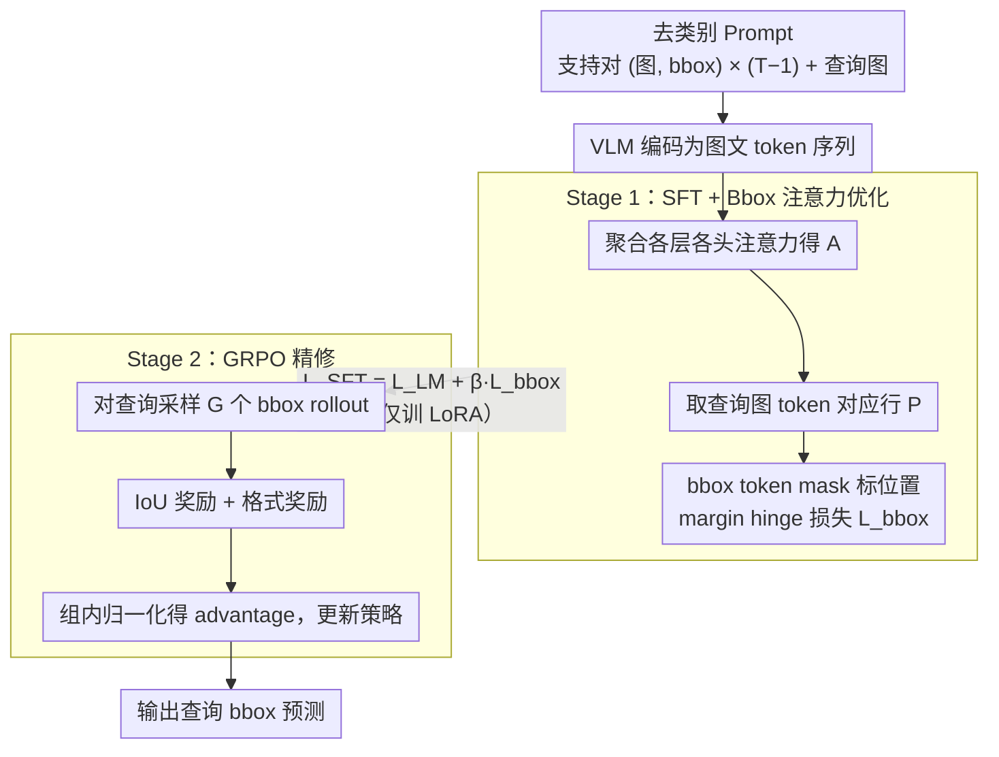

# FOCUS: Forcing In-Context Object Localization through Visual Support Constraints and Policy Optimization

**会议**: ICML 2026  
**arXiv**: [2605.31145](https://arxiv.org/abs/2605.31145)  
**代码**: 待确认  
**领域**: 目标检测 / 多模态VLM / 上下文学习  
**关键词**: 上下文目标定位, 视觉支持约束, 注意力优化, GRPO, 类别无关

## 一句话总结
FOCUS 通过"完全去除类别名 + 注意力 mask 优化 + GRPO IoU 奖励"两阶段训练，让 VLM 真正按视觉支持示例（而非语义先验）做 in-context 目标定位；7B 参数模型超 72B 模型，证明任务对齐的 inductive bias 比单纯 scaling 更重要。

## 研究背景与动机

**领域现状**：In-context Object Localization (ICOL) 让模型只看 1-K 个支持例（带 bbox）就在 query 图上定位同一对象，无需训练或类别词表——对个性化视觉搜索、图编辑、交互式追踪等用户驱动应用至关重要。

**现有痛点**：（1）当前 VLM 在 ICOL 上严重依赖**类别名称偏置**：query 中含类别词时，模型会跳过 visual support 直接按 semantic prior 定位，遇到同类多实例就错；（2）IPLoc 用 pseudo-label 训练试图减弱类别依赖，但推理时仍用真实类别名，train-test mismatch 让 bias 卷土重来；（3）即使 pseudo-label 训练，模型仍**忽视 bbox 几何 / 空间相对位置**等细粒度线索，靠粗略视觉相似或残留类别相关性。

**核心矛盾**：要做真正的 instance-specific 定位（区分同类多实例），必须强制模型用 visual support 的几何而非语义先验；但当前训练目标只优化最终 bbox 准确性，没显式约束注意力分配——模型最省力的路径就是"识别类别再随机选实例"。

**本文目标**：（1）完全去类别名让 visual support 唯一指示目标；（2）注意力损失强制 query token 关注 query 图和 bbox token；（3）GRPO + IoU reward 精修 bbox 对齐；（4）7B 模型超 72B 模型证明 task-aligned objective > scale。

**切入角度**：实证发现（论文 §3）—— vanilla VLM 把大量 attention 给类别 token、给 query 图和 bbox token 的注意力远不足；即使去类别（vanilla wo/c）attention 也是 diffuse 不集中在 support 对应区域。这说明问题不是缺信息而是 attention 错配——直接监督 attention 比改其他都管用。

**核心 idea**：两阶段——Stage 1 SFT 加 bbox attention optimization（强制 query token 给 bbox token 高 attention）；Stage 2 GRPO IoU reward 微调（直接最小化定位误差）。

## 方法详解

### 整体框架

**Prompt 设计**：完全无类别词，只有 task description + interleaved (image, bbox) 对，最后一张是 query；模型输出 `<answer>[xmin,ymin,xmax,ymax]</answer>`

输入序列：$\mathcal{C} = \langle \text{prompt}, (I_1, b_1), \dots, (I_{T-1}, b_{T-1}), I_T \rangle$ —— 注意无类别信息

**训练两阶段**：
1. Stage 1：SFT + bbox attention mask 损失（强制 query token 给 bbox token 高 attention），仅训练 LoRA 权重
2. Stage 2：GRPO + IoU reward 微调

### 关键设计

**1. 完全去除类别词的 Prompt：把语义捷径从根上断掉**

VLM 在 ICOL 上严重依赖类别名偏置——query 里只要出现"dog""bowl"这种词，模型就跳过 visual support 直接按 semantic prior 定位，遇到同类多实例必错。IPLoc 等用 pseudo-label 训练想削弱这种依赖，但推理时仍喂真实类别名，train-test mismatch 让 bias 卷土重来。FOCUS 干脆让 prompt 只描述任务（"locate the same object across frames"）和输出格式，完全不含任何类别名；输入序列 $\mathcal{C} = \langle \text{prompt}, (I_1, b_1), \dots, (I_{T-1}, b_{T-1}), I_T \rangle$ 里，支持图配 bbox、query 图无 bbox 待预测。train 和 test 都无类别名，让 visual support 成为唯一的目标指示器，从根本上断开 semantic shortcut。

**2. Bounding Box Attention Optimization：直接监督 query token 该看哪里**

论文 §3 的证据显示：即便去掉类别词，vanilla 模型的 attention 仍然 diffuse，并不集中在 support 对应区域——问题不是缺信息，而是 attention 错配。FOCUS 于是显式监督注意力分布：先把各层各头的 attention 聚合成 $A = \tfrac{1}{LH}\sum_{\ell, h} A^{(\ell, h)}$，取出 query image token 对应的行 $P \in \mathbb{R}^{N \times T}$，用 binary mask $m$ 标出 support 的 bbox token 位置。它不直接拉高 bbox token 的绝对注意力，而是用一个 **margin hinge 损失**：先算每个 query token 落到 bbox token 上的平均注意力 $p^+_i$ 与落到非 bbox token 上的平均注意力 $p^-_i$，取偏好间隔 $\Delta_i = p^+_i - p^-_i$，再以 $\mathcal{L}_{\text{bbox}} = \tfrac{1}{N}\sum_i \max(0, \mu - \Delta_i)^2$ 强制 bbox token 比无关 token 至少高出 margin $\mu$。它和语言建模损失合成 SFT 目标 $\mathcal{L}_{\text{SFT}} = \mathcal{L}_{\text{LM}} + \beta\,\mathcal{L}_{\text{bbox}}$（只更新 LoRA 权重）。这是 attention 工程而非架构创新，却是单组件里最大的贡献（消融里 +4.5 AP），因为它强迫模型真正去“看 support 的几何”，而不是停留在类别相关的浅层模式上。

**3. GRPO + IoU Reward 精修：用 RL 直接对齐定位误差**

SFT 的 token-level cross-entropy 和“bbox 几何对不对齐”只是间接相关，模型最省力的解未必是几何最优。FOCUS 在 SFT 收敛后接一段 GRPO（Group Relative Policy Optimization）：对每个 prompt 采样 $G$ 个 bbox rollout，奖励由两部分组成——IoU 奖励 $r_{\text{iou}}=\text{IoU}(b_{\text{pred}}, b_{\text{qry}})$ 直接对齐查询真值、格式奖励则约束输出符合 `<answer>[xmin,ymin,xmax,ymax]</answer>` 的语法。组内对奖励做均值/方差归一化得到 advantage $A_i$，无需 critic。RL 目标和任务目标（IoU）完全一致，GRPO 在 bbox 坐标这种结构化连续输出、小 batch 下又比 PPO 更稳——消融里 SFT 之后再加 GRPO 还能涨 3.3 点，正是补上了“SFT loss 与 IoU 间接对齐”的缺口。

## 实验关键数据

### 主结果：跨基准 vs 大模型

| 模型 | 参数量 | RefCOCO+ AP@50 | RefCOCO++ | Visual-Genome AP |
|------|------|---------|---------|------|
| IPLoc (Qwen2-VL-7B) | 7B | 38.4 | 32.7 | 41.2 |
| Qwen2-VL-72B | 72B | 42.1 | 36.5 | 45.6 |
| LLaVA-OV-72B | 72B | 41.7 | 36.0 | 44.9 |
| **FOCUS (Qwen2-VL-7B)** | **7B** | **48.6** | **43.2** | **52.7** |

7B 的 FOCUS 显著超 72B 通用 VLM——证明任务对齐 objective 比 10× scaling 更有效。

### 消融（RefCOCO+ AP@50）

| 配置 | AP@50 |
|------|------|
| 完整 FOCUS | 48.6 |
| − GRPO（仅 Stage 1 SFT）| 45.3 |
| − Attention Mask Loss | 40.8 |
| − 去类别名（仍含 category）| 39.5 |
| Vanilla SFT baseline | 38.4 |

attention mask loss 是单组件最大贡献（+4.5）；去类别 + GRPO 各加 1-3 点；三者协同。

### 注意力分析

vanilla baseline：query token → category token attention 比 query/bbox token 高
FOCUS：query token → bbox token 和 query image attention 显著提升（论文 Figure 2 的 layer-wise heatmap）

### 同类多实例 case

vanilla：场景含多个"碗"时，IPLoc 错指随机一个碗
FOCUS：根据 support bbox 的几何（如左下角的碗），正确定位特定实例

### 关键发现
- **任务对齐目标 > 单纯 scaling**：7B + FOCUS 胜 72B 通用 VLM 10+ 点
- **attention mask loss 是关键单组件**：+4.5 AP，比 GRPO 单独 (+3.3) 影响更大；说明问题主要在 attention 错配
- **完全去类别名 vs pseudo-label**：完全去除胜 partial（pseudo-label）路线，train-test consistency 关键
- **GRPO 精修在 SFT 后涨 3.3 点**：RL 直接优化 IoU 解决 SFT-IoU 间接对齐问题

## 亮点与洞察
- **"对齐 inductive bias > 单纯 scale" 的 demonstrative case**：7B 胜 72B 是个有力示例——对所有"任务需要特定归纳偏置"的工作鼓舞
- **完全去类别名的彻底性**：以前都"减弱"类别依赖，本文直接断；这种"激进 ablate"思路常出意外好效果
- **attention loss 是个通用工具**：把 attention 当可监督对象，从结构上指挥模型注意力——可推广到所有"模型该看哪里"明确的任务（VQA、图文匹配等）
- **GRPO 在结构化输出上稳**：bbox 坐标作连续输出，GRPO 比 PPO 在小 batch 下更稳，这套训练范式对所有 VLM 定位/检测 RL 都受用

## 局限性 / 可改进方向
- 完全去类别名让模型在某些场景丢失重要先验（如类别就是判别的关键时）—— task-aware 类别使用可能更平衡
- attention mask 是手工设计，按 bbox token 位置定；对长 prompt 或复杂 layout 可能不准
- 仅评 single-object localization；多 object / panoptic segmentation 扩展未试
- 仅在 RefCOCO 系列 + VG 验证；novel domain（医学、卫星）上的 visual support 是否同样有效未测
- 7B 模型本身规模限制；要进一步 push，需更大底座或更精细的 attention 监督

## 相关工作与启发
- **vs IPLoc（Doveh 2025）**：那个用 pseudo-label 训但推理用真类别，train-test mismatch；FOCUS 一致地去类别
- **vs GLIP / GroundingDINO**：那些 text-conditioned grounding；FOCUS pure visual conditioning，open-set 更强
- **vs few-shot detection（Bertinetto / Shaban）**：那些 episodic / meta-learning + 架构改动；FOCUS 推理时 in-context 无架构改动
- **启发**：所有"VLM 该看哪里" 类问题都可考虑显式 attention 监督；"完全去除某种 shortcut"思路（vs 部分减弱）在去 bias 中常更有效

## 评分
- 新颖性: ⭐⭐⭐⭐ Attention mask + GRPO + 去类别 的组合是新的；attention 监督本身有先例
- 实验充分度: ⭐⭐⭐⭐⭐ 多基准 + 多 VLM 规模对比 + 详尽消融 + 注意力可视化
- 写作质量: ⭐⭐⭐⭐⭐ Figure 1/2 注意力可视化决定性证据，§3 失败案例分析扎实
- 价值: ⭐⭐⭐⭐ ICOL 是 VLM 落地的实用能力（个性化搜索、图编辑）；7B 胜 72B 对部署友好

<!-- RELATED:START -->

## 相关论文

- [\[ICLR 2026\] Long-Context Generalization with Sparse Attention](../../ICLR2026/object_detection/long-context_generalization_with_sparse_attention.md)
- [\[CVPR 2026\] Foundation Model Priors Enhance Object Focus in Feature Space for Source-Free Object Detection](../../CVPR2026/object_detection/foundation_model_priors_enhance_object_focus_in_feature_space_for_source-free_ob.md)
- [\[CVPR 2026\] Reasoning-Driven Anomaly Detection and Localization with Image-Level Supervision](../../CVPR2026/object_detection/reasoning-driven_anomaly_detection_and_localization_with_image-level_supervision.md)
- [\[AAAI 2026\] TubeRMC: Tube-conditioned Reconstruction with Mutual Constraints for Weakly-supervised Spatio-Temporal Video Grounding](../../AAAI2026/object_detection/tubermc_tube-conditioned_reconstruction_with_mutual_constraints_for_weakly-super.md)
- [\[ICCV 2025\] Visual-RFT: Visual Reinforcement Fine-Tuning](../../ICCV2025/object_detection/visual-rft_visual_reinforcement_fine-tuning.md)

<!-- RELATED:END -->
