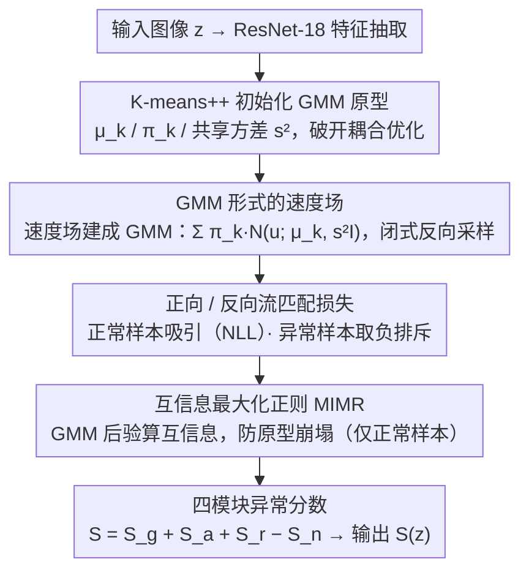

# Mixture Prototype Flow Matching for Open-Set Supervised Anomaly Detection

**会议**: ICML 2026  
**arXiv**: [2605.02438](https://arxiv.org/abs/2605.02438)  
**代码**: https://github.com/fuyunwang/MPFM-OSAD  
**领域**: 异常检测 / 流匹配 / 原型学习  
**关键词**: 开放集监督异常检测, 流匹配, 高斯混合原型, 互信息正则, OSAD

## 一句话总结
MPFM 把 OSAD 里传统的"单峰高斯原型"换成可学习的**高斯混合原型空间**, 用流匹配直接回归一个 GMM 形式的速度场, 再加一个互信息最大化正则防止原型崩塌, 在 9 个工业 / 医学 AD 数据集上以 10/1 个异常样本的设定打过 DRA / AHL / DPDL 等所有 SOTA.

## 研究背景与动机

**领域现状**: 异常检测分三派: 无监督 AD 只见正常样本, 少样本 AD 只见极少正常样本, 监督 AD 需要海量异常样本. 开放集监督 AD (OSAD) 是折中: 训练时给少量已知类别的异常图像 (image-level 标签) + 大量正常图像, 测试时要识别**已知 + 未见过**的两类异常. 现有 OSAD 方法分三类: (a) 数据增强 + outlier exposure (DRA), (b) 异构模拟 (AHL), (c) 原型学习 + 生成动力学 (DPDL).

**现有痛点**: 第三类最接近 SOTA 的 DPDL 用一组**简单的单峰高斯**作为正常样本的原型分布, 再用扩散桥把正常特征"拉"向这些原型. 问题是工业场景的正常样本本身就是**多模态**的 (同一个品类下子图案 / 角度 / 光照变化丰富), 用单峰高斯硬套就会把稀有但合法的正常 sub-pattern 当成异常, 制造大量 false positive, 决策边界变得模糊不清.

**核心矛盾**: 既要让正常样本的密度估计**紧致** (高 recall on 正常), 又要让边界**外推到未见过的异常**类型 (高 recall on 未知异常). 单峰高斯先验直接破坏了第一个目标, 而离散的多高斯之间又缺乏结构关联, 模型不知道这些 mode 之间是怎么过渡的, 语义连续性丢失.

**本文目标**: (1) 用一个**连续的、结构化的**多模态原型空间替代单峰高斯; (2) 让流匹配的速度场本身就是多模态的, 而不是回归一个均值向量; (3) 防止多个高斯组件 collapse 到同一个 mode.

**切入角度**: 把原型空间显式建成 GMM, 用流匹配学一个从正常特征分布到这个 GMM 的连续传输映射. 关键观察是: 在标准线性 noise schedule 下, 一步反向转移可以保持 GMM 闭包性 (linear-Gaussian 系统的封闭性), 所以可以闭式做 step-wise 采样, 不需要数值积分.

**核心 idea**: **用 GMM 形式的速度场代替单一速度向量做流匹配, 把多模态先验从 prior 一路传到 transport dynamics, 再用互信息最大化把 GMM 组件撑开**.

## 方法详解

### 整体框架

输入: 训练集 $\mathcal{Z}_{tr} = \mathcal{Z}_{tr}^{n} \cup \mathcal{Z}_{tr}^{a}$ (正常 $N$ 张 + 异常 $M$ 张, $N \gg M$, 只有 image-level 标签); 输出: 测试样本 $z \in \mathcal{Z}_{te}$ 的异常分数 $S(z)$.

Pipeline:
1. **特征抽取**: ResNet-18 backbone $f: \mathcal{Z} \to \mathbb{R}^d$, 把图像映成 1D 特征.
2. **K-means++ 初始化 GMM**: 在 $\mathcal{F}_{tr}^{n}$ 上跑 K-means++ 得到 $K$ 个簇中心 $\mu_k$、混合权重 $\pi_k = |C_k| / N$、共享方差 $s^2 = \frac{1}{dN} \sum_k \sum_{i \in C_k} \| z_0^{n,i} - \mu_k \|_2^2$. 这一步是为了破开"flow 网络和 GMM 参数互相依赖"的耦合优化死循环.
3. **流匹配训练**: 线性 noise schedule $\alpha_t = 1-t, \sigma_t = t$, 速度 $u = \frac{z_T - z_0}{t}$, 在正常样本上最大化 GMM 速度场似然, 在异常样本上**反向**最小化 (即让 anomalous velocity 远离 normal 速度分布).
4. **MIMR 正则**: 在正常样本上最大化"prototype 分配 $c$"和"流后的特征 $\psi(z_0^{n,i})$"之间的互信息, 既要 confident assignment 又要 balanced usage.
5. **四模块异常分数预测**: 全局 $M_g$ (GMM NLL) + 局部 $M_a$ (top-O patch 分数) + 正常 $M_n$ (全局 pooling) + 残差 $M_r$ ($(\psi(z) - \mu_{c^*})/s$ 经分类头), 推理时 $S(z) = S_g + S_a + S_r - S_n$.

### 关键设计

**1. GMM 形式的速度场（MPFL 核心）：把多模态从先验一路灌进传输动力学**

这一步对应框架图里「GMM 速度场」节点, 是全文的根. 痛点很明确: DPDL 那类方法把速度场建成单峰条件高斯 $q_\theta(u | z_t) = \mathcal{N}(u; \mu_\theta(z_t), s^2 I)$, 只回归一个均值向量, 于是所有正常样本被拉向同一个 mode, 工业场景里丰富的正常 sub-pattern（同品类下的子图案 / 角度 / 光照）被强行压平, 稀有但合法的正常样本被当成异常——这正是 DPDL false positive 高、决策边界模糊的根源. MPFM 的做法是直接把条件速度场建成混合高斯 $q_\theta(u | z_t^{n,i}) = \sum_{k=1}^K \pi_k(z_t^{n,i}; \theta) \mathcal{N}(u; \mu_k(z_t^{n,i}; \theta), s^2 I)$, 其中混合权重 $\pi_k$ 与均值 $\mu_k$ 都是当前特征的函数, 训练用 NLL $\mathcal{L}_{NLL} = \mathbb{E} [-\log \sum_k \pi_k \mathcal{N}(u; \mu_k, s^2 I)]$ 把预测的速度分布对齐到 GMM. 让它真正可用的关键工程点是闭式反向采样: 在标准线性 noise schedule 下, 一步反向转移 $q_\theta(z_{t-\Delta t}^{n,i} | z_t^{n,i})$ 仍然是 GMM, 系数 $c_1, c_2, c_3$ 完全由 noise schedule 决定, 靠 linear-Gaussian 系统的闭包性可以逐步解析采样, 推理时不需要数值 ODE 求解. 它有效的本质在于——多模态结构被编码进速度场本身, 于是从 $t=0$ 到 $t=T$ 的每一步都是多模态的, 而不是「流终点是 GMM、流过程仍单峰」那种事后补救.

**2. 正向 / 反向流匹配损失：在传输层面同时吸引正常、排斥异常**

对应框架图里紧接 GMM 速度场的「双向流匹配损失」节点, 决定正常 / 异常样本分别被怎么对待. 正常样本走标准 NLL $\mathcal{L}_{flow}^{n} = \mathbb{E}[-\log q_\theta(u | z_t^{n,i})]$, 被吸引进 GMM 原型空间; 异常样本则走对称取负的 $\mathcal{L}_{flow}^{a} = \mathbb{E}[\log q_\theta(u | z_t^{a,i})]$, 即最大化异常样本的 NLL, 等价于把它的速度分布推离正常 GMM. 要点在于异常的「真速度」$u^{a} = (z_T^{a} - z_0^{a}) / t$ 是按同一条线性 schedule 算出的「假如它是正常样本本该有的速度」, 模型被强制学得「不像它」. 相比传统 OSAD 用对比损失或二分类只在最终特征空间把异常推开, 这里直接在速度场层面做正负分离, 排斥力作用于整条 transport trajectory, 在 $t=0$ 到 $t=T$ 的每一步都有梯度信号, 分离得更彻底.

**3. 互信息最大化正则 MIMR：用 GMM 自带后验防止原型崩塌**

对应框架图里流匹配之后的「MIMR」节点, 专门堵一个隐患: 多个高斯组件若没有显式分离约束, 容易 collapse 到同一个 mode, 多模态退化、判别力丧失. MIMR 直接借用 GMM 自带的后验 $p(c=k | \psi(z_0^{n,i})) = \frac{\pi_k \mathcal{N}(\psi(z_0^{n,i}); \mu_k, s^2 I)}{\sum_j \pi_j \mathcal{N}(\psi(z_0^{n,i}); \mu_j, s^2 I)}$（免费得到, 不引入额外参数）, 再最大化互信息 $I(\psi(z_0^{n,i}); c) = H(c) - H(c | \psi(z_0^{n,i}))$, 写成 loss 即 $\mathcal{L}_{mim} = \mathbb{E}[\sum_k p(c=k|\cdot) \log p(c=k|\cdot)] - \sum_k \pi_k \log \pi_k$: 第一项最小化条件熵, 逼每个样本明确归属某一个原型; 第二项最大化边际熵, 让各组件被均衡使用. 这样设计的好处是不需要额外判别头或对抗训练, 工程极轻量; 且 MIMR 只在正常样本上算, 因为对异常样本算反而会把异常往原型上拉、起反效果.

### 损失函数 / 训练策略

总损失:
$\mathcal{L} = \underbrace{\mathcal{L}_{M_a} + \mathcal{L}_{M_n} + \mathcal{L}_{M_r} + \mathcal{L}_{M_g}}_{\text{异常分数模块}} + \underbrace{\mathcal{L}_{flow}^{n} + \mathcal{L}_{flow}^{a}}_{\text{流匹配}} + \lambda \mathcal{L}_{mim}$.

四个异常分数模块都用 binary classification loss (BCE), 全部联合训练. $\lambda$ 控制 MIMR 强度. 推理时 $S(z) = S_g(z) + S_a(z) + S_r(z) - S_n(z)$ —— 注意 $S_n$ 是"像正常的程度", 所以减去.

## 实验关键数据

### 主实验

在 9 个真实 AD 数据集 (MVTec AD / Optical / SDD / 等) 上以 10 个训练异常样本的 general setting 报 AUC (3 个种子均值±标准差).

| 数据集 | DRA | AHL | DPDL | **MPFM (Ours)** |
|--------|------|------|------|------|
| MVTec AD | 0.959±0.003 | 0.970±0.002 | 0.977±0.002 | **0.982±0.003** |
| Optical | 0.965±0.006 | 0.976±0.004 | 0.983±0.005 | **0.992±0.002** |
| SDD | 0.991±0.005 | — | — | (best, 见原文) |

MPFM 在所有报告数据集上拿第一或并列第一, 相对最强 baseline DPDL 在 MVTec AD 涨 0.5 个 AUC 点, 在 Optical 涨 0.9 点 (注意 AUC 已经在 0.97+ 的天花板区).

### 消融实验

| 配置 | 关键指标 | 说明 |
|------|---------|------|
| Full MPFM (GMM flow + MIMR + 4 score modules) | best AUC | 完整模型 |
| w/o GMM (退化为单峰高斯速度场) | 显著掉点 | 验证多模态速度场必要性, 等价于 DPDL 思路 |
| w/o MIMR | 中等掉点 | 验证防原型崩塌正则的作用 |
| w/o 反向 flow loss $\mathcal{L}_{flow}^{a}$ | 较大掉点 | 异常样本只参与分数模块训练, 失去 transport 层面的排斥力 |

### 关键发现

- **多模态速度场是最大贡献**: 去掉 GMM 结构 (退化为单峰) 掉点最严重, 直接验证了 motivation 提到的"单峰高斯无法 capture 正常 sub-pattern 多样性".
- **K-means++ 初始化对收敛极为关键**: 论文专门强调"flow 网络和 GMM 参数互相耦合"是优化难点, 没有 K-means++ 的先验初始化容易陷入坏局部最优.
- **互信息正则 vs 距离正则**: MIMR 利用 GMM 自带后验做信息熵, 比常见的"两两均值距离约束"更精细, 因为它同时管 confident assignment (条件熵) 和 balanced usage (边际熵) 两件事.
- **共享方差 $s^2$ 是工程稳定性 trick**: 各组件共用一个 $s$ 避免某个组件方差爆炸或塌缩, 论文在 supplementary 里专门讨论了这一点.

## 亮点与洞察

- **多模态从 prior 一路传到 transport**: 这是 MPFM 和过去所有"原型 + 桥接流"方法最大的差别 —— 别人是"流终点是 GMM", 但流过程仍是单峰; MPFM 是"流过程本身就是 GMM 速度场", 多模态在每一步都活着. 这种"先验贯穿动力学"的思路可以推广到任何用扩散 / 流做表征学习的任务.
- **闭式反向采样保留 GMM 闭包性**: 利用 linear-Gaussian 系统的解析性质, 一步反向 $q_\theta(z_{t-\Delta t} | z_t)$ 仍然是 GMM, 推理时**完全闭式**, 不用 ODE solver, 这是把 GMM 速度场做实际可用的关键工程点.
- **反向流匹配损失**: 把异常样本扔进同一个流匹配框架但取**对数似然的负号**, 优雅地实现了 transport 层面的排斥, 没有引入新模块也没有对抗训练.
- **四模块异常分数的减法组合**: $S = S_g + S_a + S_r - S_n$ 这种"加正减反"的组合, 借鉴了异常检测里"既要看像不像异常、也要看不像正常"的双视角思想, 容易被忽视但实际很有用.

## 局限与展望

- **K 是超参且需 K-means++ 预跑**, 没讨论 K 应该怎么自适应选 —— 不同 MVTec 子类的正常 mode 数量明显不同 (carpet 和 transistor 完全是两个量级), 全部用同一个 K 不太合理.
- **只在 ResNet-18 上做**, 没在更强的 backbone (CLIP / DINOv2) 上验证, 而 backbone 表达能力对原型空间结构影响很大.
- **MIMR 只在正常样本算**, 没把"异常样本不应被任何原型 confident 占用"这种额外约束写进损失, 可能在异常分布和某个正常 sub-pattern 重叠时仍然失效.
- **没有像素级定位评估**, 全是 image-level AUC, 对工业落地里需要"指出异常在图像哪个位置"的需求覆盖不全.

## 相关工作与启发

- **vs DPDL**: 他们用一组离散的独立单峰高斯, 流是简单速度向量; MPFM 用结构化连续 GMM, 流是 GMM 速度场, 中间多模态结构有语义关联. 是 DPDL 的直接 extension.
- **vs DRA / AHL**: 他们靠数据增强或异构模拟扩大异常覆盖, 本质是"造更多异常样本"; MPFM 不动数据, 改的是"正常样本怎么建模", 思路正交.
- **vs 普通 Rectified Flow / SD3**: 后者是生成模型, 用 flow matching 把噪声映成图像; MPFM 把同样的 flow matching 工具反过来用作"判别式表征"框架, 在异常检测里把流当 density estimator 用, 是 flow matching 跨任务迁移的好例子.

## 评分
- 新颖性: ⭐⭐⭐⭐ "GMM 形式的速度场 + 互信息正则 + 反向 flow loss" 三件套是 OSAD 里的新组合, 但单独看每个组件 (GMM flow / MIMR / 反向 NLL) 在生成或聚类领域都已有先例.
- 实验充分度: ⭐⭐⭐⭐ 9 个真实数据集 + 多 seed + ablation 充分, 但缺乏更强 backbone 和像素级评估.
- 写作质量: ⭐⭐⭐⭐ 数学推导 (尤其闭式反向采样部分) 严谨, 算法 1 清晰, motivation 图直接可视化"单峰 vs 多峰边界"很有说服力.
- 价值: ⭐⭐⭐⭐ 给工业 AD 提供一个稳定可用的新 baseline, 而且"先验贯穿动力学"的设计哲学对其他用 diffusion / flow 做表征的任务有迁移价值.

<!-- RELATED:START -->

## 相关论文

- [\[CVPR 2025\] Distribution Prototype Diffusion Learning for Open-set Supervised Anomaly Detection](../../CVPR2025/object_detection/distribution_prototype_diffusion_learning_for_open-set_supervised_anomaly_detect.md)
- [\[CVPR 2026\] GPFlow: Gaussian Prototype Probability Flow for Unsupervised Multi-Modal Anomaly Detection](../../CVPR2026/object_detection/gpflow_gaussian_prototype_probability_flow_for_unsupervised_multi-modal_anomaly_.md)
- [\[NeurIPS 2025\] Scalable, Explainable and Provably Robust Anomaly Detection with One-Step Flow Matching](../../NeurIPS2025/object_detection/scalable_explainable_and_provably_robust_anomaly_detection_with_one-step_flow_ma.md)
- [\[CVPR 2026\] UniSpector: Towards Universal Open-set Defect Recognition via Spectral-Contrastive Visual Prompting](../../CVPR2026/object_detection/unispector_towards_universal_open-set_defect_recognition_via_spectral-contrastiv.md)
- [\[CVPR 2026\] Complementary Prototype Mapping for Efficient Multimodal Anomaly Detection](../../CVPR2026/object_detection/complementary_prototype_mapping_for_efficient_multimodal_anomaly_detection.md)

<!-- RELATED:END -->
