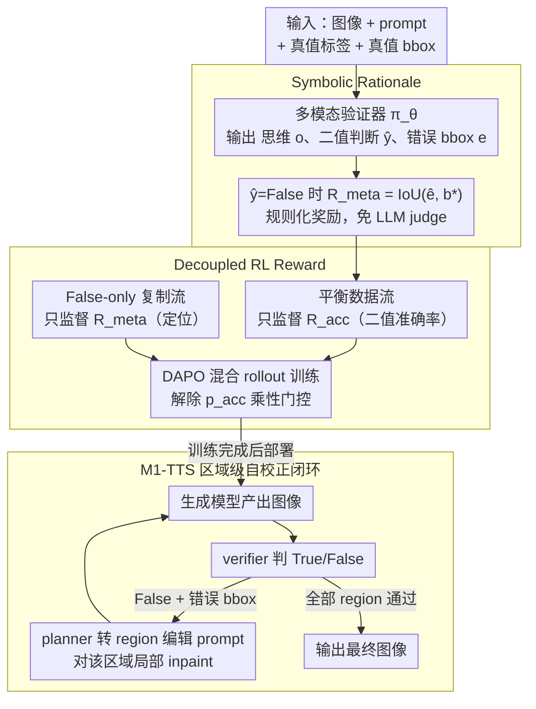

# OmniVerifier-M1: Multimodal Meta-Verifier with Explicit Structured Recalibration

**会议**: ICML 2026  
**arXiv**: [2605.28805](https://arxiv.org/abs/2605.28805)  
**代码**: 论文未提供仓库链接（无）  
**领域**: 多模态VLM / 视觉验证 / 强化学习  
**关键词**: 多模态 meta-verifier, 符号化奖励, 解耦 RL, 视觉自校正, RLVR  

## 一句话总结
针对多模态视觉验证器只输出 True/False 二值判断信号过粗、且文本解释易被 reward-hacking 的问题，本文提出 OmniVerifier-M1：用 bounding box 等符号化输出代替文本作为 meta-verification rationale 以支持 IoU 这种 rule-based reward，并在理论与实验上证明把二值判断与 meta-verification 解耦成两条独立 reward 流（而非合并成乘性 joint reward）能显著提升 SNR，最终把验证器升级为可驱动 region-level 自校正的 agentic 系统 M1-TTS。

## 研究背景与动机

**领域现状**：多模态大模型（MLLM）在生成与推理上能力越来越强，配套需要一个能可靠评判视觉结果的 verifier 作为奖励/反思信号源。现有工作大致分两支：(i) 传统图像奖励模型如 RewardDance、UnifiedReward，专注 text-to-image 评分；(ii) 通用视觉验证器如 OmniVerifier，用 RLVR（Reinforcement Learning with Verifier Rewards）把二值判断（True/False）作为 reward 训练 verifier。

**现有痛点**：纯二值判断信号有两大问题——其一，监督只到决策级、不到原因级，模型可以靠"猜对"或抓表面模式拿满奖励，无法被迫学到细粒度推理；其二，把文本解释当 rationale 来训 verifier 又必须用一个 LLM judge 给文本打分，既慢又容易被 reward hacking。

**核心矛盾**：要细粒度反馈，就得有 rationale 监督；可文本 rationale 要么需要模型评判（贵 + 易被攻击），要么需要规则评判（文本太开放定不下规则）。同时 binary judgement 与 meta-verification 这两个任务的输出空间天然不同——前者是离散低熵，后者是连续高维细粒度，硬塞进一个 joint reward 会有严重的优化冲突。

**本文目标**：(i) 找到一种既能严格规则化、又能精确表达图像错误的 rationale 形式；(ii) 解决 joint reward 下 meta-verification 梯度被二值准确率"门控"的问题；(iii) 把 verifier 升级成能驱动 region-level 自校正的 agent，闭环到生成端。

**切入角度**：图像是高度结构化的空间表示，错误天然可以用 bounding box / keypoint 这种符号定位——这意味着我们可以用 IoU 等规则化 reward 替代 model-based judge，从源头消除 reward hacking。同时，理论上 joint reward 中 meta gradient 被 binary accuracy $p_{acc}$ 乘性门控，把二者解耦能恢复 SNR。

**核心 idea**：**Symbolic rationale (bbox) + Decoupled RL reward** —— 用 bbox 作为 meta-verification rationale 让 IoU 直接当 rule-based reward；把 binary judgement 与 meta-verification 拆成两套独立 reward 流通过 mixed-data 训练。

## 方法详解

OmniVerifier-M1 沿 RLVR 框架训练一个 pointwise 多模态 verifier $\pi_\theta(I, P) \to (o, \hat y, e)$，输出包含思维过程 $o$、二值判断 $\hat y$ 以及（仅当 $\hat y = \text{False}$ 时）一个错误区域定位 $e$（bbox）。整篇方法围绕"用什么 rationale"和"如何组合 reward"两个核心问题展开。

### 整体框架
输入 (image, prompt, ground-truth label, optional ground-truth bbox)；输出 verifier 的 $(o, \hat y, e)$；reward 由三部分构成——格式奖励 $\mathcal{R}_f$（要求 `<think>` 标签）、准确率奖励 $\mathcal{R}_{acc} \in \{0,1\}$、meta-verification 奖励 $\mathcal{R}_{meta}$（在符号 rationale 情形下 = IoU）。训练用 DAPO 在 OmniVerifier-7B 与 Qwen3-VL-8B 上各跑 80 步 / 16 张 A800-80G。下游应用 M1-TTS 把 verifier 输出当 agent tool：先识别错误 region，再驱动生成模型做 region-level 编辑，迭代 replanning 收敛。

### 关键设计

**1. Symbolic Rationale：用 bbox 代替文本解释当 meta 反馈**

要给 verifier 细粒度监督就得有 rationale，但文本 rationale 必须再请一个 LLM judge 打分，既慢又会被 reward hacking。作者的观察是：图像错误本质是"哪里错了"的空间问题，天然可以用 bbox / point / line 这种结构化几何对象定位，于是直接把 IoU 这种 hard rule 当 reward。每条训练样本除 binary label 外同时给 ground-truth bbox 和 ground-truth 文本解释；symbolic 路线用 $\mathcal{R}_{meta} = \text{IoU}(\hat b, b^*)$ 评 verifier 产出的 bbox，textual 路线则用 Qwen3-4B 当 judge 比较语义等价性；模型仍在 `<think>` 之后给出最终 verdict 和 bbox 列表。规则化 reward 让模型没法"说服"IoU，从源头杜绝 reward hacking，还省掉一个 judge 模型——实测每样本 reward 计算 0.021 ms vs 文本 20.2 ms（≈1000× 快），per-step 训练 8.13 min vs 10.27 min（约 20% 加速），显存从 56.9 GB 降到 48.6 GB，而 ViVerBench 总分两条路线几乎相等（0.661 vs 0.662）——symbolic 是真正"等效但便宜"的替代。

**2. Decoupled RL Reward：把"判对没"和"指对错在哪"拆成两条独立 reward 流**

binary judgement 是离散低熵、meta-verification 是连续高维细粒度，硬塞进一个 joint reward 会优化冲突。原 joint 目标 $\mathcal{R}_f + \mathcal{R}_{acc} \cdot (\mathbb{I}[y=\text{True}] + \mathbb{I}[y=\text{False}] \cdot \mathcal{R}_{meta})$ 里，meta gradient 只在 $y=\hat y=\text{False}$ 时才激活。Decoupled 方案改成混合两条数据流：原始 1:1 平衡数据集只监督 $\mathcal{R}_{acc}$；把所有 $y=\text{False}$ 的样本复制一份组成 grounding-only 子集，只监督 $\mathcal{R}_{meta}$；两条流在 RL rollouts 中混合。这背后有硬核理论支撑：Lemma 5.1 / Theorem 5.2 证明 joint 训练里 meta gradient 范数被 $p_{acc}(\theta)$ 乘性门控，RL 早期 $p_{acc} \ll 1$ 时 meta 几乎学不到；Theorem 5.3 进一步给出 $\text{Var}(\mathcal{G}_{joint}) = p_{acc}\,\text{Var}(\mathcal{G}_{dec}) + p_{acc}(1-p_{acc})\|\mathbb{E}[\mathcal{G}_{dec}]\|^2$，Corollary 5.4 推出 SNR 上界 $\text{SNR}(\mathcal{G}_{joint}) \le p_{acc}(\theta) \cdot \text{SNR}(\mathcal{G}_{dec})$，说明 joint 严格次优。解耦把这个 Bernoulli 门去掉，恢复纯 grounding 梯度。

**3. M1-TTS：让 verifier 从"打分者"升级为驱动 region-level 自校正的 agent**

传统多轮编辑都在 global level 做，对"图里某一小块语义错"束手无策。有了 bbox 这种可调度的 symbolic 反馈后，OmniVerifier-M1 可以当 agent 的细粒度优化器：每轮先让基础模型生成图像 → verifier 判 True/False → 若 False 同时给出错误 bbox → planner 把 bbox 翻成 region-aware editing prompt 喂回生成模型 → 在该区域做局部 inpainting/编辑 → 进入下一轮，由 verifier 持续 replanning 监控，直到所有 region 通过。这恰好把 meta-verification 的细粒度优势从训练阶段延伸到推理阶段，把火力精确集中到错误 region，闭环回生成端。

### 损失函数 / 训练策略
RL 算法用 DAPO（变种 GRPO），reward = 格式奖励（indicator）+ 准确率奖励（0/1）+ meta 奖励（IoU 或 model-based judge 分）。decoupled 训练时混合两个数据流：原始 balanced 数据只算 $\mathcal{R}_f + \mathcal{R}_{acc}$，复制后的 False-only 数据只算 $\mathcal{R}_f + \mathcal{R}_{meta}$。每个数据集合内部按 rollout group 估计 advantage，标准 PPO clipping 加 KL 正则。

## 实验关键数据

### 主实验
ViVerBench 是涵盖 Concept Existence / Object Relation / World Dynamics / Image Annotation / State Value Evaluation / STEM 六大类共 16 项子任务的视觉验证 benchmark，配合 RefCOCO 评估定位能力。下表节选关键子项（论文 Table 2 摘录）：

| Model | Obj. | Attr. | Spat. | BBox | Point | Count | GUI | Chart | **Overall** |
|-------|------|-------|-------|------|-------|-------|-----|-------|-------------|
| OmniVerifier-7B (baseline) | 0.701 | 0.703 | 0.808 | 0.770 | 0.659 | 0.527 | 0.634 | 0.600 | 0.650 |
| OmniVerifier-7B (Joint) | 0.723 | 0.733 | 0.833 | 0.827 | 0.716 | 0.640 | 0.694 | 0.623 | 0.661 |
| OmniVerifier-7B (Decoupled) | **0.741** | **0.754** | **0.846** | **0.854** | **0.741** | **0.710** | **0.722** | **0.639** | **0.668** |

在更强的 Qwen3-VL-8B backbone 上同样规律：Decoupled > Joint > baseline；BBox / Point / Count 这类需要细粒度定位的子任务提升最大（+8–18 个百分点），印证 meta-verification 监督直接强化了 grounding 能力。

### 消融 / 效率分析
| 配置 | ViVerBench | GPU 显存 (GB) | reward 计算 (ms/sample) | 训练时间 (min/step) | 响应长度 (token) |
|------|------------|---------------|-------------------------|---------------------|------------------|
| OmniVerifier-7B baseline | 0.650 | — | — | — | — |
| + Bbox (symbolic) | 0.661 | 48.6 | **0.021** | **8.13** | 384 |
| + Exp (textual) | 0.662 | 56.9 | 20.2 | 10.27 | 340 |
| Qwen3-VL-8B baseline | 0.654 | — | — | — | — |
| + Bbox | 0.671 | 49.9 | 0.021 | 8.74 | 516 |
| + Exp | 0.670 | 58.3 | 20.2 | 11.08 | 488 |

### 关键发现
- **Symbolic ≈ Textual on 性能，但训练成本天差**：两种 rationale 在 ViVerBench 上差距 < 0.001，但 reward 计算快约 1000 倍、显存降 ~15%、训练时间快 ~20%——说明用 bbox 完全可以无损替代文本 judge。
- **Decoupled 提升不是"加更多数据"的功劳**：复制的 False 数据只看 $\mathcal{R}_{meta}$，不增加 binary accuracy 监督；提升来自 meta gradient 摆脱了被 $p_{acc}$ 门控的束缚。
- **Grounding 子任务受益最大**：BBox 0.770→0.854、Count 0.527→0.710、Point 0.659→0.741，验证了 meta-verification 的细粒度信号真正流入了模型 grounding 能力。
- **M1-TTS 显著优于 global multi-turn editing**：在 region-level 自校正实验中，OmniVerifier-M1 驱动的 agentic 系统比传统全局重生成更高效、错误率更低。

## 亮点与洞察
- **"用图像本质的结构化代替自由文本"**：把 verifier 的输出从语言态转到符号态（bbox / point），同时解决了 reward hacking、训练效率、定位精度三件事——这是把"任务本身的几何结构"利用到极致的范例，可迁移到任意输出具有结构化形式的多模态任务（OCR、布局生成、UI 操作）。
- **Joint vs Decoupled 的理论拆解很硬核**：Lemma + Theorem + Corollary 把"为什么 joint 不行"用 SNR 不等式量化出来，比一般 RL 论文的"经验上更好"更具说服力；该框架可推广到任何"鉴别+解释"双任务的 RL 训练（代码生成、定理证明）。
- **从 verifier 到 agentic optimizer 的角色升级**：M1-TTS 把 verifier 从"分数提供者"升级为"action 提供者"——产出可调度的 region 信号，是把 RL-trained judge 模型接入 agent loop 的一种新范式，对 controllable generation / safety alignment 有直接价值。

## 局限与展望
- 实验仅在 OmniVerifier-7B 与 Qwen3-VL-8B 两个 backbone 上验证；更大模型（30B+）上 joint vs decoupled 的差距是否仍然成立（$p_{acc}$ 越接近 1 差距应越小）未充分讨论。
- bbox 适合"哪里错"的空间错误，但对"风格不符""光照不一致"等无清晰空间边界的错误并不天然适用；未来需要扩展更多 symbolic 形态（mask / 颜色直方图 / 文本 anchor 组合）。
- M1-TTS 依赖统一多模态模型支持 region-level edit；对纯文本→图像的扩散模型链路，region edit 仍需额外 inpainting pipeline。
- 训练只跑 80 步、单 benchmark 评测；长期 scaling 下 reward 模型仍可能退化或被生成器适应性"绕开"，长期稳定性需进一步研究。

## 相关工作与启发
- **vs OmniVerifier (Zhang et al. 2025)**：本文是其直接升级——把"只用 binary judgement"升级为"用 bbox + 解耦 meta"，且把 verifier 推到 agentic 闭环；M1-TTS 替代 OmniVerifier-TTS 的全局编辑方案。
- **vs DeepSeekMath-V2 / Wang et al. 2026**：他们在数学/语言域引入 meta-verification 用文本 rationale，本文证明在视觉域 symbolic 更优。
- **vs RewardDance / UnifiedReward**：传统图像奖励模型只输出 scalar，本文输出"判断 + 定位 + 解释"三元组，可监督性大幅提升。
- **vs ReflectionFlow / OmniVerifier-TTS**：它们做 global 多轮反思编辑，本文走 region-level，颗粒度精细一个数量级，对复杂组合生成（多对象、空间约束）更友好。
- **可迁移启发**：任何"判断 + 解释"型 RL 任务（数学证明 verifier、代码 review、安全审计）都可借鉴解耦训练；任何允许结构化输出的领域（OCR、UI 操作、布局生成）都可考虑用 symbolic rationale 替代文本 rationale 来同时获得效率与抗 reward hacking。

<!-- RELATED:START -->

## 相关论文

- [\[CVPR 2026\] Towards an Incremental Unified Multimodal Anomaly Detection: Augmenting Multimodal Denoising From an Information Bottleneck Perspective](../../CVPR2026/object_detection/towards_an_incremental_unified_multimodal_anomaly_detection_augmenting_multimoda.md)
- [\[NeurIPS 2025\] Structured Temporal Causality for Interpretable Multivariate Time Series Anomaly Detection](../../NeurIPS2025/object_detection/structured_temporal_causality_for_interpretable_multivariate_time_series_anomaly.md)
- [\[CVPR 2026\] Distribution-Aligned Multimodal Fusion for Robust Object Detection](../../CVPR2026/object_detection/distribution-aligned_multimodal_fusion_for_robust_object_detection.md)
- [\[CVPR 2026\] Complementary Prototype Mapping for Efficient Multimodal Anomaly Detection](../../CVPR2026/object_detection/complementary_prototype_mapping_for_efficient_multimodal_anomaly_detection.md)
- [\[NeurIPS 2025\] DETree: DEtecting Human-AI Collaborative Texts via Tree-Structured Hierarchical Representation Learning](../../NeurIPS2025/object_detection/detree_detecting_human-ai_collaborative_texts_via_tree-structured_hierarchical_r.md)

<!-- RELATED:END -->
