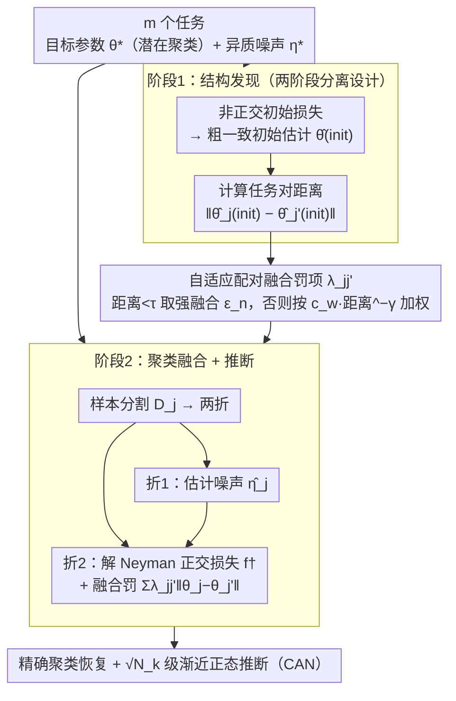

# Adaptive Estimation and Inference in Semi-parametric Heterogeneous Clustered Multitask Learning via Neyman Orthogonality

**会议**: ICML 2026  
**arXiv**: [2605.01907](https://arxiv.org/abs/2605.01907)  
**代码**: 无  
**领域**: 多任务学习 / 因果推断 / 半参数统计  
**关键词**: Neyman 正交性, 自适应融合, 潜在聚类, 异质噪声, 渐近正态性

## 一句话总结
本文桥接双重机器学习与聚类多任务学习，提出自适应框架结合 Neyman 正交性与数据驱动的配对融合罚项，在异质（可能无限维）噪声的半参数设置中精确恢复任务潜在聚类、以汇总率达到预言水平，并建立渐近正态性，实现有效统计推断。

## 研究背景与动机

**领域现状**
多任务学习（MTL）通过共享结构改进统计效率，但现实中任务往往仅部分相关：可能共享目标参数，但辅助特征、数据分布、混杂因素等差异很大。聚类多任务学习尝试发现任务间的潜在分组。近期双重机器学习（DML）进展使得在高维/非参数噪声下估计低维目标参数成为可能。

**现有痛点**
1. **现有 MTL 假设过强**：多数方法假设特征空间对齐或任务结构同构，对异质特征和分布漂移处理不足。
2. **DML 是单任务程序**：DML 本身不利用跨任务相似性；当单个任务样本量有限时方差可能很高。
3. **聚类学习 + 无限维噪声难题**：已有聚类 MTL 方法（融合罚项、质心正则化）多假设参数模型，无法处理任务特定的复杂高维噪声。

**核心矛盾**
需要跨任务信息共享以降低方差，同时保留任务本地化的灵活噪声估计以维持推断有效性——两者似乎冲突。

**本文目标**
设计一个方法同时：(i) 发现并利用共享目标参数结构，(ii) 对异质、可能无限维的噪声保持鲁棒，(iii) 建立精确推断保证。

**切入角度**
从第一阶段任务级初始估计（用于相似性量化）出发，第二阶段用 Neyman 正交性保护推断，融合罚项只作用于目标参数（跨任务），噪声参数保持任务本地（无跨任务混杂）。

**核心 idea**
两阶段自适应融合：阶段 1 用任意（可能非正交）初始损失获得粗一致估计、计算任务对距离；阶段 2 通过自适应配对罚项 $\lambda_{jj'}=\min(c_w\|\hat\theta_j^{\text{init}}-\hat\theta_{j'}^{\text{init}}\|_2^{-\gamma},\text{const})$ 强化相似任务，结合正交性损失与样本分割，使得即便自适应聚类后仍达到 $\sqrt{N_k}$（汇总样本量）级 CAN 性质。

## 方法详解

### 整体框架
$m$ 个任务，任务 $j$ 有目标参数 $\theta_j^*\in\Theta\subseteq\mathbb R^d$ 与噪声参数 $\eta_j^*\in\mathcal H_j$。假设 $\{\theta_j^*\}$ 承认潜在聚类 $\{S_k\}_{k=1}^K$，同簇内 $\theta_j^*=\beta_k^*$，但 $\eta_j^*$ 可在维度、光滑性等方面差异巨大。

**两阶段估计器**：
- **阶段 1（结构发现）**：对每个任务 $j$，用可能非正交的损失 $\ell_j^{\text{init}}$ 得到初始 $\hat\theta_j^{\text{init}}$。这些初始估计仅用于诊断任务相似性，无需最优率。
- **阶段 2（聚类融合）**：样本分割 $\mathcal D_j=\mathcal D_{j,1}\cup\mathcal D_{j,2}$。在 $\mathcal D_{j,1}$ 上估计噪声 $\hat\eta_j$，在 $\mathcal D_{j,2}$ 上解多任务目标 $\hat{\boldsymbol\theta}=\arg\min\sum_j f_j^\dagger(\theta_j,\hat\eta_j)+\sum_{j<j'}\lambda_{jj'}\|\theta_j-\theta_{j'}\|_2$，其中 $f_j^\dagger$ 为正交损失。罚项 $\lambda_{jj'}$ 当初始距离 $<\tau$ 取最小值 $\epsilon_n$（强融合），否则取权重 $c_w\|\cdot\|^{-\gamma}$。

整条流水线串起来是：所有任务的数据先进阶段 1 算出初始估计与任务对距离，距离喂给自适应融合罚项决定谁该绑在一起；阶段 2 再对每个任务做样本分割，一折估噪声、一折在正交损失上带着融合罚联合求解目标参数，最终同时给出聚类恢复与有效推断。

### 关键设计

**1. 任务内 Neyman 正交性 + 样本分割：让噪声估计误差不污染目标参数**

多任务融合是在目标层做跨任务混杂，可噪声 $\eta_j$ 又是高维甚至无限维的，一旦它的估计误差顺着融合传到目标参数，推断就失效。作者把每个任务的损失 $\ell_j^\dagger$ 设计成对噪声 Neyman 正交，即 Gâteaux 导数 $D_\eta\nabla_\theta\mathbb{E}[\ell_j^\dagger]|_{(\theta_j^*,\eta_j^*)}[h]=0$ 对所有方向 $h$ 成立，于是一阶噪声误差 $\|\hat\eta-\eta^*\|=O_p(1/\sqrt n)$ 对 $\theta$ 估计的影响被消掉。再配合样本分割——噪声用一个 fold、目标用另一个 fold——防止两者互相过拟合。关键点在于融合只在目标层跨任务进行，噪声始终保持任务本地，这样错误的任务间偏差就不会借融合通道传播。

**2. 自适应配对融合罚项：从初始距离推断同簇概率，动态调融合强度**

固定权重（如 MeTaG）不知道哪些任务真该绑在一起，硬分簇（如 ARMUL）又得预先知道簇数 $K$、且离散切换不鲁棒。作者用第一阶段的初始估计算任务对距离，定义权重 $w_{jj'}=c_w\|\hat\theta_j^{\text{init}}-\hat\theta_{j'}^{\text{init}}\|_2^{-\gamma}$，距离越大权重越小、融合越弱；再加一层阈值 $\tau$：距离 $<\tau$ 的对取最小罚 $\epsilon_n$（强融合），其余取 $w_{jj'}$（适中融合）。这个两层结构在强分离假设下能做到精确聚类恢复（定理 3.5），而且因为是平滑过渡而非硬切换，对超参数和分离条件都更鲁棒——融合强度自动跟着任务相似性的景观走，而不是人为设死。

**3. 两阶段分离设计：让"发现聚类"和"精确推断"各用最趁手的工具**

把发现和推断硬塞进一个框架，往往两头都不讨好。作者干脆拆开：第一阶段只为算任务相似性，不需要最优率，只要一致性，于是可以挑方差更小、有限样本下更稳的估计器，哪怕带一点偏差也无妨——因为它只用来算 $w_{jj'}$，估计更稳意味着距离更可信。第二阶段才上正交损失 + 样本分割，专注精细估计与推断。这样每个目标都用上最适合它的工具，避免了单一框架为了兼容而处处妥协的刚性。

### 损失函数与训练策略
第二阶段关于 $\theta$ 的优化是凸问题，可用加速梯度或近端方法。正交性通过样本分割在 $\mathcal D_{j,2}$ 上的损失设计自然实现。论文证明对 $(c_w,\gamma,\tau,\epsilon_n)$ 的广泛范围结论都成立，提供鲁棒的超参数选择指南。

## 实验关键数据

### 主实验

| 模型 | 设定 | RMSE | ARI | vs Personalized | vs ARMUL (正确 K) | vs MeTaG |
|------|------|------|-----|-----------------|------------------|----------|
| PLM | $\delta=1/3$ | **0.18** | **0.98** | -67% | +2% | -85% |
| PLM | $\delta=2/3$ | **0.12** | **0.99** | -72% | -1% | -88% |
| PLM | $\delta=1.0$ | **0.08** | **1.00** | -78% | -3% | -91% |
| ATE | $\delta=1/3$ | **0.22** | **0.97** | -63% | +5% | -80% |
| ATE | $\delta=2/3$ | **0.15** | **0.99** | -70% | 0% | -85% |
| DID | $\delta=2/3$ | **0.19** | **0.98** | -68% | +1% | -83% |

ARMUL 在 K 正确时略优，K 错误时性能大幅下降；本方法无论 K 是否正确都保持最优。

### 消融实验

| 组件 | 变更 | RMSE 增幅 | ARI 下降 | 说明 |
|------|------|---------|---------|------|
| 完整方法 | - | - | - | 基线 |
| 去掉正交性 | 第 2 阶段用非正交损失 | +45% | 不变 | 无偏差但方差增加 |
| 固定罚项 | 所有对 $\lambda_{jj'}=0.01$ | +28% | +0.15 | 无自适应，欠融合 |
| 无阈值两层 | 单层 $\lambda=w_{jj'}$ | +18% | +0.08 | 融合强度不当 |
| 无样本分割 | 噪声与目标共用 fold | +32% | 不变 | 过拟合，推断不可靠 |

### 关键发现
- **精确聚类恢复**：即使簇分离很弱（$\delta=1/3$）ARI≈0.98，而 ARMUL 必须知道精确 K 才能做到。
- **自适应权重关键**：固定权重 +28% RMSE，证实任务对的个性化融合强度很重要。
- **正交性必需**：去正交性后 RMSE +45%，虽不影响聚类但置信区间覆盖率失效。
- **样本分割保护推断**：虽不影响点估计，但无分割时推断（CI 覆盖率）显著失效。
- **超参数稳健性**：多组 $(\gamma,\tau)$ 实验结果对参数范围不敏感，支持"宽泛条件"理论。

### 真实数据应用
美国 50 州 + DC 电力价格弹性分析中，方法发现 3 个聚类：
- 聚类 0（VA）：高弹性 -1.138，冷却密集、调整性强。
- 聚类 1（KY/AL/OK/TN）：中等弹性 -0.788，南部温暖州。
- 聚类 2（其余 46 州）：低弹性 -0.221。

聚类符合气候地理，验证方法在真实异质多任务中的有效性。

## 亮点与洞察
- **Neyman 正交性在多任务中的角色**：将 DML 与聚类融合结合，保证即使跨任务融合也维持推断有效性。
- **自适应权重的精妙性**：相比硬分簇软自适应权重从数据中学习，对超参数显著更鲁棒。
- **两阶段分离的设计哲学**：将"发现聚类"与"精确推断"分离，允许各阶段选择最优工具，避免单一框架的刚性。
- **经济学应用结合**：地区电力弹性发现既验证方法，也提供政策相关洞察。

## 局限与展望
- **限于低维目标参数**：高维目标（维数随样本增长）的扩展未考虑。
- **簇分离假设**：仍需跨簇最小分离 $\delta$；不适用于完全连续任务空间。
- **噪声估计的现实挑战**：理论要求 $O_p(n_j^{-1/4})$ 率，对复杂模型实现该率不容易。

## 相关工作与启发
- **vs ARMUL**：都做聚类 MTL，但 ARMUL 需预知 K；本方法自动恢复，超参数更鲁棒。
- **vs DML 单任务**：把 DML 框架扩展到多任务聚类，保留推断有效性优势。
- **vs 经典聚类学习（Jacob 等）**：这些方法多限参数模型；本文处理异质半参数噪声，是显著扩展。

## 评分
- 新颖性: ⭐⭐⭐⭐⭐ Neyman 正交性 + 自适应聚类融合的结合是新颖的，两阶段框架也新颖。
- 实验充分度: ⭐⭐⭐⭐ 三类半参数模型、多个分离级别、充分消融、真实应用。
- 写作质量: ⭐⭐⭐⭐ 数学严谨，定理表述清晰，主要结果直观。
- 价值: ⭐⭐⭐⭐ 在因果推断、经济学应用中直接可用，理论框架对多任务推断领域影响深远。

<!-- RELATED:START -->

## 相关论文

- [\[ICLR 2026\] FedDAG: Clustered Federated Learning via Global Data and Gradient Integration for Heterogeneous Environments](../../ICLR2026/optimization/feddag_clustered_federated_learning_via_global_data_and_gradient_integration_for.md)
- [\[NeurIPS 2025\] Robust Estimation Under Heterogeneous Corruption Rates](../../NeurIPS2025/optimization/robust_estimation_under_heterogeneous_corruption_rates.md)
- [\[CVPR 2026\] ACE-Merging: Data-Free Model Merging with Adaptive Covariance Estimation](../../CVPR2026/optimization/ace-merging_data-free_model_merging_with_adaptive_covariance_estimation.md)
- [\[ICLR 2026\] Incentives in Federated Learning with Heterogeneous Agents](../../ICLR2026/optimization/incentives_in_federated_learning_with_heterogeneous_agents.md)
- [\[ICML 2026\] Multi-Objective Bayesian Optimization via Adaptive ε-Constraints Decomposition](multi-objective_bayesian_optimization_via_adaptive_varepsilon-constraints_decomp.md)

<!-- RELATED:END -->
