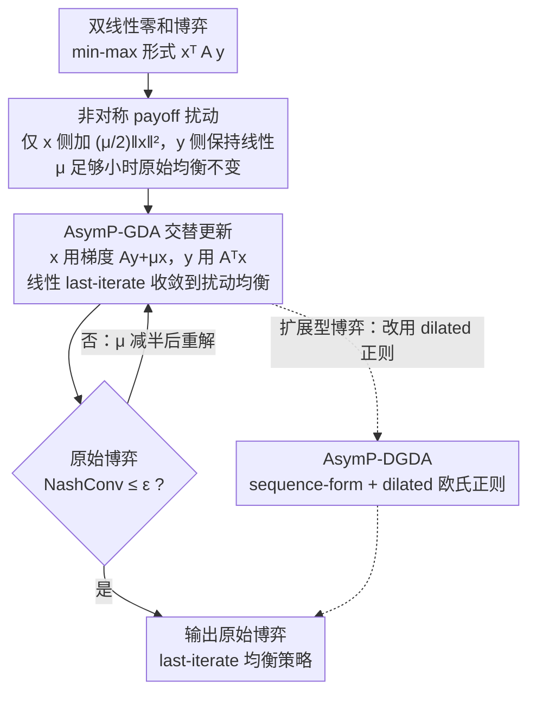

# Asymmetric Perturbation in Solving Bilinear Saddle-Point Optimization

**会议**: ICML2026  
**arXiv**: [2506.05747](https://arxiv.org/abs/2506.05747)  
**代码**: https://github.com/CyberAgentAILab/asymmetrically-perturbed-gda  
**领域**: 优化 / 博弈学习  
**关键词**: 双线性鞍点优化, 非对称扰动, last-iterate 收敛, 零和博弈, NashConv  

## 一句话总结
这篇论文证明只扰动双线性零和博弈中一方的 payoff，就能在足够小扰动下保持原始均衡不变，并据此构造 AsymP-GDA，在理论上获得线性 last-iterate 收敛，在普通型和扩展型博弈实验中比对称扰动更快、更准地逼近原始均衡。

## 研究背景与动机
**领域现状**：双线性鞍点问题 $\min_{x \in X}\max_{y \in Y} x^T A y$ 是零和博弈、minimax 优化和约束优化里的核心形式。很多学习算法可以通过 no-regret 保证平均迭代收敛到 Nash equilibrium，但实际策略序列本身可能循环，不一定收敛。

**现有痛点**：平均迭代收敛在大模型或大规模博弈中并不理想，因为它需要保存或混合大量历史策略。Optimistic GDA、Extra-Gradient、OMWU 等方法试图实现 last-iterate 收敛，但在带采样噪声、bandit feedback 或大规模模拟环境里可能失去稳定性。

**核心矛盾**：payoff perturbation 是另一条路线：给 payoff 加强凸正则项可稳定动态并让 last iterate 收敛。传统做法通常对双方都加对称扰动，但固定扰动强度 $\mu$ 会把均衡推离原始博弈；若要逼近原始均衡，又必须让 $\mu$ 很小或随迭代逐步减小，从而产生精度与速度的冲突。

**本文目标**：作者希望找到一种既能保留扰动带来的稳定收敛，又不把目标均衡系统性移开的方式。理想情况下，扰动后的问题应该更容易求解，但解出来的策略仍是原始博弈的 minimax / maximin 策略。

**切入角度**：论文提出一个很简单但效果明显的结构变化：只扰动一方的 payoff。对于要求解 player $x$ 的 minimax 策略，目标变为 $\min_x\max_y x^T A y + \frac{\mu}{2}\|x\|^2$，而 player $y$ 的 payoff 保持线性。

**核心 idea**：非对称扰动把一侧目标变成强凸以稳定梯度动态，同时利用原始双线性目标的分段线性几何结构，使足够小的扰动不会改变原始 minimax 策略。

## 方法详解
论文围绕一个问题展开：为什么“只扰动一方”会和“双方都扰动”产生本质差异？直观上，对称扰动会同时改变两个玩家的偏好，因此 perturbed equilibrium 往往只是原始 equilibrium 的近似；非对称扰动只让被优化方的目标变强凸，而对手仍维持原始线性 best response 结构，所以原始目标函数的尖点可能继续锁住同一个 minimax 解。

### 整体框架
输入是一个双线性零和博弈或等价的 saddle-point problem，策略空间 $X,Y$ 是多面体，目标是找到原始博弈的 minimax 和 maximin 策略。论文先定义非对称扰动问题，证明在某个扰动强度范围内，perturbed minimax 策略 $x^\mu$ 属于原始均衡集合 $X^*$。

在算法层面，作者提出 AsymP-GDA。它是 alternating GDA 的轻量修改：更新 $x$ 时使用 perturbed gradient $Ay + \mu x$，更新 $y$ 时仍使用原始 gradient $A^T x$。如果要得到两方策略，可以分别对 $x$ 和 $y$ 运行镜像形式的非对称扰动。由于 invariance 阈值依赖具体游戏实例、事先无从得知，论文进一步给出 parameter-free 变体：从较大的 $\mu$ 出发，解完一个扰动博弈就检查原始博弈的 NashConv，未达标就把 $\mu$ 减半再解，直到跨过阈值并满足精度。

对于扩展型博弈，论文使用 sequence-form 表示，把 imperfect-information zero-sum games 写成双线性 saddle-point，并引入 dilated Euclidean regularizer 得到 AsymP-DGDA。这样可以在 Kuhn Poker、Leduc Poker、Liar's Dice、Goofspiel 等序贯博弈上做可计算的 last-iterate 学习。

### 关键设计
**1. 非对称 payoff 扰动：只给一侧目标加强凸正则，原始均衡却不动**

求 player $x$ 的 minimax 策略时，只把它的目标改成 $\min_x\max_y x^T A y + \frac{\mu}{2}\|x\|^2$，而 player $y$ 的 payoff 保持原始的线性形式——这正是“非对称”的含义。对称扰动给双方都加正则，会同时改写两个玩家的偏好，固定 $\mu$ 下解出来的往往只是原始均衡的近似；非对称扰动只让被优化的一侧变强凸，对手仍维持原始的线性 best response，于是原始目标 $g(x)=\max_y x^T A y$ 的分段线性“尖点”几何得以保留。论文据此证明 Theorem 3.1：$x^\mu$ 到原始均衡集合 $X^*$ 的距离有上界，且当 $\mu$ 低于一个游戏相关阈值 $\alpha/\max_x\|x\|$ 时上界恰为 0——也就是足够小的扰动下 $x^\mu$ 精确落在 $X^*$ 里（Corollary 3.2 的 equilibrium invariance）。这是全文地基：扰动既稳住了梯度动态，又没把目标搬走。

**2. AsymP-GDA 交替更新：把非对称扰动落成一阶算法，拿到线性 last-iterate 收敛**

算法在标准 alternating GDA 上只多一项：更新 $x$ 用 perturbed gradient，执行 $x^{t+1}=\Pi_X(x^t-\eta(Ay^t+\mu x^t))$；更新 $y$ 仍用原始 gradient，执行 $y^{t+1}=\Pi_Y(y^t+\eta A^T x^{t+1})$。Theorem 4.1 证明只要学习率满足条件，策略到扰动均衡集合 $Z^\mu$ 的距离就按几何（指数）速率下降。额外代价只是一次向量加法 $\mu x$，但 $x$ 侧拿到强凸性后，动态不再像普通 GDA 那样绕着均衡打转；再结合设计 1 的 invariance，小 $\mu$ 下这个 last iterate 同时就是原始博弈的 minimax 策略。

**3. parameter-free 自适应 $\mu$：不必知道阈值也能吃到 invariance**

Theorem 3.1 的阈值 $\alpha/\max_x\|x\|$ 依赖具体游戏实例，实际中无从得知。parameter-free 变体（Algorithm 1）从任意大的 $\mu_{init}$ 出发，反复执行一个外循环：用 AsymP-GDA 把当前扰动博弈解到 duality gap 足够小，再检查原始博弈的 NashConv 是否 $\le \epsilon$；不满足就把 $\mu$ 减半、解下一个扰动博弈。因为“足够小后均衡不变”，$\mu$ 迟早跨过阈值并满足精度，而每个子问题都线性收敛，总迭代复杂度只有 $O(\log(1/\epsilon))$。相比之下，对称扰动的 decreasing-$\mu$ 方法（Liu et al. 2023）需要随精度逐步缩小 $\mu$、解一长串扰动博弈，复杂度退化到 $\tilde{O}(1/\epsilon)$。

**4. 扩展型博弈推广 AsymP-DGDA：把方法带到不完美信息序贯博弈**

两人零和扩展型博弈（各种 Poker、Goofspiel 等）通过 sequence-form 表示同样能写成双线性 saddle-point $\min_x\max_y x^T A y$，于是非对称扰动可以直接套用。为压低 sequence-form 上每步投影的计算成本，论文把 proximal 正则和扰动项都换成 dilated 欧氏正则（Hoda et al. 2010），得到 AsymP-DGDA，相对标准 Dilated GDA 几乎不增加每步开销；要同时得到双方策略，则对 $x$、$y$ 各跑一次非对称过程再组合。需要说明的是，AsymP-DGDA 在序贯博弈上经验收敛很强，但论文坦言尚未给出与 AsymP-GDA 同级别的全局收敛证明，因为 dilated 正则在策略空间边界附近的光滑常数可能发散。

### 损失函数 / 训练策略
这篇论文不是深度学习训练范式，而是优化算法与博弈学习算法。主要收敛指标是 NashConv，即当前策略对偏离均衡的 exploitability。普通型博弈实验直接比较 NashConv 随迭代下降的曲线；扩展型博弈实验用 sequence-form 策略并报告 last-iterate NashConv。

理论上，AsymP-GDA 对任意固定 $\mu>0$ 都线性收敛到非对称扰动博弈的均衡集合。如果 $\mu$ 位于 invariance 区间，收敛点同时是原始博弈的 equilibrium。parameter-free 版本通过逐步减半 $\mu$，在无需知道游戏常数的情况下保证 $O(\log(1/\epsilon))$ 迭代复杂度达到 NashConv 不超过 $\epsilon$。

## 实验关键数据

### 主实验
论文的实验分成三组：普通型博弈中的轨迹和 NashConv，对扩展型博弈的 AsymP-DGDA 比较，以及与 CFR 系列算法的补充比较。缓存文本中的图表主要给出趋势而非逐项数值表，因此这里保留最能说明结论的实验设置和观测。

| 实验对象 | 比较方法 | 评价指标 | 主要结果 | 说明 |
|--------|------|------|------|------|
| Biased Rock-Paper-Scissors / M-Ne | AsymP-GDA, SymP-GDA, GDA, OGDA | log NashConv / 轨迹 | AsymP-GDA 收敛到原始均衡，SymP-GDA 常收敛到偏离原始均衡的点，GDA 循环 | 直接展示非对称扰动的均衡保持优势 |
| BRPS 中不同 $\mu$ | AsymP-GDA, SymP-GDA | 轨迹与收敛位置 | AsymP-GDA 在 $\mu \le 2.0$ 时仍直接到原始均衡，$\mu=4.0$ 后开始偏离 | 支持“存在较宽 invariance 区间”的经验观察 |
| 扩展型博弈五个任务 | AsymP-DGDA, SymP-DGDA, DMWU, DGDA, DOMWU, DOGDA | last-iterate NashConv | AsymP-DGDA 在所有游戏中达到竞争性或更快收敛，并直接逼近原始均衡 | 覆盖 Kuhn Poker、Leduc Poker、Liar's Dice、Goofspiel-4/5 |
| CFR 补充比较 | AsymP-DGDA, CFR, CFR+, DCFR, LCFR | NashConv vs strategy updates | AsymP-DGDA 在多数游戏上低于 CFR 系列，Leduc Poker 是主要例外 | CFR 报告 average-iterate，AsymP-DGDA 报告 last-iterate |

### 消融实验
| 设计 / 现象 | 关键指标 | 说明 |
|------|---------|------|
| 对称扰动 | 固定 $\mu$ 下解通常偏离原始均衡，误差随 $\mu$ 缩放 | 强凸-强凹带来稳定，但代价是目标被改写 |
| 非对称扰动 | $\mu$ 足够小时 $x^\mu \in X^*$ | 这是论文的核心 invariance 结论 |
| AsymP-GDA | last-iterate 线性收敛到 $Z^\mu$ | 只扰动一侧也能得到几何收敛率 |
| parameter-free AsymP-GDA | 复杂度 $O(\log(1/\epsilon))$ | 通过减半 $\mu$ 避免知道游戏相关阈值 |
| Symmetric decreasing-$\mu$ 方法 | 典型复杂度为 $\tilde{O}(1/\epsilon)$ | 需要解决随目标精度增长的一串 perturbed games |
| AsymP-DGDA | 扩展型博弈中经验收敛强，但理论未完全覆盖 | dilated regularizer 的全局光滑性难以保证 |

### 关键发现
- 非对称扰动的关键不是“正则化更小”，而是“只改一侧”。这一结构使原始 minimax 策略在小 $\mu$ 区间内保持不变。
- AsymP-GDA 的额外代价很低，只比标准 alternating GDA 多一个 $\mu x$ 项，却把普通 GDA 的旋转动态改成了收敛动态。
- parameter-free 算法的重要性在于实际使用中不知道阈值 $\alpha / \max_x \|x\|$。逐步减半 $\mu$ 是一个简单但有理论保证的策略。
- 在扩展型博弈里，AsymP-DGDA 需要分别为两方运行一次非对称过程，再组合得到策略对；论文用总 strategy updates 做横轴来保持比较公平。
- 实验说明对称扰动会出现“收敛很快但收敛到错目标”的现象，而非对称扰动更适合真正想解原始博弈的场景。

## 亮点与洞察
- 最有洞察的地方是把 symmetric perturbation 的问题说清楚：不是它不收敛，而是它收敛到被正则项改变过的游戏。很多时候这比不收敛更隐蔽。
- 非对称扰动是一个很小的改动，但理论后果很大。只给一侧加 $\ell_2$ 项就能同时保留强凸稳定性和原始均衡，这个设计比复杂的 optimistic correction 更朴素。
- 论文的理论链条比较完整：先证明 equilibrium invariance，再证明 AsymP-GDA 的线性 last-iterate 收敛，最后用 adaptive-$\mu$ 消除未知阈值。
- 这项工作对 RLHF、对抗训练、博弈求解都有启发：如果正则化会改变目标，就应该检查是否可以只在“被优化的一侧”平滑，而让另一侧保留原始反应结构。

## 局限与展望
- 理论主要覆盖双线性两人零和博弈。作者认为可以扩展到两人零和 Markov games，但目前还没有完整证明。
- invariance 的扰动区间依赖游戏常数，且论文在附录 E 构造了该区间可以任意小的例子。parameter-free 算法解决了调参问题，但最坏情况下仍可能需要很多轮减半。
- AsymP-DGDA 在扩展型博弈上表现好，但论文明确说明尚未给出与 AsymP-GDA 同级别的全局收敛证明，因为 dilated Euclidean regularizer 在边界附近的光滑常数可能发散。
- 要恢复两方 equilibrium，需要对 $x$ 和 $y$ 分别运行非对称算法。这在大规模博弈中虽可并行，但计算上仍比单次双边更新更复杂。
- 实验主要是标准普通型和扩展型博弈。未来应在带函数逼近、采样噪声、非精确投影或大规模神经策略的真实 minimax 学习任务中验证稳定性。

## 相关工作与启发
- **vs OGDA / EG / OMWU**: optimistic 方法通过预测下一步梯度来稳定 last iterate，AsymP-GDA 通过改变一侧几何结构来稳定动态。后者更接近正则化和投影优化，可能在 noisy feedback 下更稳。
- **vs symmetric payoff perturbation**: 对称扰动提供强凸-强凹结构，但固定 $\mu$ 下会改变原始均衡。非对称扰动的优势在于小 $\mu$ 区间内可以精确保持原始 minimax 策略。
- **vs decreasing-$\mu$ 正则化方法**: 传统方法需要随精度逐渐减小 $\mu$，复杂度较慢；本文的 adaptive-$\mu$ 只需跨过游戏相关阈值，然后每个子问题线性收敛。
- **vs CFR 系列**: CFR 侧重 average-iterate 收敛，是扩展型博弈经典方法；AsymP-DGDA 关注 last-iterate 策略本身，适合不能或不想维护历史平均策略的场景。
- **启发**: 对 minimax 学习中的正则项要区分“稳定优化过程”和“改变目标函数”两件事。非对称正则化提供了一种把二者分开的可复用思路。

## 评分
- 新颖性: ⭐⭐⭐⭐⭐ 非对称扰动这个改动很简洁，但 equilibrium invariance 和线性 last-iterate 收敛组合起来相当新颖。
- 实验充分度: ⭐⭐⭐⭐☆ 覆盖普通型和扩展型博弈，并有 CFR 补充比较；不过主文实验多为曲线趋势，缺少更大规模神经策略任务。
- 写作质量: ⭐⭐⭐⭐☆ 论文结构清楚，定理动机强；符号和附录证明较密，读者需要一定优化与博弈论背景。
- 价值: ⭐⭐⭐⭐☆ 对鞍点优化、博弈学习和需要 last-iterate 策略的应用很有价值，尤其适合重新审视正则化在 minimax 问题中的副作用。

<!-- RELATED:START -->

## 相关论文

- [\[ICLR 2026\] Saddle-to-Saddle Dynamics Explains A Simplicity Bias Across Neural Network Architectures](../../ICLR2026/optimization/saddle-to-saddle_dynamics_explains_a_simplicity_bias_across_neural_network_archi.md)
- [\[NeurIPS 2025\] AutoOpt: A Dataset and a Unified Framework for Automating Optimization Problem Solving](../../NeurIPS2025/optimization/autoopt_a_dataset_and_a_unified_framework_for_automating_optimization_problem_so.md)
- [\[ICLR 2026\] A Convergence Analysis of Adaptive Optimizers under Floating-Point Quantization](../../ICLR2026/optimization/a_convergence_analysis_of_adaptive_optimizers_under_floating-point_quantization.md)
- [\[AAAI 2026\] GHOST: Solving the Traveling Salesman Problem on Graphs of Convex Sets](../../AAAI2026/optimization/ghost_solving_the_traveling_salesman_problem_on_graphs_of_convex_sets.md)
- [\[ICML 2026\] Cost-Aware Stopping for Bayesian Optimization](cost-aware_stopping_for_bayesian_optimization.md)

<!-- RELATED:END -->
