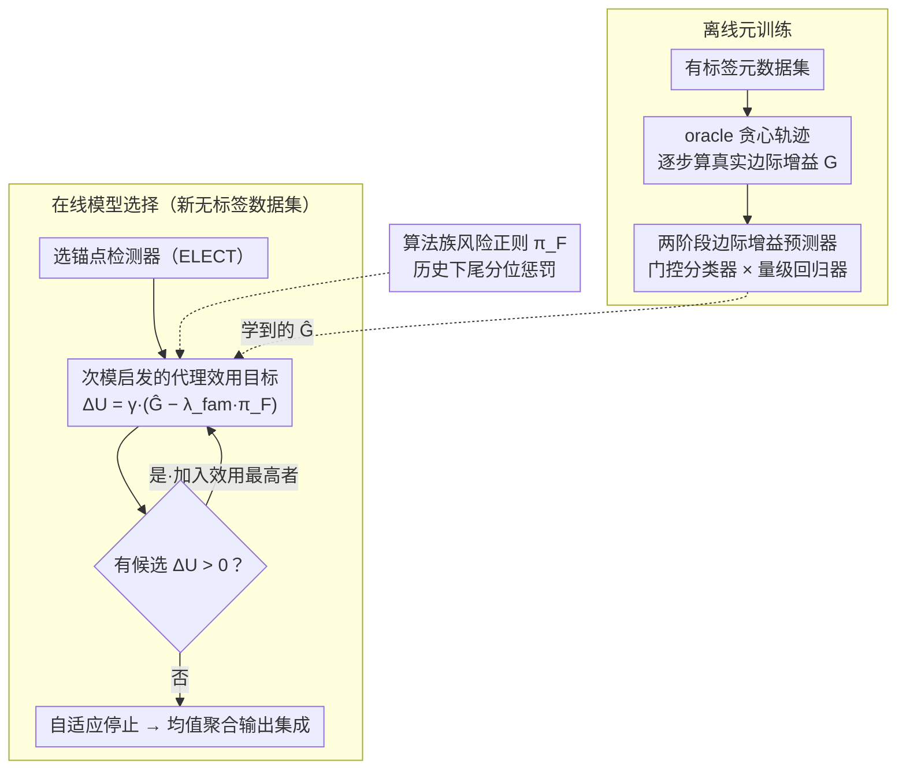

# Automatic Unsupervised Ensemble Outlier Model Selection–Extended Version

**会议**: ICML2026  
**arXiv**: [2605.16567](https://arxiv.org/abs/2605.16567)  
**代码**: 待确认  
**领域**: 异常检测  
**关键词**: 无监督异常检测, 集成模型选择, 元学习, 次模优化, 自适应停止

## 一句话总结
提出 MetaEns 框架，通过元学习预测候选检测器的边际集成增益，结合多样性折扣和算法族风险正则化的代理目标函数，在无标签条件下自适应地贪心构建紧凑高质量的异常检测集成模型。

## 研究背景与动机

**领域现状**：无监督异常检测在欺诈检测、网络安全、医学诊断等场景中有广泛应用。现有检测器（LOF、IForest、kNN 等）各有所长，但没有单一检测器能在所有数据集上稳定表现优秀，因此集成方法成为提升鲁棒性的主流思路。

**现有痛点**：在无监督场景下构建集成模型面临"集成饱和"问题——简单地把所有检测器的分数取平均（如 Mega Ensemble），或固定选取 Top-k 个检测器，都会因引入冗余或不可靠的模型而导致性能退化和额外计算开销。现有的元学习方法如 MetaOD 和 ELECT 虽然可以推荐检测器，但仅限于选择单个最优模型，无法解决多模型互补组合的问题。

**核心矛盾**：在没有标签的情况下，无法直接评估"向集成中添加一个新检测器到底有没有用"。添加模型的边际收益（marginal gain）是不可观测的，而朴素的固定大小集成无法根据数据集特征自适应调整。

**本文目标**：将无监督集成异常检测的模型选择建模为序贯决策问题，自动决定"选哪些模型"和"什么时候停止添加"。

**切入角度**：虽然测试时无法计算真实的边际增益，但边际增益的结构可以从有标签的元数据集上离线学习。利用检测器之间的分数统计特征（相关性、分布形状、排名重叠度），可以训练一个跨数据集迁移的增益预测器。

**核心 idea**：用元学习预测候选模型的边际集成增益，结合次模启发的代理目标（含冗余折扣和算法族风险惩罚）进行贪心选择，当没有候选模型能带来正收益时自适应停止。

## 方法详解

### 整体框架
MetaEns 分为离线元训练和在线模型选择两个阶段。离线阶段利用有标签的元数据集模拟序贯集成构建过程，计算每一步添加候选检测器的真实边际增益（AP 提升），用这些"状态-增益"对训练一个两阶段增益预测器。在线阶段面对新的无标签数据集，先选定一个锚点检测器（primary detector），然后贪心地逐步添加代理效用最高的检测器，直到没有候选模型能带来正效用为止。代理效用由学到的预测增益、冗余折扣和算法族风险正则三者组合而成。候选池包含 297 个检测器，覆盖 IForest、LOF、kNN、HBOS、OCSVM、LODA、ABOD、COF 共 8 个算法族。集成分数采用成员检测器分数的均值聚合。

### 关键设计

**1. 两阶段边际增益预测器：用"门控 + 量级"应对零膨胀的增益分布**

测试时没标签，无法直接判断"加一个检测器到底有没有用"，所以要从有标签的元数据集上离线学这个增益。难点是随着集成增长，正增益样本变得极度稀疏——大多数候选要么冗余要么有害，单一回归器在这种零膨胀分布上会给一堆候选预测出小的正值，把冗余模型误选进来。作者把预测拆成分类器和回归器：

$$\hat{G}(f_i\mid P)=f_{\text{cls}}(f_i\mid P)\cdot f_{\text{reg}}(f_i\mid P),$$

$f_{\text{cls}}$ 先估"这个候选是否能改善集成"的概率充当门控，$f_{\text{reg}}$ 只在正类样本上估增益幅度。状态表征 $\phi(f_i,f_{i-1}^*,P)$ 用的是候选与上一步选择、候选与当前集成、上一步与当前集成之间的分数统计特征（Spearman 相关、余弦相似度、熵、峰度、Jaccard 重叠等）加集成大小 $|P|$，两个模型都用 ExtraTrees。先判断该不该加、再量化加多少，比硬回归稳得多。

**2. 次模启发的代理效用目标：在无标签下指导贪心选择与自适应停止**

学到的 $\hat{G}$ 有噪声、不保证满足次模性，直接拿它贪心容易选进近重复模型、也不知道何时该停。作者给候选 $f_i$ 定义边际效用

$$\Delta U(f_i\mid P)=\gamma(f_i,P)\cdot\big(\hat{G}(f_i\mid P)-\lambda_{\text{fam}}\,\pi_{\mathcal{F}(f_i)}\big),\qquad \gamma(f_i,P)=\frac{1}{1+\beta\cdot\text{sim}_{\max}(f_i,P)},$$

冗余折扣 $\gamma$ 用候选与已选模型的**最大** Jaccard 相似度衰减效用——之所以用最大而非平均，是为了严格挡住任何已选成员的近复制品进入集成，从而显式模拟"递减收益"。当所有候选的 $\Delta U\le 0$ 时自动停止，集成大小因此自适应、不用手动设 $k$。

**3. 算法族风险正则化：用历史下尾统计规避系统性风险**

某些算法族平均表现尚可，但在部分数据集上会产生严重负增益，而无标签时根本没法当场验证单次选择的好坏。作者在元训练轨迹里对每个算法族 $F$ 算真实边际增益的第 10 百分位 $\text{Risk}_F=Q_{0.10}(\{G(f\mid P)\})$，转成非负惩罚 $\pi_F=\max(0,-\text{Risk}_F)$，通过系数 $\lambda_{\text{fam}}$ 加进上面的代理目标（未见过的族给零惩罚）。用下尾分位而非均值，正是因为风险藏在尾部——这一项在消融里是最关键的组件，去掉后 AP 掉得最多（-0.0359）。

### 训练策略
离线阶段采用 oracle 贪心策略生成训练轨迹：对每个元数据集，从 AP 最高的检测器开始，迭代选择使真实增益最大的模型。这种策略让元模型暴露于高质量的部分集成状态，避免被随机低信号状态主导训练。分类目标为 $y_{\text{cls}} = \mathbb{I}(G > 0)$，回归目标为 $y_{\text{reg}} = \max(0, G)$，仅在 $G > 0$ 的样本上优化。超参数通过留一数据集交叉验证调优。

## 实验关键数据

### 主实验
在 39 个真实异常检测数据集上评估，候选池 297 个检测器。对比 19 个无监督基线和 1 个有监督贪心上界。

| 方法 | AP ↑ | 平均排名 ↓ | ROC-AUC ↑ | 集成大小 |
|------|------|-----------|-----------|---------|
| Greedy Oracle（上界） | 0.6877 | 1.0 | 0.8968 | 10 |
| MetaEns（本文） | **0.4308** | **59.3** | **0.7867** | **2.2** |
| ELECT Top-10 | 0.4117 | 83.2 | 0.7785 | 10 |
| ELECT Top-1 | 0.4069 | 85.8 | 0.7734 | 1 |
| MetaOD | 0.3989 | 101.0 | 0.7547 | 1 |
| Mega Ensemble | 0.3970 | 100.0 | 0.7737 | 297 |
| DeepSVDD | 0.2073 | 247.5 | 0.5905 | 1 |

MetaEns 在所有指标上均超越最强基线 ELECT Top-10，AP 提升 0.019，平均排名从 83.2 降至 59.3，且仅使用平均 2.2 个模型（对比 ELECT 的 10 个和 Mega Ensemble 的 297 个）。深度学习基线在无监督表格异常检测上普遍表现较弱。

### 消融实验

| 变体 | AP ↑ | 平均排名 ↓ | ΔAP |
|------|------|-----------|-----|
| MetaEns（完整） | 0.4308 | 59.3 | — |
| 去掉多样性折扣（$\beta=0$） | 0.4185 | 77 | -0.0169 |
| 去掉族风险正则（$\lambda_{\text{fam}}=0$） | 0.3995 | 72 | -0.0359 |
| 单一增益预测器 | 0.4133 | 87 | -0.0221 |

### 关键发现
- 算法族风险正则化是最关键的组件，去除后 AP 下降最大（-0.0359），表明在无标签环境下控制算法族级别的风险对集成质量至关重要
- MetaEns 对初始化检测器具有鲁棒性：无论用 ELECT、LOF、IForest 还是随机选择作为起始模型，都能通过互补选择恢复性能，在"救援区"（primary AP < 0.4）中表现尤为突出
- 纯分数层面的状态表征使框架可迁移至图像和文本模态：在 20 个 ADBench 图像/文本数据集上，MetaEns 的 AP 也优于最强基线（图像上 +0.0257）
- t-SNE 可视化显示 ELECT Top-10 倾向于在单个算法族内选择模型，而 MetaEns 的选择跨越多个算法族簇，实现了更好的多样性

## 亮点与洞察
- 两阶段增益预测器的"门控"设计是应对零膨胀分布的通用技巧：先判断二分类再估计量级，比直接回归更稳定，可迁移到任何需要预测稀疏正信号的场景（如推荐系统中的增量价值预测）
- 纯分数层面的特征设计使框架与数据维度和模态无关：不依赖原始输入特征或模型内部结构，只利用检测器输出分数的统计关系，实现了从表格到图像/文本的零样本迁移
- 自适应停止机制自然产生紧凑集成（平均仅 2.2 个模型），在实用性上远优于需要手动设定集成大小的方法

## 局限与展望
- 依赖有标签的元数据集进行离线训练，若测试任务与元训练分布差异过大（如低维数据集 $d \leq 13$），性能可能退化
- 算法族划分依赖预定义的先验知识，对新型检测器需要人工指定所属族别，缺乏自动化机制
- 仅关注批处理场景，不支持流式或非平稳数据上的在线集成更新
- 改进方向：引入不确定性感知的增益预测以量化预测置信度、探索更丰富的元特征以改善分布偏移下的迁移能力

## 相关工作与启发
- **vs ELECT**: ELECT 利用元学习选择单个最优检测器，MetaEns 在其基础上进行序贯集成扩展，共享相同的 primary detector 但通过上下文感知的伙伴选择获得显著提升
- **vs MetaOD**: MetaOD 基于任务相似度推荐单模型，无法构建互补集成，AP 比 MetaEns 低 0.032
- **vs Mega Ensemble**: 朴素地聚合全部 297 个检测器反而不如自适应选择 2.2 个模型，验证了"少而精"优于"多而杂"的集成选择思路

## 评分
- 新颖性: ⭐⭐⭐⭐ 将集成选择建模为序贯决策并引入两阶段增益预测器和族风险正则化，是异常检测集成方向的创新贡献
- 实验充分度: ⭐⭐⭐⭐⭐ 39 数据集、297 候选模型、19 基线、完整消融/鲁棒性/模态迁移分析
- 写作质量: ⭐⭐⭐⭐ 结构清晰，公式化规范，问题定义和方法阐述层次分明
- 价值: ⭐⭐⭐⭐ 解决了无监督集成选择的实际痛点，框架通用性强，2.2 模型的紧凑集成具有很高实用价值

<!-- RELATED:START -->

## 相关论文

- [\[NeurIPS 2025\] Towards Reliable and Holistic Visual In-Context Learning Prompt Selection](../../NeurIPS2025/optimization/towards_reliable_and_holistic_visual_in-context_learning_prompt_selection.md)
- [\[ICML 2025\] Sparse Causal Discovery with Generative Intervention for Unsupervised Graph Domain Adaptation](../../ICML2025/optimization/sparse_causal_discovery_with_generative_intervention_for_unsupervised_graph_doma.md)
- [\[NeurIPS 2025\] Deep Taxonomic Networks for Unsupervised Hierarchical Prototype Discovery](../../NeurIPS2025/optimization/deep_taxonomic_networks_for_unsupervised_hierarchical_prototype_discovery.md)
- [\[ICML 2026\] Sign Lock-In: Randomly Initialized Weight Signs Persist and Bottleneck Sub-Bit Model Compression](sign_lock-in_randomly_initialized_weight_signs_persist_and_bottleneck_sub-bit_mo.md)
- [\[CVPR 2026\] Model Merging in the Essential Subspace](../../CVPR2026/optimization/model_merging_in_the_essential_subspace.md)

<!-- RELATED:END -->
