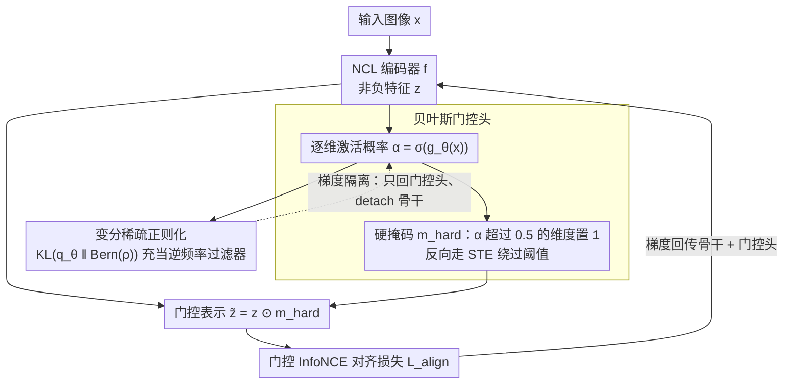

# Bayesian Gated Non-Negative Contrastive Learning

**会议**: ICML 2026  
**arXiv**: [2605.28441](https://arxiv.org/abs/2605.28441)  
**代码**: https://github.com/Cui-Peng-624/BayesNCL  
**领域**: 自监督/表示学习  
**关键词**: 对比学习, 非负表示, 贝叶斯门控, 语义解耦, 可解释性  

## 一句话总结
针对非负对比学习（NCL）中共享背景特征导致的优化冲突（梯度振荡），提出 BayesNCL，通过贝叶斯门控头为每个特征维度学习 Bernoulli 分布来动态过滤高频公共特征，在 ImageNet-100 上语义一致性提升 142.1% 且不牺牲下游准确率。

## 研究背景与动机

**领域现状**：自监督对比学习（CL）已成为无标注视觉表示学习的主流范式，通过拉近正样本对、推远负样本对来编码高层语义。然而标准 CL 的表示高度纠缠——语义概念分散在所有特征维度上，单个维度缺乏明确语义意义，这在安全关键场景中构成严重风险。

**现有痛点**：Non-Negative Contrastive Learning（NCL）通过强制非负约束建立了与 NMF 的等价性，使特征维度与语义簇对齐。但 NCL 采用确定性相似度度量，对所有维度一视同仁。当现实图像存在组合性——不同物体共享高频背景特征（如"蓝天"）时，这种确定性方法会失败。

**核心矛盾**：作者识别出一个根本性的**优化冲突**——以"鸟"和"飞机"共享蓝天背景为例，正样本对要求对齐"蓝天"维度，负样本对却要求排斥同一维度。这导致冲突特征维度的梯度期望趋近于零但方差极大（$\mathbb{E}[\nabla_{z_k} L] \approx 0, \text{Var}(\nabla_{z_k} L) \gg 0$），阻碍语义解耦。

**切入角度**：从概率论视角重新审视相似度定义。联合似然分析表明最优相似度应按逆频率加权：$s_{IPW}(z,z') = \sum_k \frac{1}{\pi_k} z_k z_k'$，即稀有判别性特征应主导对齐得分，高频背景特征应被降权。但显式计算语义频率 $\pi_k$ 不可行。

**核心 idea**：引入可学习的贝叶斯门控机制，通过变分推断自动"关闭"引发冲突的高频公共特征维度，以概率过滤的方式实现逆频率加权相似度的可行近似。

## 方法详解

### 整体框架
BayesNCL 在标准 NCL 编码器 $f: \mathcal{X} \to \mathbb{R}_{\geq 0}^K$ 的基础上，增加一个**贝叶斯门控头**。输入图像经编码器得到非负特征 $z = f(x)$，门控头预测每个维度的 Bernoulli 参数 $\alpha = \sigma(g_\theta(x))$，通过阈值生成离散掩码 $m_{\text{hard}} = \mathbb{I}(\alpha > 0.5)$，最终门控表示 $\tilde{z} = z \odot m_{\text{hard}}$ 用于计算对比损失。训练目标结合门控 InfoNCE 与 KL 稀疏正则化。

### 关键设计

**1. 贝叶斯门控头：让每张图自己决定哪些维度该关掉**

背景里"蓝天"这种高频公共特征是优化冲突的来源——它在正样本对里被要求对齐、在负样本对里又被要求排斥，于是梯度期望趋零、方差爆炸。BayesNCL 的办法是在编码器特征之上接一个 2 层 MLP 门控头，对每个维度输出激活概率 $\alpha_k = \sigma(g_\theta(x)_k)$，再用硬阈值 $m_{\text{hard}} = \mathbb{I}(\alpha > 0.5)$ 把维度真正置零。门控之所以必须是"硬"的，是因为只有严格置零才能彻底切断那条振荡的梯度，软门控只是缩小幅度仍留有冲突信号——实验里硬门控（STE）的 ImageNet-100 一致性 36.14 远高于软门控的 33.15。但硬阈值不可导，所以反向传播走 Straight-Through Estimator，让梯度绕过阈值经由连续概率 $\alpha$ 回传：$m_{\text{train}} = \text{sg}[m_{\text{hard}} - \alpha] + \alpha$。相比 TopK 这类只能设全局固定阈值的确定性方法，概率门控的关键优势是"按图而变"——"鸟图"和"飞机图"可以各自关掉不同的背景维度，而不是所有样本共享一套被砍的通道。

**2. 变分稀疏正则化：把逆频率加权变成一个可优化的 KL 约束**

概率分析告诉我们最优相似度应按逆频率加权 $s_{IPW}(z,z') = \sum_k \frac{1}{\pi_k} z_k z_k'$，但语义频率 $\pi_k$ 没法显式算。本文转而把"该开哪些维度"形式化成变分推断，用一个稀疏先验来间接实现逆频率过滤。训练目标是 ELBO 形式：

$$\mathcal{L}_{\text{total}} = \mathbb{E}_{m \sim q_\theta}[\mathcal{L}_{\text{InfoNCE}}(z \odot m)] + \lambda \cdot D_{\text{KL}}(q_\theta(m|x) \| p(m))$$

其中先验 $p(m) = \text{Bern}(\rho)$ 控制期望稀疏度。KL 项在这里扮演"逆频率过滤器"——它给每个维度的开启标了一个代价 $\lambda \cdot \log(1/\rho)$，维度只有在对齐增益足够大时才值得开。Theorem 4.5 把这件事说死了：维度 $k$ 的对齐增益正比于 $\gamma \cdot \pi_k(1-\pi_k)$，当特征频率 $\pi_k \to 1$（即高频背景）时增益 $\to 0$，低于稀疏代价，于是该维度被自动关闭。这样有限的激活预算就被分配给稀有的判别性特征，而不是消耗在无助于实例区分的公共背景上。

**3. 梯度隔离：别让稀疏目标污染骨干表示**

稀疏正则会鼓励"少开维度"，如果让它直接作用到编码器骨干，骨干就会为了满足稀疏约束而牺牲表示质量——它同时被"学好特征"和"少激活"两个目标拉扯。BayesNCL 的处理很简单：稀疏正则项 $\mathcal{L}_{\text{sparsity}}$ 的梯度只回传到门控头参数 $\theta$，不回传到骨干；骨干只通过门控后的 InfoNCE 学习，专注于学有判别力的表示，"关哪些维度"的决策完全交给门控头。这一刀切得很关键：消融里移除梯度隔离会让 ImageNet-100 一致性从 36.14 直接掉到 22.29，印证了让骨干背负双目标确实会引发目标冲突。

### 损失函数 / 训练策略
总目标是门控 InfoNCE 加 KL 稀疏正则的 ELBO（见设计 2），先验稀疏度 $\rho$ 和正则权重 $\lambda$ 是两个关键超参，存在"倒 U 型"敏感区间需调优。前向用硬门控、反向用 STE，稀疏梯度对骨干做 detach。

## 实验关键数据

### 主实验（可解释性指标）

| 方法 | CIFAR-10 Cons.↑ | CIFAR-100 Cons.↑ | IN-100 Cons.↑ | IN-100 $H_s$↓ | IN-100 Act. |
|------|-----------------|-------------------|---------------|----------------|-------------|
| CL | 10.00 | 1.00 | 1.00 | 4.59 | 1.00 |
| NCL | 53.82 | 9.91 | 14.93 | 3.28 | 0.48 |
| NCL+TopK | 51.81 | 12.32 | 14.27 | 3.35 | 0.47 |
| BayesNCL (GS) | 53.68 | 20.75 | 11.66 | 3.36 | 0.13 |
| **BayesNCL (STE)** | **56.50** | **22.02** | **36.14** | **2.10** | 0.50 |

BayesNCL-STE 在 ImageNet-100 上语义一致性达 36.14，相比 NCL 的 14.93 提升 **142.1%**，同时激活率（0.50）高于 NCL（0.48），说明不是简单地"关闭通道"，而是实现了**有效稀疏**。

### 下游任务性能

| 方法 | CIFAR-10 LP@1 | CIFAR-100 LP@1 | IN-100 LP@1 | IN-100 LP@5 |
|------|---------------|----------------|-------------|-------------|
| CL | 87.88 | 59.72 | 68.31 | 90.24 |
| NCL | 87.80 | 60.67 | 69.63 | 91.23 |
| **BayesNCL** | **88.02** | 60.69 | **70.44** | **91.71** |

BayesNCL 在显著提升可解释性的同时，线性探测准确率不降反升（IN-100: 70.44% vs NCL 69.63%），打破了"可解释性-性能"的 trade-off。

### 消融实验

| 配置 | IN-100 Cons.↑ | IN-100 LP@1 | 说明 |
|------|---------------|-------------|------|
| BayesNCL (完整) | 36.14 | 70.44 | 基线 |
| Soft Gating | 33.15 | 69.87 | 软门控无法中断梯度振荡 |
| 去除梯度隔离 | 22.29 | 67.47 | 骨干被稀疏损失误导 |
| 1-Layer MLP | 40.85 | 69.55 | 一致性高但准确率略低 |
| 3-Layer MLP | 26.37 | 68.09 | 过深门控头训练不稳定 |

### 计算开销

| 数据集 | 方法 | 训练时间 (min) | FLOPs |
|--------|------|---------------|-------|
| CIFAR-100 | NCL | 70.95 | 1.416G |
| CIFAR-100 | BayesNCL | 75.12 | 1.419G |
| IN-100 | NCL | 193.78 | 3.731G |
| IN-100 | BayesNCL | 218.53 | 3.815G |

FLOPs 增量仅 ~2%，训练时间增加 ~13%，开销极小。

## 亮点与洞察
- **精准定位问题**：将 NCL 的可解释性瓶颈归因于"优化冲突"并给出梯度分析的形式化证明，为理解对比学习的特征纠缠提供了新视角
- **理论完备**：从四个互补视角提供理论保证——局部语义过滤（Theorem 4.5）、全局误差缩减（Theorem 4.7）、信息论约束（Theorem 4.9）和泛化界
- **有效稀疏 vs 简单稀疏**：BayesNCL 并非简单关闭通道，而是动态招募更多维度编码不同语义概念同时过滤纠缠噪声，激活率反而高于 NCL

## 局限性 / 可改进方向
- 仅在 CIFAR-10/100 和 ImageNet-100 上验证，缺少大规模 ImageNet-1K 实验
- 骨干网络仅用 ResNet-18/50，未验证在 ViT 等现代架构上的效果
- 超参数 $\rho$ 和 $\lambda$ 需要调优，存在"倒 U 型"敏感区间
- 门控头仅基于单样本特征决策，未考虑跨样本的全局统计信息

## 相关工作与启发
- NCL（Wang et al., 2024）通过非负约束建立 CL 与 NMF 的等价性，是本文的直接前驱
- 变分信息瓶颈（VIB）通过注入噪声压缩信息，BayesNCL 则通过结构化稀疏实现"硬信息瓶颈"
- Sparse Autoencoder（SAE）中"特征叠加"与本文"优化冲突"有异曲同工之处
- 可扩展至多模态对比学习（如 CLIP）中解决模态间共享特征的冲突问题

## 评分
- 新颖性: 8/10 — 优化冲突的形式化定义和贝叶斯门控解法是新颖的理论贡献
- 实验充分度: 7/10 — 消融详尽但缺乏大规模数据集验证
- 写作质量: 9/10 — 问题定义清晰、理论推导完整、实验分析透彻
- 价值: 7/10 — 为可解释自监督学习提供了有效方案，但适用范围待进一步验证

<!-- RELATED:START -->

## 相关论文

- [\[ICML 2026\] Multi-Objective Bayesian Optimization via Adaptive ε-Constraints Decomposition](multi-objective_bayesian_optimization_via_adaptive_varepsilon-constraints_decomp.md)
- [\[CVPR 2026\] BD-Merging: Bias-Aware Dynamic Model Merging with Evidence-Guided Contrastive Learning](../../CVPR2026/optimization/bd-merging_bias-aware_dynamic_model_merging_with_evidence-guided_contrastive_lea.md)
- [\[ICML 2025\] A Unified View on Learning Unnormalized Distributions via Noise-Contrastive Estimation](../../ICML2025/optimization/a_unified_view_on_learning_unnormalized_distributions_via_noise-contrastive_esti.md)
- [\[ICML 2026\] SyMerge: From Non-Interference to Synergistic Merging via Single-Layer Adaptation](symerge_from_non-interference_to_synergistic_merging_via_single-layer_adaptation.md)
- [\[ICML 2026\] SPSsafe: Safeguarded Stochastic Polyak Step Sizes for Non-smooth Optimization](safeguarded_stochastic_polyak_step_sizes_for_non-smooth_optimization_robust_perf.md)

<!-- RELATED:END -->
