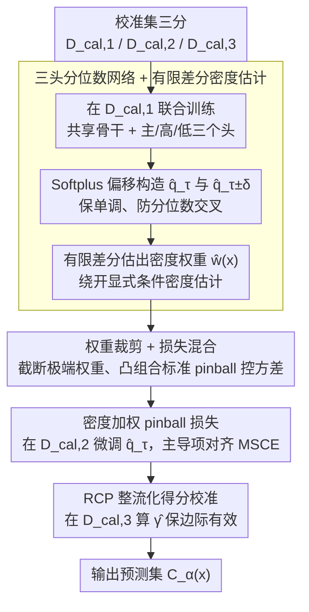

# Colorful Pinball: Density-Weighted Quantile Regression for Conditional Guarantee of Conformal Prediction

**会议**: ICML2026  
**arXiv**: [2512.24139](https://arxiv.org/abs/2512.24139)  
**代码**: https://github.com/Colorful-Pinball/CPCP  
**领域**: optimization  
**关键词**: conformal prediction, 条件覆盖, 分位数回归, 密度加权, pinball损失  

## 一句话总结

本文通过 Taylor 展开揭示了标准 pinball 损失在条件覆盖率优化上的固有缺陷——忽视了异方差结构，提出密度加权 pinball 损失作为条件覆盖 MSE 的更紧代理目标，并设计三头分位数网络通过有限差分估计密度权重，在 8 个高维回归基准上大幅提升条件覆盖性能。

## 研究背景与动机

**领域现状**：Conformal Prediction (CP) 是当前不确定性量化的主流范式，能以有限样本给出分布无关的边际覆盖保证 $\mathbb{P}(Y \in \mathcal{C}_\alpha(X)) \geq 1-\alpha$。然而标准 split CP 仅保证总体层面的边际覆盖，无法保证对特定输入 $x$ 的条件覆盖 $\mathbb{P}(Y \in \mathcal{C}_\alpha(X) \mid X=x)$——这在高风险场景中恰恰是实际需求。

**现有痛点**：针对条件覆盖，现有方法主要从两条路径入手：一是通过分组/局部化近似条件保证（如 group-conditional、localized CP），但受维度诅咒限制；二是改进非一致性得分函数（如 CQR、RCP），通过分位数回归校正得分的异方差性。然而，标准 pinball 损失的优化目标与条件覆盖 MSE 之间存在系统性偏差。

**核心矛盾**：已有工作（Kiyani et al., 2024; Plassier et al., 2025a）建立了 MSCE 与 pinball 损失超额风险之间的上界联系，但这个上界依赖条件 CDF 的全局 Lipschitz 常数 $L_F$，通常很松——它忽略了 $f_{S|X}(q_\tau(x))$ 在不同 $x$ 处的变化，即条件得分分布在目标分位数处的"陡峭度"差异。

**本文目标**：直接逼近条件覆盖的 MSE（即 MSCE），而非依赖松弛的上界或放松的条件覆盖定义。

**切入角度**：作者对 MSCE 做 Taylor 展开，发现其主导项是 **密度加权的 pinball 超额风险** $\mathbb{E}_X[f_{S|X}(q_\tau(X)) \cdot \mathcal{E}(X)]$，权重恰好是条件密度在真实分位数处的取值。在 location-scale 族下，该权重正比于 $1/\sigma(x)$——对低方差（陡峭 CDF）区域赋予更高权重，因为这些区域的条件覆盖最敏感——微小的分位数误差可导致覆盖率从 95% 骤降至 80%。

**核心 idea**：用密度加权 pinball 损失替代标准 pinball 损失来训练分位数回归，通过有限差分从辅助分位数估计密度权重，弥补标准方法对异方差结构的忽视。

## 方法详解

### 整体框架

CPCP (Colorful Pinball Conformal Prediction) 将校准集分为三个子集 $\mathcal{D}_{\text{cal},1}, \mathcal{D}_{\text{cal},2}, \mathcal{D}_{\text{cal},3}$，执行三阶段流程：(1) 在 $\mathcal{D}_{\text{cal},1}$ 上联合训练三个分位数估计器（目标分位数 $\tau$ 及辅助分位数 $\tau \pm \delta$）；(2) 用辅助分位数构造有限差分密度权重，在 $\mathcal{D}_{\text{cal},2}$ 上用加权 pinball 损失微调目标分位数；(3) 在 $\mathcal{D}_{\text{cal},3}$ 上执行 RCP 整流化得分校准，确保边际有效性。最终输出预测集 $\mathcal{C}_\alpha(x_{\text{test}}) = \{y: S(x_{\text{test}}, y) \leq \hat{q}_\tau(x_{\text{test}}) + \hat{\gamma}\}$。

### 关键设计

**1. 密度加权 pinball 损失（理论核心）：补上标准 pinball 与条件覆盖 MSE 之间差的那一个密度因子**

为什么标准 pinball 损失优化不好条件覆盖？作者对 MSCE 做 Taylor 展开把这件事抠清楚了：条件覆盖偏差的平方 $(F_{S|X}(\hat{q}_\tau(x))-\tau)^2$ 的主导项是 $f_{S|X}(q_\tau(x))^2\cdot\epsilon_q(x)^2$，而标准 pinball 超额风险的主导项是 $\tfrac{1}{2}f_{S|X}(q_\tau(x))\cdot\epsilon_q(x)^2$——两者整整差了一个密度因子 $f_{S|X}(q_\tau(x))$。这意味着标准 pinball 在条件 CDF 陡峭（$f_{S|X}$ 大、$\sigma(x)$ 小）的区域赋权不足，可那里恰恰是条件覆盖最敏感的地方：微小的分位数误差就能让覆盖率从 95% 骤降到 80%。于是修复方案很直接——给 pinball 损失乘上密度权重 $f_{S|X}(q_\tau(x))$，优化目标就在主导项上与 MSCE 精确对齐。在 location-scale 族下这个权重正好退化为 $1/\sigma(x)$，对低方差区域加重权重，直觉上也很自然。

**2. 三头分位数网络 + 有限差分密度估计：不去估完整密度，只借两个辅助分位数把权重"差"出来**

密度权重虽好，但显式估计条件密度 $f_{S|X}$ 比回归本身还难。作者绕开这点，利用分位数函数和 CDF 互为逆函数的关系 $\partial q_\tau(x)/\partial\tau=1/f_{S|X}(q_\tau(x))$，直接用有限差分近似密度：

$$\hat{w}(x)=\frac{2\delta}{\hat{q}_{\tau+\delta}(x)-\hat{q}_{\tau-\delta}(x)}.$$

为此网络设计成共享骨干 $h(x)$ 加三个投影头，辅助分位数由 $\hat{q}_{\tau\pm\delta}(x)=\hat{q}_\tau(x)\pm\text{Softplus}(\phi_{\text{high/low}}\circ h(x))$ 构造——Softplus 强制偏移量非负，天然保证 $\hat{q}_{\tau-\delta}<\hat{q}_\tau<\hat{q}_{\tau+\delta}$ 的单调性、杜绝分位数交叉。这样只需两个辅助分位数就能拿到所需权重，把"估密度"这个难题转化成"多训两个头"的易事。

**3. 权重裁剪 + 损失混合（有限样本稳定化）：给逆权重的方差爆炸上一道保险**

有限差分估计器的分母 $\hat{q}_{\tau+\delta}-\hat{q}_{\tau-\delta}$ 在 $\delta$ 较小时可能接近零，导致权重 $\hat w(x)$ 爆炸、方差失控。作者用两个标准手法压方差：权重裁剪把极端权重截断到经验均值的 $M$ 倍以内；损失混合则把优化目标设成"加权 pinball + 标准 pinball"的凸组合，等价于给权重施加一个人工下界。两者都是以轻微偏差换取方差大幅下降，思路和因果推断里逆倾向得分裁剪一脉相承；实验也显示这个稳定化在所有数据集上都带来额外增益，在 SGEMM、Transcoding 这类高维多输出数据上尤其明显。

### 训练策略

采用两阶段训练：第一阶段在 $\mathcal{D}_{\text{cal},1}$ 上用标准 pinball 损失联合训练三个分位数头（确保有限差分精度）；第二阶段冻结骨干和辅助头，仅用加权 pinball 损失在 $\mathcal{D}_{\text{cal},2}$ 上微调主头。最终在 $\mathcal{D}_{\text{cal},3}$ 上计算整流化得分的经验分位数 $\hat{\gamma}$ 保证边际有效性。

## 实验关键数据

### 主实验：条件覆盖性能（MSCE ↓）

在 8 个高维回归基准上比较 MSCE（Mean Squared Coverage Error），目标覆盖率 $\tau = 90\%$，20 次重复：

| 方法 | Bike | Diamond | Naval | SGEMM | Transcoding | WEC |
|------|------|---------|-------|-------|-------------|-----|
| Split CP | 0.0031 | 0.0118 | 0.0351 | 0.0039 | 0.0125 | 0.0123 |
| CQR | 0.0011 | 0.0010 | 0.0120 | 0.0012 | 0.0016 | 0.0061 |
| RCP | 0.0010 | 0.0013 | 0.0029 | 0.0007 | 0.0009 | 0.0030 |
| CPCP | 0.0009 | 0.0009 | 0.0019 | 0.0003 | 0.0009 | 0.0025 |
| **CPCP (Clip+Mix)** | **0.0008** | **0.0004** | **0.0019** | **0.0003** | **0.0004** | **0.0012** |

### 消融 / Worst-Slice Coverage（WSC ↑）

| 方法 | Bike | Diamond | Naval | SGEMM | Transcoding | WEC |
|------|------|---------|-------|-------|-------------|-----|
| Split CP | 0.8133 | 0.6480 | 0.5428 | 0.7435 | 0.6797 | 0.7623 |
| CQR | 0.8641 | 0.8563 | 0.6997 | 0.8393 | 0.8175 | 0.8149 |
| RCP | 0.8849 | 0.8448 | 0.8002 | 0.8627 | 0.8515 | 0.8516 |
| **CPCP (Clip+Mix)** | **0.8882** | **0.8802** | **0.8320** | **0.8912** | **0.8759** | **0.8715** |

### 关键发现

- CPCP (Clip+Mix) 在 MSCE 上相比 RCP 平均降低约 40-60%，在 WSC 上将最差切片覆盖率从 ~80% 提升至 ~87-89%
- 消融实验中 RCP-MultiHead（仅多头联合训练但不使用密度权重）与 RCP 性能接近，证明改进不来自多任务学习或额外容量，而是密度加权目标本身
- 带宽 $\delta$ 在 0.01-0.05 范围内结果稳健，默认 $\delta=0.02$
- 权重裁剪 + 损失混合的稳定化策略在所有数据集上一致带来额外增益，尤其在高维多输出数据集（如 SGEMM、Transcoding）上效果显著

## 亮点与洞察

- **理论洞察极为优雅**：通过 Taylor 展开精确刻画了标准 pinball 损失与条件覆盖 MSE 之间的"差一个密度因子"的系统性偏差，将看似黑盒的条件覆盖优化问题转化为有明确数学动机的加权回归问题。在 location-scale 族下权重退化为 $1/\sigma(x)$ 这一结果直觉上也非常自然
- **有限差分密度估计的巧妙设计**：利用分位数函数与 CDF 逆函数的关系，避免了难度更高的条件密度估计任务，仅需两个辅助分位数即可；Softplus 参数化同时解决了分位数交叉和负权重两个实际问题
- **理论完备性强**：提供了完整的非渐近超额风险界，包含估计权重中逆权重的精确刻画，这一理论工具对其他涉及逆倾向加权的问题（如因果推断、off-policy评估）也有参考价值

## 局限与展望

- 校准集被三分使用，每个子集的有效样本量约为原始的 1/3，在小校准集场景下可能降低性能
- 密度权重估计依赖辅助分位数的精度，在极端分位数（如 $\tau$ 接近 0 或 1）或样本稀疏区域可能不稳定
- 理论速率 $O(n^{-1/3})$ 慢于标准分位数回归，虽然有限样本中密度加权的常数因子优势足以弥补，但在超大样本下标准方法可能追平
- 当前仅验证了回归任务，可探索在分类任务的条件覆盖保证和结构化输出（如图、序列）场景下的推广

## 相关工作与启发

- **RCP** (Plassier et al., 2025a)：CPCP 的直接基础，整流化得分框架；CPCP 可视为在 RCP 的分位数回归阶段引入更优的加权目标
- **CQR** (Romano et al., 2019)：经典的分位数回归 + 共形校准方法，但需要在训练集上替换目标函数
- **PLCP** (Kiyani et al., 2024)：建立 MSCE 与 pinball 超额风险的联系，但使用离散分组近似，收敛速率仅 $O(n^{-1/4})$

<!-- RELATED:START -->

## 相关论文

- [\[CVPR 2026\] Conditional Factuality Controlled LLMs with Generalization Certificates via Conformal Sampling](../../CVPR2026/optimization/conditional_factuality_controlled_llms_with_generalization_certificates_via_conf.md)
- [\[ICLR 2026\] Conformal Prediction Adaptive to Unknown Subpopulation Shifts](../../ICLR2026/optimization/conformal_prediction_adaptive_to_unknown_subpopulation_shifts.md)
- [\[ICML 2025\] Conformal Prediction as Bayesian Quadrature](../../ICML2025/optimization/conformal_prediction_as_bayesian_quadrature.md)
- [\[NeurIPS 2025\] Conformal Prediction for Causal Effects of Continuous Treatments](../../NeurIPS2025/optimization/conformal_prediction_for_causal_effects_of_continuous_treatments.md)
- [\[ICML 2025\] On Temperature Scaling and Conformal Prediction of Deep Classifiers](../../ICML2025/optimization/on_temperature_scaling_and_conformal_prediction_of_deep_classifiers.md)

<!-- RELATED:END -->
