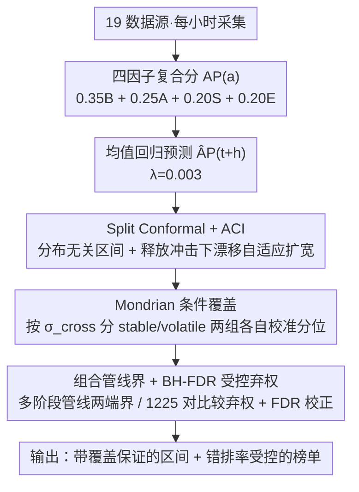

# Distribution-Free Uncertainty Quantification for Continuous AI Agent Evaluation

**会议**: ICML 2026  
**arXiv**: [2605.19779](https://arxiv.org/abs/2605.19779)  
**代码**: 待确认  
**领域**: LLM 评测 / 不确定性量化  
**关键词**: conformal prediction, ACI, agent evaluation, FDR, Mondrian

## 一句话总结
本文提出 AgentPulse 框架，将 split conformal、adaptive conformal inference (ACI)、Mondrian conformal 与 BH-FDR 组合，为 50 个 AI agent 的连续打分提供分布无关的覆盖率保证、组合管线的不确定性边界以及带 FDR 控制的排名弃权机制，把"测量不确定性"作为评测的一等输出。

## 研究背景与动机

**领域现状**：SWE-bench、GAIA、WebArena、TAU-bench 等基准把 agent 表现压缩成一个静态分数，Chatbot Arena 用 bootstrap 给 Elo 分数加置信区间。整个社区习惯把这些点估计当作"定论"，并据此排榜。

**现有痛点**：评测中实际存在三类不确定性，没有任何工具同时覆盖：(i) 测量异质性——不同平台对"质量"的判断本就不一致；(ii) 模型设定——加权方案稍变排名就翻；(iii) 时间非平稳——agent 在更新，分数随时间漂移。Bootstrap 只针对单一信号源、又依赖经验分布代表性假设；参数化区间假设残差高斯，agent 释放事件会立刻打破这个假设。

**核心矛盾**：评测对象既不满足 iid（agent 在迭代），又是多信号融合（benchmark/adoption/sentiment/ecosystem 四个因子），还要在排行榜尺度做大量两两比较，单一统计工具无法在"分布无关 + 漂移自适应 + 条件覆盖 + 多重检验"四个轴上同时给保证。

**本文目标**：为连续评测提供 (a) 单 agent 预测区间的有限样本覆盖保证；(b) 多 agent 管线的组合误差界；(c) 受控错排率的两两比较 + leaderboard 级别的 FDR 控制；(d) 条件覆盖（per-agent）而非仅边际覆盖。

**切入角度**：把 conformal prediction 这一套分布无关工具迁移到 agent 评测，并把它面对的四个具体挑战逐一对应到现成的扩展上——ACI 处理释放冲击，Mondrian 处理 per-agent 条件覆盖，独立/最坏界处理管线传播，BH 处理 leaderboard。

**核心 idea**：用 "split conformal + ACI + Mondrian + BH-FDR" 这一组合替代 bootstrap/参数化区间，把分布无关、漂移自适应、条件覆盖、多重检验四个保证同时挂到一个连续评测 pipeline 上。

## 方法详解

### 整体框架
AgentPulse 每小时从 19 个数据源采集信号，对 50 个 agent 算一个四因子复合分：
$\mathrm{AP}(a)=0.35\,B(a)+0.25\,A(a)+0.20\,S(a)+0.20\,E(a)$，其中 $B$ 是 benchmark（SWE-bench/GAIA/WebArena/HumanEval+/TAU-bench，缺失用中性先验 0.5），$A$ 是 GitHub stars/包下载/VSCode 安装的对数归一组合，$S$ 是 VADER/TextBlob/FinBERT/DistilBERT-SST2 在 9 个平台文本上的情感融合（200 条校准文本上 $\kappa{=}0.81$），$E$ 是 contributor depth + issue 关闭率 + release 新鲜度。预测用均值回归 $\widehat{\mathrm{AP}}_{t+h}(a)=\mathrm{AP}_t(a)+\lambda(\overline{\mathrm{AP}}-\mathrm{AP}_t(a))\cdot h$，$\lambda{=}0.003$（ADF 检验在 42/50 agent 上拒绝单位根）。不确定性侧由下面三个关键设计支撑。

### 关键设计

**1. Split Conformal + ACI 双层覆盖：在分布无关的基础上再补一层漂移自适应**

参数化区间假设残差高斯、bootstrap 假设经验分布有代表性，可一旦 agent 发版/周末/节假日打破平稳性，这两套都会立刻欠覆盖。AgentPulse 第一层先用 split conformal 拿到分布无关的有限样本保证 $\Pr[\mathrm{AP}_{t+h}\in C_{1-\alpha}]\ge 1-\alpha$：历史打分按 70/30 切成 train/calibration，取非一致性分数 $R_i=|\mathrm{AP}_{t_i+h}-\widehat{\mathrm{AP}}_{t_i+h}|$ 的 $\lceil(1-\alpha)(n_{\text{cal}}+1)\rceil/n_{\text{cal}}$ 分位 $\hat q_{1-\alpha}$，区间即 $\widehat{\mathrm{AP}}_{t+h}\pm\hat q_{1-\alpha}$。但 split conformal 仍假设交换性，对付不了 release 这类非交换冲击，于是第二层叠 ACI 在线调 miscoverage：$\alpha_{t+1}=\alpha_t+\gamma(\alpha-\mathrm{err}_t)$，在 Windsurf 发版后 6 小时内自动把区间扩宽 35%、48 小时后再收回。一层管"分布无关"、一层管"漂移自适应"，正好对上评测里最常见的两类不确定性。

**2. Mondrian 条件覆盖 + cross-source σ 分层：把"平均 80%"升级成"每个 agent 都 80%"**

边际覆盖 80% 是个会骗人的平均数——标准 conformal 下波动大的 agent 被淹没在均值里，volatile 子集平均覆盖只有 64.6%（15 个里 11 个低于 75%），承诺与现实差了 15 个百分点。作者用每个 agent 的跨平台标准差 $\sigma_{\text{cross}}(a)=\mathrm{std}(\{s_p(a)\})$ 当分层变量，按 $\sigma_{\text{cross}}<0.04$（stable, n=35）和 $\ge 0.04$（volatile, n=15）分成两组，每组各自校准一个 $\hat q_{1-\alpha}$。这样 volatile 组拿到更宽的区间去补偿它的重尾残差，覆盖被拉回 80.4%（只剩 2/15 低于 75%），代价是宽度多 22%——而这点额外宽度恰好如实反映了这类 agent 本身更大的内禀不确定性，而不是被均值抹平。

**3. 组合管线界 + BH-FDR 受控弃权：把单点不确定性扩到多阶段管线和整张排行榜**

单 agent 的区间还不够用：实际部署常是 $a_1\to a_2$ 的多阶段管线，排行榜上又有 1225 个两两比较，逐阶段相加或逐对判断都会失控。管线侧给出两端界——独立界 $\sigma_{\text{pipeline}}=\sqrt{\sigma_1^2+\sigma_2^2}$ 和最坏界 $\sigma_1+\sigma_2$，仿真在相关系数 $\rho\in[-0.5,0.9]$ 上验证真值落在两者之间（$\rho>0$ 普遍成立，$\rho<0$ 时独立界反而偏保守，建议安全场景直接用最坏界），把"完全独立"和"完全相关"两个极端都标出来留给用户选。比较侧对差分 $\Delta_{ab}$ 算 conformal 区间，$0\in C_\Delta^{1-\alpha}$ 时直接弃权（标"无法区分"而非硬排序）；排行榜侧再把每对的 conformal p 值用 BH 在 $q{=}0.20$ 上做 FDR 校正。校正后"被自信排序的对子"从 69% 降到 50%，但换来的是错排比例上限锁死在 20%，而不是按对累计爆掉。

### 损失函数 / 训练策略
本文无监督学习目标，所有"模型"都是统计估计器：均值回归预测 $\lambda$ 在 ADF 检验下校准，conformal 分位数从校准集经验取，ACI 的步长 $\gamma$ 在线更新 $\alpha_t$，EK-FAC 类前置统计在 reference dataset 上一次性算好。Dirichlet 权重敏感性用 $\mathrm{Dir}(3.5,2.5,2.0,2.0)$ 抽 1000 次评估排名稳定性。

## 实验关键数据

### 主实验
24 小时尺度的 conformal vs 参数化覆盖对比，conformal 校准误差 $<0.02$，参数化系统性 over-conservative：

| Horizon | 参数化 Cov. | 参数化 Width | Conformal Cov. | Conformal Width |
|---------|------------|--------------|----------------|-----------------|
| 1h | 94% | 0.021 | 82% | 0.016 |
| 6h | 89% | 0.051 | 83% | 0.044 |
| 24h | 83% | 0.103 | 81% | 0.098 |
| 48h | 80% | 0.145 | 80% | 0.152 |
| 72h | 78% | 0.178 | 79% | 0.195 |

24h 上 bootstrap 覆盖 84% / 宽度 0.108，到 72h 掉到 74%（欠覆盖），conformal 保持 79%；ACI 在 release 事件后 6h 内扩宽 35%、48h 收回，稳定期比 split conformal 宽 8%。

### 消融实验
覆盖修复与权重 / 多重检验扰动：

| 配置 | 关键指标 | 说明 |
|------|---------|------|
| 标准 conformal (volatile 子集) | 64.6% 覆盖 | 15 个里 11 个低于 75%，与 80% 承诺差 15pp |
| Mondrian conformal (volatile 子集) | 80.4% 覆盖 | 只剩 2/15 低于 75%，宽度增加 22% |
| Dirichlet 权重采样 ($k{=}2$) | $\tau{=}0.52$ | 近均匀先验下排名稳定性显著下降 |
| Dirichlet 权重采样 ($k{=}10$) | $\tau{=}0.80$ | 默认配置，rank 稳定 |
| Dirichlet 权重采样 ($k{=}50$) | $\tau{=}0.97$ | 集中先验，rank 几乎不变 |
| 1225 对未校正 ($\alpha{=}0.20$) | 69% 自信排序 | per-pair 错率 20% 在 leaderboard 上累积 |
| 1225 对 BH-FDR ($q{=}0.20$) | 50% 自信排序 | leaderboard 错排率上限 20% |

### 关键发现
- 误差最大的轴不是 horizon 而是 cross-source σ：volatile agent 在 72h 上覆盖掉到 68%，stable agent 全 horizon ≥79%，所以 Mondrian 比拉大区间更对症。
- B+S 子复合（去掉 GitHub 信号）在 n=35 上能预测 GitHub stars $\rho_s{=}0.52$（$p<0.01$），说明 sentiment 不只是 GitHub 的影子。
- Aspect 级分析揭示掩盖的异质性：Devin 在 code quality 上 +0.11、在 reliability 上 −0.12，平均分会把这种正负方差抹掉。
- B/A、A/E 因子相关性分别为 0.05 / 0.61（需求 vs 供给），四因子是互补而非冗余。

## 亮点与洞察
- 把 conformal 工具箱按"四种不确定性挑战"切片对应使用（ACI ↔ release shift，Mondrian ↔ per-agent 条件覆盖，独立/最坏界 ↔ 管线，BH ↔ leaderboard），是一份很清楚的"评测 UQ 选型清单"。
- σ_cross 这个跨平台标准差被同时当作"波动度量"和"Mondrian 分层变量"，一个统计量挑两个活。
- bootstrap 对比直接戳穿了社区现有 UQ 的失败模式——非平稳下 72h 欠覆盖到 74%，说明"重采样代表性"假设在 agent 评测里站不住。
- 把"弃权"作为一等机制：与其强行排第 21 vs 第 22 名，不如标"无法区分"，与 leaderboard 的真实价值更一致。

## 局限与展望
- ACI 收敛要求 bounded shift，真正的范式切换（如完全替换 backbone）可能突破假设。
- 组合界在 $\rho<0$ 时独立界反保守，论文建议安全场景用最坏界但没给出自动选择规则。
- BH-FDR 假设 test statistics 之间独立或正回归依赖，1225 对里这一前提没显式验证。
- $n=11$ 的 ablation 功效只有 0.38，里面几个 "no effect" 结论需要更大样本复测。
- 仅英文 NLP 信号；闭源 agent 缺 adoption 信号；e-process 等"任意停时有效"扩展只提了 future work 没实做。

## 相关工作与启发
- **vs Chatbot Arena (bootstrap CI)**：他们仅对单一偏好信号做重采样，本文做多源四因子 + 分布无关保证，72h 上 conformal 还能维持 79% 而 bootstrap 掉到 74%。
- **vs TrueSkill**：贝叶斯 skill 模型给的是后验分布，本文给的是有限样本频率覆盖，不依赖正态/分布族假设。
- **vs LiveBench**：LiveBench 解决基准过时但不给评测 CI，本文把"基准分"作为四因子之一塞进 conformal 区间。
- **vs Ortiz-Jimenez / Yoshida 的 task arithmetic UQ**：那条线在模型权重空间做 UQ，本文在评测信号空间做 UQ，互补而非竞争。

## 评分
- 新颖性: ⭐⭐⭐⭐ 工具本身都是现成的，但"按四个挑战分别套件"的组合方式和 σ_cross 当 Mondrian 分层变量是新的。
- 实验充分度: ⭐⭐⭐⭐ 50 agent × 18 信号 × 多 horizon × 多覆盖目标 × Dirichlet 权重扫，validation 也做了 circularity 控制。
- 写作质量: ⭐⭐⭐⭐ 结构清晰，每个工具的"为什么需要它"写得明确，Table 1 把 conformal/parametric trade-off 摆得很直。
- 价值: ⭐⭐⭐⭐ 给"agent leaderboard 怎么诚实地报错误"提供了完整工程模板，社区可以直接 fork 用。

<!-- RELATED:START -->

## 相关论文

- [\[NeurIPS 2025\] Uncertainty Quantification for Reduced-Order Surrogate Models Applied to Cloud Microphysics](../../NeurIPS2025/optimization/uncertainty_quantification_for_reduced-order_surrogate_models_applied_to_cloud_m.md)
- [\[ICML 2026\] HO-SFL: Hybrid-Order Split Federated Learning with Backprop-Free Clients and Dimension-Free Aggregation](ho-sfl_hybrid-order_split_federated_learning_with_backprop-free_clients_and_dime.md)
- [\[ICML 2026\] Bregman meets Lévy: Stochastic Mirror Descent with Heavy-Tailed Noise in Continuous and Discrete Time](bregman_meets_lévy_stochastic_mirror_descent_with_heavy-tailed_noise_in_continuo.md)
- [\[ICML 2026\] LoRe: Adaptive Interaction-Evaluation Routing with Per-Step Interaction Budgets for Iterative Graph Solvers](lore_adaptive_interaction-evaluation_routing_with_per-step_interaction_budgets_f.md)
- [\[ICML 2026\] RACO: Reward-free Alignment for Conflicting Objectives](reward-free_alignment_for_conflicting_objectives.md)

<!-- RELATED:END -->
