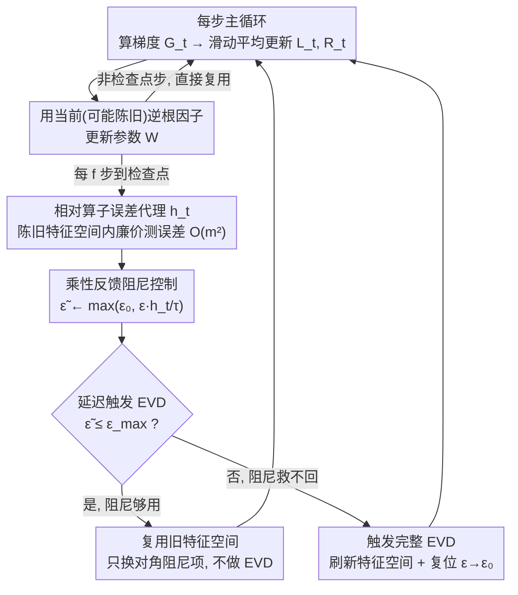

# FOAM: Frequency and Operator Error-Based Adaptive Damping Method for Reducing Staleness-Oriented Error for Shampoo

**会议**: ICML2026  
**arXiv**: [2606.02365](https://arxiv.org/abs/2606.02365)  
**代码**: https://github.com/REAL-KENTECH/FOAM.git (有)  
**领域**: 优化器 / 二阶预条件 / 数值稳定性  
**关键词**: Shampoo, 自适应阻尼, 特征分解频率, 预条件陈旧性, Kronecker 分解

## 一句话总结
FOAM 通过一个可在陈旧特征空间里廉价估算的"算子相对误差代理 $h_t$"，把 Shampoo 的阻尼系数 $\epsilon$ 和特征分解（EVD）触发频率耦合成一个反馈控制回路，在大模型训练上把 EVD 调用次数砍掉 80%+ 同时保持收敛质量。

## 研究背景与动机

**领域现状**：在大模型训练里，纯一阶方法（SGD、Adam）虽然单步便宜但收敛慢、对病态曲率敏感；Kronecker 分解类的二阶预条件器——Shampoo 系列——通过对左右因子 $L_t, R_t$ 做 $-1/p$ 次幂逆运算来重塑梯度，在最近的 AlgoPerf 等基准上表现优于 AdamW。但 Shampoo 的核心瓶颈是每步都要做矩阵特征分解（EVD）才能得到 $L_t^{-1/p}$ 和 $R_t^{-1/p}$，计算开销巨大。

**现有痛点**：实际工程实现普遍采用 "stale Shampoo" 启发式——每隔固定 $\mathbf{f}$ 步才重新做一次 EVD，中间步全部复用旧的逆根因子。这个 $\mathbf{f}$ 怎么选完全靠手调，既没有理论指导，也无法在训练过程中根据梯度统计的真实漂移做自适应。

**核心矛盾**：陈旧性（staleness）并不只是"收敛慢一点"的小问题——作者指出它会同时损害两件事：(i) 收敛性（discounted regret 上界里出现 $(1-\beta^{\mathbf{f}}) R_{\mathrm{SG}}^4 / \epsilon_0^2$ 的"陈旧项"），(ii) 数值稳定性（逆根映射 $A \mapsto A^{-1/p}$ 的 Lipschitz 常数正比于 $1/(p \epsilon_0^{(p+1)/p})$，$\epsilon_0$ 越小，对漂移越敏感，整体训练越容易炸）。换句话说，陈旧性 $\mathbf{f}$ 和阻尼 $\epsilon$ 是一对耦合变量，必须联合控制。

**本文目标**：把"何时刷新 EVD"和"用多大的 $\epsilon$"这两个决策从手调常数变成可解释的反馈控制，要求 (a) 触发判据基于真实的算子误差而不是经验时间表，(b) 决策开销远小于一次 EVD，(c) 即使在大幅减少 EVD 次数的情况下仍能保持训练稳定性。

**切入角度**：作者发现完整的 $mn \times mn$ 预条件器误差 $P_t - \hat{P}_t$ 可以通过 Kronecker 恒等式分解为左右因子各自的算子误差 $\Delta_L, \Delta_R$ 的可加形式，从扰动论上界看，"控制每个 $m\times m$、$n \times n$ 因子的相对误差"是控制整体稳定性的充分条件，而且只需要 $O(m^2 + n^2)$ 开销。再加上"$\epsilon$ 既是数值稳定剂又会反向抑制有用的预条件信息"这一双面性观察，自然产生**用 $\epsilon$ 当反馈控制变量**的想法。

**核心 idea**：定义一个在陈旧特征空间内即可计算的"相对算子误差代理 $h_t$"，把它接成乘性反馈：若 $h_t > \tau$ 则上调 $\epsilon$ 压制误差，若 $h_t \le \tau$ 则下调 $\epsilon$ 解除压制；只有当 $\epsilon$ 顶到 $\epsilon_{\max}$ 还压不住误差时才触发一次真正的 EVD。

## 方法详解

### 整体框架
FOAM 嵌在通用 Shampoo 主循环（Algorithm 1）的"更新规则" $\mathcal{U}(\cdot)$ 槽位里。每步主循环只做三件便宜的事：算梯度 $G_t$、按指数滑动平均更新二阶矩 $L_t = \beta L_{t-1} + (1-\beta) G_t G_t^\top$ 和 $R_t = \beta R_{t-1} + (1-\beta) G_t^\top G_t$、用当前的（可能陈旧的）逆根因子做参数更新 $W_{t+1} = W_t - \eta \hat{L}_t^{-1/p} G_t \hat{R}_t^{-1/p}$。

FOAM 的核心逻辑发生在每 $\mathbf{f}$ 步的"检查点"上，对左右因子各自独立地走三阶段控制流：先用代理 $h_t$ 感测当前阻尼下的相对算子误差，再按乘性规则更新 $\epsilon_t$，最后看更新后的 $\epsilon_t$ 是否仍在 $\epsilon_{\max}$ 限内——是就继续复用旧特征空间只更新阻尼项（成本 $O(m^2)$ 级别），否就触发一次完整 EVD 并把 $\epsilon$ 复位到基线 $\epsilon_0$。整套机制构成一个绕 $\epsilon$ 的反馈控制回路：

### 关键设计

**1. 相对算子误差代理 $h_t$：不做新 EVD 就能感知陈旧因子的逆根误差**

要把"何时刷新"从盲刷时间表改成对症触发，第一步得有一个能在已陈旧的特征空间里廉价测出"误差到底有多大"的信号。作者证明左因子的逆根误差有上界

$$\frac{\|\Delta_L^{(1)}\|_F}{\|\hat{L}_t^{-1/p}\|_F}\le \frac{\alpha}{p}\cdot \text{RC}(\epsilon_{t-1}),\quad \text{RC}(\epsilon)=\big\|\hat{L}_t^{-1/2}(L_t-\hat{L}_t)\hat{L}_t^{-1/2}\big\|_F,$$

其中 $\text{RC}$ 是"白化后的漂移 Frobenius 范数"，$\alpha(\epsilon)=\|\hat{L}_t^{-1/p}\|_2/\|\hat{L}_t^{-1/p}\|_F$ 是谱范数转 Frobenius 的比例系数。把右端记作 $h_t$，里面所有量都能在已缓存的特征向量 $Q_L$ 和特征值 $D_L$ 上算出，开销只有 $O(m^2)$，根本不用重做 EVD。它比之前工作（如用对角化残差做触发）更对症：对角化残差测的是"特征空间还能不能近似对角化当前统计量"，而 $h_t$ 直接锚在逆根范数 $\|\hat{L}_t^{-1/p}\|_F$ 上，各向异性地放大小特征值方向的漂移——而那个方向恰恰是逆根映射放大效应最强、最容易引爆数值不稳的方向。

**2. 乘性反馈阻尼控制：把 $h_t$ 转成实时跟踪误差的阻尼值 $\epsilon_t$**

有了误差信号，下一步是让阻尼 $\epsilon$ 跟着它走，而不是定死一个常数。控制规则用乘性形式

$$\epsilon_t \leftarrow \max\big(\epsilon_0,\ \epsilon_{t-1}\cdot h_t/\tau\big),$$

$\tau\in(0,1)$ 是相对误差的容许阈值：$h_t>\tau$（误差超标）就按比例抬高 $\epsilon$ 去压，$h_t\le\tau$（裕量充足）就按比例缩小 $\epsilon$ 解除压制，地板 $\epsilon_0$ 保证 $\epsilon$ 不会跌得太小重新引爆 Lipschitz 敏感性。之所以非乘性不可，是因为引入刷新周期 $\mathbf{f}$ 后 $(1-\beta^{\mathbf{f}})$ 随 $\mathbf{f}$ 线性涨，固定 $\epsilon$ 一旦定下就回不来；更关键的是算子误差对 $\epsilon$ 的依赖本身是 $\epsilon^{-(p+1)/p}$ 的幂律形式，乘性反馈正好匹配这个衰减率，能在很大的动态范围里稳定调控。

**3. 基于 $\epsilon_{\max}$ 的延迟触发 EVD：让刷新频率随真实漂移自适应**

阻尼能挡风但不能无限抬——Theorem 5.4 指出过大的 $\epsilon_0$ 会让 regret 里冒出 $\epsilon_0 D^2$ 项膨胀。所以 FOAM 在更新出 $\tilde{\epsilon}_t$ 后判一下 $\tilde{\epsilon}_t\le \epsilon_{\max}$ 是否成立：成立就直接拿 $\epsilon_t=\tilde{\epsilon}_t$ 重新组装 $\hat{L}_t^{-1/p}=Q_L(D_L+\epsilon_t I_m)^{-1/p}Q_L^\top$——只换对角阻尼项，特征向量 $Q_L$ 和特征值 $D_L$ 都不动，开销极小；一旦 $\tilde{\epsilon}_t>\epsilon_{\max}$，说明阻尼已经救不回来，这时才花一次完整 $\text{EVD}(L_t)$ 并把 $\epsilon$ 复位到 $\epsilon_0$。$\epsilon_{\max}$ 在这里身兼两职：既保证阻尼不会大到压死有用的预条件信息，又把"$\epsilon$ 是否用尽"作为触发 EVD 的唯一判据，于是 EVD 频率严格跟着真实 spectral drift 自适应，而不是按固定时间表盲刷。

### 损失函数 / 训练策略
不改变 Shampoo 原始的损失目标，只替换更新规则 $\mathcal{U}(\cdot)$。关键超参为感测周期 $\mathbf{f}$、相对误差阈值 $\tau$、最大阻尼 $\epsilon_{\max}$ 和基线阻尼 $\epsilon_0$；在 ViT 上设为 $(20, 0.75, 3\times10^{-7}, 10^{-9})$，Conformer 上设为 $(50, 0.4, 1\times10^{-7}, 10^{-9})$。$\mathbf{f}$ 只是"什么时候去检查代理 $h_t$"，并不直接等于 EVD 间隔——实际 EVD 间隔被 $\epsilon_{\max}$ 触发条件拉长。

## 实验关键数据

### 主实验
在三类大规模任务上对比 FOAM 与 stale Shampoo：(1) ViT-small @ ImageNet-1K，4× A6000；(2) Conformer @ LibriSpeech，4× RTX Pro 6000；(3) GPT-2 @ Wikitext-103（附录）。评价指标是"达到等同/更好最终性能所需的墙钟时间"。

| 任务 / 模型 | 度量 | Stale Shampoo | FOAM | 关键发现 |
|---|---|---|---|---|
| ImageNet-1K / ViT-small | Top-1 val. Acc. + wall-clock | baseline | 更高准确率 / 更低 loss / 显著更少时间 | FOAM 处于"性能-时间"图的左上蓝色区 |
| LibriSpeech / Conformer | WER + wall-clock | baseline | 更低 WER / 更少时间 | 同样位于优势蓝区 |
| Wikitext-103 / GPT-2 | PPL + wall-clock | baseline | 与 Shampoo 持平或更好 | 见附录 J，趋势一致 |

### 消融实验

| 配置 | 训练 loss | 墙钟时间 | 说明 |
|---|---|---|---|
| 完整 FOAM（自适应 $\epsilon$ + 触发 EVD） | 最低 | 最少 | 蓝色三角，性能-时间帕累托最优 |
| 只放大 $\mathbf{f}$ 不开自适应 $\epsilon$ | 显著上升 | 较少 | 绿色方块；陈旧因子放任 spectral drift，训练崩 |
| 只开自适应 $\epsilon$ 不触发 EVD 刷新 | 中等下降 | 显著增加 | 紫色菱形；$\epsilon$ 涨上去压制误差但预条件质量降，且阻尼算子重组本身也占时间 |
| EVD 调用次数（FOAM vs Stale） | — | — | ViT 上 $L$ 因子 EVD 调用降到 $\approx 10\%$，$R$ 因子降到 $\approx 5\%$ |

### 关键发现
- 自适应阻尼和触发刷新缺一不可：只有"代理 $h_t$ 控阻尼 + $\epsilon_{\max}$ 触发 EVD"两条腿同时上才能同时砍掉训练 loss 和墙钟时间，这印证了第 5 节里"$\mathbf{f}$ 与 $\epsilon$ 必须联合控制"的理论判断。
- FOAM 的优势对超参数扫描鲁棒：对 $(\mathbf{f}, \tau, \epsilon_{\max}, \epsilon_0)$ 做广扫的大部分配置都落在"优势蓝区"内，说明反馈控制本身吸收了对超参数敏感性，不依赖单一精调点。
- $\epsilon$ 动态符合直觉：训练中 $\epsilon_t$ 在陈旧累积时主动抬升、在 EVD 刷新后回落到 $\epsilon_0$，呈现锯齿形而非单调；stale baseline 则一直贴着极小常数，遇到大漂移时缺乏缓冲。

## 亮点与洞察
- 把"何时刷新"和"用多大阻尼"统一进同一个反馈环：之前 Shampoo 体系里这俩超参是分开手调的，FOAM 用 $\epsilon$ 在阻尼区间内"挡风"、用 $\epsilon_{\max}$ 在挡不住时"刷盘"，这是个非常符合控制论直觉的拆分，可迁移到任何"周期性昂贵刷新 + 平稳维护"的场景。
- 用"相对算子误差"代替"对角化残差"作为触发判据：作者明确指出二者关注的几何不同，前者直接对齐到逆根映射的扰动敏感方向（小特征值），是更"对症"的健康信号，这一点对所有基于陈旧特征空间复用的方法（SOAP、CASPR 等）都有直接借鉴价值。
- 理论与工程互相佐证：discounted regret 里出现的 $r(1-\beta^{\mathbf{f}}) R_{\mathrm{SG}}^4 / \epsilon_0^2$ 项不仅是数学结论，还直接告诉你阻尼增大与陈旧增大的同阶关系，FOAM 的乘性反馈就是这一比例的直接物理对应。

## 局限与展望
- 作者承认的局限：本文只对 $p = 2$（Shampoo2）给出完整 regret 证明，$p = 4$ 的原始 Shampoo 留在附录；理论假设包含损失凸性和梯度的次高斯尾界（Assumption 5.1, 5.3），在深网训练里只是粗近似。
- 自己发现的局限：超参数虽然鲁棒但仍有 4 个 $(\mathbf{f}, \tau, \epsilon_{\max}, \epsilon_0)$ 要选；FOAM 当前完全独立处理左右因子，是否能用全局信号联合调度二者仍是开放问题；代理 $h_t$ 只是"一阶 + Frobenius 上界"，对极度低秩或者快变的统计场景可能保守。
- 改进思路：把 $\epsilon_{\max}$ 也做成自适应的（譬如绑定到当前 regret 项的估计），可以省掉一个手调超参；在分布式异步训练里加入对网络通信延迟引发的 staleness 联合建模，把控制环上推到系统层。

## 相关工作与启发
- **vs Stale Shampoo (Gupta et al., 2018)**：他们靠固定时间表 $\mathbf{f}$ 触发 EVD、用固定 $\epsilon_0$ 抗噪，本文把这两个常数都换成由代理 $h_t$ 闭环驱动的变量。
- **vs SOAP / Purifying Shampoo (Eschenhagen et al., 2026)**：他们用"对角化残差"决定何时刷新特征空间，本文论证对角化残差与逆根算子误差并不同源，转而用相对算子误差作为更对症的触发判据。
- **vs Damaskinos et al., 2018（异步 SGD 中标量阻尼陈旧梯度）**：那是对一阶梯度做事后加权降权，本文是在二阶预条件器内部用 $\epsilon$ 实时压制 Kronecker 因子的算子误差，作用层级和机制完全不同。
- **vs SPlus (Frans et al., 2026)**：SPlus 用工程稳定器修补陈旧复用，本文从扰动论拿出可证明的相对误差上界来同时驱动稳定性和触发判据，理论根基更稳。

## 评分
- 新颖性: ⭐⭐⭐⭐☆ 把 $\epsilon$ 当反馈控制变量、用相对算子误差代替对角化残差，是 Shampoo 体系里一次清晰的视角刷新。
- 实验充分度: ⭐⭐⭐⭐☆ 覆盖 ViT/Conformer/GPT-2 三个模态 + 充分消融 + 超参数鲁棒性，唯一缺憾是没有跨 $p$ 值的横向对比。
- 写作质量: ⭐⭐⭐⭐⭐ 理论-动机-算法-实验四段衔接非常紧，公式编号清晰，作者用心讲清"为什么阻尼是抑制剂、为什么相对误差是更好的健康信号"。
- 价值: ⭐⭐⭐⭐☆ EVD 调用降 80%+ 同时不损精度，对所有用 Kronecker 二阶预条件器训练大模型的团队是即插即用的优化器替换。

<!-- RELATED:START -->

## 相关论文

- [\[ICML 2026\] Taming the Loss Landscape of PINNs with Noisy Feynman-Kac Supervision: Operator Preconditioning and Non-Asymptotic Error Bounds](taming_the_loss_landscape_of_pinns_with_noisy_feynman-kac_supervision_operator_p.md)
- [\[NeurIPS 2025\] Revisiting Orbital Minimization Method for Neural Operator Decomposition](../../NeurIPS2025/optimization/revisiting_orbital_minimization_method_for_neural_operator_decomposition.md)
- [\[NeurIPS 2025\] Purifying Shampoo: Investigating Shampoo's Heuristics by Decomposing its Preconditioner](../../NeurIPS2025/optimization/purifying_shampoo_investigating_shampoos_heuristics_by_decomposing_its_precondit.md)
- [\[ICML 2026\] Adaptive Preconditioners Trigger Loss Spikes in Adam](adaptive_preconditioners_trigger_loss_spikes_in_adam.md)
- [\[ICML 2026\] Multi-Objective Bayesian Optimization via Adaptive ε-Constraints Decomposition](multi-objective_bayesian_optimization_via_adaptive_varepsilon-constraints_decomp.md)

<!-- RELATED:END -->
