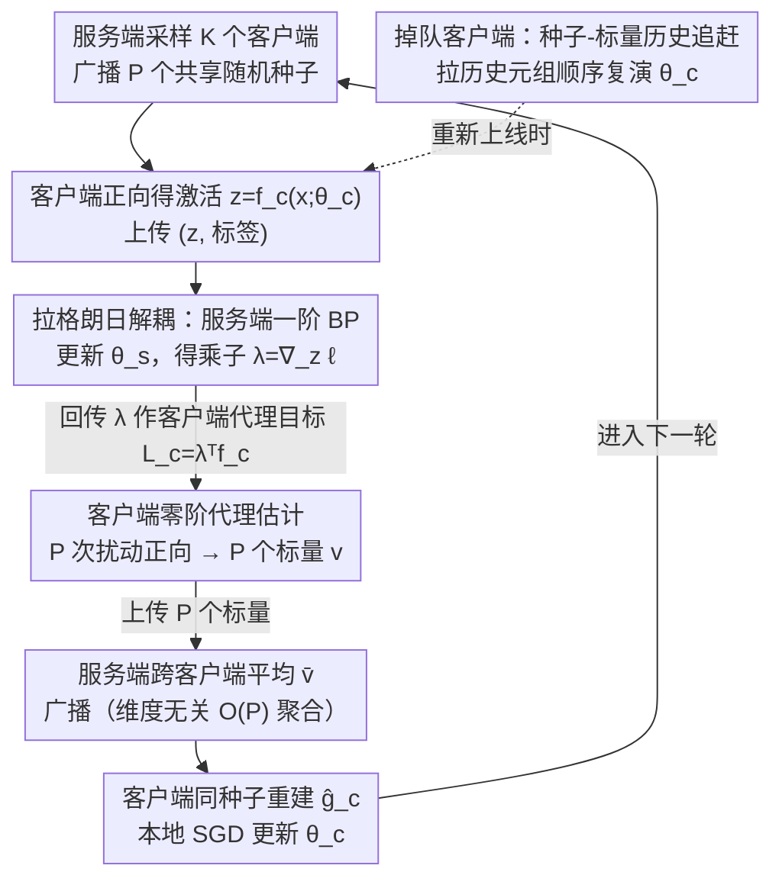

# HO-SFL: Hybrid-Order Split Federated Learning with Backprop-Free Clients and Dimension-Free Aggregation

**会议**: ICML 2026  
**arXiv**: [2603.14773](https://arxiv.org/abs/2603.14773)  
**代码**: 未公开  
**领域**: 优化 / 联邦学习 / 分布式训练  
**关键词**: 拆分联邦学习, 零阶优化, 反向传播免除, 维度无关聚合, 边端微调

## 一句话总结
HO-SFL 通过拉格朗日变量提升把 split federated learning (SFL) 的客户端和服务端解耦——服务端继续做一阶反向传播 (BP)，客户端只做零阶 (ZO) 扰动前向，再借共享随机种子把每轮上行通信压到 $\mathcal{O}(P)$ 个标量，从而在端侧把大模型微调的显存降到推理级、收敛率仍可达 $\mathcal{O}(\sqrt{d_c/PT})$。

## 研究背景与动机

**领域现状**：在端侧微调大模型已成为联邦学习的新刚需，主流框架是 FL（McMahan 2017）和 SFL（Thapa 2022）——后者把模型按层切两段，重的服务端段做大计算，轻的客户端段留在边端，以减小客户端算力压力。

**现有痛点**：标准 SFL 仍然要求客户端在自己那段子模型上跑完整 BP 才能拿到梯度。对动辄上亿/上千亿参数的 LLM，BP 需要的激活缓存仍远超手机/IoT 设备的内存，即便客户端只留几层也存不下；MeZO 这类工作用零阶优化 (ZO) 代替 BP，把显存降到推理级，但 ZO 估计器方差随维度 $d$ 线性放大，收敛率退化到 $\mathcal{O}(\sqrt{d/T})$，对大模型几乎不可行。

**核心矛盾**：BP 算得准但吃显存；ZO 省显存但收敛慢。把两者直接拼在一起（如 FedZO、MU-SplitFed），整个系统仍背着 ZO 的高维方差，因为客户端和服务端共用同一个优化目标 $\ell(f_s(f_c(\bm x;\bm\theta_c);\bm\theta_s),y)$，参数耦合在一起，必须一起选阶。

**本文目标**：拆掉客户端-服务端的耦合，让两端各自挑最适合自己资源的优化阶；同时把模型聚合的通信从 $\mathcal{O}(d_c)$ 压到 $\mathcal{O}(P)$。

**切入角度**：把"客户端激活 = 服务端输入"这条本来隐式成立的等式 $\bm z=f_c(\bm x;\bm\theta_c)$ 显式写成一个等式约束，再用变量提升 (variable lifting) 引入拉格朗日乘子 $\bm\lambda$，原本的复合目标就被劈成两个解耦子问题。

**核心 idea**：服务端 BP 反传出来的激活梯度 $\bm\lambda=\nabla_{\bm z}\ell$ 本身就是约束问题的最优拉格朗日乘子，把它当成客户端的"局部代理目标" $\mathcal{L}_c(\bm\theta_c)=\bm\lambda^\top f_c(\bm x;\bm\theta_c)$，客户端只需对这个标量代理函数做 ZO 扰动估计——而代理函数在客户端这边只有 $d_c\ll d$ 维，从根本上把 ZO 维度依赖隔离到了小子空间。

## 方法详解

### 整体框架
单轮通信周期由四个阶段组成：① 服务端采样 $K$ 个客户端，广播一组共享随机种子 $\{s_p^t\}_{p=1}^P$；② 各客户端用当前参数 $\bm\theta_c^t$ 做正向得到激活 $\bm z_m^t=f_c(\bm x_m;\bm\theta_c^t)$，连同标签上传到服务端；③ 服务端完成剩余正向 $\hat y_m=f_s(\bm z_m^t;\bm\theta_s^t)$ 并标准 BP，得到 $\bm g_{s,m}^t=\nabla_{\bm\theta_s}\ell$ 和激活梯度 $\bm\lambda_m^t=\nabla_{\bm z_m^t}\ell$，更新 $\bm\theta_s$ 并把 $\bm\lambda_m^t$ 回传给对应客户端；④ 每个客户端用共享种子重生成 $P$ 个高斯扰动 $\bm u_p^t\sim\mathcal{N}(\bm 0,\bm I_{d_c})$，跑 $P$ 次小扰动正向 $\tilde{\bm z}_{m,p}^t=f_c(\bm x_m;\bm\theta_c^t+\mu\bm u_p^t)$，算 $P$ 个**标量** $v_{m,p}^t=\bm\lambda_m^{t\top}(\tilde{\bm z}_{m,p}^t-\bm z_m^t)$ 上传，服务端跨客户端平均得 $\bar v_p^t$ 广播回去，客户端用同一组种子重生成 $\bm u_p^t$ 并拼出梯度估计 $\hat{\bm g}_c^t=\frac{1}{P\mu}\sum_p\bar v_p^t\bm u_p^t$ 完成本地一步 SGD。

整套流程客户端永远不需要做反向、不需要存激活图、不需要上传/下载任何参数维度大小的向量。

### 关键设计

**1. 拉格朗日解耦的目标重写：把 SFL 单步目标劈成两端各管各的子问题**

之前的 FedZO/MU-SplitFed 在整体目标 $\ell(f_s(f_c(\bm x;\bm\theta_c);\bm\theta_s),y)$ 上做 ZO，方差吃整个模型维度 $d$，因为客户端和服务端参数耦合在一起、必须一起选阶。本文把"客户端激活 = 服务端输入"这条本来隐式成立的等式 $\bm z=f_c(\bm x;\bm\theta_c)$ 显式写成约束，做变量提升后构造拉格朗日

$$\mathcal{L}_\lambda=\ell(f_s(\bm z;\bm\theta_s),y)+\bm\lambda^\top(f_c(\bm x;\bm\theta_c)-\bm z)$$

从平稳条件 $\nabla_{\bm z}\mathcal{L}_\lambda=\bm 0$ 直接解出 $\bm\lambda^t=\nabla_{\bm z}\ell(f_s(\bm z^t;\bm\theta_s^t),y)$——它恰好就是 BP 链式法则里本来就要算的激活梯度，所以这个乘子"零额外计算成本"。于是客户端子目标退化为 $\mathcal{L}_c(\bm\theta_c)=\bm\lambda^\top f_c(\bm x;\bm\theta_c)$，服务端只看 $\bm\theta_s$、客户端只看 $\bm\theta_c$，两端可以各自选最适合自己资源的优化阶。关键收益是客户端 ZO 此后只作用在 $\mathcal{L}_c$ 上，把维度依赖从 $d$ 收缩到 $d_c$，这正是后面 $\mathcal{O}(\sqrt{d_c/PT})$ 收敛率的来源。

**2. 基于服务端反馈的客户端零阶代理估计：不做 BP、不存激活图，还能跟全局方向对齐**

客户端要在没有 BP、没有激活图的前提下拿到低方差且方向准的梯度估计。做法是固定锚点 $\bm z_m^t=f_c(\bm x_m;\bm\theta_c^t)$，对每个共享种子 $s_p^t$ 重生成扰动 $\bm u_p^t$ 跑扰动正向 $\tilde{\bm z}_{m,p}^t$；由于代理函数 $\bm\lambda^\top f_c$ 关于 $\bm\theta_c$ 是线性的，有限差分直接化简成一个标量 $v_{m,p}^t=\bm\lambda_m^{t\top}(\tilde{\bm z}_{m,p}^t-\bm z_m^t)$。客户端只上传 $P$ 个标量，服务端跨客户端平均 $\bar v_p^t=\frac{1}{K}\sum_m v_{m,p}^t$ 后广播，每个客户端再用同一组种子独立重建 $\hat{\bm g}_c^t=\frac{1}{P\mu}\sum_p\bar v_p^t\bm u_p^t$。这一步同时解决三件事：ZO 估计被服务端激活梯度"导航"、方向比纯 ZO 准；上下行都只发 $P$ 个标量（加种子），做到维度无关的 $\mathcal{O}(P)$ 聚合；客户端扰动正向还能与服务端 BP 并行、掩盖延迟。

**3. 掉队客户端的种子-标量历史追赶机制：用几十个标量替代几 GB 的模型下发**

标准 FL/SFL 客户端掉线再上线必须重新下发完整模型，对 LLM 是几 GB 的下行。HO-SFL 的处理是让服务端保存历史广播元组 $\{(s_p^\tau,\bar v_p^\tau)\}_{p,\tau}$；卡在 $t'$ 轮的客户端只需拉取 $\tau\in[t',t)$ 的元组，对每轮用伪随机生成器 $\bm u_p^\tau=\mathrm{PRG}(s_p^\tau)$ 重建扰动、按 $\hat{\bm g}_c^\tau=\frac{1}{P\mu}\sum_p\bar v_p^\tau\bm u_p^\tau$ 重建梯度，再 $\bm\theta_c^{\tau+1}\leftarrow\bm\theta_c^\tau-\eta\hat{\bm g}_c^\tau$ 顺序复演，全程不需要下行任何高维参数。这把"模型同步"彻底从"传参数"变成"传标量"，downlink 也成了 $\mathcal{O}(P)$，配合并行流水线掩盖了 SFL 里典型的客户端空等。

### 损失函数 / 训练策略
全局目标仍是 $\mathcal{L}(\bm\theta)=\frac{1}{M}\sum_m\mathbb{E}_{\xi_m\sim\mathcal{D}_m}[\ell(\bm\theta;\xi_m)]$。学习率取 $\eta=\Theta(\sqrt{P/(T d_c)})$，平滑参数取 $\mu=\mathcal{O}((PT)^{-1/4}d_c^{-5/4})$，可使偏差项与方差-优化项同阶，整体收敛率 $\mathcal{O}(\sqrt{d_c/PT})$。视觉任务 $P=5$，语言任务 $P=2$，$\mu=10^{-3}$。

## 实验关键数据

### 主实验

| 任务 / 模型 | 评测指标 | SplitLoRA (一阶) | ZO-SFL (纯零阶) | HO-SFL (本文) |
|--------|------|------|----------|------|
| GLUE-SST2 / OPT-125M | Acc (%) | 87.5 | 52.8 | **87.6** |
| GLUE-RTE / OPT-125M | Acc (%) | 57.8 | 52.0 | **59.2** |
| GLUE-SST2 / Gemma-3-270M | Acc (%) | 90.3 | 51.8 | **90.8** |
| GLUE-RTE / Gemma-3-270M | Acc (%) | 59.6 | 54.2 | **65.0** |
| GLUE-SST2 / LLaMA-3.2-1B | Acc (%) | **94.4** | 61.5 | 93.9 |
| GLUE-RTE / LLaMA-3.2-1B | Acc (%) | 70.0 | 49.1 | **73.3** |
| SQuAD / LLaMA-3.2-1B | F1 | ≈ 0.60 (一阶) | 不收敛 | 与一阶基本持平 |

CIFAR-10 在 IID 设定下 HO-SFL 与 SFL 收敛曲线只差一点点；Non-IID 设定下 HO-SFL 反超 SFL，因为它能每步聚合（维度无关），而 SFL 受 client drift 拖累。

### 消融 / 对比

| 维度 | SFL / SplitLoRA | ZO-SFL / MU-SplitFed | HO-SFL |
|------|---------|---------|---------|
| 客户端是否需要 BP | 需要 | 不需要 | **不需要** |
| 客户端显存 | 训练级（存激活图） | 推理级 | **推理级** |
| 聚合上行通信 | $\mathcal{O}(d_c)$ | $\mathcal{O}(d_c)$ | **$\mathcal{O}(P)$** |
| 收敛率维度依赖 | $d$ 无关（FO） | $\mathcal{O}(\sqrt{d/T})$ | **$\mathcal{O}(\sqrt{d_c/PT})$** |
| Non-IID 鲁棒性 | 受 client drift 影响 | 收敛慢/不收敛 | 每步聚合，受影响小 |
| 客户端掉线恢复 | 下行完整模型 | 下行完整模型 | $\mathcal{O}(P)$ 标量+种子 |

### 关键发现
- 维度解耦是关键：把 ZO 限制在客户端段 $d_c$ 而不是整体 $d$，理论上从 $\mathcal{O}(\sqrt{d/T})$ 改善到 $\mathcal{O}(\sqrt{d_c/PT})$，实验也对应——纯 ZO 基线 (ZO-SFL/MU-SplitFed) 在 LLM 上几乎不收敛，而 HO-SFL 能匹配一阶。
- 模型规模从 125M 扩到 8B（64×），HO-SFL 的 SQuAD F1 与 SplitLoRA 仍持平，说明这个框架不靠"小模型 ZO 还能勉强 work"的运气，结构上是可扩展的。
- 维度无关聚合在 Non-IID 下反而胜过一阶 SFL，因为可以每步聚合而不是每隔多步聚合一次，client drift 被显著抑制——一个意外的"省通信反而更准"的现象。

## 亮点与洞察
- 把激活一致性写成等式约束、用拉格朗日乘子吸收掉——一个本来只在凸优化教材里出现的工具被精确地用对了地方：得到的乘子恰好等于 BP 链式法则要算的激活梯度，根本不增加计算量，是非常优雅的"数学免费午餐"。
- 客户端代理目标 $\bm\lambda^\top f_c(\bm x;\bm\theta_c)$ 关于 $\bm\theta_c$ 是线性的（$\bm\lambda$ 已固定），ZO 有限差分自动消掉一阶项，方差结构比直接对完整损失做 ZO 干净得多——这是 hybrid-order 思路相比纯 ZO 更容易扩到大模型的根本原因。
- 共享种子 + 标量聚合 + PRG 历史追赶，把"模型同步"从"传参数"彻底变成"传标量"，这套抽象可以直接迁到任意 federated/split 训练框架上，是值得复用的系统设计 trick。

## 局限与展望
- 服务端依然要做完整 BP，整体方案省的是客户端显存而非服务端算力，所以并不"分布式去中心化"，强依赖一个资源充足的中心服务器。
- 理论分析仍是 non-convex SGD 经典框架，对客户端 ZO 的偏差控制依赖梯度规则性常数 $\Gamma$，对非常深的客户端段 $d_c$ 较大时常数会变差，论文中模型分割点选在 ResNet-18 的第 2-3 残差块/LoRA-only 之类的"小客户端段"上。
- 维度无关聚合的好处只对客户端段成立，服务端段参数仍然是大头，未来如果想把整段都搬到边端依然要面对 ZO 的高维问题。
- 异步/掉队场景下顺序追赶 $\mathcal{O}(t-t')$ 步会拖慢慢客户端，对极不均匀的设备群可能成为瓶颈。

## 相关工作与启发
- **vs MeZO (Malladi 2023)**：MeZO 在单机上用 ZO 把 LLM 微调显存压到推理级；HO-SFL 把这个思路搬到分布式 SFL 设定下，但不是简单照搬——它让 ZO 只作用在客户端代理上、用服务端 BP 反馈做导航，避免了 MeZO 在分布式场景下方差爆炸的问题。
- **vs DeComFL (Li 2025)**：DeComFL 在 FL 设定下用共享随机种子做维度无关通信；HO-SFL 把同一种子机制扩展到 SFL，并配上 hybrid 优化，二者机制相似但优化结构不同：DeComFL 是纯 ZO，HO-SFL 是 hybrid。
- **vs MU-SplitFed (Liang 2026)**：MU-SplitFed 也在 SFL 里做 ZO 客户端，但是"服务端多步、客户端少步"的不平衡更新，本质仍是纯 ZO；HO-SFL 通过拉格朗日给了一个理论上更干净的解耦，收敛率从 $\mathcal{O}(\sqrt{d/T})$ 改进到 $\mathcal{O}(\sqrt{d_c/PT})$。
- **vs FSL-SAGE (Nair 2025)**：FSL-SAGE 用客户端辅助模型估计服务端梯度以并行化，但客户端仍跑 BP；HO-SFL 用 ZO 直接消除客户端 BP，是更彻底的客户端解放。

<!-- RELATED:START -->

## 相关论文

- [\[NeurIPS 2025\] Covariances for Free: Exploiting Mean Distributions for Training-free Federated Learning](../../NeurIPS2025/optimization/covariances_for_free_exploiting_mean_distributions_for_training-free_federated_l.md)
- [\[ICML 2026\] Learning Dynamics of Zeroth-Order Optimization: A Kernel Perspective](learning_dynamics_of_zeroth-order_optimization_a_kernel_perspective.md)
- [\[ICML 2026\] Learning a Zeroth-Order Optimizer for Fine-Tuning LLMs](learning_a_zeroth-order_optimizer_for_fine-tuning_llms.md)
- [\[ICML 2026\] Distribution-Free Uncertainty Quantification for Continuous AI Agent Evaluation](distribution-free_uncertainty_quantification_for_continuous_ai_agent_evaluation.md)
- [\[ICML 2026\] Delayed Momentum Aggregation: Communication-efficient Byzantine-robust Federated Learning with Partial Participation](delayed_momentum_aggregation_communication-efficient_byzantine-robust_federated_.md)

<!-- RELATED:END -->
