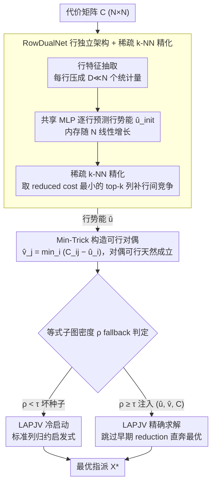

# Learning-Augmented Scalable Linear Assignment Problem Optimization via Neural Dual Warm-Starts

**会议**: ICML 2026  
**arXiv**: [2605.09382](https://arxiv.org/abs/2605.09382)  
**代码**: 无  
**领域**: 组合优化 / 学习增强算法 / 多目标跟踪  
**关键词**: 线性指派, 对偶变量, 暖启动, LAPJV, 行独立网络

## 一句话总结
训练一个轻量网络预测线性指派问题 (LAP) 的对偶变量 $\hat{u}$，用 Min-Trick 构造可行对偶 $\hat{v}$，将其作为 LAPJV 精确求解器的暖启动，从而在保持最优性的同时把 $N=16{,}384$ 规模实例端到端加速 $2\times$ 以上。

## 研究背景与动机

**领域现状**：线性指派问题 (LAP) 是匹配类问题的基础原语，在多目标跟踪 (MOT)、调度、运输等场景中被反复调用。目前的两类主流求解器分别走精确路线和学习路线：经典 Hungarian / Jonker-Volgenant (LAPJV) 给出可证明的最优解，但最坏复杂度是 $\mathcal{O}(N^3)$；近年来基于 GNN 的神经求解器牺牲精确性换取速度。

**现有痛点**：当 $N \geq 10^3$ 时，LAPJV 的三次方复杂度会主导实时系统的延迟；而神经替代方案不仅可能违反硬性指派约束，还因为边特征要 $\mathcal{O}(N^2 H)$ 内存而被卡在 $N \approx 2{,}000$ 量级，无法服务真正大规模的应用。

**核心矛盾**：精确性与可扩展性之间存在张力——只要把神经网络拉进求解流程，要么破坏最优性，要么撑爆显存；如果完全不用神经网络，又会被 $\mathcal{O}(N^3)$ 的搜索吞掉时间预算。

**本文目标**：在 $N$ 达到 $16{,}384$ 这种工业级规模上，既保证全局最优解，又在端到端时钟时间上跑赢 LAPJV 冷启动；并且要对分布漂移鲁棒，最好能零样本迁移到真实数据。

**切入角度**：作者借用 LP 对偶理论的一个事实——给 LAPJV 一组接近最优的可行对偶变量，等价于把这个 dual-ascent 算法 "恢复" 到了接近收敛的状态，后续只需要少量增广路径就能结束搜索。因此神经网络的工作不是替代求解器，而是预测一组好的初始对偶。

**核心 idea**：用行独立的 RowDualNet 预测行势能 $\hat{u}$，再通过 Min-Trick $\hat{v}_j = \min_i (C_{ij} - \hat{u}_i)$ 构造性地补出列势能 $\hat{v}$，保证对偶可行；用一个轻量阈值做 fallback，使得即便预测很差也只是退化到冷启动。

## 方法详解

### 整体框架
输入是 $N \times N$ 的代价矩阵 $C$，输出是精确最优的指派矩阵 $X^\ast$。Pipeline 有四个阶段：(1) 行特征抽取——把 $C$ 压成 $F \in \mathbb{R}^{N \times D}$，每行只保留行内最小、均值、熵、排名等 $D \ll N$ 个统计量；(2) RowDualNet 在 GPU 上对每行独立地预测一个标量 $\hat{u}_i$，附加一个稀疏 k-NN 精化步骤捕捉行间竞争；(3) Min-Trick 在 GPU 上分块算出 $\hat{v}$，并通过等式子图密度 $\rho$ 判断要不要 fallback；(4) 把 $(\hat{u}, \hat{v}, C)$ 注入 CPU 上修改过的 LAPJV C++ 实现，让它跳过早期 reduction，直奔精确解。其中阶段 (1)(2) 共同组成「RowDualNet 行独立架构 + 稀疏 k-NN 精化」这一关键设计，阶段 (3) 拆成「Min-Trick 构造可行对偶」与「等式子图密度 fallback」两个设计，阶段 (4) 的 LAPJV 求解器是被加速的脚手架。

### 关键设计

**1. RowDualNet 行独立架构 + 稀疏 k-NN 精化：用线性内存换取可扩展性**

GNN 神经匹配之所以卡在 $N\approx 2000$，根子是全连接边特征要 $\mathcal{O}(N^2 H)$ 内存。作者反其道而行：先把代价矩阵 $C$ 每行压成 $D\ll N$ 个统计量（行内最小、均值、熵、排名），再用一个共享 MLP 对每行独立地预测初始行势能 $\hat{u}_{init,i}$，内存只随 $N$ 线性增长。行独立的弱点是看不到行间竞争，于是补一个稀疏 k-NN 精化步：对每行算"伪 reduced cost" $C_{ij}-\hat{u}_{init,i}$，只挑最小的 $k$ 个列做聚合。这一步之所以够用，是因为最优指派每行只选一列，竞争信号高度集中在 reduced cost 接近 0 的少数列上，固定 $k\ll N$ 就能抓住关键信号——正是这种"少看一点反而能 scale"的取舍把训练-推理规模一路推到 $N=16{,}384$。

**2. Min-Trick 构造可行对偶：把可行性从约束变成定义**

以往"学到不可行解再投影回可行域"的套路又慢又把神经网络省下的时间吃回去。作者改成一步构造：拿到 $\hat{u}$ 后直接取

$$\hat{v}_j=\min_i\,(C_{ij}-\hat{u}_i),$$

由这个定义立刻有 $\hat{u}_i+\hat{v}_j\le C_{ij}$，对偶可行性天然成立。这步是 $\mathcal{O}(N^2)$ 但完全并行，在 GPU 上几乎免费。关键好处是 LAPJV 的最优性不再依赖网络预测得好不好——网络只决定暖启动有多接近收敛，而可行性已经被构造死了，因此即便预测平庸，解的正确性也不受影响。

**3. 基于等式子图密度的 fallback：用一个标量守住最坏情况**

神经网络偶尔会吐出非常稀疏的等式子图，反而拖慢 LAPJV。为此定义等式子图密度

$$\rho=\frac{1}{N}\sum_{i,j}\mathbb{I}\big(|C_{ij}-\hat{u}_i-\hat{v}_j|<\epsilon\big),$$

即 reduced cost 贴近 0 的边的平均度；当 $\rho<\tau$ 时判定为"坏种子"，丢掉预测、让 LAPJV 退回标准的列归约启发式冷启动。因为构造和判定的开销 $T_{\text{overhead}}=\mathcal{O}(N^2\log N)$ 相对 $\mathcal{O}(N^3)$ 渐近可忽略，所以最坏情况只是退化到基线运行时，"用神经种子但绝不会更慢"这一异步安全性是被严格证明的。

### 损失函数 / 训练策略
监督训练，离线用 LAPJV 跑出真值对偶 $u^\ast$ 作为目标。损失主项是 $\hat{u}$ 与 $u^\ast$ 的 MAE，再加上一个 Complementary Slackness 正则项——它强制让真值最优边上的 reduced cost 紧贴 0，从而把对偶预测引导到 "刚好让最优指派出现在等式子图里" 的位置。采用多尺度训练，单一模型在 $N \in \{512, 1536, 2048, 3072\}$ 上训练，1700+ 张矩阵，然后零样本评估到 $N=16{,}384$ 测分布外泛化。

## 实验关键数据

### 主实验

| 数据集 | 规模 | 加速 (vs SciPy) | 加速 (vs LAP) | 最优性 |
|--------|------|-----------------|----------------|--------|
| Dense Uniform 合成 | $N=16384$ | $\approx 2.0\times$ | $\approx 2.5\times$ | 0% gap |
| Block-Structured 合成 | $N=16384$ | $\approx 2.25\times$ | $\approx 4.0\times$ | 0% gap |
| MOT (真实) | $N \geq 8000$ | $\approx 2\times$ | $\approx 1.25\times$ | 0% gap |
| OSM 七大城市 | $N=10000$ | $1.4\text{-}1.6\times$ | $1.3\text{-}1.8\times$ | 0% gap |

### 消融实验

| 配置 | 行为 | 说明 |
|------|------|------|
| RowDualNet (full) | $\approx 76\%$ 指派在 greedy 阶段直接解决 | 增广路径搜索减少 $\approx 68\%$ |
| 冷启动 LAPJV | 仅 $\approx 26\%$ greedy 解决 | 后续要做大量最短路 |
| 线性回归代替 RowDualNet | $N>4096$ 反而比基线慢 | 验证非线性特征学习的必要性 |
| Row Mean / Random 启发式 | speedup $<1$ | 简单统计量无法捕捉竞争结构 |

### 关键发现
- 真正的加速来源不是 GPU 卸载，而是 "等式子图密度" 的提升：神经种子让 LAPJV 直接进入接近收敛态，从而省掉昂贵的 price war 阶段。
- 端到端运行时的稳定性提升显著——变异系数从 $\approx 45\%$ 降到 $\approx 30\%$，最坏-最好之比从基线的 $11\times$ 飙升被压制住，这对实时安全系统是关键卖点。
- 在 $N=16{,}384$ 时神经组件只占总时间的 $<7\%$，剩下 93% 还是 CPU 上的精确求解器，说明这是真正的算法加速而非硬件玩法。

## 亮点与洞察
- 把神经网络当作 "求解器加速器" 而不是 "求解器替代品"，与 Dinitz et al. 2021 的理论 "learned duals" 路线形成系统级实现：Min-Trick 把可行性内建为构造结果，绕过了所有投影算法。
- 行独立架构 + 稀疏 k-NN 这种 "少看一点反而能 scale" 的设计哲学值得借鉴——很多 GNN 任务的 $\mathcal{O}(N^2)$ 都来自全连接边消息，但若关键信号本来就稀疏，把它显式建模成 top-$k$ 就能换来数量级的内存节省。
- Fallback 机制提供了严格的渐近安全保证，这种 "learning-augmented + worst-case safety" 的范式对落地工业系统非常友好，是 Dinitz 等人的 ALPS 框架在实际工程上的优雅延伸。

## 局限与展望
- 仅针对方形稠密 LAP，对非方矩阵、稀疏 LAP、二次指派 (QAP) 等扩展未讨论。
- 训练真值依赖离线跑 LAPJV，对超大 $N$ 训练数据生成成本不低；若能用半监督或自监督训练 RowDualNet 会更可扩展。
- 在小规模 ($N=512$) 时神经开销占比过高反而拖累整体——这暗示自适应地决定 "要不要用神经种子" 是有价值的方向。
- MOT 上的提速 ($1.25\times$) 远小于稠密合成数据，作者归因于矩阵稀疏，但没探索专门为稀疏 LAP 设计的稀疏神经预测器。

## 相关工作与启发
- **vs Dinitz et al. 2021 "learned duals"**：他们提出理论框架但用投影算法保证可行，速度被吞；本文用 Min-Trick 构造可行性绕过投影，第一次让该路线 scale 到 $N=16{,}384$。
- **vs GNN 神经匹配 (Liu 2024 / Aironi 2024)**：他们直接预测指派矩阵但放弃最优性 + 受困于 $\mathcal{O}(N^2)$ 内存；本文坚持精确解，并通过行独立架构把内存压回 $\mathcal{O}(N)$。
- **vs SciPy / LAP 库的 LAPJV**：本文做的是 "在它们之上加一层暖启动"，因此优势随 $N$ 增大放大，且最优性 0% gap 完全可验证。

## 评分
- 新颖性: ⭐⭐⭐⭐ 把 learned duals 推到工业级规模，Min-Trick 巧解可行性问题
- 实验充分度: ⭐⭐⭐⭐ 合成 + MOT + OSM 七城三类数据，覆盖到 $N=16384$
- 写作质量: ⭐⭐⭐⭐ 理论保证 + 工程细节都讲清楚
- 价值: ⭐⭐⭐⭐ 直接服务实时跟踪 / 大规模调度，工程落地价值明显

> 备注：本文虽落在 video_understanding 目录，但本质属于组合优化方向，主要应用场景之一才是 MOT 跟踪。后续可考虑迁到 `optimization` / `other` 等更贴合的领域文件夹。

<!-- RELATED:START -->

## 相关论文

- [\[ICLR 2026\] Dual Optimistic Ascent (PI Control) is the Augmented Lagrangian Method in Disguise](../../ICLR2026/optimization/dual_optimistic_ascent_pi_control_is_the_augmented_lagrangian_method_in_disguise.md)
- [\[ICML 2026\] RMNP: Row-Momentum Normalized Preconditioning for Scalable Matrix-Based Optimization](rmnp_row-momentum_normalized_preconditioning_for_scalable_matrix-based_optimizat.md)
- [\[ICML 2026\] Dynamics and Representation Structure of Local Approximations to Gradient-Based Learning in Linear Recurrent Neural Networks](dynamics_and_representation_structure_of_local_approximations_to_gradient-based_.md)
- [\[ICML 2026\] Balancing Learning Rates Across Layers: Exact Two-Step Dynamics and Optimal Scaling in Linear Neural Networks](balancing_learning_rates_across_layers_exact_two-step_dynamics_and_optimal_scali.md)
- [\[AAAI 2026\] ECPv2: Fast, Efficient, and Scalable Global Optimization of Lipschitz Functions](../../AAAI2026/optimization/ecpv2_fast_efficient_and_scalable_global_optimization_of_lipschitz_functions.md)

<!-- RELATED:END -->
