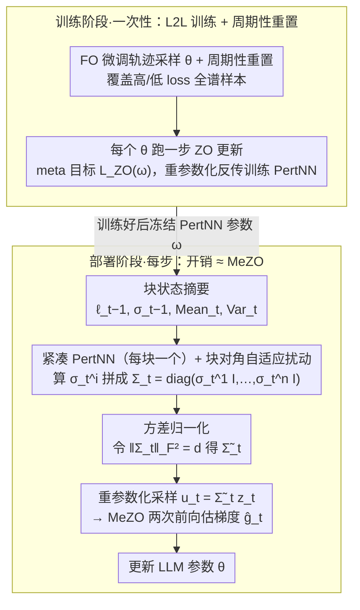

# Learning a Zeroth-Order Optimizer for Fine-Tuning LLMs

**会议**: ICML 2026  
**arXiv**: [2510.00419](https://arxiv.org/abs/2510.00419)  
**代码**: https://github.com/ASTRAL-Group/ZO_Fine_tuner (有)  
**领域**: 优化算法 / LLM 高效微调 / Learning to Learn  
**关键词**: 零阶优化, MeZO, L2L, 块对角扰动, 内存高效微调  

## 一句话总结
本文提出 ZO Fine-tuner：用一个"per-block 的轻量神经网络 PertNN"自动学习 LLM 各参数块的扰动方差，把 MeZO 中固定的 $\mathcal{N}(0,I)$ 升级为按块自适应的非均匀扰动；在 OPT-30B 上辅助网络仅占 <2MB，却在 4 个 LLM × 7 个数据集（28 对）中 82.1% 跑赢现有零阶基线，且"一次训练、跨任务/跨衍生模型复用"。

## 研究背景与动机

**领域现状**：随着 LLM 体积爆炸，Adam 等一阶优化器的优化器状态+反向激活会吃掉约 12× 推理内存；即便加上 LoRA、Prefix-Tuning 这类 PEFT，反向传播仍带来不可忽视的内存负担。MeZO (Malladi et al., 2023) 把经典 ZO-SGD 引入 LLM 微调：每步只做两次前向、用 $g\!\approx\!\tfrac{\mathcal{L}(\theta+\epsilon u)-\mathcal{L}(\theta-\epsilon u)}{2\epsilon}u,\ u\!\sim\!\mathcal{N}(0,I)$ 估计梯度，把训练内存压到近似推理水平。HIZOO、LOZO、MeZO-SVRG、ZO-AdamU、ZO-DAP 等后续工作都是在 MeZO 之上手工设计更复杂的更新规则。

**现有痛点**：上述改进全部依赖人工启发式或数学近似，并且仍要在学习率之外做大量超参搜索；最关键的是——它们都沿用了 *一个对所有参数共享、各向同性* 的 $\mathcal{N}(0,I)$ 采样分布。可零阶梯度估计的质量明显依赖局部 landscape，对一个层维度差异巨大、Hessian 高度不均的 LLM 而言，"所有参数一视同仁地加噪声"显然把宝贵的扰动预算浪费在了不该扰动的方向上。

**核心矛盾**：想让扰动分布自适应当前优化状态（L2L 思路天然适配），但 L2L 在 LLM 上有两个硬障碍——(i) 反传 PertNN 需要存大量激活；(ii) 若为每个参数单独学一个辅助网络，参数量是 $O(d^2)$，对 30B 模型完全不可承受。同时，L2L 在小模型上还有"训练一次只能服务一个 model-task 对"的迁移性问题。

**本文目标**：把 L2L 真正搬上 LLM 尺度，且要做到 (a) 内存/速度开销 ≈ MeZO，(b) "一个 base LLM 训一次 PertNN，跨任务、跨衍生 checkpoint 都能复用"。

**切入角度**：作者借用 Zhang et al. (2024b) 的实证发现——Transformer Hessian 大致呈块对角结构（embedding / Q / K / V / projection 等天然形成参数块）。这暗示扰动方差只需在"块"粒度上自适应，就足以匹配真实的曲率结构；LLaMA-8B 全模型仅 291 个参数块，远小于 80 亿参数。

**核心 idea**：用"每块一个 PertNN" 学一个**块对角的扰动协方差** $\Sigma_t\!=\!\mathrm{diag}(\sigma_t^{(1)} I_{d_1},\dots,\sigma_t^{(n)} I_{d_n})$，把 MeZO 的 $u\!\sim\!\mathcal{N}(0,I)$ 替换为 $u\!\sim\!\mathcal{N}(0,\Sigma_t\Sigma_t^\top)$；用一阶微调轨迹做"meta-supervision"以可微分方式训练 PertNN。

## 方法详解

### 整体框架
ZO Fine-tuner 的部署阶段就是 MeZO 的两次前向，唯一新增的是：每步在采扰动前，先用 $n$ 个轻量 PertNN 算出当前各块的扰动标准差 $\sigma_t^{(i)}$，拼成 $\Sigma_t$，再用重参数化采样 $u_t=\widetilde\Sigma_t z_t,\ z_t\!\sim\!\mathcal{N}(0,I_d)$，最后照 MeZO 公式更新 LLM 参数。PertNN 本身则在"训练阶段"沿 LLM 的一阶微调轨迹学好（meta-training），用完即冻结，部署时不再更新。

PertNN 的输入是一组与任务/模型几乎无关的**状态摘要**：上一步扰动方差 $\sigma_{t-1}^{(i)}$、当前块参数均值/方差 $\mathrm{Mean}_t^{(i)},\mathrm{Var}_t^{(i)}$、上一步记录的两个 loss $\boldsymbol{\ell}_{t-1}$。正因为输入"任务无感"，PertNN 才有跨数据集与跨衍生 checkpoint 的迁移基础。

### 关键设计

**1. 块对角自适应扰动 + 紧凑 PertNN：把扰动方差从"全参数共享"改成"按 Transformer 自然块自适应"**

MeZO 用对所有参数共享、各向同性的 $\mathcal{N}(0,I)$ 采样，对一个层维度差异巨大、Hessian 高度不均的 LLM 来说，等于把宝贵的扰动预算浪费在不该扰动的方向上。但要为每个参数学一个辅助网络，参数量是 $O(d^2)$、对 30B 模型不可承受。本文的杠杆是 Transformer Hessian 大致呈块对角（embedding/Q/K/V/projection 天然成块），所以扰动方差只需在块粒度上自适应即可匹配曲率——LLaMA-8B 全模型仅 291 块。具体对第 $i$ 块跑一个独立小网络 $\sigma_t^{(i)}=\mathrm{PertNN}^{(i)}(\boldsymbol{\ell}_{t-1},\sigma_{t-1}^{(i)},\mathrm{Mean}_t^{(i)},\mathrm{Var}_t^{(i)};\omega^{(i)})$，组成块对角协方差 $\Sigma_t=\mathrm{diag}(\sigma_t^{(1)}I_{d_1},\dots,\sigma_t^{(n)}I_{d_n})$，再用重参数化 $u_t=\Sigma_t z_t$ 让整个扰动过程对 $\omega$ 可微（PertNN 才能被梯度训练）。Theorem 3.1 证明在 Hessian 块对角假设下"按块自适应方差"能给出比 MeZO 更紧的 loss 下降上界，而"块数 $\ll$ 参数数"让它几乎不增内存——OPT-30B 上所有 PertNN 加起来 FP16 不到 2MB，相对 60GB 主模型可忽略。

**2. 方差归一化：把"扰动形状"和"有效学习率"解耦**

非均匀方差有个隐患——由 $\mathbb{E}[\hat g]\approx\mathbb{E}[u_t u_t^\top]\nabla\mathcal{L}$ 可看出它会把有效学习率变成 $\eta\cdot\tfrac{\|u_t\|^2}{d}$，于是 PertNN 学到的方差会偷偷"混进"步长，调参极不稳。又因为 $u_t=\Sigma_t z_t\Rightarrow\mathbb{E}\|u_t\|^2=\|\Sigma_t\|_F^2$，本文在每步令 $\|\Sigma_t\|_F^2=\|I_d\|_F^2=d$（即 $\widetilde\Sigma_t=\tfrac{\sqrt{d}}{\|\Sigma_t\|_F}\Sigma_t$），高维下 $\|u_t\|$ 集中在 $\sqrt{d}$、有效学习率被钉住。这样 $\Sigma_t$ 只负责"块间相对大小"，全局步长仍由统一学习率 $\eta$ 控制。它是两项消融里收益更大的一项——单独加 Normalize 就能把 LLaMA-8B/SQuAD 的 loss 从 0.395 降到 0.307。

**3. L2L 训练框架 + 周期性重置：用"一步更新后的 loss"当可微 meta 目标，并防过拟合到低 loss 区**

没法直接拿"最优扰动"做监督，本文转而把"一步 ZO 更新后的 LLM loss"当成 PertNN 的可微 meta-objective。先用一阶优化器沿任务跑出 LLM 轨迹 $\{\theta_0^k\}$，在每个 $\theta_0^k$ 上跑一步 ZO 更新得 $\theta_1^k$，meta loss 为 $\mathcal{L}_{\text{ZO}}(\omega)=\mathcal{L}(\theta_0^k-\eta\hat g(\theta_0^k,\omega))$，靠重参数化把梯度从 $\theta_1^k$ 反传到 $\omega$。用 FO 轨迹做训练数据流很经济——它天然产生大量不同 loss 水平的 $\theta$ 样本，免去额外采样。但 FO 训练会越走越平，PertNN 若只见低 loss 输入就会在高 loss 区失效，所以每隔固定步数把 LLM 重置回预微调状态以重新覆盖高 loss 区域。表 2 里"Reset+Normalize"组合把 Qwen-14B/SST2 的 acc 从 0.800 推到 0.935，正是这条次级偏置被修掉的效果。

### 损失函数 / 训练策略
- LLM 更新：$\theta_{t+1}=\theta_t-\eta_1\hat g_t$，其中 $\hat g_t$ 用归一化后的 $\widetilde\Sigma_t$ 采样得到。
- PertNN 更新：$\omega_{t+1}=\omega_t-\eta_2\partial\mathcal{L}_{\text{ZO}}/\partial\omega_t$，沿 FO 轨迹累计训练。
- 实际仅在 COPA 上 meta-train 一次（COPA 小且 loss 平滑），其余 27 个 (model, dataset) 组合全部 *零样本* 复用 PertNN，构成对"train once, reuse widely"主张的直接检验。

## 实验关键数据

### 主实验
4 个 LLM (LLaMA-3.2-1B / LLaMA-3.1-8B / Qwen2.5-14B / OPT-30B) × 7 数据集 (COPA, SST-2, CB, SQuAD, WSC, BoolQ, DROP)，与 MeZO / MeZO-Adam(U) / HIZOO / LOZO 对比，均按各方法最佳学习率报告：

| Model | Method | SST-2 Loss/Acc | SQuAD Loss/F1 | BoolQ Loss/Acc | DROP Loss/F1 |
|-------|--------|----------------|---------------|----------------|--------------|
| LLaMA-3.2-1B | MeZO | 0.29 / 0.90 | 0.48 / 0.75 | 0.63 / 0.63 | 1.16 / 0.29 |
| LLaMA-3.2-1B | **ZO FT** | **0.14 / 0.93** | **0.37 / 0.78** | **0.58 / 0.66** | **1.03 / 0.35** |
| LLaMA-3.1-8B | MeZO | 0.29 / 0.92 | 0.32 / 0.89 | 0.42 / 0.78 | 0.69 / 0.64 |
| LLaMA-3.1-8B | **ZO FT** | **0.18 / 0.94** | **0.31 / 0.90** | **0.34 / 0.87** | **0.54 / 0.66** |
| Qwen2.5-14B | MeZO | 0.21 / 0.88 | 0.24 / 0.88 | 0.23 / 0.84 | 0.45 / 0.66 |
| Qwen2.5-14B | **ZO FT** | 0.24 / **0.94** | **0.22 / 0.91** | 0.29 / **0.89** | **0.40 / 0.70** |
| OPT-30B | MeZO | 0.38 / 0.89 | 0.59 / 0.74 | 0.60 / 0.66 | 1.66 / 0.31 |
| OPT-30B | **ZO FT** | **0.35** / 0.87 | **0.56 / 0.77** | 0.61 / **0.67** | **1.59 / 0.31** |

整体上 28 对 (model, dataset) 中 ZO Fine-tuner 在 **82.1%** 的组合上拿到最低 loss、在 **75.0%** 的组合上拿到最高 acc，相对 MeZO 平均 acc +2.5%；这一切只来自 COPA 上的单次 meta-training，是严格的 OOD 迁移测试。

跨衍生模型迁移（表 4，PertNN 训于 LLaMA-3.1-8B，直接迁到 LLaMA-3.1-8B-Instruct）：SST2 MeZO 0.276/0.92 → ZO FT **0.164/0.95**；SQuAD MeZO 0.291/0.90 → ZO FT **0.287/0.92**。长序列推理迁移（表 5，Qwen-14B 在 MetaMathQA 上微调）：GSM8K MeZO 81.4 → ZO FT **85.6**；MATH-500 MeZO 53.0 → ZO FT **54.6**——证明从 COPA 学到的扰动策略能跨到推理类长序列任务。

### 消融实验
表 2（Normalization 与 Periodic Reset，loss / acc）：

| 配置 | LLaMA-8B/SST2 | Qwen-14B/SST2 | LLaMA-8B/SQuAD |
|------|---------------|---------------|----------------|
| Base | 0.398 / 0.874 | 0.409 / 0.800 | 0.395 / 0.840 |
| +Reset | 0.389 / 0.881 | 0.404 / 0.810 | 0.368 / 0.856 |
| +Normalize | 0.306 / 0.920 | 0.389 / 0.844 | 0.307 / 0.899 |
| +Reset+Normalize | **0.179 / 0.941** | **0.240 / 0.935** | **0.307 / 0.905** |

表 3（参数共享粒度）：layer-wise vs block-wise，LLaMA-8B/SST2 0.23/0.92 → **0.18/0.94**；Qwen-14B/SST2 0.27/0.91 → **0.24/0.94**——证明 Hessian 块对角假设对应的"块粒度共享"确实优于更粗的层粒度共享。

### 关键发现
- 在消融的两个 trick 中，**Normalization 是收益主力**：单独加它就能把多数任务的 loss 砍掉 20-25%。这佐证了"非均匀方差不归一化就会偷偷改变有效学习率"的诊断。
- Reset 单用收益小，但与 Normalize 组合时进一步把 Qwen-14B/SST2 acc 从 0.844 推到 0.935，说明它解决的是"高 loss 区欠覆盖"这种次级偏置，需要先把主问题修掉才能显出价值。
- ZO Fine-tuner 对学习率更鲁棒（Figure 3）：相同曲线扫描下它在更小学习率上就能收敛得更深，间接证实"块自适应扰动 + 归一化"等价于给优化器内置了一个隐性的逐块预条件子。
- 内存代价几乎是零：OPT-30B 上所有 PertNN 加起来 FP16 < 2MB，相对 60GB 主模型可忽略；速度上唯一开销是每步一次 PertNN 前向。

## 亮点与洞察
- 把 L2L 拉到 LLM 尺度的关键不是"更强的辅助网络"，而是**把学习对象从 $d$ 维向量降到 $n$ 维（块数）**，且这种降维有 Hessian 块对角性这个干净的几何依据——一句"291 < 8e9"就把工程可行性钉住了。
- 用"FO 微调轨迹"做 PertNN 的训练数据流是个非常经济的设计：免去专门构造 meta dataset 的开销，且天然提供从"高 loss 起点"到"低 loss 终点"的全谱样本——再补一个 periodic reset 就能把样本分布拉回均衡。
- Normalization 那一节展示了一个值得迁移到所有 L2L/自适应优化器工作的**重要 sanity check**：当你的学习目标里既混入"方向"又混入"幅度"时，先做一次 budget 归一化，让网络只学方向、把幅度交还给学习率。否则 meta-training 信号会被幅度漂移污染。
- "一次 meta-training（仅 COPA）即可迁到 28 对 model-task" 直接呼应论文卖点 "ship a pretrained finetuner with each base model"——这把 L2L 优化器从"研究 toy"推到了一个有真实供应链含义的产品形态。

## 局限与展望
- 作者承认：PertNN 的 meta-training 仍需一次性的 FO 微调"教师"轨迹，对 base model 提供方而言是一次性成本，但对没有一阶训练能力的下游用户不可复现。
- 实验主要在 GLUE/SuperGLUE 风格短上下文任务上，加上一个 MetaMathQA 长序列实验作为补充；对 RLHF / 长推理链 / 多模态 LLM 的扰动适配是否同样有效，仍是开放问题。
- 块的划分目前依赖 Transformer 自然结构（embedding/Q/K/V/projection），对 MoE、SSM、混合架构等非标准 LLM 是否仍能找到合适的块粒度，需要重新验证 Theorem 3.1 的块对角假设。
- 没有报告与 first-order LoRA 等 PEFT 在内存-精度 Pareto 上的直接对比，仅在附录给了 FO Adam 上界；如果能补上"相同内存预算下 ZO FT vs LoRA"这条曲线，论文的实用论证会更完整。
- 一个值得探索的方向：把 PertNN 的输入从"参数统计量"升级为"少量梯度信号或 Hessian 探针"，看能否在保持迁移性的前提下进一步逼近 FO 性能。

## 相关工作与启发
- **vs MeZO (Malladi et al., 2023)**：MeZO 用固定 $\mathcal{N}(0,I)$；本文学一个 block-wise 自适应 $\Sigma_t$，几乎不加内存却在 82.1% 组合上跑赢。区别本质是"扰动分布是手工选 vs 数据学习"。
- **vs HIZOO (Zhao et al., 2025)**：HIZOO 也想用 Hessian 信息改进 MeZO，但靠人工估 Hessian 近似；本文用 L2L 间接拟合 Hessian-aware 的扰动方差，迁移性和稳健性更好。
- **vs LOZO / 梯度低秩近似**：LOZO 等利用梯度低秩结构压缩 ZO 估计；本文走的是"扰动结构化"路线（块对角 $\Sigma$），两条路线正交，未来可组合。
- **vs Ruan et al. (2020) 的 ZO + L2L**：那篇只在小模型上验证 L2L 思想，迁移性差；本文用块对角参数化 + COPA→其他的 OOD 测试，第一次把 ZO-L2L 扩到 30B 量级并验证跨任务/跨衍生 checkpoint 的可复用性。
- **可迁移的设计思路**：(i) "Hessian 块对角→按块参数共享"这个模式可以迁到自适应学习率（每块一个 lr）、自适应裁剪（每块一个 clip 阈值）等场景；(ii) "学方向+归一化幅度"这个 trick 适用于所有同时学步长方向与大小的 meta-optimizer。

## 评分
- 新颖性: ⭐⭐⭐⭐ 首次把 L2L 框架严肃地扩展到 LLM 尺度的零阶微调，块对角参数化+归一化两个 trick 都有清晰的理论/实证支撑。
- 实验充分度: ⭐⭐⭐⭐ 4 模型 × 7 数据集 + 跨衍生 checkpoint + 长序列数学任务 + 双重消融，但缺一条"相同内存预算下 vs LoRA"的直接 Pareto 比较。
- 写作质量: ⭐⭐⭐⭐ 动机→定理→架构→训练→实验链条清晰，Algorithm 1/2 与 Figure 1 对齐良好；公式排版略密但符号一致。
- 价值: ⭐⭐⭐⭐ "ship a pretrained finetuner with each base model" 是个有产品落地潜力的范式，对内存受限场景（端侧/边缘微调）尤其有用。

<!-- RELATED:START -->

## 相关论文

- [\[ICCV 2025\] Zeroth-Order Fine-Tuning of LLMs in Random Subspaces](../../ICCV2025/optimization/zeroth-order_fine-tuning_of_llms_in_random_subspaces.md)
- [\[ICML 2026\] Learning Dynamics of Zeroth-Order Optimization: A Kernel Perspective](learning_dynamics_of_zeroth-order_optimization_a_kernel_perspective.md)
- [\[ICML 2026\] Distilling Linearized Behavior into Non-Linear Fine-Tuning for Effective Task Arithmetic](distilling_linearized_behavior_into_non-linear_fine-tuning_for_effective_task_ar.md)
- [\[ICML 2026\] HO-SFL: Hybrid-Order Split Federated Learning with Backprop-Free Clients and Dimension-Free Aggregation](ho-sfl_hybrid-order_split_federated_learning_with_backprop-free_clients_and_dime.md)
- [\[ICML 2026\] Memory-Efficient LLM Pretraining via Minimalist Optimizer Design](memory-efficient_llm_pretraining_via_minimalist_optimizer_design.md)

<!-- RELATED:END -->
