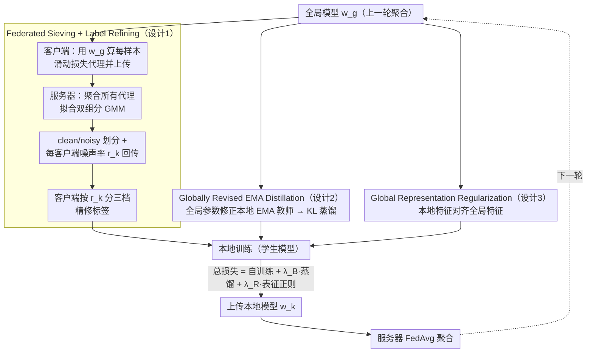

# Learning Locally, Revising Globally: Global Reviser for Federated Learning with Noisy Labels

**会议**: ICML 2026  
**arXiv**: [2412.00452](https://arxiv.org/abs/2412.00452)  
**代码**: https://github.com/cs-yuxintian/FedGR-ICML26 (有)  
**领域**: 联邦学习 / 噪声标签学习 / 优化  
**关键词**: 联邦学习, 标签噪声, EMA 蒸馏, GMM 样本筛选, 隐私保护  

## 一句话总结
本文观察到 FL 的全局模型对噪声标签存在"延迟记忆"现象（CIFAR-10 上记忆率 ≤30%，显著低于集中式训练），据此提出 FedGR——用服务器端 GMM 在所有客户端聚合损失代理上联合筛选并估计每个客户端的噪声比例，再用全局参数定期"修正"本地 EMA 教师以做蒸馏，并加入全局-本地表征一致性正则。三模块协同，在双重异质 (label noise × non-IID) 设定下相比 8 个 SOTA 基线在 CIFAR-10/100 + Clothing1M 上稳定取得显著增益。

## 研究背景与动机

**领域现状**：联邦学习 (FL) 把"模型聚合"和"数据不动"结合起来训练，FedAvg 已是医学影像、推荐、图学习等隐私敏感场景的事实标准；同时学界对集中式噪声标签学习 (C-LNL) 已有 Co-teaching、DivideMix 等成熟方案，主流套路是利用"记忆效应"——网络先学干净样本再过拟合噪声标签——做样本筛选。

**现有痛点**：把 C-LNL 方法直接搬到 FL 会同时遇到两类异质：(1) 不同客户端噪声**类型**（对称/非对称/混合）和**比例**差异巨大；(2) 数据分布 Non-IID 导致类别不均衡。两者叠加使得 client 端独立的样本筛选/网络对偶机制（Co-teaching / DivideMix）的"clean-rate 估计"频繁失效，而依赖客户端共享统计特征的共识方法又触碰隐私红线。

**核心矛盾**：客户端独立筛选→样本太少、噪声估计抖动；客户端间共享统计→泄露分布信息。同时，本地模型容易被高噪声客户端拖崩，全局模型虽然鲁棒却无法很好拟合各客户端的局部分布，二者难以同时利用。

**本文目标**：在不泄露任何 $(\mathbf{x}, \mathbf{y})$ 联合分布相关信息的前提下，同时解决"噪声估计"和"本地训练正则化"两件事。

**切入角度**：作者实证发现 FL 的全局模型对噪声标签的记忆速度远慢于集中式训练（CIFAR-10 Sym 噪声下，集中式模型最终记住 ≥80% 噪声标签，FL 全局模型 ≤30%），且其测试精度不会像集中式那样在 noisy peak 后塌缩——他们把这种现象命名为"FL 的内在标签噪声鲁棒性"，并据此把全局模型当作可信赖的"修正器"。

**核心 idea**：把"全局模型自带的延迟记忆"当作隐私保护的免费午餐——服务器端只用每样本的损失代理（与数据分布无关）做 GMM 筛选并把结果发回给客户端，同时让客户端的本地 EMA 教师周期性被全局参数"修正"以避免噪声累积。

## 方法详解

### 整体框架
FedGR 在标准 FedAvg 循环外加三个模块，全部为客户端 $k$ 在第 $t$ 轮的本地训练设计，总损失为 $\mathcal{L}_k = \mathcal{L}_k^{SR} + \lambda_{\mathcal{B}} \mathcal{B}_k + \lambda_{\mathcal{R}} \mathcal{R}_k$。流程：(1) 客户端用全局模型 $\mathbf{w}_g^{t-1}$ 计算每个样本的滑动平均损失代理 $\bar{\ell}_i^t$ 上传服务器；(2) 服务器对所有客户端的代理拟合两组分 GMM，按"clean 后验概率" $q_{i,k}$ 划分 clean/noisy 子集，估计每客户端噪声率 $r_k$，把结果回传；(3) 客户端按 $r_k$ 分级修正标签（低噪声且 clean 子集→保留；低噪声且 noisy 子集→$q_{i,k}\hat{y}_i + (1-q_{i,k})y^{pse}_i$ 软标签；高噪声 $r_k \ge \beta$→直接用伪标签 $y^{pse}_i$，伪标签来自 FixMatch 在全局模型上的弱增强预测）；(4) 同时维护本地 EMA 教师，每轮开头用全局参数做一次"修正" $\mathbf{w}_{k,ema}^{t,0} = \gamma_g \mathbf{w}_{k,ema}^{t-1,m_k} + (1-\gamma_g)\mathbf{w}_g^{t-1}$，本地步内再用常规 EMA 更新，蒸馏给学生；(5) 全局-本地表征一致性正则 $\mathcal{R}_k$ 进一步约束本地骨干不要离全局表征太远。

### 关键设计

**1. Federated Sieving + Label Refining：把噪声判定搬到服务器，但只看与分布无关的损失统计**

单个客户端只有 10–50 个样本，根本拟合不出"干净 vs 噪声"的双峰，独立估计噪声率必然抖动；可一旦客户端之间共享类别频率或原型，又会泄露分布信息。FedGR 的破局点是只传一个隐私无害的量——每样本的滑动平均损失代理。客户端 $k$ 对每个样本维护损失观测集 $L_i^t=\{\ell_{i,p}\}_{p=1}^{T_k}$，其中 $\ell_{i,T_k}=\mathcal{H}(\mathbf{p}_i^g,\hat{y}_i)$ 用全局模型 $\mathbf{w}_g^{t-1}$ 算交叉熵，取均值 $\bar{\ell}_i^t=\frac{1}{T_k}\sum_p\ell_{i,p}$ 上传。服务器把所有选中客户端的代理汇到一起拟合双组分 GMM，clean 后验 $q_{i,k}$ 同时给出 clean/noisy 划分和每客户端噪声率 $r_k$。客户端拿回结果后按噪声率分三档精修标签 $\tilde{y}_i$：$r_k<\beta$ 且属 clean 则保留原标签；$r_k<\beta$ 但被划入 noisy 则用 $q_{i,k}\hat{y}_i+(1-q_{i,k})y^{pse}_i$ 软融合；$r_k\ge\beta$ 则直接用伪标签 $y^{pse}_i$（FixMatch 在弱增强下由全局模型生成）。这样设计既靠群体数据把噪声两峰建模稳，又因为只传损失值（与 $\mathbf{x},\mathbf{y}$ 联合分布无关）而不构成隐私泄露，避开了 FedCorr、FedNoRo 那种要传类别频率/原型的风险。

**2. Globally Revised EMA Distillation：让全局参数定期"洗"本地 EMA 教师，再蒸馏给学生**

在线 EMA 在高噪声客户端会随本地步累积错误信号，单纯的本地教师靠不住。FedGR 的做法是给每个客户端的 EMA 模型 $\mathbf{w}_{k,ema}^{t,m_k}$ 设两段更新：每轮开头（$m_k=0$）先用全局参数做一次"修正"

$$\mathbf{w}_{k,ema}^{t,0}=\gamma_g\,\mathbf{w}_{k,ema}^{t-1,m_k}+(1-\gamma_g)\,\mathbf{w}_g^{t-1},$$

本地训练步内（$m_k\ge1$）再走标准 EMA $\mathbf{w}_{k,ema}^{t,m_k}=\gamma_l\mathbf{w}_{k,ema}^{t,m_k-1}+(1-\gamma_l)\mathbf{w}_k^{t,m_k}$。蒸馏只取本轮开头那个"修正后" EMA 的弱增强 logits $\mathbf{p}_i^{le,w}$ 当教师，目标 $\mathcal{B}_k=\mathbb{E}_{\hat{\mathcal{D}}_k}[KL(\mathbf{p}_i^{le,w}/\tau,\ \mathbf{p}_i^{l,s}/\tau)]$。这相当于把"EMA 的时间平滑"和"全局聚合的群体鲁棒性"两种平滑显式叠加；又因为前向被锁在 $m_k=0$ 这一步，蒸馏成本从 $O(\text{steps})$ 降到 $O(1)$。消融印证了它的针对性：去掉该模块后 Non-IID Sym 1.0 精度从 63.64 掉到 51.07（−12.6 个点），远高于 IID 同设定的损失，正对应"本地模型在高噪声 + 类不均下被污染"这一痛点。

**3. Global Representation Regularization：从特征空间再加一道不依赖标签的兜底约束**

只靠 EMA 蒸馏还留着一个风险——教师本身可能被精修后的错误标签带跑。表征正则就是为这个兜底：它约束本地 backbone $f(\cdot;\mathbf{w}_{k,f}^t)$ 在弱增强下的特征与全局 backbone $f(\cdot;\mathbf{w}_{g,f}^{t-1})$ 的特征保持一致（余弦/L2 一致性，由 $\lambda_{\mathcal{R}}$ 加权，CIFAR-10 取 0.1、CIFAR-100/Clothing1M 取 0.2）。它的关键好处是完全不碰标签——纯从特征空间约束本地模型别偏离全局，于是与第 2 点的 logits 级蒸馏构成"特征 + logits"的双重约束。消融显示去掉它后 Non-IID Sym 1.0 从 63.64 掉到 58.23（−5.4 个点），说明在 EMA 教师开始累积误差时它确实起到了独立的补强作用。

### 损失函数 / 训练策略
总损失 $\mathcal{L}_k = \mathcal{L}_k^{SR} + \lambda_{\mathcal{B}} \mathcal{B}_k + \lambda_{\mathcal{R}} \mathcal{R}_k$；$\lambda_{\mathcal{B}}=1.0$，$\lambda_{\mathcal{R}}=0.1$ (CIFAR-10) 或 $0.2$ (其它)；SGD + 常数学习率，本地 epoch $=10$ (CIFAR-10/100)、$2$ (Clothing1M)；骨干分别为 ResNet-18/34/预训练 ResNet-50；CIFAR 切 100 client、Clothing1M 切 500 client，Non-IID 用 Dirichlet $\alpha=0.3$；warmup $\alpha$ 轮内服务器无放回随机采样保证所有客户端都被采过、之后切回标准 FL 采样；强增强 RandAugment、弱增强沿用 FedCorr；评估用最后 10 轮均值精度。

## 实验关键数据

### 主实验
CIFAR-10 上，控制噪声客户端比例 $\phi$ 和噪声率区间 $\mathcal{U}(\rho_{\min}, \rho_{\max})$。这里给出"Sym 1.0/$\mathcal{U}(0.5,1.0)$"和"Mixed 1.0/$\mathcal{U}(0.2,0.4)$"两类极端设定。

| 方法 | IID Sym $\phi=1.0$ | IID Mixed $\phi=1.0$ | Non-IID Sym $\phi=1.0$ | Non-IID Mixed $\phi=1.0$ |
|------|--------------------|----------------------|------------------------|--------------------------|
| FedAvg | 23.89 | 70.66 | 17.32 | 51.92 |
| FedProx | 23.02 | 64.44 | 16.69 | 49.77 |
| FL-Coteaching | 47.28 | 83.99 | 33.49 | 72.42 |
| FL-DivideMix | 68.47 | 85.19 | 38.35 | 68.86 |
| FedCorr (CVPR22) | 55.12 | 84.15 | 29.42 | 83.33 |
| FedNoRo (IJCAI23) | 33.98 | 71.07 | 18.60 | 57.09 |
| **FedGR (Ours)** | **83.91** | **93.13** | **63.64** | **86.50** |

CIFAR-10 上 Avg 列：FedGR 达到 91.07，第二名 FL-DivideMix 81.11；Clothing1M (Table 3) 上同样领先；最极端的 Non-IID Sym $\phi=1.0$/$\mathcal{U}(0.5,1.0)$ 设定下相对 FedCorr 提升 +34.2 个点。

### 消融实验 (CIFAR-10, Table 4)

| 配置 | IID Sym 1.0 | IID Mixed 1.0 | Non-IID Sym 1.0 | Non-IID Mixed 1.0 | 说明 |
|------|-------------|---------------|-----------------|-------------------|------|
| Full FedGR | 83.91 | 92.27 | 63.64 | 84.65 | 完整模型 |
| w/o FS | 54.59 | 91.71 | 45.48 | 84.01 | 去掉联邦筛选→IID Sym 掉 29.3，Non-IID Sym 掉 18.2 |
| w/o LR | 75.23 | 90.46 | 59.48 | 83.21 | 去掉标签精修→各设定均掉 1–8 点 |
| w/o $\mathcal{R}_k$ | 81.49 | 91.84 | 58.23 | 82.70 | 去掉表征正则→Non-IID Sym 掉 5.4 |
| w/o $\mathcal{B}_k$ | 78.14 | 91.24 | 51.07 | 79.44 | 去掉 EMA 蒸馏→Non-IID Sym 掉 12.6 |

### 关键发现
- **联邦筛选 (FS) 是命门**：去掉 FS 后高噪声 IID Sym 暴跌 29.3 个点，远超去掉其它任何模块——说明服务器端聚合数据代理比客户端独立估计噪声率有质的差异，验证了"FL 全局视角"的核心价值。
- **EMA 蒸馏 (B_k) 在双异质下最有用**：去掉后 Non-IID Sym 1.0 掉 12.6 个点，远高于 IID 同设定的 5.8——印证了它专门针对"本地模型在高噪声 + 类不均下被污染"这一痛点的设计动机。
- **超越 clean baseline 的反常现象**：在 Mixed $\phi=0.6$/$\mathcal{U}(0.2,0.4)$ 设定下 FedGR 甚至超过用纯净数据训练的 FedAvg，作者归因于额外正则的副作用，但承认这种 gap 很小，主要价值还是来自噪声鲁棒性而非正则化。
- **筛选准确性**：Figure 3 报告 FedGR 估计的客户端噪声率 $\{r_k\}$ 与真实值 Pearson 相关 > 0.9，远高于 FedCorr/FedFixer，说明聚合代理 + GMM 的方法在客户端层面就显著更准。

## 亮点与洞察
- **把"全局模型的鲁棒性"系统性变现**：之前 FL 文章大多把全局模型当成"待评估的产出"，本文把它当成"在线的隐式正则与可信代理"，这一视角可以平移到联邦域适应、联邦持续学习等任何"全局信号优于本地信号"的场景。
- **隐私友好的损失代理**：用"每样本的滑动损失"代替"原型/类别频率"作为客户端→服务器的传递信号，是个干净的可复用 trick——只要待解决的统计目标只关心样本相对难度而非语义内容，就能搬到联邦不平衡学习、联邦主动学习上。
- **EMA 修正机制**：把 EMA 的"长期平均"和全局聚合的"群体平均"两种平滑显式叠加，又把蒸馏前向锁在 $m_k=0$ 一步以节省成本——既是一个理论上有依据的设计也是工程上很省的实现。

## 局限与展望
- 假设客户端的损失代理在前 $\alpha$ 轮就能在群体层面分出双峰；如果绝大多数客户端噪声率都很高且类型一致，GMM 退化为单峰，FS 会失效（作者未给出 100% 噪声场景的兜底）。
- 引入了 4 个新超参 $\alpha, \beta, \gamma_g, \lambda_{\mathcal{R}}$，论文显示对 $\gamma_g$ 较敏感（过大会反噬精度），实际部署需要按数据集调参，缺乏自适应机制。
- 服务器端 GMM 拟合 + 每样本损失观测的存储和带宽开销虽然作者声称"moderate"（附录 A.8），但相对 vanilla FedAvg 仍是显著增量，对超大规模 (>10k client) FL 的扩展性未做实验。
- 隐私保证只在直观层面（"损失与分布无关"），没有差分隐私之类的形式化分析，对成员推理攻击是否真正免疫待验证。

## 相关工作与启发
- **vs FedCorr (CVPR22)**：FedCorr 也走"server-side noise correction"路线，但需要传送 model parameters + ratio statistics 等更多信号，对 dual heterogeneity 弱；FedGR 只传损失代理，在 Non-IID Sym 1.0 上反超 +34 点。
- **vs FedNoRo / FedDiv / FedFixer**：这些方法主要在客户端独立做筛选或检测 noisy clients，遇到双异质就崩；FedGR 把筛选搬到服务器并叠加全局-本地表征对齐，证明"集中视角 + 隐私敏感统计"路线更鲁棒。
- **vs DivideMix (集中式)**：DivideMix 双网络共训提高 clean-rate 估计稳定性，本文复用其 GMM 后验思路，但把双网络改成"全局-本地" + EMA 蒸馏，从而把同样的 idea 适配到通信受限、计算受限、分布异质的 FL 场景。

## 评分
- 新颖性: ⭐⭐⭐⭐ "全局模型延迟记忆"现象 + 服务器端 GMM 联合筛选的组合在 F-LNL 文献里首次系统化。
- 实验充分度: ⭐⭐⭐⭐ 三数据集 × 8 基线 × 多噪声/分布组合 × 完整消融 + 超参分析，但缺乏 100% 噪声、>10k client 等极端场景。
- 写作质量: ⭐⭐⭐⭐ 动机讲得清楚，公式与流程对应明确，附录补足理论收敛与隐私讨论。
- 价值: ⭐⭐⭐⭐ 在隐私敏感的 F-LNL 落地上是一个可直接复现且收益显著的强基线，可作为后续工作的起点。

<!-- RELATED:START -->

## 相关论文

- [\[CVPR 2026\] Revisiting Learning with Noisy Labels: Active Forgetting and Noise Suppression](../../CVPR2026/optimization/revisiting_learning_with_noisy_labels_active_forgetting_and_noise_suppression.md)
- [\[AAAI 2026\] Data Heterogeneity and Forgotten Labels in Split Federated Learning](../../AAAI2026/optimization/data_heterogeneity_and_forgotten_labels_in_split_federated_learning.md)
- [\[CVPR 2026\] FedRG: Unleashing the Representation Geometry for Federated Learning with Noisy Clients](../../CVPR2026/optimization/fedrg_unleashing_the_representation_geometry_for_federated_learning_with_noisy_c.md)
- [\[ICML 2026\] Delayed Momentum Aggregation: Communication-efficient Byzantine-robust Federated Learning with Partial Participation](delayed_momentum_aggregation_communication-efficient_byzantine-robust_federated_.md)
- [\[ICLR 2026\] FedDAG: Clustered Federated Learning via Global Data and Gradient Integration for Heterogeneous Environments](../../ICLR2026/optimization/feddag_clustered_federated_learning_via_global_data_and_gradient_integration_for.md)

<!-- RELATED:END -->
