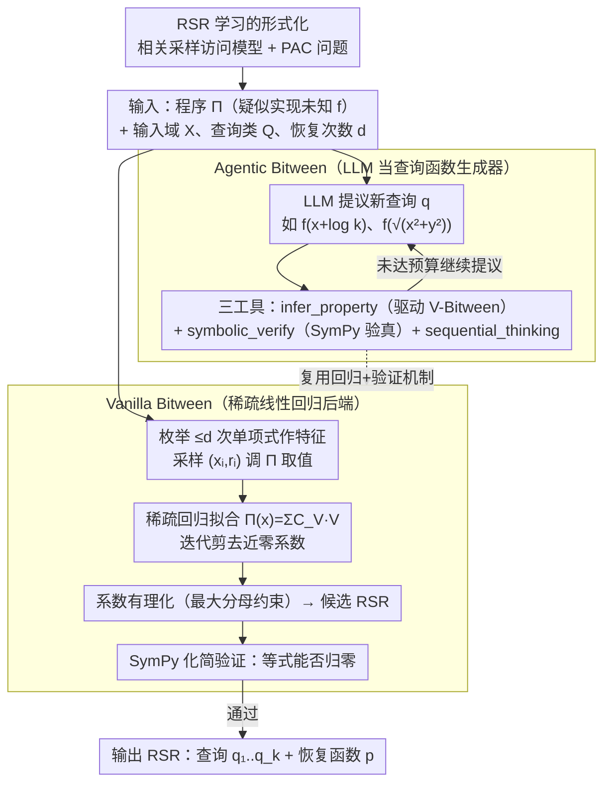

# Learning Randomized Reductions

**会议**: ICML 2026 Spotlight  
**arXiv**: [2412.18134](https://arxiv.org/abs/2412.18134)  
**代码**: https://github.com/ferhaterata/learning-randomized-reductions (有)  
**领域**: 优化 / 神经符号学习 / 符号回归  
**关键词**: 随机自归约, 自校正程序, 神经符号, 符号回归, LLM 智能体  

## 一句话总结
本文把"发现某个函数 $f$ 的随机自归约 (RSR)"这一沉寂四十年的人工任务，形式化成一个带相关采样的学习问题，并构建了 Bitween 框架：先用稀疏线性回归在固定查询集 $\{x+r, x-r, x \cdot r, x, r\}$ 内挖掘 RSR，再让 LLM 智能体在更大的查询函数空间里搜索，最终在 80 个数学/ML 函数构成的 RSR-Bench 上把 RSR 覆盖率从 54% 推到 80%，并首次给出 sigmoid 的 RSR 表达式。

## 研究背景与动机

**领域现状**：随机自归约 (Randomized Self-Reduction, RSR) 自 Goldwasser & Micali 1984 年提出以来，是把困难输入 $x$ 上的函数值 $f(x)$ 用 $f$ 在若干随机但相关的点 $u_i = q_i(x, r)$ 上的取值线性组合恢复出来的技术，已在自校正程序、实例隐藏、平均/最坏情况复杂度归约、交互式证明中大量使用。

**现有痛点**：四十多年来，发现一个具体函数的 RSR 几乎只能靠数学家手工推导，而且学界长期把"查询函数"限定在 $\{x+r, x-r, x \cdot r, x, r\}$ 这五个固定形式上，导致大量函数（如 sigmoid、Gudermannian、特殊函数）一直没有已知 RSR。

**核心矛盾**：RSR 的形式空间在两个维度上同时爆炸——查询函数族 $Q$ 的选择 + 恢复函数 $p$ 的代数结构，纯符号方法无法自由探索查询函数族，纯神经方法又会大量编造无法被符号验证的"伪 RSR"。

**本文目标**：把 RSR 发现拆成两个子问题：(1) 给定查询函数族 $Q$，如何高效从 $Q$ 里的样本数据反推出恢复函数 $p$；(2) 如何在 $Q$ 之外动态提出新的、对当前函数 $f$ 有意义的查询函数。

**切入角度**：作者注意到 Lipton (1989) 已经证明，对于有限域上次数 $d$ 的多项式，只需要 $d+1$ 个**线性**查询函数和一个**线性**恢复函数就能构造 RSR——这意味着在很多场景下 RSR 本质上是一个稀疏线性回归问题，而符号回归/MILP/遗传编程这些更"重"的方法不一定最优。

**核心 idea**：先在固定查询集上把回归后端做透 (Vanilla Bitween)，再把 LLM 当成"查询函数生成器"调度同一套验证工具去探索新查询 (Agentic Bitween)，让神经的创造力和符号的可验证性形成互补。

## 方法详解

### 整体框架
Bitween 输入是一个被怀疑实现了未知函数 $f$ 的程序 $\Pi$（可能含浮点误差），加上输入域 $X$、查询函数类 $Q$、恢复函数次数上界 $d$。整套方法建立在「RSR 学习的形式化」这一理论地基上（相关采样访问模型 + PAC 问题），具体由两个能跑的系统接力：Vanilla Bitween 的流程是 (1) 对每个候选查询 $q \in Q$ 引入符号变量 $v_q$ 代表 $\Pi(q(x,r))$；(2) 枚举所有 $v_q$ 的次数 $\le d$ 的单项式 $V$ 作为线性特征；(3) 随机采样 $m$ 对 $(x_i, r_i)$，调用 $\Pi$ 得到 $\Pi(x_i)$ 和所有 $\Pi(q(x_i, r_i))$；(4) 用稀疏线性回归把 $\Pi(x_i) = \sum_V C_V \cdot V(x_i, r_i)$ 拟合出来，去掉系数接近 0 的单项式；(5) 把残余浮点系数用最大分母约束转成有理数，得到候选 RSR；(6) 用 SymPy 把候选式化简到 0 来形式化验证。Agentic Bitween 在外层加了一个 LLM 智能体，它可以多次调用 `infer_property_tool`（驱动 Vanilla 后端，但允许提议新查询如 $f(x+\log k)$、$f(\sqrt{x^2+y^2})$）、`symbolic_verify_tool`（SymPy 验证）和 `sequential_thinking_tool`（思维链记账），从而复用整套验证机制去探索固定查询集之外的新查询。

### 关键设计

**1. RSR 学习的形式化与"相关采样"访问模型：把四十年的手工任务写成可证伪的 PAC 问题**

在动手做系统之前，作者先把"发现 RSR"明确定义成一个 PAC-style 学习问题——给定函数类 $F\subseteq\mathrm{RSR}_k(Q,P)$ 和 $m$ 个样本，以 $\ge1-\delta$ 概率输出一个 $(\rho,\xi)$-近似 RSR。这里最关键的设计是访问模型：他们引入一种介于"独立同分布样本"和"任意 oracle 查询"之间的第三类——相关随机样本，即每个 $x_j$ 的边缘分布均匀，但不同 $j$ 之间可以相关。这恰好是 RSR 天然的采样模式（$x$ 与 $x+r$ 边缘上都均匀、联合分布却相关），不刻画成这样后面的样本复杂度证明就无从谈起。之所以要单独造这个框架，是因为传统 PAC 学习要求输出近似 $f$ 本身，而 RSR 学习只要求输出 $f$ 的一个等式约束 $p(x,r,f(u_1),\dots,f(u_k))$，两类目标在样本复杂度上有本质差异（论文用 Claim A.1/A.2 做了对比），这个形式化正是后续给出 Bitween 样本复杂度上界的前提。

**2. Vanilla Bitween：把 RSR 搜索退化成受控的稀疏线性回归三件套**

Lipton (1989) 证明有限域上次数 $d$ 的多项式只需 $d+1$ 个线性查询 + 一个线性恢复函数，这暗示 RSR 在很多场景下本质是稀疏线性回归而非组合搜索。Vanilla Bitween 据此把问题拆成一系列回归子问题：对每个候选目标变量 $v_q$ 单独建一个任务，损失为

$$L_q(C)=\frac{1}{m}\sum_i\Big(\Pi_i-\sum_V C_V V_i\Big)^2+\lambda R(C),$$

其中正则项 $R(C)$ 在 Lasso 与 Ridge 间切换、$\lambda$ 用 5 折 CV 网格搜出；回归后剪掉系数低于阈值的单项式、迭代到收敛；最后用 Stern–Brocot 类有理逼近把浮点系数变成可读分数——这一步是后续 SymPy 能严格验证的关键。为了验证"用对模型类比用强算法更重要"，作者把同一框架接到 PySR（遗传编程）、GPLearn、Gurobi（MILP）等看似更强的后端做公平对照，结果它们经常超时或给出无法被 SymPy 验证的近似式，反而朴素稀疏线性回归（V-Bitween-LR）在覆盖率、运行时间、RSR 数量上同时夺冠（54% vs ≤32%）。

**3. Agentic Bitween：把 LLM 当查询函数生成器，用符号工具兜底验真**

固定查询集 $\{x+r, x-r, x\cdot r, x, r\}$ 是限制覆盖率的天花板，但纯神经方法又会大量编造无法验证的"伪 RSR"。Agentic Bitween 的破法是给 LLM 划定一个严格角色——只负责提议新查询函数（如 $f(x+\log k)$、$f(\sqrt{x^2+y^2})$、$f(x^{1/n})$），不负责给最终答案。智能体对每个函数只被调用一次，但可多次调用三种工具：`infer_property_tool` 把提议的新查询塞回 Vanilla 回归后端反推恢复函数，`symbolic_verify_tool` 用 SymPy 化简等式给出"通过/失败"的硬判定，`sequential_thinking_tool` 让模型写思维链记账（实证显示它能显著提高另两个工具的调用质量）。这套设计的价值在数据上很直观：纯神经基线 N-Research 在 Opus-4.1 上给出 250 个 RSR 却带 172 个未验证属性，而 A-Bitween 借符号验证把未验证压到极低（793 RSR 仅 26 个未验证），真正实现"神经创造力 + 符号可验证性"的闭环，而非常见的"LLM 一锤子买卖"。

### 损失函数 / 训练策略
回归阶段用 Lasso/Ridge 加正则 $\lambda$（5 折 CV 选择），迭代剪枝阈值化系数到零；采样 $[-10, 10]$ 均匀分布，误差容忍 $\delta = 10^{-3}$，每实验重复 5 次，单次预算 1800s；三角/双曲/指数函数用次数 3，其它用次数 2，运行环境 32GB / Apple M1 Pro 10 核。

## 实验关键数据

### 主实验
RSR-Bench 含 80 个函数，跨 8 个类别（基础/指数/对数/三角/双曲/反三角/ML 激活/特殊函数）。下表是 5 类符号后端 + 3 个神经基线 + 3 个 A-Bitween 配置的总表，格式为 RSR 计数 / 验证 | 未验证。

| 方法 | RSR / 验证 | 未验证 | RSR 覆盖率 | 平均运行时间 |
|------|-----------|--------|-----------|-------------|
| V-Bitween-PySR | 61 / 61 | 60 | 38% | 335 s |
| V-Bitween-GPLearn | 48 / 48 | 54 | 32% | 140 s |
| V-Bitween-MILP | 74 / 74 | 29 | 51% | 11 s |
| **V-Bitween-LR** | **87 / 87** | 46 | **54%** | **5 s** |
| N-Research-Opus-4.1 | 250 / 539 | 172 | 64% | 286 s |
| A-Bitween-Sonnet-4 | 293 / 729 | 14 | 66% | 160 s |
| **A-Bitween-Opus-4.1** | **793 / 1628** | **26** | **80%** | 378 s |

线性回归后端在符号阵营里同时拿下最高 RSR 数、最高覆盖率、最短平均运行时间；Agentic Bitween 把覆盖率推到 80%，并首次给出 sigmoid 的 RSR：$\sigma(x) = \frac{\sigma(x+r)(\sigma(r) - 1)}{2\sigma(x+r)\sigma(r) - \sigma(x+r) - \sigma(r)}$。

### 消融实验
基于 Figure 2 的按类别 RSR 数量（A-Bitween 与对应 N-Research 同模型对比，反映"工具调用是否带来额外 RSR"）。

| 类别 | V-Bitween-LR | N-Research (Opus) | A-Bitween (Opus) | 工具增益 |
|------|-------------|-------------------|------------------|---------|
| Basic | 1.2 | 11.0 | 23.5 | +12.5 |
| Exponential | 1.2 | 12.3 | 29.6 | +17.3 |
| Trigonometric | 1.8 | 9.1 | 19.4 | +10.3 |
| Hyperbolic | 0.7 | 7.0 | 20.0 | +13.0 |
| ML Functions | 1.0 | 4.1 | 18.7 | +14.6 |
| Special | 0.7 | 4.9 | 20.2 | +15.3 |

### 关键发现
- 在符号方法里，"模型类匹配"碾压"算法复杂度"——稀疏线性回归在覆盖率上是 PySR/GPLearn 的 1.4–1.7 倍，平均运行时间却快 28–67 倍，提示 RSR 本质是一个稀疏线性问题而不是组合搜索问题。
- A-Bitween 相对 N-Research 的核心收益不是"找到更多 RSR"，而是"显著降低伪 RSR"：Opus-4.1 上未验证属性从 172 降到 26（−85%），证明 `symbolic_verify_tool` 才是把 LLM 从"幻觉机器"变成"可靠发现工具"的关键开关。
- 模型越强收益越大：从 GPT-OSS-120B (157 RSR) → Sonnet-4 (293) → Opus-4.1 (793) 几乎是 1:2:5 的指数级增长，且 A-Bitween 对 Opus 的 RSR 数是 N-Research 的 3.2 倍，说明强模型能更充分利用工具反馈。
- 框架天然外推到非标量域：作者无修改即可在矩阵、四元数、八元数、Clifford/Lie 代数上跑出 RSR（把这些结构展平成标量），说明 Bitween 的可推广性来自学习问题本身，而非特定符号引擎。

## 亮点与洞察
- **形式化 + 工程化双轮驱动**：先把四十年来"凭直觉"的 RSR 发现写成可证伪的学习问题（含相关采样定义），再把工程上跑得通的最简后端（线性回归）放进来——这种"先把问题问对再选最朴素工具"的研究路径在很多 ML for Science 任务里值得复用。
- **LLM as "查询函数生成器"**：把 LLM 限定在"提建议"而非"出答案"的位置，用符号工具验真，是当下"神经-符号融合"最干净的范式之一，未来可以迁移到不变量发现、Lyapunov 函数寻找、量子电路化简等任何"创造性提议+严格验证"任务。
- **第一个 sigmoid RSR** 本身就是一个具体的科学副产品——它意味着 sigmoid 可以通过两次 sigmoid 调用 ($\sigma(x+r)$, $\sigma(r)$) + 一次有理运算自校正，对边缘设备私密推理 (instance-hiding) 是有意义的工具。

## 局限与展望
- 当前理论框架要求 $F \subseteq \mathrm{RSR}_k(Q, P)$，即 "可实现性" 假设；agnostic 设定（$f$ 不一定真有 RSR）留作未来工作，这其实是更接近"自动发现"的核心场景。
- 实验最大度数 $d$ 限制在 3 以内，因为单项式数随 $d$ 指数膨胀；对真正高阶多项式或超越函数的 RSR 仍然手工不可达。
- "RSR 学习的 Fundamental Theorem"——把样本复杂度与 $Q$、$P$ 的 VC 类维数挂钩——作者明确留作 open problem，没有给出与 PAC 那样紧的下界。
- LLM 部分对模型大小高度敏感（GPT-OSS-120B 与 Claude-Opus-4.1 差 5 倍），且 A-Bitween 单次调用的 token 成本和延迟不可忽视（最大 900 秒/函数）。

## 相关工作与启发
- **vs PySR / GPLearn / 一般符号回归**：它们从数据中发现表达式本身，本文锁定函数已知、只找 RSR 等式；通过把通用符号回归当成"可插拔后端"做公平比较，反向证明在该任务上稀疏线性回归才是匹配的工具。
- **vs Daikon / DIG 等程序不变量挖掘**：它们关注程序级动态不变量（整除、不等式等），本文专注数学函数的随机自归约，且第一次以 PAC-style 学习视角去做。
- **vs 纯 LLM 数学推理（GPT-4、Llemma）**：这些工作让 LLM 自己写最终答案，难以避免幻觉；A-Bitween 通过把 LLM 严格限定在"提议查询函数"的子任务里 + SymPy 验证回路，把神经的开放性和符号的严谨性融合得更彻底。

## 评分
- 新颖性: ⭐⭐⭐⭐⭐ 把四十年的人工任务首次形式化为 PAC-style 学习问题并交付能跑的系统。
- 实验充分度: ⭐⭐⭐⭐ 80 个函数 × 8 类别 × 5 个符号后端 × 3 个 LLM 充分对照，但单次实验只重复 5 次。
- 写作质量: ⭐⭐⭐⭐ 理论与系统两条线并行清晰，附录给出完整伪代码与每函数级表格。
- 价值: ⭐⭐⭐⭐⭐ 既给出实际科学副产品 (sigmoid RSR)，又开了一个"神经创造力 + 符号验证"的可复用范式。

<!-- RELATED:START -->

## 相关论文

- [\[ICML 2026\] Learning Locally, Revising Globally: Global Reviser for Federated Learning with Noisy Labels](learning_locally_revising_globally_global_reviser_for_federated_learning_with_no.md)
- [\[ICLR 2026\] Convex Dominance in Deep Learning I: A Scaling Law of Loss and Learning Rate](../../ICLR2026/optimization/convex_dominance_in_deep_learning_i_a_scaling_law_of_loss_and_learning_rate.md)
- [\[ICML 2026\] Interpretability and Generalization Bounds for Learning Spatial Physics](interpretability_and_generalization_bounds_for_learning_spatial_physics.md)
- [\[ICML 2026\] Ubiquity of Emergent Hebbian Dynamics in Regularized Learning](ubiquity_of_emergent_hebbian_dynamics_in_regularized_learning.md)
- [\[ICML 2026\] Bayesian Gated Non-Negative Contrastive Learning](bayesian_gated_non-negative_contrastive_learning.md)

<!-- RELATED:END -->
