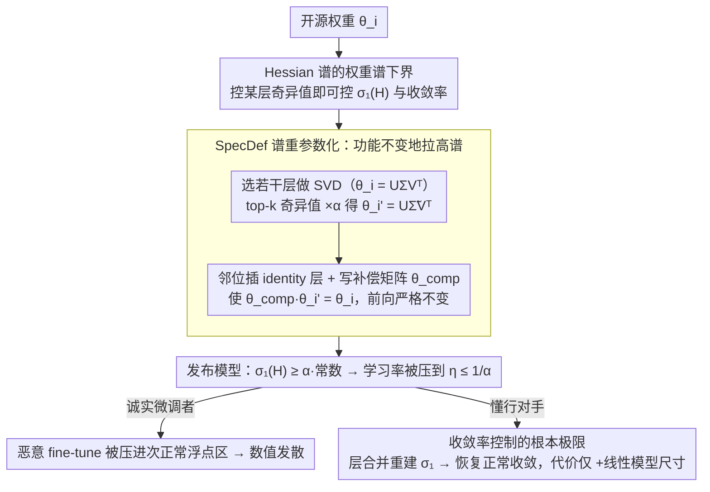

# Limits of Convergence-Rate Control for Open-Weight Safety

**会议**: ICML 2026  
**arXiv**: [2602.18868](https://arxiv.org/abs/2602.18868)  
**代码**: 暂未公开  
**领域**: AI 安全 / 优化理论 / 开源权重模型治理  
**关键词**: open-weight safety、convergence rate、Hessian 谱、spectral reparameterization、tamper resistance

## 一句话总结
作者把"开源权重安全"形式化为"如何延缓恶意 fine-tune 的收敛速度"，证明 Hessian 谱的最大奇异值由权重谱下界决定，由此设计了能严格减慢一阶/二阶优化的 SpecDef 算法，但同时证明任何此类收敛率控制方法都能被攻击者以"线性模型尺寸增加"的代价绕过。

## 研究背景与动机

**领域现状**：开源基础模型在 release 后没有理论上可保证的训练抗性——用户可以自由对权重做 fine-tune，包括为深伪、化学武器等恶意用途。Open-weight 治理大多走"许可证 / 节流发布"等政策路径，技术上的 training-time resistance（如 TAR、RepNoise、RMU、ELM 等）零零散散，且都缺少统一的理论解释。

**现有痛点**：(1) 现有 unlearning / 不可改训方法在系统化评测下都失败——只要稍微调整 learning rate，几十步 fine-tune 就能把"被抹掉"的能力恢复回来；(2) 这些方法 ad hoc，没有人说清楚"它们到底为什么有时候有用、什么时候必败"；(3) 业界长期把 inference-time safety 和 training-time safety 混为一谈，缺乏统一定义。

**核心矛盾**：要"既保留功能又难以再训练"，本质上就是要在保持 zeroth-order 行为的同时增大 second-order（Hessian）的谱——可一阶优化收敛速度恰恰由 Hessian 最大奇异值决定。能不能在数学上构造出"功能不变但 Hessian 谱爆炸"的变换？反过来，能不能证明所有这类变换都有上限？

**本文目标**：(a) 把训练时安全形式化为"迭代复杂度 / 收敛率控制"问题；(b) 给出一个权重谱可直接操控 Hessian 谱的下界；(c) 据此构造可证明的算法 SpecDef；(d) 同时证明任何此类方法都有结构性上限，攻击者可以以线性额外成本攻破。

**切入角度**：一阶优化必须取学习率 $\eta \leq 1/L$，$L$ 又被 Hessian 最大奇异值 $\sigma_1(H^{\mathcal{L}}_{\theta})$ 下界——只要能在不动函数输出的前提下把 $\sigma_1$ 推到天文数字，攻击者就只能用 $\eta\to 0$，从而陷入"数值上无法学习"的窘境。

**核心 idea**：通过 SVD 对若干层权重做"对称重参数化"——把选定层的 top-$k$ 奇异值乘以 $\alpha$，并在相邻位置插入恰好抵消的补偿层；功能完全不变，但 Hessian 最大奇异值被强制拉高至少 $\alpha$ 倍，从而把可行学习率推到次正常浮点精度以下。

## 方法详解

### 整体框架
整篇方法是三块咬合的结构：先用一个**谱下界定理**把"测不准、控不动的 Hessian 最大谱"绑到"能直接动手的某层权重奇异值"上；据此构造一个**功能不变却能任意拉高谱**的算法 SpecDef；最后再证明这条"控收敛率"的路在懂行对手面前存在**根本极限**。

其中 SpecDef 在模型 release 前一次性运行：(1) 选若干层 $\theta_i$；(2) 在邻位插入 identity 线性层占位；(3) 对 $\theta_i$ 做 SVD 得到 $U \Sigma V^\top$；(4) 把 top-$k$ 奇异值乘 $\alpha$ 得到新权重 $\theta_i' = U \tilde\Sigma V^\top$；(5) 把"补偿矩阵"$\theta_i^{comp} = U \Sigma \tilde\Sigma^{-1} U^\top$ 写到 identity 层位置，使得 $\theta_i^{comp} \theta_i'$ 在功能上等同于原 $\theta_i$。GPT-OSS-20b 上对 10 层操作只需 15 秒。发布后：谱下界把可行学习率压到 $\eta\le 1/\alpha$，诚实微调者被逼进数值发散；但懂行对手可"层合并"把补偿层与原层重新吸收，以线性代价复原正常收敛——这正是题目里 "Limits" 的来源。

### 关键设计

**1. Hessian 谱的权重谱下界（Theorem 3）：把"测不动的 Hessian 最大特征值"绑到"能直接动手的某层权重奇异值"上**

一阶优化的学习率必须满足 $\eta\le 1/L$，而 $L$ 又被 Hessian 最大奇异值 $\sigma_1(\nabla^2_\theta\mathcal{L})$ 下界——可问题是 Hessian 既测不准也控不动。Theorem 3 搭的桥就是把它换成可控量：

$$\sigma_1(\nabla^2_\theta \mathcal{L}) \;\ge\; \sup_{r_1, r_2} \sigma_{r_1}(A)\,\sigma_1(B)\,\sigma_{r_2}(C)\,\cos\theta_1\cos\theta_2.$$

推导分两步：先用 Poincaré 分离定理把 Hessian 最大奇异值下界为某个 $p\times q$ 子块 $\nabla^2_{\theta_i,\theta_j}\mathcal{L}$ 的最大奇异值；再注意到这个子块对标准 MLP/CNN/Transformer 都有 $ABC$ 形分解（例如三层 MLP 的 $\partial^2 f/\partial\theta_3\partial\theta_1=(x^\top\otimes I_m)^\top D_{z_1}\cdot\theta_2^\top\cdot D_{z_2}$，中间正好夹着 $\theta_2$），最后用经典奇异值不等式收口。这是整个框架的理论支点：只要中间矩阵 $B=\theta_k$ 的最大奇异值被放大 $\alpha$ 倍，Hessian 最大奇异值至少同比例放大，从而把学习率上界压到 $\eta\le (1/\alpha)\cdot\text{常数}$，绕开了"无法直接控制 Hessian"这个老大难。值得一提的是这个 bound 在 rank-deficient 情况下仍 non-vacuous，比经典 Horn–Johnson bound 更紧。

**2. Lower-Max 谱重参数化 + SpecDef：功能严格不变，却把 Hessian 谱拉到天文数字**

有了上面的桥，剩下的就是构造一类映射 $\mathcal{T}_c: f_\theta\mapsto f_{\theta'}$，同时满足 $\sigma_1(H^{\mathcal{L}}_{\theta'})\ge c$ 和函数距离 $d(\mathcal{T}_c[f],f)\le\epsilon$，SpecDef 是它的具体实现。算法对选定层 $\theta_i$ 做 SVD 得 $U\Sigma V^\top$，把奇异值乘上 $T=\mathrm{diag}(\alpha,\dots,\alpha,1,\dots,1)$（前 $k$ 个放大 $\alpha$ 倍）得到 $\tilde\Sigma=T\Sigma$，再用 $U\tilde\Sigma V^\top$ 替换原权重；关键在于同时在相邻位置插入一个 identity 占位层并写入补偿矩阵 $\theta_i^{comp}=U\Sigma\tilde\Sigma^{-1}U^\top$，因为 $\theta_i^{comp}\theta_i'=U\Sigma V^\top=\theta_i$，前向输出严格不变。单纯的 weight rescaling 会改变输出，所以 compensation 是必须的；而插入 identity 层则巧妙绕开了 ReLU 这种非 1-同态激活的麻烦——identity 层之间的 cross-layer compensation 总是合法。$\alpha$ 按"逼对手到最小有效学习率以下"来选：既然多数 LM 在 $\eta<10^{-6}$ 时已无法收敛，取 $\alpha\ge 10^6$ 就能把可行学习率推进次正常浮点区。代价仅仅是模型参数量线性增加。

**3. 收敛率控制的根本极限（Layer Injection Attack）：证明这条路在懂行对手面前本质有限**

论文最重要的是它把自己也否定了。作者把 SpecDef 乃至所有"对称谱重参数化"方法抽象成一类映射，证明对任意这样的 $\mathcal{T}$ 都存在反向映射 $\mathcal{T}^{-1}$ 把谱拉回正常：攻击者只要知道层结构，就能把补偿矩阵和原层合并（"layer collapse"）重建出原始 Hessian 谱，从而恢复正常收敛——代价只是模型尺寸线性增加，而非指数；并且 Sophia、Muon、AdaHessian 这类曲率感知优化器只能局部改善、无法突破这一上限。这个结论之所以被作者特意摆出来，是要砸碎"open-weight safety 能提供实际抗性"的乐观主义：不是 SpecDef 不好用，而是整个"控制收敛率"路径在面对完整模型访问权的对手时存在结构性极限，未来真要做 training-time safety，必须跳出 convergence-rate control 这个框架另寻路径。这也是论文题目里 "Limits" 的由来。

### 损失函数 / 训练策略
SpecDef 本身不需要训练，是一次性的代数操作。论文同时建议"certification process"：在 release 前对 $\alpha, k, $ 层选择做 hyperparameter sweep，确认在常用 fine-tune 配方下都难以收敛。攻击侧实验用 SGD/Adam + 多个 learning rate（$10^{-6}$ 到 $3\times 10^{-5}$）以及曲率感知优化器（Sophia/Muon/AdaHessian）做 relearning 评估。

## 实验关键数据

### 主实验（Llama-3.1-8B-Instruct 上的 WMDP-bio relearning 攻击）

| 方法 | 起始 Acc | LR=$10^{-6}$（步数 / Acc）| LR=$10^{-5}$ | LR=$3\times 10^{-5}$ |
|------|----------|----------------------------|--------------|----------------------|
| ELM | 0.204 | 120 / 0.607 | 23 / 0.621 | 20 / 0.671 |
| RepNoise | 0.325 | 510 / 0.468 | 30 / 0.627 | 33 / 0.650 |
| TAR | 0.290 | 510 / 0.307 | 66 / 0.638 | 66 / 0.618 |
| Llama-3.1-8B 原版 | 0.482 | 93 / 0.607 | 20 / 0.629 | 10 / 0.609 |
| **SpecDef ($\alpha=10\mathrm{k}$)** | 0.204 | **10 / 0.195†** | **10 / 0.191†** | **10 / 0.195†** |

(†表示 perplexity 增加超过 100%，相当于 fine-tune 直接发散)

| Benchmark 模型效用保持（α 越大变化越小越好）| WMDP | PPL | MMLU | Winogrande | ARC | HellaSwag |
|---------------------------------------------|------|-----|------|------------|-----|-----------|
| α = 1k | $\Delta = -0.1$ | -0.01 | +0.1 | 0 | +1.0 | +0.3 |
| α = 100k | $-0.1$ | $-0.01$ | +0.6 | +0.3 | +0.3 | 0 |
| α = 1B | 0 | $-0.02$ | — | — | — | — |

### 消融实验

| 配置 | 效果 |
|------|------|
| 仅放大 $\sigma_1$（无 compensation）| 模型功能严重改变，丢精度 |
| SpecDef 全套 | 功能近乎不变，fine-tune 直接发散 |
| 攻击：曲率感知优化器（Sophia/Muon/AdaHessian）| 无法绕过 SpecDef |
| 攻击：层合并（layer-injection attack）| 可恢复正常收敛，代价 +linear 模型尺寸 |
| 攻击：vanilla spectral attack | 复用 SpecDef 同类型变换可逆转一些 prior defense |

### 关键发现
- **所有先前防御都被简单 LR sweep 击穿**：表 1 中 ELM、RepNoise、RMU、TAR、NPO 等在 $\eta = 10^{-5}$ 以上几十步就被打穿到 0.6+ 准确率，说明它们的"防御"只在某一个固定 LR 下有效。
- **SpecDef 在所有 LR 下都让 fine-tune 直接发散**：哪怕攻击者 sweep 五个数量级的 LR，都会被 $\alpha = 10^4$ 推到次正常浮点区，PPL 增长 100%+。
- **模型效用近乎零损失**：MMLU/Winogrande/ARC/HellaSwag 几乎全在 $\pm 0.3$ 内波动，证明前向数学恒等真的可以做到，价格只是"参数量增加 + 推理稍慢"。
- **但攻击者能以线性代价绕过**：作者自己给出 layer-injection attack 的构造，意味着任何具有完整模型访问权的对手都可以撤销 SpecDef——这是论文最重要的悲观结论，也是它把题目叫"Limits"的原因。

## 亮点与洞察
- **把 safety 翻译成 optimization theory**：以前的 unlearning 文章动辄手动定义 loss 项，本文直接走 iteration complexity 的经典分析，把"难训练"量化为"必须取极小 LR"，理论根基扎实。
- **权重谱 → Hessian 谱的桥梁很有教科书价值**：Theorem 3 把多年 random matrix theory 的工具用得很优雅，且这个 bound 在 rank-deficient 情况下仍然 non-vacuous，比经典 Horn-Johnson bound 更紧。
- **对称重参数化 + identity 注入**：这一招"既保持 zeroth-order 又能任意拉谱"非常巧妙，跟 Dinh 等人对 sharpness 的对称性分析一脉相承，可以延伸到 generalization / sharpness-aware training 等其他领域。
- **正反两面同等重要**：一篇 paper 既给出 best-known 算法 SpecDef，又证明其根本极限——这种"提出 + 否定"的结构很罕见，提醒未来研究者：要想真正实现 training-time safety，必须跳出 convergence rate control 这个框架。

## 局限与展望
- SpecDef 假设攻击者只能用一阶/二阶 smooth optimizers，未严肃考虑 randomized methods（如 stochastic Langevin dynamics）或基于符号梯度/zeroth-order 的攻击。
- 模型参数量线性增加在大模型部署上不是小问题——20B 模型加 10 层补偿可能就是几 GB 额外显存。
- "smallest effective learning rate"是经验确定的，不同硬件、不同精度（FP16/BF16/FP8）的浮点截断点不同，$\alpha$ 选择需要重新校准。
- Layer-injection attack 已经被作者证明可用，但实际攻击复杂度（需要哪些信息、调多少 hyperparameter）没有定量评估，留给后续工作。
- 没有给出 cryptographic 意义上的安全证明，只是"数值上不收敛"——这与 obfuscated gradients 的失败教训相似，未来需要更强模型。

## 相关工作与启发
- **vs TAR / RepNoise / RMU / ELM**：这些方法都是经验性 unlearning + 额外正则，文中的统一评测显示它们都在 LR sweep 下崩溃；SpecDef 第一次提供"在所有 LR 下都难收敛"的可证明保证。
- **vs Sharpness-Aware Minimization (Foret 2020) / Dinh 2017 关于 sharpness 的对称性**：本文反过来用对称性把 sharpness 推到无穷大，思路上一脉相承但目的相反。
- **vs Obfuscated Gradients (Athalye 2018)**：那篇证明"梯度混淆"防御都能被简单方法击穿，本文则是给出"收敛率混淆"的一个等价警告：任何依赖优化几何的防御都可被相应反向操作拆解。
- **vs Bresler 等关于 PAC-learning Hardness 的工作**：本文的 limit 不是计算复杂度意义上的硬度，而是 algebraic invertibility 意义上的极限，是另一条思路。

## 评分
- 新颖性: ⭐⭐⭐⭐⭐ 第一次给开源权重安全建立 convergence rate 理论框架，并同时给出可证明算法 + 根本极限，正反双向都强。
- 实验充分度: ⭐⭐⭐⭐ 跨 LM + ViT + Stable Diffusion 三类模型，10+ 防御对照，curvature-aware optimizer 攻击全覆盖；只是真实世界攻击者建模偏理想。
- 写作质量: ⭐⭐⭐⭐ 定义、命题、定理交代清楚，理论与实验衔接顺畅；篇幅密集，需要一定优化背景。
- 价值: ⭐⭐⭐⭐⭐ 给社区一个清醒的方向校准——后续真正想做 training-time safety 必须跳出收敛率控制框架，这种"路标"价值高于具体算法。

<!-- RELATED:START -->

## 相关论文

- [\[ICML 2026\] On the Convergence Rate of LoRA Gradient Descent](on_the_convergence_rate_of_lora_gradient_descent.md)
- [\[ICML 2026\] Sign Lock-In: Randomly Initialized Weight Signs Persist and Bottleneck Sub-Bit Model Compression](sign_lock-in_randomly_initialized_weight_signs_persist_and_bottleneck_sub-bit_mo.md)
- [\[ICML 2026\] Towards Understanding Adam Convergence on Highly Degenerate Polynomials](towards_understanding_adam_convergence_on_highly_degenerate_polynomials.md)
- [\[ICLR 2026\] Dual Optimistic Ascent (PI Control) is the Augmented Lagrangian Method in Disguise](../../ICLR2026/optimization/dual_optimistic_ascent_pi_control_is_the_augmented_lagrangian_method_in_disguise.md)
- [\[ICML 2026\] Balanced LoRA: Removing Parameter Invariance to Accelerate Convergence](balanced_lora_removing_parameter_invariance_to_accelerate_convergence.md)

<!-- RELATED:END -->
