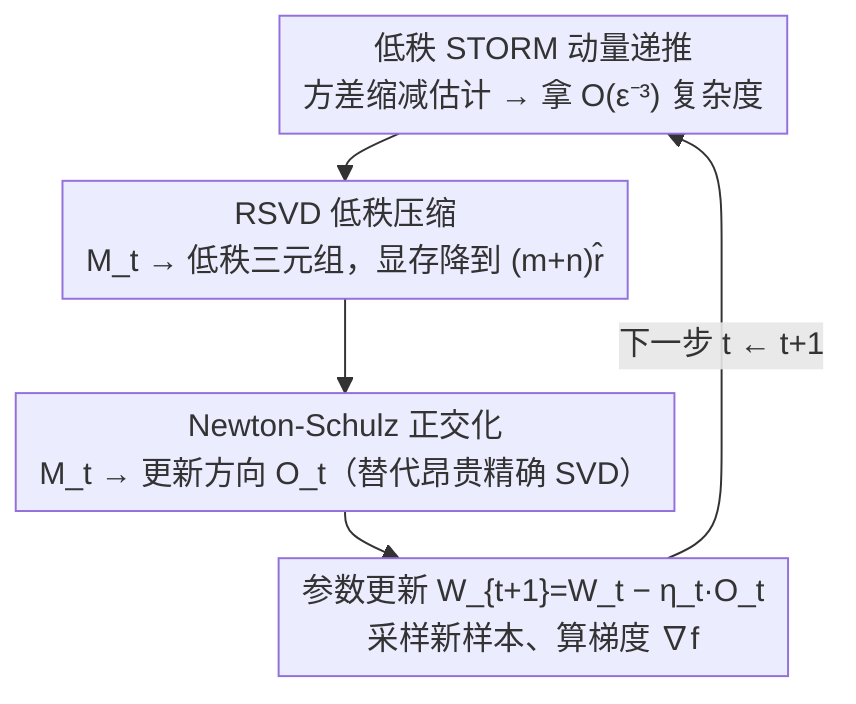

# LiMuon: Light and Fast Muon Optimizer for Large Models

**会议**: ICML 2026  
**arXiv**: [2509.14562](https://arxiv.org/abs/2509.14562)  
**代码**: 待确认  
**领域**: 大模型优化器 / 方差缩减 / 随机奇异值分解  
**关键词**: Muon、STORM 方差缩减、随机 SVD、低秩动量、广义光滑、Newton-Schulz

## 一句话总结
LiMuon 把 STORM 风格的动量方差缩减和随机 SVD（RSVD）一起塞进 Muon 优化器，把矩阵参数的动量从 $m \times n$ 压成 $(m+n)\hat{r}$、同时把求 $\epsilon$-稳态点的 SFO 复杂度从 $\mathcal{O}(\epsilon^{-4})$ 降到 $\mathcal{O}(\epsilon^{-3})$，在 Mamba-130M / Qwen2.5-0.5B / ViT 上同时取得更低 perplexity / 更高 accuracy 和更小显存。

## 研究背景与动机

**领域现状**：大模型主流仍是 Adam/AdamW，但近年专门利用「参数是矩阵 / 张量」结构的优化器（Shampoo、Muon）显示出更高的样本效率潜力。Muon（Jordan et al., 2024）把动量 $B_t = \mu B_{t-1} + G_t$ 做正交化后再下降——等价于对动量做 SVD $B_t = U \Sigma V^\top$ 然后用 $O_t = U V^\top$ 作为更新方向，实战上常用 Newton-Schulz 多项式迭代近似，已经在多种 LLM 上做出竞争力。

**现有痛点**：现有 Muon 系工作（Shen 2025、SCG、Gluon、GGNC、Muon++、SUMO 等）有一条统一短板——要么 **样本复杂度还是 $\mathcal{O}(\epsilon^{-4})$**（SCG、Gluon、GGNC、SUMO），要么 **状态显存仍是满秩 $mn$**（Shen、Muon++）。只有 Muon++（Sfyraki & Wang 2025）通过 STORM 把复杂度降到 $\mathcal{O}(\epsilon^{-3})$，但代价是必须额外存 $mn$ 的方差缩减动量并依赖梯度裁剪。在 $m, n$ 都是几千的现代 LLM 层里，$mn$ 的 optimizer state 已经是显存大头。

**核心矛盾**：「降样本复杂度」依赖 STORM 这种基于 $M_{t-1}$ 的递推方差估计，结构上要求保留前一步的全梯度信息——这天然和「降显存」冲突；而 SUMO 用子空间投影压显存，但要求目标函数有界这种比较强的假设，且复杂度仍是 $\mathcal{O}(\epsilon^{-4})$。

**本文目标**：要找到一个 **同时** 把状态显存压到 $(m+n)\hat{r}$ 且把 SFO 复杂度降到 $\mathcal{O}(\epsilon^{-3})$ 的 Muon 变体，并且在更弱的 $(L_0, L_1)$ 广义光滑条件下也成立、对 Newton-Schulz 近似版本也成立。

**切入角度**：作者注意到 STORM 估计里被存的那块 $M_t$ 本身就是带噪动量，理论上它的「重要方向」远少于 $\min(m,n)$；那么可以只把它的低秩近似 $\hat{M}_t = \hat{U}_t \hat{S}_t \hat{V}_t^\top$（用 Halko 等的随机 SVD 在 $\hat{r} + s$ 列上做投影 + QR）拿来递推，存的就只是三块小矩阵。

**核心 idea**：用 **「STORM 递推 + RSVD 低秩压缩」** 这一对组合替换 Muon 的原始动量，理论上证明低秩近似引入的偏差不会拖垮收敛阶、实战上同时省显存又涨指标。

## 方法详解

### 整体框架
LiMuon 沿用 Muon 的两段式：每步先对一个动量代理 $M_t$ 做（近似）正交化得到方向 $O_t$，再用 $W_{t+1} = W_t - \eta_t O_t$ 更新参数。差异全在动量代理本身——Muon 用 EMA 动量，Muon++ 用全秩 STORM 估计，LiMuon 用 **低秩 STORM** 估计。论文给两种选项：Option#1 还存全秩 $M_t$（不省显存、做理论对照），Option#2 存 $\hat{M}_t$ 的低秩三元组（实操推荐），并各自给了 Exact-SVD 和 Newton-Schulz 两套算法。下图是 LiMuon 一步迭代里三件事的分工（顺序对应下面三个关键设计）：

### 关键设计

**1. STORM 方差缩减动量：把求 $\epsilon$-稳态点的样本复杂度从 $\mathcal{O}(\epsilon^{-4})$ 降到 $\mathcal{O}(\epsilon^{-3})$**

Muon 原版用 EMA 动量 $B_t=\mu B_{t-1}+G_t$，每步只吃一个随机梯度，方差大、收敛慢（$\mathcal{O}(\epsilon^{-4})$）。LiMuon 把动量代理换成 STORM 式的递推方差缩减估计（Algorithm 1 第 7 行）：

$$M_{t+1} = \nabla f(W_{t+1}; \xi_{t+1}) + (1 - \beta_{t+1})\big(M_t - \nabla f(W_t; \xi_{t+1})\big)$$

括号里的 $M_t-\nabla f(W_t;\xi_{t+1})$ 用同一批样本 $\xi_{t+1}$ 在前后两步上的梯度差去"校正"上一步动量，把估计方差随迭代压下去——这正是复杂度从 $\mathcal{O}(\epsilon^{-4})$ 推到 $\mathcal{O}(\epsilon^{-3})$ 的来源，且 batch size 只需 1。代价是这个递推结构必须保留上一步的动量 $M_t$：若像 Option#1 那样原样存满秩 $M_t\in\mathbb{R}^{m\times n}$，复杂度是降了、显存却一点没省（这也正是 Muon++ 的短板）。降复杂度和降显存的矛盾就卡在这里，交给设计 2 化解。

**2. RSVD 低秩压缩：把跨步保留的动量状态从满秩 $mn$ 降到 $(m+n)\hat{r}$**

作者的关键观察是：被存的那块 $M_t$ 本身就是带噪动量，"重要方向"远少于 $\min(m,n)$，没必要存满秩、留它的低秩近似就够。Option#2（Algorithm 1 第 8–9 行）用随机 SVD（RSVD，Algorithm 2）把 $M_t$ 压成三元组：抽高斯随机矩阵 $\Omega\in\mathbb{R}^{n\times(\hat{r}+s)}$，算 $Y=M_t\Omega$ 并 QR 分解 $Y=QR$，在小矩阵 $B=Q^\top M_t$ 上做精确 SVD 得 $(\tilde{U},\Sigma,V)$、还原 $U=Q\tilde{U}$，其中 $s\ge 2$ 是 oversampling 用来稳精度。得到 $\hat{M}_t=\hat{U}_t\hat{S}_t\hat{V}_t^\top$ 后，**跨步只存** $\hat{U}_t\in\mathbb{R}^{m\times\hat{r}}$、$\hat{S}_t\in\mathbb{R}^{\hat{r}\times\hat{r}}$、$\hat{V}_t\in\mathbb{R}^{n\times\hat{r}}$ 三块，$m\hat{r}+n\hat{r}+\hat{r}^2\ll mn$。再把这个低秩近似回代进 STORM 递推（第 9 行用 $\hat{M}_t$ 替换第 7 行的 $M_t$）：

$$M_{t+1} = \nabla f(W_{t+1}; \xi_{t+1}) + (1 - \beta_{t+1})\big(\hat{M}_t - \nabla f(W_t; \xi_{t+1})\big)$$

这样状态显存被推到和 SUMO 同一档 $(m+n)\hat{r}$，又保住了 STORM 的 $\mathcal{O}(\epsilon^{-3})$。注意 RSVD 这一步是专门用来**压缩动量状态**的（不是用来做正交化——正交化由设计 3 的精确 SVD / Newton-Schulz 负责），正是它绕开了"方差缩减必须存满秩"的显存爆点；论文进一步证明这个低秩近似引入的偏差不会拖垮收敛阶。

**3. Newton-Schulz 正交化版 + 广义光滑收敛：把理论保证接到实际部署最常用的近似上**

拿到动量 $M_t$ 后还要把它正交化成更新方向 $O_t$。Algorithm 1 用精确 SVD（$O_t=U_tV_t^\top$）做理论对照，但精确 SVD 在几千维的矩阵层上每步都跑代价感人，工业界普遍改用 Newton-Schulz 多项式迭代近似。Algorithm 3 把正交化换成 NS 迭代 $X_j = p_\kappa(X_{j-1}X_{j-1}^\top)X_{j-1}$（默认 $p_2(z)=3.4445-4.7750z+2.0315z^2$，跑 $q$ 次），并证明在 polar 近似误差 $\varepsilon_q\in(0,1)$、$\chi_q=1/(1-\varepsilon_q)$ 下，LiMuon-NS 复杂度是 $\mathcal{O}(\chi_q^3\epsilon^{-3})$，严格优于 Kim & Oh (2026) Muon-NS 的 $\mathcal{O}(\chi_q^4\epsilon^{-4})$。同时全部收敛证明都建立在比 Lipschitz 弱得多的 $(L_0,L_1)$ 广义光滑 $\|\nabla F(W)-\nabla F(W')\|_F^2\le(L_0^2+L_1^2\|\nabla F(W)\|_F^2)\|W-W'\|_F^2$ 之上，更贴合 LLM 训练实际，把 NS 近似从"工程 hack"升格成可证明对象；且全程不依赖梯度裁剪，比 Muon++ 少一个超参。

### 损失函数 / 训练策略
目标是非凸随机优化 $\min_{W \in \mathbb{R}^{m \times n}} \mathbb{E}_{\xi \sim \mathcal{D}}[f(W; \xi)]$，停止判据是 $\epsilon$-Frobenius / 核范数稳态点。超参主要是步长 $\eta_t$、动量系数 $\beta_t$、目标秩 $\hat{r}$、RSVD oversampling $s \ge 2$、NS 迭代次数 $q$。Theorem 4.7 等给出 $\eta = \mathcal{O}(T^{-2/3}), \beta = \mathcal{O}(T^{-2/3})$ 下平均梯度核范数 $\le \mathcal{O}(T^{-1/3})$，回代即 $T = \mathcal{O}(\epsilon^{-3})$。值得注意的是 LiMuon **不依赖梯度裁剪**，少一个 Muon++ 的可调参数。

## 实验关键数据

### 主实验
全部在 NVIDIA A100-SXM4-80GB 上，对照组覆盖 Adam / AdamW / Lion / SUMO / Muon / Muon++。

| 模型 / 数据集 | 优化器 | 显存 (GB) | 关键指标 | 备注 |
|---------------|--------|-----------|----------|------|
| Mamba-130M / WikiText-103 | AdamW | 22.92 | val ppl 266.43 | baseline |
| (5k 步, bs=64, seq=256) | Muon | 22.20 | val ppl 71.27 | 矩阵正交化已大幅改进 |
|  | Muon++ | 22.35 | val ppl 56.79 | STORM 方差缩减 |
|  | **LiMuon (rank=8)** | **20.25** | val ppl 62.23 | 显存少 2 GB 仍打 Muon++ 同档 |
|  | **LiMuon (full)** | 22.80 | **val ppl 47.78** | 同档显存下 ppl 最低 |
| Qwen2.5-0.5B / MiniPile | Muon | 54.14 | val ppl 67.60 | – |
| (2k 步, bs=16, seq=1024) | Muon++ | 54.30 | val ppl 82.26 | STORM 在大模型反而吃亏 |
|  | **LiMuon (rank=16)** | 54.21 | val ppl **46.77** | 显存持平、ppl 砍掉一半 |
|  | **LiMuon (full)** | 55.15 | val ppl **40.83** | 全规模最优 |
| ViT / Tiny-ImageNet | Muon | 5.50 | val top-1 47.87% | – |
| (10k 步, bs=128) | SUMO | 5.31 | val top-1 44.23% | 子空间法 |
|  | **LiMuon (rank=8)** | 5.28 | val top-1 46.75% | 比 SUMO 更省也更准 |
|  | **LiMuon (full)** | 5.53 | val top-1 **48.04%** | 同档最高 |

### 消融 / 复杂度对比

| 算法 | SFO 复杂度 | 状态显存 | 广义光滑 | NS 兼容 |
|------|-----------|----------|----------|---------|
| Muon (Shen 2025) | $\mathcal{O}(\epsilon^{-4})$ | $mn$ | ✗ | – |
| Muon++ | $\mathcal{O}(\epsilon^{-3})$ | $mn$ | ✗ | – |
| SUMO | $\mathcal{O}(\epsilon^{-4})$ | $(m+n)\hat{r}$ | ✗ | – |
| Gluon / GGNC | $\mathcal{O}(\epsilon^{-4})$ | $mn$ | ✓ | – |
| Muon-NS (Kim & Oh 2026) | $\mathcal{O}(\chi_q^4 \epsilon^{-4})$ | $mn$ | – | ✓ |
| **LiMuon (Exact SVD)** | $\mathcal{O}(\epsilon^{-3})$ | $(m+n)\hat{r}$ | ✓ | – |
| **LiMuon (NS)** | $\mathcal{O}(\chi_q^3 \epsilon^{-3})$ | $(m+n)\hat{r}$ | ✓ | ✓ |

### 关键发现
- **在 Qwen2.5-0.5B 上 Muon++ 反而比 Muon 差**（val ppl 82.26 vs 67.60），暗示 Muon++ 那种全秩 STORM 在模型放大后并不稳定；而 LiMuon 的低秩动量在同样设定下大幅领先，说明"压一压反而稳"。
- **rank=8 / 16 通常就能逼近 full rank**：在 Mamba、ViT 上 rank=8 已经追平 Muon++、rank=16 反超；这意味着 $\hat{r}$ 不需要调得太重就能拿到大头收益。
- **不需要梯度裁剪**：和 Muon++ 比少一个超参，工程上更友好。

## 亮点与洞察
- **首次同时拿下「更低复杂度 $\times$ 更低显存」**——之前的工作要么 Muon++ 走复杂度路线、要么 SUMO 走显存路线，LiMuon 用 RSVD 把这两件事缝在一起，且不靠"目标函数有界"这种强假设。
- **把 Newton-Schulz 误差 $\chi_q$ 显式写进复杂度**，把 NS 近似从"工程 hack"升格为可证明对象，这对实际部署的工程师是一次理论补全。
- **低秩动量并不"伤"性能**：在 LLM 实测里 rank=8/16 就追平甚至反超 full-rank，给一个直觉证据——优化器动量本身就是低有效秩的对象。

## 局限与展望
- 实验规模仍偏中等（Mamba-130M、Qwen2.5-0.5B、ViT-22M），千亿参数级 LLM 的真实节约还需要再验证；尤其 Qwen2.5-0.5B 上 Muon++ 反常这件事提示更大模型下不同 baseline 的稳定性差异可能更大。
- 每步要做一次 RSVD（即便代价小）也会增加 wall-clock；论文 Table 5 给了 ViT 单步时间 baseline 对比但没把更大模型上的 NS-only vs LiMuon-NS 端到端时间表全量列出。
- 目标秩 $\hat{r}$ 是手工设的，自适应 rank（随训练阶段或层 spectrum 调整）是显然的下一步。
- 现有理论仍假设无偏随机梯度 + 有界方差，对带噪 LR schedule、warmup、weight decay 的耦合分析没覆盖。

## 相关工作与启发
- **vs Muon++（Sfyraki & Wang 2025）**：同样走 STORM 路线拿 $\mathcal{O}(\epsilon^{-3})$，但 Muon++ 要存全秩动量 + 依赖裁剪；LiMuon 用低秩动量直接把显存和裁剪需求一并解决。
- **vs SUMO（Refael 等 2025）**：同样压到 $(m+n)\hat{r}$ 显存，但 SUMO 仍是 $\mathcal{O}(\epsilon^{-4})$ 且依赖 $F$ 有界；LiMuon 复杂度更优、假设更弱。
- **vs Gluon / GGNC**：那条线侧重在 $(L_0, L_1)$ 广义光滑下分析 Muon，本文承袭这个分析框架但补上了方差缩减 + 低秩双重升级。
- **vs Shampoo / KFAC 这类二阶法**：思路完全不同——二阶法压预条件矩阵的秩，LiMuon 压动量的秩；两者可能正交可叠加，值得探索。

## 评分
- 新颖性: ⭐⭐⭐⭐ 把 STORM + RSVD 缝进 Muon 是清晰的组合创新，"低秩动量"这一观察对 Muon 系是首次系统化，技术上不算激进但是对的洞察。
- 实验充分度: ⭐⭐⭐ Mamba/Qwen/ViT 三种架构 + 多 rank 消融到位，但缺更大模型规模、缺更详细的训练时间剖析；理论表格清楚但部分实验细节（NS-only baseline 在大模型下）略欠。
- 写作质量: ⭐⭐⭐⭐ 算法、定理、表格分明，假设和限制都明确，少见的严谨；表 1 的复杂度位图是这个领域少有的把"前置工作 + 本文卖点"一图说清的范例。
- 价值: ⭐⭐⭐⭐ 大模型训练里 optimizer state 是显存大头，"复杂度更优 + 状态更省 + 不需裁剪"是部署侧实打实的收益，影响面会大。

<!-- RELATED:START -->

## 相关论文

- [\[CVPR 2026\] DP-FedAdamW: An Efficient Optimizer for Differentially Private Federated Large Models](../../CVPR2026/optimization/dp-fedadamw_an_efficient_optimizer_for_differentially_private_federated_large_mo.md)
- [\[ICML 2026\] The Implicit Bias of Adam and Muon on Smooth Homogeneous Neural Networks](the_implicit_bias_of_adam_and_muon_on_smooth_homogeneous_neural_networks.md)
- [\[AAAI 2026\] Pareto-Grid-Guided Large Language Models for Fast and High-Quality Heuristics Design in Multi-Objective Combinatorial Optimization](../../AAAI2026/optimization/pareto-grid-guided_large_language_models_for_fast_and_high-quality_heuristics_de.md)
- [\[ICML 2026\] Memory-Efficient LLM Pretraining via Minimalist Optimizer Design](memory-efficient_llm_pretraining_via_minimalist_optimizer_design.md)
- [\[ICML 2026\] Learning a Zeroth-Order Optimizer for Fine-Tuning LLMs](learning_a_zeroth-order_optimizer_for_fine-tuning_llms.md)

<!-- RELATED:END -->
