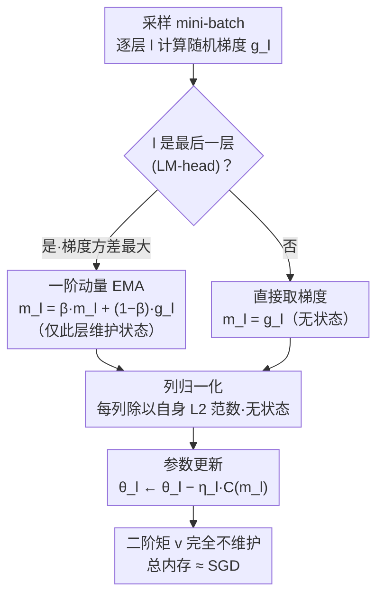

# Memory-Efficient LLM Pretraining via Minimalist Optimizer Design

**会议**: ICML 2026  
**arXiv**: [2506.16659](https://arxiv.org/abs/2506.16659)  
**代码**: 有（论文末尾"Code is available at this link"）  
**领域**: LLM 优化器 / 内存高效预训练 / Adam 替代  
**关键词**: 列归一化、最后一层动量、SCALE、内存高效、SGD vs Adam  

## 一句话总结
本文用"自底向上拆解 Adam"的方式找出真正必须的两个组件——逐列梯度归一化 + 只在最后一层加一阶动量——把它们组合成 SCALE 优化器，用接近 SGD 的内存 (LLaMA 7B 上 13.74 GB) 达到了 Adam 级甚至超越 Muon/APOLLO 的预训练困惑度。

## 研究背景与动机

**领域现状**：Adam 是大模型预训练的事实默认优化器，但它要为每个参数维护一阶矩 $m^t$ 和二阶矩 $v^t$ 两个状态，总内存约为 SGD 的 3 倍——在 7B 模型上 Adam 状态占 40 GB。为节省这部分内存出现了三条路线：(i) 压缩状态——Adafactor、SM3、CAME、GaLore（低秩投影）、Fira、APOLLO、APOLLO-Mini（rank-1）；(ii) 彻底去掉部分状态——Muon（只留一阶动量 + Newton-Schulz 正交化）、Scion、SWAN、SGD-SaI；(iii) 块级处理。这些方法各自引入了不同的归一化方案、动量变体、低秩近似，但缺乏一个"哪个组件才是关键"的系统拆解。

**现有痛点**：(1) Vanilla SGD 在 LLM 上完全不收敛——Figure 2 验证 LLaMA 130M 上 SGD 困惑度根本下不来；(2) 内存高效方法为了稳定通常对第一层 (embedding) 和最后一层 (LM-head) 单独跑 Adam，60M 模型时这两层占网络 50% 参数，让"内存节省"在中小模型上几乎抵消；(3) 各种归一化、各种动量被随意混搭，到底哪一个真正不可或缺没人讲清楚。

**核心矛盾**："状态压缩追求保留 Adam 的全部行为"和"内存节省追求只保留最必要的组件"之间存在根本张力——前者注定有压缩损失或额外计算，后者必须先知道哪些组件可以去掉。

**本文目标**：用"自底向上 (bottom-up) 极简主义"方法系统地回答：要把 vanilla SGD 拉到 Adam 水平，最少需要哪些修改？目标是同时回答 (a) 用哪种梯度归一化（奇异值 / 列 / 行 / sign），(b) 一阶动量是否每层都需要，(c) 二阶动量到底是不是必须。

**切入角度**：把 Adam 拆成两个正交组件——"归一化因子 $v^t$"和"指数滑动平均 (EMA)"——分别看每一个能贡献多少。归一化不需要任何状态而 EMA 必然要存动量，所以先用归一化把 SGD 拉起来，再尽量少地往里加 EMA。

**核心 idea**：一个对 LLM 预训练足够好的优化器，只需要做两件事——把梯度按"输出维度"列归一化（无状态、近常数时间）+ 只给最后一层加一阶动量（这一层梯度方差最大）；其他层完全裸跑 SGD，二阶矩根本没必要。

## 方法详解

### 整体框架

SCALE (Stochastic Column-normalized Last-layer momEntum) 的设计来自一条三步实证链路。第一步把 SGD 加各种归一化（奇异值 NS、列、行、sign）单独跑 LLaMA 60M/130M/350M，发现奇异值与列归一化能把 SGD 拉到接近 Adam，而行归一化和 sign 归一化掉得很厉害；通过分析 LM-head 梯度分布发现行归一化在 LM-head 上会出现绝对值高达 150 的极端值，破坏训练，所以淘汰行归一化。第二步对比"加哪一层的动量收益最大"——经验性测出最后一层 (LM-head) 梯度方差最大，并用一个多层 SGD-M 的收敛定理证明"动量该加在方差大的层上"。第三步组合：列归一化（每层、无状态、近常数时间）+ 仅最后一层一阶动量（占总参数极小比例），最终在 LLaMA 60M-7B 上稳定超过 GaLore / Fira / APOLLO / APOLLO-Mini，并匹配 Muon / Adam。

伪流程：每步 forward / backward 后对每层 $l$ 做——计算 mini-batch 梯度 $g_l^t$；若 $l$ 为最后一层则 $m_l^t=\beta\,m_l^{t-1}+(1-\beta)g_l^t$，否则 $m_l^t=g_l^t$（无状态）；最后 $\theta_l^{t+1}=\theta_l^t-\eta_l\,\mathcal{C}(m_l^t)$，其中 $\mathcal{C}$ 是列归一化算子。

### 关键设计

**1. 列归一化作为唯一的归一化：性能够好且计算几乎免费**

四种归一化（奇异值、列、行、sign）来自不同矩阵范数下的最速下降方向，本文先把它们各跑一遍 LLaMA 60M/130M/350M：sign 困惑度 54.36/40.42/27.95、行归一化 79.27/37.67/21.63 都明显差于 Adam（30.05/23.13/18.77），而列归一化 39.89/28.85/20.38 与奇异值 NS 归一化 34.15/25.25/18.73 都接近 Adam。再看成本——$d=4096$ 时奇异值 SVD 要 1958.66 ms、Newton-Schulz 近似 14.41 ms，列归一化只要 0.17 ms。最有意思的是"为什么列优于行"：画 LM-head 梯度直方图发现，行归一化后某些列梯度绝对值飙到 150（LM-head 输入维度 $d_\text{model}$ 远小于词表 $|V|$，row 操作把 token 频次差异放大），训练直接发散；列归一化分布平滑、训练稳定。所以列归一化的操作就是把每个权重矩阵 $G\in\mathbb{R}^{d_{in}\times d_{out}}$ 的每列除以自己的 $\ell_2$ 范数，无需任何状态。它同时占住"性能足够好"和"计算几乎免费"两个最优点，是这套自底向上设计的最佳起点。

**2. 仅在最后一层施加一阶动量：把动量加在方差最大的那一层**

动量是 Adam 内存开销的唯一来源（归一化不需要状态），所以问题变成"动量到底要存在哪几层"。作者用大 batch（512）近似真实梯度、小 batch（32）当随机梯度，测出训练全程"最后一层梯度方差始终最大"（Figure 4a），第一层 embedding 次之，其余层方差都很小。Theorem 2.1 进一步给出多层 SGD-M 的收敛率，其方差项形如

$$\sum_l\left(\frac{1-\beta_l}{1+\beta_l}\cdot\frac{L\sqrt\gamma}{4\sqrt T}+\dots+\frac{1-\beta_l}{\beta_l^3}\cdot\frac{\gamma^2}{4LT}\right)\frac{\sigma_l^2}{\delta^2}$$

每层带自己的 $\beta_l$ 和方差 $\sigma_l^2$，推论是"只在方差大的层取大 $\beta$、其余层取 $\beta=0$"既能恢复收敛又省内存。于是只有 LM-head 维护 $m_L^t=\beta m_L^{t-1}+(1-\beta)g_L^t$，这一层在 LLaMA 7B 上只占约 2% 参数，动量内存可忽略。实验印证（Table 3）：60M/130M/350M 上得 30.81/22.57/16.32，对 Adam 几乎打平甚至在 350M 反超 2.45 个困惑度；Figure 4b 还显示给最后一层加动量后第一层方差也跟着下降——在最噪的源头做平滑，下游层都受益。

**3. 极简组合 SCALE：列归一化 + 仅末层动量，二阶矩彻底丢掉**

两个组件拼成完整优化器：每步对每层独立处理——最后一层先做 EMA 再列归一化更新，其他层直接列归一化梯度更新，完全不维护二阶矩 $v^t$、也不维护中间层一阶矩。相对 Adam 只改几行代码，相对 vanilla SGD 几乎不加内存（7B 只多 2%、1B 只多 10%）。和 SWAN 对比尤其能说明问题——SWAN 同时用行归一化 + 奇异值归一化两种归一化、且对 LM-head 单跑 Adam，SCALE 证明这是冗余设计，一种归一化就够、而且只需列这一种；和 Scion 对比则是 Scion 全层都加动量，SCALE 表明只在最后一层加就够。LLaMA 7B 上 SCALE 总内存 13.74 GB（vs Adam 40.43、Muon 26.95、APOLLO 16.14、APOLLO-Mini 14.53），落在 Pareto 前沿最左下角，困惑度 12.59 也超过 Muon 12.72、APOLLO 13.02、APOLLO-Mini 13.09。这是自底向上极简主义的天然终点：既然实验和理论都表明只需这两件事，就不该再加任何东西。

### 损失函数 / 训练策略

LLaMA 60M-1B 在 C4 上预训练至 Chinchilla 最优 token 数（1.4B-20B token）；7B 模型训 19.7B token (150K 步) 和 100B token 延长稳定性测试，跑在 8 张 NVIDIA H200 141G 上。超参跟随 Zhao et al. (2024) (GaLore) 的设置。

## 实验关键数据

### 主实验

| 模型 | Adam 困惑度/内存 | Muon | GaLore | APOLLO-Mini | **SCALE (本文)** |
|------|------------------|------|--------|-------------|-----------------|
| 60M  | 30.05 / 0.35G | 28.86 / 0.23G | 34.58 / 0.28G | 31.85 / 0.25G | **30.81 / 0.15G** |
| 130M | 23.13 / 0.81G | 22.20 / 0.54G | 25.31 / 0.61G | 23.63 / 0.46G | **22.57 / 0.32G** |
| 350M | 18.77 / 2.21G | 16.70 / 1.47G | 19.37 / 1.59G | 17.11 / 1.00G | **16.32 / 0.80G** |
| 1B   | 15.79 / 8.04G | 13.67 / 5.36G | 15.05 / 4.76G | 13.48 / 3.20G | **13.49 / 2.81G** |
| 7B   | -      | 12.72 / 26.95G | -     | 13.09 / 14.53G  | **12.59 / 13.74G** |

SCALE 在 60M-7B 全尺度上要么直接夺 SOTA（350M/7B），要么以 35-65% 的内存逼平最强基线。

### 消融实验

| 配置 | 60M / 130M / 350M 困惑度 | 说明 |
|------|--------------------------|------|
| SGD + sign 归一化 | 54.36 / 40.42 / 27.95 | sign 太粗，明显劣于 Adam |
| SGD + 行归一化 | 79.27 / 37.67 / 21.63 | LM-head 梯度被放大到 150 量级、训练发散 |
| SGD + 奇异值 (NS) | 34.15 / 25.25 / 18.73 | 性能 OK 但 4096 维上 14.41 ms vs 列 0.17 ms |
| SGD + **列归一化** | 39.89 / 28.85 / 20.38 | 性能 + 速度的最佳折中 |
| + 仅末层动量 (SCALE) | 30.81 / 22.57 / 16.32 | 一举追平 / 超越 Adam |
| Adam (基线) | 30.05 / 23.13 / 18.77 | 全状态 Adam |

### 关键发现
- 最后一层是优化的"咽喉点"：LM-head 维度 $d_\text{model}\times |V|$，高频 token 对应的列梯度范数远超其他列，决定了归一化方向（列 > 行）和动量分配（必须在这一层）。
- 列归一化对所有层都"白嫖"：与 SWAN 用"中间层 SVD 归一化 + 首尾层 Adam"的复杂方案相比，列归一化全网通用、还能去掉那部分 Adam 开销。
- 二阶矩在 LLM 预训练里其实并非必要：SCALE 完全去掉 $v^t$ 仍能匹配 Adam，验证 Muon 等无二阶矩优化器的方向是对的，进一步指出连一阶矩都只需要保留一层。
- 列归一化后第一层方差也下降（Figure 4b）：说明最噪源头被动量稳定后误差不会向下游传播。

## 亮点与洞察
- **"自底向上"的方法论本身就是这篇论文最大的贡献**——不是再造一个新优化器，而是把 Adam 拆成最小可行组件，告诉社区"这里的复杂度大部分其实多余"。这种思路也可以迁移到归一化层（LayerNorm vs RMSNorm vs DyT）、attention 实现等任何被习惯性接受的组件上。
- **LM-head 梯度分布的可视化诊断**最具说服力——直接画直方图就能解释为什么行归一化训练崩、列归一化稳，把"经验性选择"升级为"机制性理解"，是后续 LLM 优化器设计可以直接借用的诊断套路。
- **Theorem 2.1 给"按方差分层选动量"提供了理论凭据**：多层 SGD-M 收敛率自然写成"每层方差独立加权"的形式，告诉你优化器超参就该按层独立调，而不是全网共用一个 $\beta$。

## 局限与展望
- 模型规模封顶 7B、token 数封顶 100B，更大尺度 (70B+) 下的稳定性与吸引盆未验证。
- 7B 单 run 没跑多种子，统计显著性偏弱；与 Muon 仅差 0.13 困惑度。
- 没有跟最新 Muon 变体（Muon-Clip、Liu et al. 2025 的稳定版）以及 Scion 全套配方做并列对比。
- 列归一化的"列"对应"输出维度"——前提是把所有权重看成输入×输出矩阵，对非 attention 架构（如 Mamba、MoE expert weight）的迁移性需要重新讨论。
- 后训练（SFT/RL）阶段是否同样只需要末层动量，论文没给答案，是有价值的延伸方向。

## 相关工作与启发
- **vs GaLore/Fira/APOLLO**：他们都是"压缩 Adam"路线——投影到低秩子空间存动量；本文走"重新设计"路线——干脆不要二阶矩、动量只留一层，在内存与性能上一并超过它们。
- **vs Muon**：Muon 用全网一阶动量 + Newton-Schulz 正交化（计算贵且需要状态）；SCALE 用列归一化（计算几乎免费）+ 仅末层动量，内存只有 Muon 的 51%、困惑度更好。
- **vs SWAN**：SWAN 同时用行归一化 + 奇异值归一化、对首尾层用 Adam；SCALE 表明这一组合是冗余设计——单列归一化就够、且只需末层动量。
- **vs Scion**：Scion 探索层级归一化，所有层都加动量；本文进一步表明动量按方差分层就够，给"层级混合"思路加上选择性约束。
- **对未来优化器设计的启示**：每个新组件应先做"消融-取消"检验——能否在没有它的情况下达到同等性能。SCALE 给社区树立了一个"用 SGD 体量内存做出 Adam 性能"的强基线。

## 评分
- 新颖性: ⭐⭐⭐⭐ 没有发明全新组件，但"自底向上拆解 Adam"的思路 + LM-head 列归一化诊断都很犀利
- 实验充分度: ⭐⭐⭐⭐ 60M-7B 全尺度 + 多种归一化 + 层级方差分析 + 100B token 稳定性测试，唯一缺多种子
- 写作质量: ⭐⭐⭐⭐⭐ 动机 → 拆解 → 实验 → 理论 → 算法的逻辑链异常清晰，是优秀的方法论范本
- 价值: ⭐⭐⭐⭐⭐ 给社区提供"内存 ≈ SGD、性能 ≈ Adam"的强基线，会成为后续 LLM 优化器研究的默认对照

<!-- RELATED:START -->

## 相关论文

- [\[ICCV 2025\] Memory-Efficient 4-bit Preconditioned Stochastic Optimization](../../ICCV2025/optimization/memory-efficient_4-bit_preconditioned_stochastic_optimization.md)
- [\[ICML 2026\] Learning a Zeroth-Order Optimizer for Fine-Tuning LLMs](learning_a_zeroth-order_optimizer_for_fine-tuning_llms.md)
- [\[ICML 2026\] LiMuon: Light and Fast Muon Optimizer for Large Models](limuon_light_and_fast_muon_optimizer_for_large_models.md)
- [\[ICML 2026\] Enhancing LLM Training via Spectral Clipping](enhancing_llm_training_via_spectral_clipping.md)
- [\[CVPR 2026\] DP-FedAdamW: An Efficient Optimizer for Differentially Private Federated Large Models](../../CVPR2026/optimization/dp-fedadamw_an_efficient_optimizer_for_differentially_private_federated_large_mo.md)

<!-- RELATED:END -->
