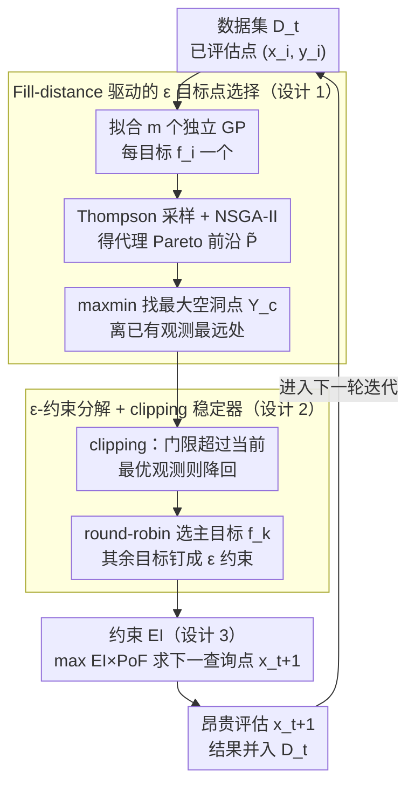

# Multi-Objective Bayesian Optimization via Adaptive ε-Constraints Decomposition

**会议**: ICML 2026  
**arXiv**: [2604.15959](https://arxiv.org/abs/2604.15959)  
**代码**: https://github.com/YangYaohong1/STAGE-BO  
**领域**: 贝叶斯优化 / 多目标优化  
**关键词**: 多目标贝叶斯优化, ε-约束法, Pareto 覆盖度, fill distance, Thompson 采样

## 一句话总结
STAGE-BO 把 MOBO 重写成一串"由 fill distance 自适应选门限"的 ε-约束单目标贝叶斯子问题，用 cEI 求解，从而在不算 hypervolume 的前提下取得均匀的 Pareto 前沿覆盖，并天然兼容硬约束与用户偏好。

## 研究背景与动机

**领域现状**：多目标贝叶斯优化（MOBO）的主流套路是为每个目标拟一个 GP，再用某个采集函数指导下一次昂贵的黑箱评估。绝大多数采集函数都围绕 hypervolume (HV) 改进设计，例如 qEHVI、JESMO、TSEMO。

**现有痛点**：把所有筹码押在 HV 上有两个明显代价。其一，HV 的精确计算关于目标数 $m$ 指数增长，$m\ge 4$ 时已经接近计算不可行；其二，Auger 等人的理论指出 HV 最大化的渐近点密度正比于 Pareto 前沿负斜率的平方根 $\propto\sqrt{-F'(\mathbf{x})}$，导致解被堆在"膝盖"区域而稀疏地覆盖平坦区，IGD 比好方法差一个数量级。

**核心矛盾**：现有"加速覆盖"的方案要么仍然依赖 HV（DGEMO、PDBO、MOBO-OSD），要么走标量化路线（ParEGO、TS-TCH）。标量化中权重均匀分布并不等于 Pareto 前沿上点均匀分布，常常出现聚簇与几何空洞，本质矛盾在于"没有显式针对前沿几何缺口去采样"。

**本文目标**：希望得到一个 (i) 不需要 HV 计算、(ii) 能均匀覆盖前沿、(iii) 同一框架兼容硬约束与偏好的 MOBO 算法。

**切入角度**：作者回到经典 ε-约束法的一个老观察——任意 Pareto 最优点都可以通过"只优化某一个目标 + 对其余目标加 ≥ε 不等式约束"恢复（Haimes, 1971）。真正难的是怎么选 $\varepsilon$。如果选得"恰好填补前沿上最大的空洞"，那么覆盖问题就被自动解决。

**核心 idea**：在每一步用 Thompson 采样估计代理前沿 $\widetilde{\mathcal{P}}_{f}^{t}$，找到代理前沿上离当前观测 max-min 距离最大的点 $\mathbf{Y}_c$，把它的坐标当成 $\varepsilon$ 约束，再用 cEI 求解约束子问题——HV 完全不参与计算。

## 方法详解

### 整体框架
STAGE-BO 的一次迭代由四步组成，输入是已有数据集 $\mathcal{D}_t=\{(\mathbf{x}_i,\mathbf{y}_i)\}$，输出是下一次评估点 $\mathbf{x}_{t+1}$：

1. 用 $\mathcal{D}_t$ 拟合 $m$ 个独立的 GP，每个对应一个目标 $f_i$；
2. 通过 Thompson 采样得到一条联合采样路径 $\tilde{F}^t(\mathbf{x})$，然后用 NSGA-II 在采样路径上求 Pareto 前沿 $\widetilde{\mathcal{P}}_{f}^{t}$；
3. 在代理前沿上挑选"距离已有观测最远的目标点"$\mathbf{Y}_c$，并按轮转策略 $k=t\bmod m+1$ 决定本轮主目标；
4. 把 $\mathbf{Y}_c$ 中除 $k$ 维之外的所有坐标作为 ε-约束门限，构造约束 BO 子问题，用 cEI 优化得到下一查询点。

整个过程没有 HV 计算，主要计算成本是 NSGA-II 在便宜的代理函数上的搜索。

### 关键设计

**1. Fill-distance 驱动的 ε 目标点选择：用前沿上"最大空洞"来决定下一步往哪填**

ε-约束法把"约束门限选在哪"留成了 50 年的悬案，而 STAGE-BO 的回答是：选在代理前沿上覆盖最差的那个位置。作者借用 Zhang et al. (2024) 的 fill distance 度量 $\text{FD}(\mathbf{Y}_t)=\max_{\mathbf{y}\in\mathcal{P}_f}\min_{\mathbf{y}'\in\mathbf{Y}_t}\|\mathbf{y}-\mathbf{y}'\|$，但把式中的真 Pareto 前沿换成 Thompson 采样得到的代理前沿，于是当前最该被填补的目标点就是

$$\mathbf{Y}_c=\arg\max_{\mathbf{y}'\in\widetilde{\mathcal{P}}_f^t}\min_{\mathbf{y}\in\mathbf{Y}_t}\|\mathbf{y}-\mathbf{y}'\|,$$

即几何意义上离已有观测最远、空洞最大的位置。文中定理进一步给出 $\text{IGD}(\mathbf{Y}^{\text{FD}})\le \text{FD}(\mathbf{Y}^{\text{FD}})$，把 FD 锚成 IGD 的上界，于是"最小化 FD"直接换来 IGD 保证。这一步之所以有效，是因为它把 HV 系列方法那种隐含的几何偏置（解被堆在膝盖区）翻成了一个显式目标——哪里覆盖差就往哪里采；而用 Thompson 采样路径而非后验均值，则是为了保留 GP 的不确定性，避免后验均值过于贪心、过早收死在已知区域。

**2. ε-约束分解 + clipping 稳定器：把多目标拆成一串单目标约束子问题，并防止可行域被掏空**

有了 $\mathbf{Y}_c$，多目标问题就被切成 $T$ 次单目标子问题：每轮只优化一个主目标 $f_k$，其余目标被门限 $\varepsilon_j=\widehat{\mathbf{Y}}_{c,j}$ 钉住，写成

$$\max_{\mathbf{x}\in\mathcal{X}} \; f_k(\mathbf{x})+s\sum_j f_j(\mathbf{x}) \quad \text{s.t.}\quad f_j(\mathbf{x})\ge \varepsilon_j,\; j\ne k,$$

其中标量化系数 $s\approx 10^{-3}$ 仅用来排除弱 Pareto 最优解。ε-约束的经典结论保证这种子问题的最优解必落在 Pareto 前沿上，主目标 $k$ 再用 round-robin 轮转，让每个目标都轮到被推动。真正的工程隐患是早期：数据稀疏时代理前沿可能给出一个比已观测最佳还激进的门限，导致可行域直接为空、整轮发散。clipping 就是补这个洞——一旦 $\mathbf{Y}_{c,j}\ge \max_t \mathbf{Y}_{t,j}$，就把 $\widehat{\mathbf{Y}}_{c,j}$ 降回当前最大观测值。消融显示它主要是数值稳定器：多数 benchmark 上"有/无 clipping"性能相当，少数任务因放松了可行域而额外受益。

**3. 约束 EI（cEI）采集函数 + 对约束/偏好的自然外推：同一个分解框架顺手吞下三种 setting**

每个子问题用约束 EI 求解，采集函数 $\alpha(\mathbf{x})=\text{EI}(\mathbf{x})\times\text{PoF}(\mathbf{x})$ 同时权衡改进量与可行概率：改进量取 $\text{EI}=\mathbb{E}[\max(0,\, f_k(\mathbf{x})+s\sum_{j\ne k} f_j(\mathbf{x})-f_k^*-s\sum_{j\ne k}f_j^*)]$，可行概率 $\text{PoF}(\mathbf{x})=\prod_{j\ne k}\Pr(f_j(\mathbf{x})\ge \widehat{\mathbf{Y}}_{c,j})$ 在独立 GP 假设下闭式可算。选 cEI 是因为它在约束 BO 里最成熟、解析最友好。更妙的是这套分解几乎不用改就能吃下别的 setting：遇到硬约束 $g_l(\mathbf{x})\ge 0$，只需把它们的可行概率乘进 PoF；遇到用户偏好 ROI $[a_i,b_i]$，则把"下界"和"上界"当成两个候选约束集、用 OR 形式写入子问题——ROI 过分激进时下界兜底，过分保守时上界驱动搜索去更好的区域。结果是无约束、约束、偏好三种 MOBO 共用一个框架，省掉了为每种 setting 单独造算法的负担。

### 损失函数 / 训练策略
STAGE-BO 不涉及神经网络训练，关键超参集中在两处：内层 NSGA-II 用默认设置在便宜的 GP 采样路径上跑；标量化项系数 $s\approx 10^{-3}$ 用于排除弱 Pareto 解。每轮的查询点完全由 cEI 优化决定，不依赖 HV 计算。

## 实验关键数据

### 主实验
作者在 6 个无约束、4 个约束、4 个偏好 benchmark 上对比 8 个 SOTA，并在 DP-SGD 隐私-效用真实任务上做了 hyperparameter 优化。所有结果按 10 次独立运行的均值+标准误差报告。这里只截取最具代表性的趋势。

| Benchmark 类型 | 代表任务 | 评估指标 | STAGE-BO vs 最强基线 |
|---|---|---|---|
| 无约束（合成） | ZDT1 ($d=10,m=2$) | IGD | 比 qEHVI 低约一个数量级，HV 与 qEHVI 持平 |
| 无约束（高维） | DTLZ7 ($d=6,m=5$, 不连续前沿) | IGD / HV | IGD 显著领先，HV 与 JESMO/MOBO-OSD 持平，且 qEHVI 因 $m\ge 4$ 算不动只能跑少量迭代 |
| 无约束（工程） | Water resource planning ($d=3,m=6$) | IGD | 在 $m=6$ 仍稳定收敛，HV-only 方法计算成本爆炸 |
| 带约束 | MW7 / Disc brake / Gear train / CONSTR | IGD | 一致优于 qEHVI、qParEGO、qPOTS、COMBOO |
| 偏好 ROI | ZDT3, DTLZ2, VehicleSafety, CarSideImpact | HV & IGD | 在 ROI 内 HV 与 IGD 都优于 TS-TCH 等 |
| 真实场景 | DP-SGD on Dutch ($d=5,m=2$) | HV | 全程最高 HV，展示隐私-效用 trade-off 上的实用性 |

### 消融实验
| 配置 | 关键观察 | 说明 |
|---|---|---|
| Full STAGE-BO | IGD/HV 最佳 | 完整版本：Thompson 采样路径 + FD 目标 + cEI |
| Posterior mean 代替 Thompson | 性能明显下降 | 后验均值过度贪心，抑制了探索所需的不确定性 |
| 关闭 clipping | 多数任务持平，少数变好 | clipping 主要起数值稳定作用 |
| 改变主目标选择策略 | 几乎无影响 | round-robin 不是关键，框架对策略不敏感 |
| 换成其他约束 BO acquisition | 仍可用 | 分解框架不依赖 cEI 本身 |

### 关键发现
- IGD 改进的来源是"显式找空洞"而非更强的代理模型——这与 HV 偏置的理论分析吻合：HV 系列方法在平坦区采样不足，IGD 差一个数量级。
- 当目标数 $m\ge 4$，HV 系列方法（尤其 qEHVI）因为 HV 计算开销基本失去可用性，而 STAGE-BO 因为不算 HV，时间复杂度对 $m$ 几乎线性。
- 偏好 setting 中"上界/下界 OR 约束"的设计很关键：当 ROI 过分激进（完全在真前沿之外）时，下界约束兜底；当 ROI 过于保守时，上界约束驱动搜索去更好的区域。

## 亮点与洞察
- 把 ε-约束法从"经典 MOO 教科书"重新带回 MOBO，并用 fill distance 解决了"$\varepsilon$ 怎么选"这个 50 年的老问题；这是一种"理论旧 idea + 现代不确定性度量"的优雅组合。
- 不算 HV 反而成了优势：既绕开了 HV 在高维下的计算诅咒，又规避了它的几何偏置——这种"少做一件事换来两个好处"的角度值得迁移到任何"指标驱动"算法的设计。
- 同一框架吞下"无约束 / 约束 / 偏好"三种 setting，只需要在 PoF 上追加因子或在子问题里追加 OR 约束，工程上极其经济，可直接复用到 cEI 兼容的任意约束 BO 框架。

## 局限与展望
- 算法严重依赖代理 Pareto 前沿的质量：当 GP 还没学好时，$\mathbf{Y}_c$ 可能选得很离谱，整轮被浪费在不可能区域。NSGA-II 在 $m>6$ 的 many-objective 场景会失效，作者建议换成 NSGA-III。
- Gap 检测基于当前观测点位置，对评估噪声敏感；噪声鲁棒的几何度量是明显的下一步。
- 子问题里的标量化项系数 $s$ 是个未充分讨论的超参——太小可能给弱 Pareto 解留口，太大会让 cEI 形变得偏向 sum-of-objectives。
- 偏好 setting 的 OR 约束让可行域不再是凸集，NSGA-II 在该几何上的搜索效率值得追踪。

## 相关工作与启发
- **vs qEHVI / TSEMO（HV-based）**：他们最大化 HV 改进，被 Auger 几何偏置咬死且 $m\ge 4$ 计算崩溃；STAGE-BO 完全绕开 HV，覆盖均匀且计算可扩展。
- **vs ParEGO / TS-TCH（scalarization）**：标量化用随机权重，权重均匀不等于解均匀；STAGE-BO 直接在目标空间几何上找空洞，从根上解决聚簇问题。
- **vs DGEMO / MOBO-OSD / PDBO（多样性增强）**：这些方法仍把 HV 作为最终选择信号或在输入空间度量多样性；STAGE-BO 在输出空间用 fill distance 度量多样性，与"我们关心的是 Pareto 前沿覆盖"这一目标精确对齐。
- **vs qPOTS / COMBOO（约束 MOBO）**：qPOTS 输入空间度量多样性，COMBOO 基于 UCB 的可行性早停；STAGE-BO 把硬约束作为 PoF 因子无缝插入，框架统一性更强。

## 评分
- 新颖性: ⭐⭐⭐⭐ 思路本身基于经典 ε-约束法，但与 fill distance 的结合，以及"用一个框架统一无约束/约束/偏好"的视角是新的。
- 实验充分度: ⭐⭐⭐⭐ 14 个 benchmark + DP-SGD 真实任务 + 多种消融，覆盖 $m$ 从 2 到 6。
- 写作质量: ⭐⭐⭐⭐ Theorem 4.2 给出 FD/IGD 关系作为理论锚点，方法、约束、偏好三节结构清晰。
- 价值: ⭐⭐⭐⭐ 对工程优化（材料、机器人、隐私 ML 调参）非常实用，开源代码进一步降低使用门槛。

<!-- RELATED:START -->

## 相关论文

- [\[ICML 2026\] Accelerated Multiple Wasserstein Gradient Flows for Multi-objective Distributional Optimization](accelerated_multiple_wasserstein_gradient_flows_for_multi-objective_distribution.md)
- [\[NeurIPS 2025\] MOBO-OSD: Batch Multi-Objective Bayesian Optimization via Orthogonal Search Directions](../../NeurIPS2025/optimization/mobo-osd_batch_multi-objective_bayesian_optimization_via_orthogonal_search_direc.md)
- [\[ICML 2026\] Bayesian Gated Non-Negative Contrastive Learning](bayesian_gated_non-negative_contrastive_learning.md)
- [\[AAAI 2026\] Pareto-Grid-Guided Large Language Models for Fast and High-Quality Heuristics Design in Multi-Objective Combinatorial Optimization](../../AAAI2026/optimization/pareto-grid-guided_large_language_models_for_fast_and_high-quality_heuristics_de.md)
- [\[ICML 2026\] Adaptive Estimation and Inference in Semi-parametric Heterogeneous Clustered Multitask Learning via Neyman Orthogonality](adaptive_estimation_and_inference_in_semi-parametric_heterogeneous_clustered_mul.md)

<!-- RELATED:END -->
