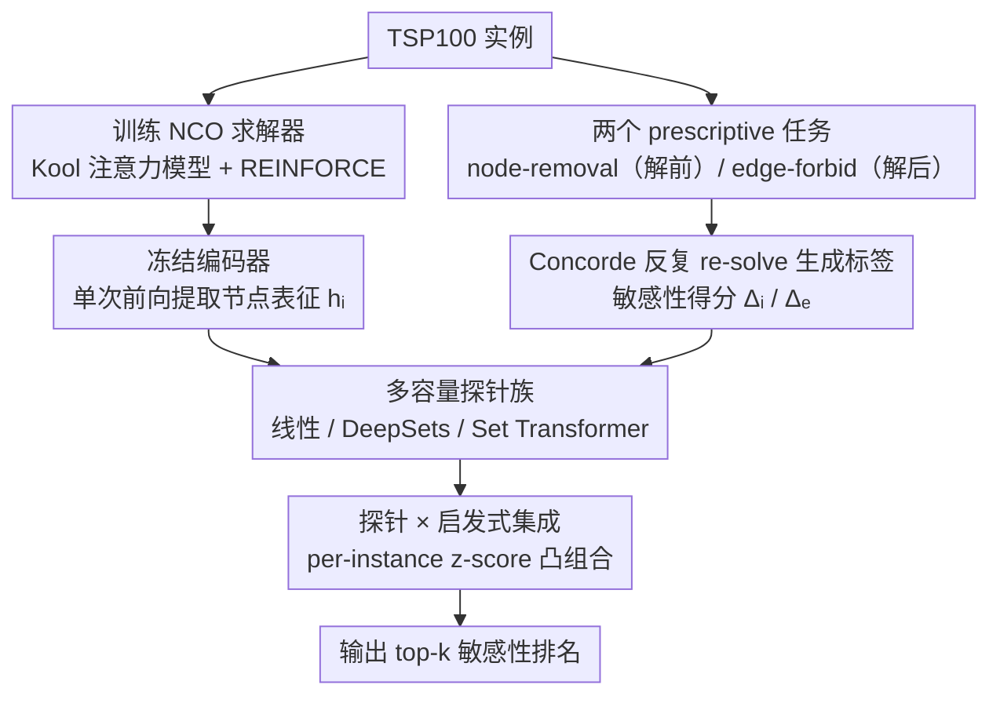

# Probing Neural TSP Representations for Prescriptive Decision Support

**会议**: ICML 2026  
**arXiv**: [2602.07216](https://arxiv.org/abs/2602.07216)  
**代码**: https://github.com/ReubenNarad/tsp_prescriptive_probe  
**领域**: 神经组合优化 / 表征探针 / 决策支持  
**关键词**: TSP, neural CO, probing, sensitivity analysis, transfer learning

## 一句话总结
作者把训练好的 TSP 神经求解器视作"可迁移编码器",用冻结表征 + 轻量探针预测两类昂贵的运筹敏感性查询(节点移除与边禁用),系统证明探针准确率随求解器质量单调提升,可以与传统启发式集成达到 SOTA。

## 研究背景与动机

**领域现状**:神经组合优化 (NCO) 已经能用注意力策略 + 强化学习训练出 TSP/VRP 等问题的端到端求解器(Pointer Network、Kool 2018、POMO 等),推理快、灵活,但相对 Concorde/LKH 这类经典精确/启发式求解器仍不够稳健,因此一直被定位为"替代求解器"。

**现有痛点**:几乎所有 NCO 评估都只看 tour cost / 最优性差距,把模型表征当成"副产物"丢掉了。这意味着即便求解器内部学到了对 logistics 极有价值的结构(如哪些节点是瓶颈、哪些边不可替代),也无人挖掘。

**核心矛盾**:实际物流决策不只是构造一个好 tour,更多是"what-if"查询——把哪个仓库摘掉对总长影响最大?哪条路段一旦封闭最致命?这些查询通过反复 re-solve 来回答昂贵到不可接受,而 NCO 求解器恰恰有可能在一次前向中就编码了答案。

**本文目标**:形式化两个"运筹规范化"下游任务(node-removal sensitivity 与 edge-forbid sensitivity),并系统检验:(1) 冻结的 NCO 编码器能否预测这些敏感性?(2) 编码器是否随训练越来越有用?(3) 简单的探针-启发式集成能否击败强 baseline?

**切入角度**:借用 NLP 中"probing"范式——固定预训练表征,只训练一个轻量分类器/回归器去恢复目标属性。这能在控制能力的前提下判断"信息有没有被显式编码进去",且天然把"表征质量"与"探针容量"解耦。

**核心 idea**:把 TSP 求解器当 foundation encoder 用,在节点 embedding 上训练 DeepSets/Set Transformer 探针,直接预测每个候选 node/edge 的敏感性得分;用 ensembling 把探针分数和几何启发式凸组合,既快又强。

## 方法详解

### 整体框架
管线分三步:(i) 训 NCO 求解器——基于 Kool 2018 的注意力模型 + REINFORCE rollout baseline,扫三种残差维度 (64/128/256),每 2000 步存 checkpoint;(ii) 离线生成标签——对每个 100-node 实例先用 Concorde 求最优,然后枚举每个候选(节点或 tour 边)做一次 re-solve,记录最优长度变化 $\Delta_i$ 或 $\Delta_e$;(iii) 训探针——冻结编码器,提取最后一层 node embedding $h_i$,节点任务直接用 $h_i$,边任务用对称特征 $[h_u, h_v, |h_u-h_v|]$ 送入线性 / DeepSets / Set Transformer 头,预测 top-k 敏感性。整体上,「求解器训练→冻结编码器」这条主干提供表征,「任务定义→Concorde 标签」这条支线提供监督,两路在探针训练处汇合,最后用集成产出敏感性排名。

### 关键设计

1. **两个 prescriptive 任务与查询时序对齐**:

    - 功能:把模糊的"what-if"决策落地到可量化、可标注、与实际查询场景一致的两个监督任务。
    - 核心思路:Node-removal 是 *pre-solve advisory*——还没决定下哪条线路前问"删掉哪个客户最省",所以只允许使用实例几何,不允许看 tour;Edge-forbid 是 *post-solve contingency*——路线已经定了但某段封路了,所以候选集限制为 tour 上的 $n$ 条边。标签定义为 $\Delta_i^{(\%)}=100\cdot(L^\star(X)-L^\star(X\setminus\{i\}))/L^\star(X)$ 与 $\Delta_e^{(\%)}=100\cdot(L^\star(X|\text{forbid }e)-L^\star(X))/L^\star(X)$,均通过 Concorde 反复求解得到。
    - 设计动机:把"什么信息在查询时可用"显式纳入任务定义,避免和不可比的 oracle baseline 混在一起;同时 node 任务候选集 $O(n)$、边任务限制为 tour 上 $O(n)$,使探针训练规模可控。

2. **冻结编码器 + 多容量探针族**:

    - 功能:在控制变量的同时探明"表征中编码了多少敏感性信息"。
    - 核心思路:每个 checkpoint 上提取编码器最后一层的 per-node 表征 $h_i \in \mathbb R^d$,只前向不展开 autoregressive rollout,因此一次推理即可缓存全部表征。探针族跨越能力光谱:线性 readout、DeepSets (MLP over 集合)、Set Transformer (permutation-invariant attention)。训练目标尝试了回归、hard CE、soft listwise CE 三种,按验证集自动选;评测指标用 top-1/top-5 accuracy 与 Spearman $\rho$。
    - 设计动机:用"几何特征 + 同探针族"作为 representation-free 对照,用"随机初始化编码器 + 同探针族"作为 representation-quality 对照,可以分别隔离"探针容量"与"求解器训练"对最终成绩的贡献。

3. **探针 × 启发式集成 + 求解器质量-表征质量关联实验**:

    - 功能:既得到工程上最强的预测器,又揭示"更好的求解器 ⇒ 更好的探针"这一规律。
    - 核心思路:对 node-removal,把 Set Transformer 探针分数与 geometry-only Set Transformer 的分数都做 per-instance z-score,然后凸组合;对 edge-forbid 则与 2-opt repair proxy 凸组合。系数在小验证集上调。同时为了验证规模规律,在 3 种模型尺寸 (0.44M/1.10M/3.36M) 与每 2000 步 checkpoint 上重复探针训练,统计 Spearman $\rho$ 衡量"探针准确率 - 负次优率"的相关性。
    - 设计动机:探针与启发式信号在不同实例上误差互补,凸组合自动学到何时信任谁;而求解器质量-表征质量曲线则直接回答了"训得更好的 NCO 会不会顺手提供更好的下游表征",这是论文核心科学贡献。

### 损失函数 / 训练策略
求解器:REINFORCE + rollout baseline,Adam lr $10^{-4}$,指数衰减 $\gamma=0.998$,batch 512,600k 步,温度 0.5 采样,greedy 评估。探针:不更新编码器,仅在缓存表征上训;数据划分为 2500/250/250 (node) 与 800/100/100 (edge),输入做训练集标准化。

## 实验关键数据

### 主实验

TSP100 上 node-removal 与 edge-forbid 的 top-1 / top-5 准确率与 Spearman $\rho$(节选自 Table 1):

| 方法 | Node Top-1 | Node Top-5 | Node $\rho$ | Edge Top-1 | Edge Top-5 | Edge $\rho$ |
|---|---|---|---|---|---|---|
| Nearest-neighbor 启发式 | 0.440 | 0.857 | 0.613 | – | – | – |
| Detour 启发式 | – | – | – | 0.540 | 0.940 | 0.668 |
| Geometry-only Set Transformer | 0.577 | 0.873 | 0.675 | 0.140 | 0.490 | 0.276 |
| Linear probe | 0.413 | 0.769 | 0.405 | 0.410 | 0.720 | 0.468 |
| DeepSets probe | 0.497 | 0.880 | 0.693 | 0.510 | 0.840 | 0.631 |
| Transformer probe | **0.615** | 0.902 | 0.736 | 0.462 | 0.818 | 0.626 |
| Probe + geometry / 2-opt 集成 | **0.653** | **0.933** | **0.739** | **0.730** | **0.980** | **0.763** |

### 消融实验

| 配置 | Edge Top-1 | 说明 |
|---|---|---|
| Linear probe, untrained policy | 0.130 | 仅探针容量,无表征信号 |
| Transformer probe, untrained policy | 0.220 | 大容量探针在随机表征上 |
| Transformer probe, trained policy | 0.462 | 完整模型;表征带来 24+ 点提升 |
| 2-opt repair (oracle) | 0.670 | 假设已知 optimal tour |
| Ensemble (probe + 2-opt) | 0.730 | 探针补足 oracle 启发式短板 |

### 关键发现
- Edge-forbid 这种"全局结构敏感"的任务最能体现表征价值:geometry-only Set Transformer 只拿到 0.14 top-1,加上求解器表征直接跳到 0.462,提升 3×。
- "更好的求解器 ⇒ 更好的探针"在多数模型尺寸上单调成立:在 1.10M 模型上,linear/transformer 探针的准确率与求解器次优率的 Spearman $\rho$ 分别为 0.71/0.45 (node) 与 0.65/0.40 (edge),即随着训练推进表征持续变好。
- 探针准确率在 tour cost 早已 plateau 之后仍在上升,说明传统 NCO 评估指标(tour 长度)严重低估了表征学习的进展。

## 亮点与洞察
- 用"查询时序"区分 pre-solve / post-solve 任务、与允许的 baseline 信息一一对应,是规避 oracle 漏洞的好做法,这套元方法可推广到任何 prescriptive analytics。
- 把 NCO 求解器视为 foundation encoder 的视角是首次,等价于对运筹社区说"训 NCO 不仅为了出一个好解,还顺手得到了可迁移特征",有望开启"NCO foundation model"研究方向。
- 集成方案极简(per-instance z-score + 凸组合),却稳定地推过强基线,提醒我们"学习表征"与"传统启发式"是互补关系而非替代关系。

## 局限与展望
- 评测只在 Euclidean TSP100 上,n 更大、非均匀分布、带约束的 VRP 是否仍成立未知。
- 标签生成依赖 Concorde 反复求解,edge-forbid 平均一例约 49.6s,如果做更大的探针训练集成本急升。
- 目前 only 检查两种敏感性,实际物流场景里还有动态加点、车容量调整等更复杂的 what-if,值得设计统一的多任务 probing 框架。

## 相关工作与启发
- **vs Zhang 2025 (CS-Probing)**:他们用探针描述 NCO 表征是否编码某些结构,本文转向"用表征预测有经济意义的决策支持指标",更贴近落地。
- **vs Narad 2025 (sparse autoencoders for TSP)**:SAE 提取人类可解释特征,本文则直接监督训练任务相关的探针,两者可结合——先 SAE 找单元,再用 probe 看哪个单元对哪种敏感性贡献最大。
- **vs Lozano 2017 (TSP interdiction)**:经典 OR 用整数规划求解 interdiction,本文用学习的 ranking 取代精确求解,可在毫秒级返回决策建议。

## 评分
- 新颖性: ⭐⭐⭐⭐ 首次把 NCO 求解器当 transferable encoder 评估 prescriptive 下游任务。
- 实验充分度: ⭐⭐⭐⭐ 多探针族 + 多模型尺寸 + 训练动态 + 两个对照,十分系统。
- 写作质量: ⭐⭐⭐⭐ 任务定义清晰,启发式与控制实验设计严谨。
- 价值: ⭐⭐⭐⭐ 给运筹与 ML 双社区都提供新视角,代码开源,易复现。

<!-- RELATED:START -->

## 相关论文

- [\[NeurIPS 2025\] Probing Neural Combinatorial Optimization Models](../../NeurIPS2025/optimization/probing_neural_combinatorial_optimization_models.md)
- [\[NeurIPS 2025\] Contribution of Task-Irrelevant Stimuli to Drift of Neural Representations](../../NeurIPS2025/optimization/contribution_of_task-irrelevant_stimuli_to_drift_of_neural_representations.md)
- [\[ICML 2026\] The Implicit Bias of Adam and Muon on Smooth Homogeneous Neural Networks](the_implicit_bias_of_adam_and_muon_on_smooth_homogeneous_neural_networks.md)
- [\[ICML 2026\] Learning-Augmented Scalable Linear Assignment Problem Optimization via Neural Dual Warm-Starts](learning-augmented_scalable_linear_assignment_problem_optimization_via_neural_du.md)
- [\[ICML 2026\] Neural QAOA$^2$: Differentiable Joint Graph Partitioning and Parameter Initialization for Quantum Combinatorial Optimization](neural_qaoa2_differentiable_joint_graph_partitioning_and_parameter_initializatio.md)

<!-- RELATED:END -->
