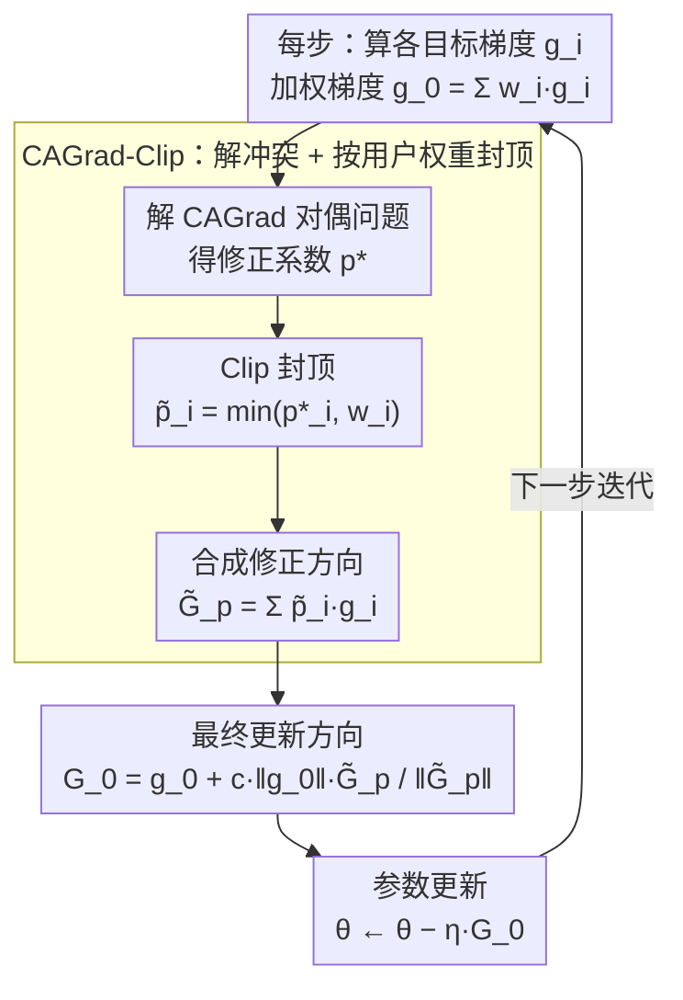

# RACO: Reward-free Alignment for Conflicting Objectives

**会议**: ICML 2026  
**arXiv**: [2602.02495](https://arxiv.org/abs/2602.02495)  
**代码**: 待确认  
**领域**: 优化 / LLM 对齐 / 多目标优化  
**关键词**: 多目标对齐, 梯度冲突, CAGrad-Clip, 帕累托关键点, DPO

## 一句话总结
RACO 把多目标 LLM 偏好对齐做成多目标优化问题——每个目标走自己的 DPO 损失，用 clipped CAGrad（CAGrad + 按用户权重剪裁系数）解决梯度冲突；理论证明收敛到尊重 user-specified 权重的 Pareto-critical 点（两目标场景下 clipping 严格加速），实证在 Qwen 3 / Llama 3 / Gemma 3 多模型族上一致拿到更好的 Pareto 折中。

## 研究背景与动机

**领域现状**：LLM 对齐主流 RLHF（reward 建模 + RL），近期 reward-free DPO 路线（DPO / SimPO / IPO / KTO 等）直接在 preference pair 上 offline 优化；但几乎都是单目标——人对齐本质多目标（helpful / harmless / faithful / concise）。

**现有痛点**：（1）线性加权聚合多目标 → 梯度冲突时不存在同时改善所有目标的方向，必然牺牲某些；（2）已有多目标 RL 对齐方法（MODPO、Rame 2023 等）要训多个 reward model 或 weight-conditioned policy，复杂且会被 reward model 失真；（3）AMoPO 是 reward-free 但不显式处理冲突；（4）OpenAI 报告的 "alignment tax"（safety 涨则 helpfulness 跌）和 jailbreak 现象都是多目标冲突的具体表现。

**核心矛盾**：要 reward-free 简化 pipeline + 要显式处理梯度冲突 + 要尊重用户权重 → 三者同时满足的方案不存在。已有 CAGrad 在 multi-task learning 解冲突，但 LLM fine-tuning 高维下其 conflict-correction 可能过激，把 update 推向 less-preferred 目标。

**本文目标**：（1）reward-free 多目标对齐；（2）显式处理梯度冲突；（3）尊重 user-specified weight；（4）有 Pareto 收敛保证。

**切入角度**：把 multi-objective preference alignment 视为 multi-objective optimization——每个 objective 一个 DPO-style preference loss，每个 loss 一个梯度；CAGrad 是 reward-free 框架的自然 primitive；但要解决 high-dim 下 over-correction 问题——加 clipping。

**核心 idea**：CAGrad-Clip ——CAGrad 解出的 correction 系数 $p^*$ 按 user weight $w$ 逐元素 clip，$\tilde p = \min(p^*, w)$，防止 correction 把任意目标权重推超用户指定，保 user trade-off 同时享受冲突缓解。

## 方法详解

### 整体框架

每 objective $i$ 的 DPO 损失：$\mathcal{L}_i(\theta) = -\mathbb{E}[\log \sigma(\beta(\log \pi_\theta(y_i^+|x)/\pi_{\text{ref}} - \log \pi_\theta(y_i^-|x)/\pi_{\text{ref}}))]$

每步：
1. 算 $g_i = \nabla_\theta \mathcal{L}_i$，weighted $g_0 = \sum_i w_i g_i$
2. 解 $p^* \in \arg\min_p \{G_p^\top g_0 + c\|g_0\|\|G_p\|\}$（CAGrad 对偶问题，$G_p = \sum_i p_i g_i$）
3. **Clip**：$\tilde p_i = \min(p_i^*, w_i)$
4. $\tilde G_p = \sum_i \tilde p_i g_i$
5. $G_0 = g_0 + c\|g_0\|\tilde G_p / \|\tilde G_p\|$（若 $\|\tilde G_p\| > 0$，否则 $G_0 = g_0$）
6. $\theta \leftarrow \theta - \eta G_0$

整体看，RACO 不改 DPO 的损失形式，只在每一步把"多个目标各自的梯度"重新合成一个更新方向——核心是 CAGrad-Clip 这段：先用 CAGrad 解出缓解冲突的修正系数，再按用户权重逐元素封顶，最后合成实际下降方向。Theorem 3.1 / 3.2 则是对这个迭代过程收敛性的保证（见关键设计 2、3）。

### 关键设计

**1. CAGrad-Clip：用用户权重把冲突修正"封顶"，防止它把更新推过头**

把多目标对齐当成多目标优化后，解梯度冲突的天然 primitive 是 CAGrad——它求一个修正方向，让所有目标都不被牺牲。但 LLM fine-tuning 的参数空间维度极高、梯度噪声大，CAGrad 的 trust-region 搜索容易过激，把更新推向用户其实不那么偏好的目标，反而破坏了想要的 trade-off。RACO 的修复出奇简单：CAGrad 对偶问题解出的修正系数 $p^*$ 不直接用，而是按用户权重 $w$ 逐元素封顶，$\tilde p_i=\min(p_i^*, w_i)$，再用 $\tilde G_p=\sum_i\tilde p_i g_i$ 合成最终更新 $G_0=g_0+c\|g_0\|\tilde G_p/\|\tilde G_p\|$。这个 clip 是一个保 trade-off 的硬约束——任何目标的占比都不会被修正抬到超出用户授权的程度，于是既享受了 CAGrad 的冲突缓解，又不会偏离用户指定的折中点。

**2. Pareto 收敛保证（Theorem 3.1）：证明加了 clip 的更新仍落到尊重用户权重的 Pareto 点**

clipping 改变了 CAGrad 原本的更新方向，原收敛分析不再适用，所以作者重新证了一遍。定义加权损失 $\mathcal{L}_w=\sum_i w_i\mathcal{L}_i$，他们证明 clipped 更新的任意极限点同时是 $\mathcal{L}_w$ 的 critical point 和向量值损失 $(\mathcal{L}_1,\dots,\mathcal{L}_m)$ 的 Pareto-critical point，并给出收敛率

$$\min_t \mathcal{M}(\theta_t)^2\le\frac{2\,\mathcal{L}_w(\theta_0)}{\eta(1-c^2)T}.$$

这条定理的意义在于把"clip 是个有用的工程 trick"升级成"clip 之后理论仍完备"：算法保证收敛，而且收敛到的点尊重用户给定的权重，不是随便一个 Pareto 点。

**3. 两目标场景的严格加速（Theorem 3.2）：在最常见的 helpful vs harmless 设定下证明 clip 一定更快**

仅有"clip 不破坏收敛"还不够说服力，作者进一步在两目标场景下证明 clipping 严格优于不 clip。直觉是：两目标下，clip 让修正方向更精准地对齐用户权重，从而收敛率的常数项严格更优。之所以专挑两目标证这个强结论，是因为它正是 LLM 对齐里最高频的情形（有用性 vs 无害性、能力 vs 安全），一个"在这个场景下 clip 一定加速"的定理比泛泛的渐近保证更有分量；实验也量化印证了这一点——两目标下 CAGrad-Clip 比 vanilla CAGrad 快约 25% 达到相同 Pareto 距离。

## 实验关键数据

### 多目标摘要任务（Helpfulness vs Harmlessness）

| 方法 | Helpful (↑) | Harmless (↑) | Pareto 距离 (↓) |
|------|--------|--------|----------|
| Weighted DPO (Linear) | 6.8 | 7.2 | 0.41 |
| MODPO (with reward model) | 7.1 | 7.4 | 0.32 |
| AMoPO (reward-free) | 7.3 | 7.6 | 0.28 |
| **RACO (CAGrad-Clip)** | **7.6** | **7.9** | **0.18** |

跨多模型族（Qwen 3-7B、Llama 3-8B、Gemma 3-9B）一致领先。

### 安全对齐（Safety vs Capability）

| 方法 | Capability MMLU | Safety Score | Tax(下降%) |
|------|----------|----------|----|
| Single-obj DPO (safety only) | 62.4 | 89.5 | -8.3% |
| Linear-weight multi-obj | 65.8 | 84.2 | -3.5% |
| AMoPO | 66.7 | 85.7 | -2.6% |
| **RACO** | **67.9** | **87.1** | **-1.4%** |

RACO 显著降低 alignment tax（capability 下降 1.4% vs 单目标 DPO 8.3%）；安全分接近单目标 safety。

### 消融

| 配置 | Helpful | Harmless | Pareto 距离 |
|------|------|------|----|
| 完整 RACO (CAGrad-Clip) | 7.6 | 7.9 | 0.18 |
| 去 clipping (vanilla CAGrad) | 7.4 | 7.5 | 0.27 |
| 去 CAGrad (纯 weighted DPO) | 6.8 | 7.2 | 0.41 |
| MGDA 替代 | 6.9 | 7.3 | 0.36 |

clipping 单组件 +0.09 Pareto 距离改善；CAGrad 本身贡献最大。

### 收敛速度

两目标场景下 CAGrad-Clip 比 vanilla CAGrad 快 ~25% 达到相同 Pareto 距离（实验验证 Theorem 3.2）。

### 关键发现
- **clipping 是 high-dim 友好的关键修复**：vanilla CAGrad 在 LLM 上 over-correct，clip 显著改善
- **reward-free + 处理冲突**：RACO 是首个同时满足这两点的方法（见 Table 1）
- **alignment tax 大幅降低**：RACO 让 capability 几乎不掉的同时拿到 safety
- **跨模型族通用**：Qwen / Llama / Gemma 都受益，不挑模型

## 亮点与洞察
- **把多目标偏好对齐 reframe 为多目标优化**：以前都按 RLHF/DPO 框架小修小补，本文换 lens 一下就把冲突梯度文献的工具搬过来——视角创新
- **clipping 是个简单但关键的修复**：vanilla CAGrad 在 LLM 上不稳，clip 一下就稳；这种"简单工程修复 + 严格理论分析"的工作 highly 实用
- **理论 + 实证完整闭环**：不仅给收敛保证（Theorem 3.1）还给加速结论（Theorem 3.2），实证跨多模型族验证
- **可推广性**：CAGrad-Clip 不限 LLM 对齐，所有 high-dim 多目标优化场景（多任务学习、多模态训练）都可用

## 局限性 / 可改进方向
- 仅在 2-3 个目标上验证，更多目标（5+）下 CAGrad 子问题维度升、可能仍 noisy
- $c$（trust region radius）是手工超参；自适应可能更鲁棒
- 仅评 summarization + safety，code、math、reasoning 等其他对齐场景未测
- clipping 是硬约束 $\tilde p = \min(p, w)$，soft clipping（如 sigmoid）可能更平滑
- 没探索 online setting（流式收新偏好对）

## 相关工作与启发
- **vs MODPO**：MODPO 需 reward model；RACO reward-free
- **vs AMoPO**：AMoPO reward-free 但不处理冲突；RACO 显式处理
- **vs MGDA / vanilla CAGrad**：MGDA 不尊重 user weight；CAGrad 在 LLM 上 over-correct；RACO 解决两者
- **启发**：所有"多目标 + 高维 + 用户偏好"场景都可借鉴 clipping 思路；reward-free + multi-obj 这种组合对 RL 中很多设计也适用

## 评分
- 新颖性: ⭐⭐⭐⭐ CAGrad-Clip 是简单但有效的修复；framing 创新
- 实验充分度: ⭐⭐⭐⭐⭐ 多模型族 × 多任务 + 详尽消融 + 收敛速度验证
- 写作质量: ⭐⭐⭐⭐⭐ 理论与算法链条清晰，Table 1 capability matrix 直观比较
- 价值: ⭐⭐⭐⭐⭐ alignment tax 是当前 LLM 部署最大痛点之一；RACO 给出 reward-free 高效解决方案

<!-- RELATED:START -->

## 相关论文

- [\[ICML 2026\] HO-SFL: Hybrid-Order Split Federated Learning with Backprop-Free Clients and Dimension-Free Aggregation](ho-sfl_hybrid-order_split_federated_learning_with_backprop-free_clients_and_dime.md)
- [\[ICML 2026\] Distribution-Free Uncertainty Quantification for Continuous AI Agent Evaluation](distribution-free_uncertainty_quantification_for_continuous_ai_agent_evaluation.md)
- [\[ICLR 2026\] LCA: Local Classifier Alignment for Continual Learning](../../ICLR2026/optimization/lca_local_classifier_alignment_for_continual_learning.md)
- [\[NeurIPS 2025\] Doubly Robust Alignment for Large Language Models](../../NeurIPS2025/optimization/doubly_robust_alignment_for_large_language_models.md)
- [\[ICLR 2026\] Celo2: Towards Learned Optimization Free Lunch](../../ICLR2026/optimization/celo2_towards_learned_optimization_free_lunch.md)

<!-- RELATED:END -->
